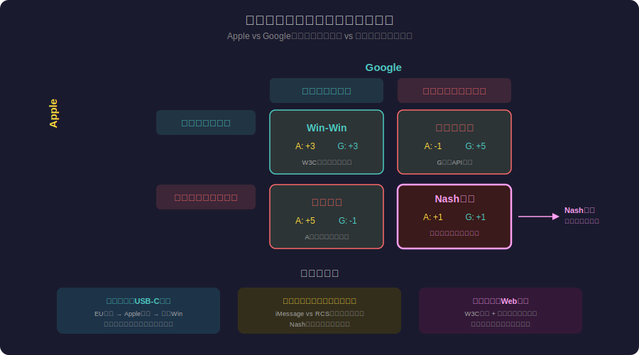
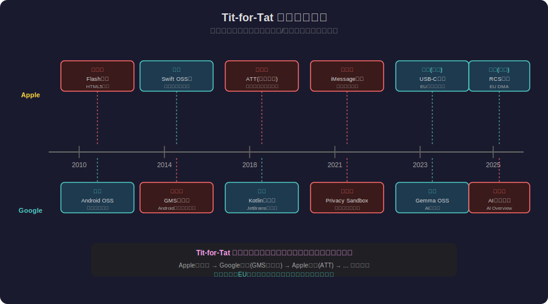
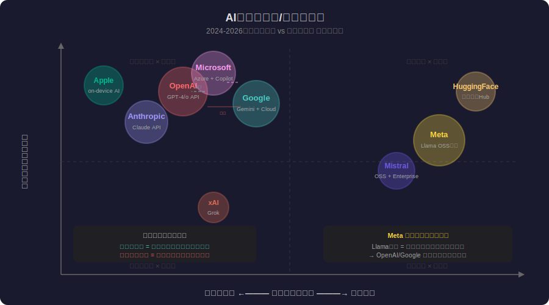

<!-- _class: lead -->
# 囚人のジレンマ：プラットフォーム戦争の数学

- ナッシュ均衡が支配するテクノロジー産業の力学
- 
- Apple vs Google、AI競争、W3C標準化を
- ゲーム理論のレンズで読み解く

---

# 目次

- 1. 囚人のジレンマとは
- 2. ナッシュ均衡の直感的理解
- 3. プラットフォーム企業の利得行列
- 4. Apple vs Google：繰り返しゲーム
- 5. W3C標準化と協力のメカニズム
- 6. AI企業の競争/協力マップ

---

# 目次 (2/2)

- 7. Tit-for-Tat戦略の実例
- 8. 規制という外部強制力
- 9. オープンソースと囚人のジレンマ
- 10. 脱出戦略：協力を可能にする条件
- 11. まとめ：数学が示す未来

---

# 囚人のジレンマとは

- **1950年 RAND研究所で定式化されたゲーム理論の基本問題**
- 
- - 2人のプレイヤーが**同時に**「協力」か「裏切り」を選択
- - 個人の最適戦略（裏切り）が、全体の最適（協力）と矛盾
- - **支配戦略**：相手が何をしても「裏切り」が得をする
- - 結果：両者裏切り → 両者にとって次善の結果に陥る
- 
- **核心：個人的合理性が集団的非合理性を生む**

---

# ナッシュ均衡：誰も動けない状態

- **ジョン・ナッシュ（1950年）の均衡概念**
- 
- - どのプレイヤーも、**一方的に**戦略を変えても得をしない状態
- - 囚人のジレンマでは「両者裏切り」がナッシュ均衡
- - パレート最適（両者協力）とは異なる
- 
- **プラットフォーム企業への適用：**
- - 「囲い込み」が支配戦略 → 断片化が均衡状態
- - 誰も最初にオープン化できない → ロックイン

---

# プラットフォーム競争の利得行列

---

# Apple vs Google：15年の繰り返しゲーム

- **一回限りのゲーム → 繰り返しゲームへ**
- 
| 年 | Apple | Google | 結果 |
| --- | --- | --- | --- |
| 2010 | Flash排除 | Android OSS | 両者異なる戦略 |
| 2014 | Swift OSS | GMS必須化 | 報復の応酬 |
| 2018 | ATT(広告制限) | Kotlin協力 | 非対称な戦略 |
| 2023 | USB-C(強制) | Gemma OSS | 外部圧力で協力 |
- 
- **フォーク定理：繰り返しゲームでは協力も均衡になりうる**

---

# Tit-for-Tat：最強の戦略

- **ロバート・アクセルロッド（1984年）のコンピュータ大会**
- 
- - 200以上の戦略がラウンドロビンで対戦
- - **勝者：Tit-for-Tat**（アナトール・ラパポート提出）
- 
- **4つの特性：**
- - **善良（Nice）**：先に裏切らない
- - **報復的（Retaliatory）**：裏切られたら即座に報復
- - **寛容（Forgiving）**：相手が戻れば許す
- - **明確（Clear）**：意図が読みやすい

---

# Tit-for-Tat のプラットフォーム適用

---

# W3C標準化：強制された協力

- **Web標準 = 囚人のジレンマからの制度的脱出**
- 
- - **1990年代のブラウザ戦争**：IE vs Netscape（裏切り均衡）
-   - 独自拡張の応酬 → Web断片化 → 開発者の疲弊
- - **W3Cの役割**：「繰り返しゲーム」のルール設定者
-   - 標準に準拠しないブラウザは市場から排除される
- - **現在の成功**：HTML5、CSS3、WebAssembly
- 
- **教訓：第三者による制度設計が協力を強制できる**

---

# ブラウザ戦争から標準化へ：協力の進化

- **3つの時代の構造変化**
- 
| 時代 | 構造 | 結果 |
| --- | --- | --- |
| 1995-2001 | 2社の裏切り均衡 | Web断片化 |
| 2004-2010 | WHATWG + W3C協力 | HTML5標準化 |
| 2015-現在 | Chrome支配 + 標準準拠 | 寡占的協力 |
- 
- - Chrome独占は「協力」か「支配」か？
- - 市場シェア65%超 → 事実上の標準決定権
- - **新たなジレンマ：独占企業が標準を定義する問題**

---

# AI企業の競争/協力マップ

---

# Meta のLlama戦略：ゲーム理論的分析

- **なぜMetaはLlamaをオープンソース化したのか**
- 
- - **直接的利益**：自社でLLMを運用する必要がある（広告最適化）
- - **戦略的利益**：OpenAI/Googleの囲い込みを無力化
- - **コミュニティ効果**：外部貢献による改善 = 無料R&D
- 
- **ゲーム理論の視点：**
- - 「協力」に見せかけた「支配戦略」の転換
- - 市場全体をオープン方向にシフト → 自社に有利なゲーム構造に変更
- - **ゲームのルール自体を変えるメタ戦略**

---

# 規制という外部強制力

- **EU DMA（デジタル市場法）の囚人のジレンマ的効果**
- 
- - USB-C統一：Appleの「裏切り」（Lightning独占）を**強制的に協力へ**
- - サイドローディング義務化：App Store独占の解体
- - 相互運用性義務：iMessageのRCS対応
- 
- **ゲーム理論の解釈：**
- - 規制 = 「利得行列」自体を書き換える外部介入
- - 裏切りのペナルティを引き上げ → 協力が支配戦略に変わる
- - **メカニズムデザイン**：望ましい均衡を誘導する制度設計

---

# オープンソースと囚人のジレンマ

- **OSSの「フリーライダー問題」**
- 
- - **協力**：コードを公開し、コミュニティに貢献する
- - **裏切り**：OSSを使うが貢献しない（フリーライド）
- - 多くの企業が「裏切り」を選択 → メンテナーの疲弊
- 
- **脱出メカニズム：**
- - GPL：法的強制による協力（コピーレフト）
- - SSPL/BSL：クラウド企業の裏切りを防ぐ新ライセンス
- - GitHub Sponsors：直接的報酬で協力を促進

---

# 繰り返しゲームで協力が成立する5条件

- **フォーク定理の実践的応用**
- 
- 1. **将来の重み（割引因子）が高い**
-    - 長期的関係があるほど協力が有利（プラットフォーム企業は永続的）
- 2. **裏切りが観測可能**
-    - API変更やロックインは公開情報（開発者コミュニティが監視）
- 3. **報復が可能**
-    - 相手の裏切りに対して対抗策がある（代替技術の存在）
- 4. **プレイヤー数が少ない**
-    - 大手5社（GAFAM）の寡占構造が協力を可能に
- 5. **制度的枠組みがある**
-    - W3C、IEEE、IETF などの標準化団体

---

# AI安全性：究極の囚人のジレンマ

- **AI開発競争における協力/裏切り構造**
- 
- - **協力**：安全性研究に投資し、結果を共有する
- - **裏切り**：安全性を無視して開発速度を最大化する
- 
- **現状：裏切り均衡に向かっている兆候**
- - 「AIアームレース」論調の加速
- - OpenAIの安全性チーム解散
- - 中国との技術競争による安全性軽視の正当化
- 
- **必要：AI安全性の「W3C」に相当する国際機関**

---

# ゲーム構造を変える：メカニズムデザイン

- **囚人のジレンマからの脱出法**
- 
| 手法 | 原理 | 実例 |
| --- | --- | --- |
| 繰り返し | 将来報復の脅威 | Apple-Google長期関係 |
| 評判 | 信頼の蓄積と損失 | OSS貢献企業の評価 |
| 制度 | ルールによる強制 | W3C、EU DMA |
| 利得変更 | ペナルティ/報酬 | GPL、反トラスト法 |
| 透明性 | 裏切りの可視化 | オープンスタンダード |

---

# プラットフォーム競争の未来予測

- **ゲーム理論が示すシナリオ**
- 
- - **シナリオ1：規制主導の協力**
-   - EU DMA型の規制が世界に拡大 → 強制的相互運用
- - **シナリオ2：AI競争の裏切り均衡**
-   - 安全性無視の開発競争 → 技術的危機が協力を促す
- - **シナリオ3：オープン化の連鎖**
-   - Meta Llama効果で業界全体がオープン化 → 新たな協力均衡
- 
- **最も可能性が高いのは3つの混在：領域ごとに異なる均衡**

---

# まとめ：数学が照らすプラットフォームの未来

- **囚人のジレンマから学ぶ5つの教訓**
- 
- - 個人的合理性は**集団的非合理性**を生む（囲い込みの罠）
- - 繰り返しゲームでは**評判と報復**が協力を可能にする
- - **制度設計**（標準化団体、規制）が利得行列を変える
- - **Tit-for-Tat**の「善良・報復・寛容・明確」が最強戦略
- - AI時代の新たな囚人のジレンマには**国際的な制度**が必要
- 
- **「ゲームに勝つ最善の方法は、ゲームのルールを変えることだ」**

