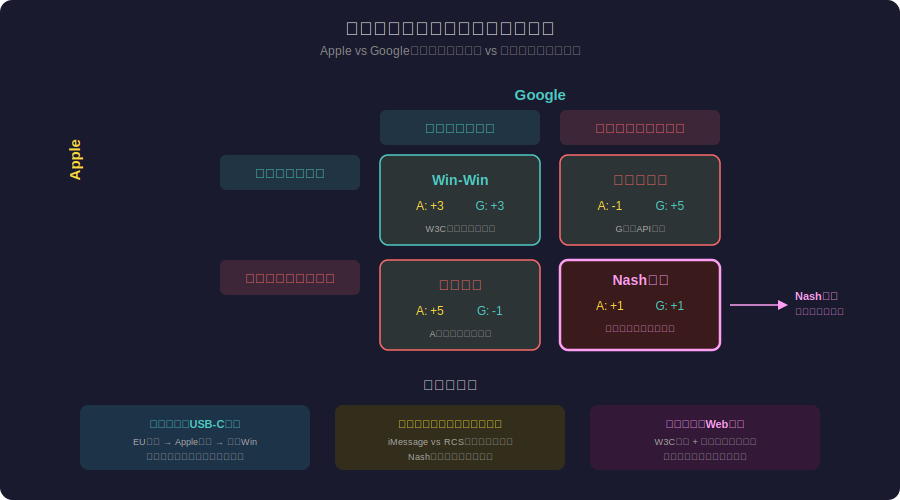
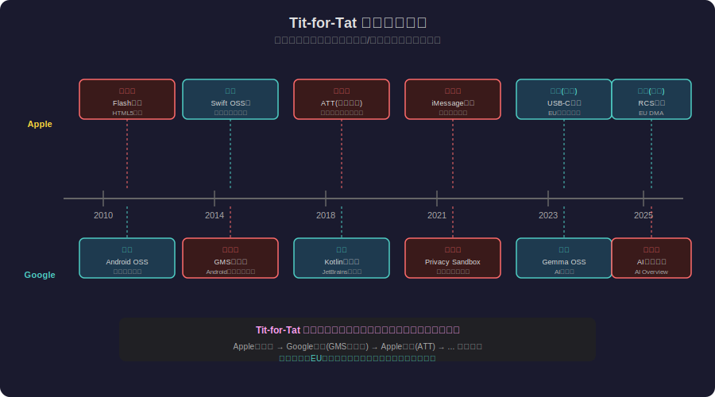
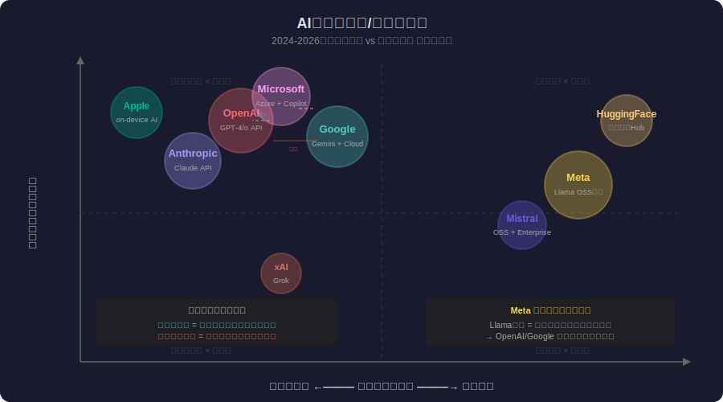

<!-- _class: lead -->
# 囚人のジレンマ：プラットフォーム戦争の数学

- ナッシュ均衡が支配するテクノロジー産業の力学
- 
- Apple vs Google、AI競争、W3C標準化を
- ゲーム理論のレンズで読み解く

---

# 目次

> *6章でゲーム理論をプラットフォーム競争に適用*

- 1. 囚人のジレンマとは
- 2. ナッシュ均衡の直感的理解
- 3. プラットフォーム企業の利得行列
- 4. Apple vs Google：繰り返しゲーム
- 5. W3C標準化と協力のメカニズム
- 6. AI企業の競争/協力マップ

---

# 目次 (2/2)

> *Tit-for-Tat・規制・OSSまで後半5章を網羅*

- 7. Tit-for-Tat戦略の実例
- 8. 規制という外部強制力
- 9. オープンソースと囚人のジレンマ
- 10. 脱出戦略：協力を可能にする条件
- 11. まとめ：数学が示す未来

---

# 囚人のジレンマとは（1/2）

> *個人合理性が集合的最悪解を生む——プラットフォーム競争の本質*

- <svg viewBox="0 0 800 360" style="max-height:70vh;max-width:100%;display:block;margin:0 auto;" xmlns="http://www.w3.org/2000/svg"><rect width="800" height="360" fill="#1a1a2e"/><text x="400" y="28" text-anchor="middle" fill="#f9a825" font-size="17" font-family="sans-serif" font-weight="bold">囚人のジレンマ：古典的ゲーム理論の基本問題</text><rect x="40" y="50" width="340" height="200" rx="10" fill="#16213e" stroke="#4fc3f7" stroke-width="2"/><text x="210" y="80" text-anchor="middle" fill="#4fc3f7" font-size="14" font-family="sans-serif" font-weight="bold">囚人A</text><circle cx="210" cy="130" r="35" fill="#1a1a2e" stroke="#4fc3f7" stroke-width="2"/><text x="210" y="128" text-anchor="middle" fill="#4fc3f7" font-size="20" font-family="sans-serif">A</text><text x="210" y="145" text-anchor="middle" fill="#aaaaaa" font-size="10" font-family="sans-serif">別室で尋問</text><text x="60" y="195" fill="#81c784" font-size="12" font-family="sans-serif" font-weight="bold">選択1: 沈黙（協力）</text><text x="60" y="218" fill="#e91e63" font-size="12" font-family="sans-serif" font-weight="bold">選択2: 自白（裏切り）</text><text x="210" y="242" text-anchor="middle" fill="#f9a825" font-size="11" font-family="sans-serif">→ 相手が何を選ぶか分からない</text><rect x="420" y="50" width="340" height="200" rx="10" fill="#16213e" stroke="#e91e63" stroke-width="2"/><text x="590" y="80" text-anchor="middle" fill="#e91e63" font-size="14" font-family="sans-serif" font-weight="bold">囚人B</text><circle cx="590" cy="130" r="35" fill="#1a1a2e" stroke="#e91e63" stroke-width="2"/><text x="590" y="128" text-anchor="middle" fill="#e91e63" font-size="20" font-family="sans-serif">B</text><text x="590" y="145" text-anchor="middle" fill="#aaaaaa" font-size="10" font-family="sans-serif">別室で尋問</text><text x="440" y="195" fill="#81c784" font-size="12" font-family="sans-serif" font-weight="bold">選択1: 沈黙（協力）</text><text x="440" y="218" fill="#e91e63" font-size="12" font-family="sans-serif" font-weight="bold">選択2: 自白（裏切り）</text><text x="590" y="242" text-anchor="middle" fill="#f9a825" font-size="11" font-family="sans-serif">→ 同時・独立に決定</text><rect x="150" y="280" width="500" height="60" rx="8" fill="#1a1a2e" stroke="#f9a825" stroke-width="2"/><text x="400" y="305" text-anchor="middle" fill="#f9a825" font-size="14" font-family="sans-serif" font-weight="bold">核心：個人的合理性 → 集団的非合理性</text><text x="400" y="328" text-anchor="middle" fill="#ffffff" font-size="12" font-family="sans-serif">「裏切り」が支配戦略 → 両者とも裏切ると次善の結果に</text></svg>
- **1950年 RAND研究所で定式化されたゲーム理論の基本問題**
- 
- - 2人のプレイヤーが**同時に**「協力」か「裏切り」を選択
- - 個人の最適戦略（裏切り）が、全体の最適（協力）と矛盾

---

# 囚人のジレンマとは（2/2）

> *2社がともに裏切るのが「均衡」——なぜ協力が難しいかが分かる*

- <svg viewBox="0 0 800 360" style="max-height:70vh;max-width:100%;display:block;margin:0 auto;" xmlns="http://www.w3.org/2000/svg"><rect width="800" height="360" fill="#1a1a2e"/><text x="400" y="28" text-anchor="middle" fill="#f9a825" font-size="16" font-weight="bold" font-family="sans-serif">囚人のジレンマ：ゲーム理論の基本構造</text><!-- Matrix table --><text x="400" y="60" text-anchor="middle" fill="#ffffff" font-size="13" font-family="sans-serif">囚人Bの選択</text><text x="270" y="80" text-anchor="middle" fill="#f9a825" font-size="12" font-weight="bold" font-family="sans-serif">黙秘</text><text x="530" y="80" text-anchor="middle" fill="#e91e63" font-size="12" font-weight="bold" font-family="sans-serif">自白</text><text x="90" y="180" text-anchor="middle" fill="#ffffff" font-size="13" font-family="sans-serif" transform="rotate(-90,90,180)">囚人Aの選択</text><text x="130" y="150" text-anchor="middle" fill="#f9a825" font-size="12" font-weight="bold" font-family="sans-serif">黙秘</text><text x="130" y="260" text-anchor="middle" fill="#e91e63" font-size="12" font-weight="bold" font-family="sans-serif">自白</text><!-- Grid cells --><rect x="160" y="90" width="260" height="130" rx="6" fill="#16213e" stroke="#f9a825" stroke-width="1.5"/><text x="290" y="145" text-anchor="middle" fill="#f9a825" font-size="16" font-weight="bold" font-family="sans-serif">A:-1, B:-1</text><text x="290" y="168" text-anchor="middle" fill="#ffffff" font-size="11" font-family="sans-serif">両者とも1年の服役</text><text x="290" y="188" text-anchor="middle" fill="#f9a825" font-size="12" font-family="sans-serif">協力の結果（最適）</text><rect x="430" y="90" width="260" height="130" rx="6" fill="#16213e" stroke="#e91e63" stroke-width="1.5"/><text x="560" y="145" text-anchor="middle" fill="#e91e63" font-size="16" font-weight="bold" font-family="sans-serif">A:-5, B:0</text><text x="560" y="168" text-anchor="middle" fill="#ffffff" font-size="11" font-family="sans-serif">AはB5年、Bは釈放</text><text x="560" y="188" text-anchor="middle" fill="#e91e63" font-size="12" font-family="sans-serif">Bが裏切り</text><rect x="160" y="220" width="260" height="130" rx="6" fill="#16213e" stroke="#e91e63" stroke-width="1.5"/><text x="290" y="275" text-anchor="middle" fill="#e91e63" font-size="16" font-weight="bold" font-family="sans-serif">A:0, B:-5</text><text x="290" y="298" text-anchor="middle" fill="#ffffff" font-size="11" font-family="sans-serif">Aは釈放、B5年服役</text><text x="290" y="318" text-anchor="middle" fill="#e91e63" font-size="12" font-family="sans-serif">Aが裏切り</text><rect x="430" y="220" width="260" height="130" rx="6" fill="#e91e63" fill-opacity="0.2" stroke="#e91e63" stroke-width="2"/><text x="560" y="275" text-anchor="middle" fill="#e91e63" font-size="16" font-weight="bold" font-family="sans-serif">A:-3, B:-3</text><text x="560" y="298" text-anchor="middle" fill="#ffffff" font-size="11" font-family="sans-serif">両者とも3年の服役</text><text x="560" y="318" text-anchor="middle" fill="#e91e63" font-size="12" font-weight="bold" font-family="sans-serif">ナッシュ均衡（劣化）</text></svg>
- - **支配戦略**：相手が何をしても「裏切り」が得をする
- - 結果：両者裏切り → 両者にとって次善の結果に陥る
- 
- **核心：個人的合理性が集団的非合理性を生む**

---

# ナッシュ均衡：誰も動けない状態（1/2）

> *誰も一方的に逸脱できない状態が均衡——プラットフォーム膠着の説明*

- <svg viewBox="0 0 800 360" style="max-height:70vh;max-width:100%;display:block;margin:0 auto;" xmlns="http://www.w3.org/2000/svg"><rect width="800" height="360" fill="#1a1a2e"/><text x="400" y="28" text-anchor="middle" fill="#f9a825" font-size="17" font-family="sans-serif" font-weight="bold">ナッシュ均衡：誰も「一方的に」得をしない状態</text><rect x="100" y="50" width="600" height="220" rx="8" fill="#16213e" stroke="#555577" stroke-width="1"/><text x="400" y="80" text-anchor="middle" fill="#f9a825" font-size="14" font-family="sans-serif" font-weight="bold">利得行列（囚人のジレンマ）</text><text x="320" y="105" text-anchor="middle" fill="#aaaaaa" font-size="11" font-family="sans-serif">Bが協力</text><text x="480" y="105" text-anchor="middle" fill="#aaaaaa" font-size="11" font-family="sans-serif">Bが裏切り</text><text x="160" y="160" text-anchor="middle" fill="#aaaaaa" font-size="11" font-family="sans-serif">Aが協力</text><rect x="240" y="115" width="160" height="70" rx="4" fill="#1a3a1a" stroke="#4caf50" stroke-width="2"/><text x="320" y="148" text-anchor="middle" fill="#81c784" font-size="15" font-family="sans-serif" font-weight="bold">(-1, -1)</text><text x="320" y="168" text-anchor="middle" fill="#81c784" font-size="10" font-family="sans-serif">両者最良</text><rect x="420" y="115" width="160" height="70" rx="4" fill="#3a1a1a" stroke="#e91e63" stroke-width="1"/><text x="500" y="148" text-anchor="middle" fill="#ffffff" font-size="14" font-family="sans-serif">(-10, 0)</text><text x="500" y="168" text-anchor="middle" fill="#aaaaaa" font-size="10" font-family="sans-serif">Aが損</text><text x="160" y="230" text-anchor="middle" fill="#aaaaaa" font-size="11" font-family="sans-serif">Aが裏切り</text><rect x="240" y="200" width="160" height="70" rx="4" fill="#3a1a1a" stroke="#e91e63" stroke-width="1"/><text x="320" y="233" text-anchor="middle" fill="#ffffff" font-size="14" font-family="sans-serif">(0, -10)</text><text x="320" y="253" text-anchor="middle" fill="#aaaaaa" font-size="10" font-family="sans-serif">Bが損</text><rect x="420" y="200" width="160" height="70" rx="4" fill="#2a1a1a" stroke="#e91e63" stroke-width="3"/><text x="500" y="233" text-anchor="middle" fill="#e91e63" font-size="14" font-family="sans-serif" font-weight="bold">(-5, -5)</text><text x="500" y="253" text-anchor="middle" fill="#e91e63" font-size="10" font-family="sans-serif">ナッシュ均衡!</text><text x="400" y="300" text-anchor="middle" fill="#e91e63" font-size="13" font-family="sans-serif" font-weight="bold">両者裏切りが均衡 — 一方的に変えても得をしない</text><text x="400" y="325" text-anchor="middle" fill="#aaaaaa" font-size="11" font-family="sans-serif">プラットフォーム企業の「囲い込み」がナッシュ均衡になる</text></svg>
- **ジョン・ナッシュ（1950年）の均衡概念**
- 
- - どのプレイヤーも、**一方的に**戦略を変えても得をしない状態
- - 囚人のジレンマでは「両者裏切り」がナッシュ均衡

---

# ナッシュ均衡：誰も動けない状態（2/2）

> *囲い込みがナッシュ均衡—自発的オープン化は起きない*

- <svg viewBox="0 0 800 360" style="max-height:70vh;max-width:100%;display:block;margin:0 auto;" xmlns="http://www.w3.org/2000/svg"><rect width="800" height="360" fill="#1a1a2e"/><text x="400" y="28" text-anchor="middle" fill="#f9a825" font-size="16" font-weight="bold" font-family="sans-serif">ナッシュ均衡：プラットフォームの「罠」</text><rect x="40" y="50" width="720" height="55" rx="8" fill="#16213e" stroke="#f9a825" stroke-width="1.5"/><text x="400" y="74" text-anchor="middle" fill="#ffffff" font-size="12" font-family="sans-serif">ナッシュ均衡 = 「誰も単独で戦略を変えても得をしない状態」</text><text x="400" y="96" text-anchor="middle" fill="#f9a825" font-size="12" font-weight="bold" font-family="sans-serif">互いの戦略が「最適応答」になっているため、自発的な変化が起きない</text><rect x="40" y="120" width="340" height="210" rx="10" fill="#16213e" stroke="#e91e63" stroke-width="2"/><text x="210" y="145" text-anchor="middle" fill="#e91e63" font-size="13" font-weight="bold" font-family="sans-serif">Apple App Store の均衡</text><rect x="58" y="157" width="304" height="38" rx="5" fill="#1a1a2e"/><text x="210" y="176" text-anchor="middle" fill="#ffffff" font-size="12" font-family="sans-serif">現状: 30%手数料 + 審査制</text><text x="210" y="192" text-anchor="middle" fill="#aaaaaa" font-size="11" font-family="sans-serif">開発者は従うしかない (iOS市場が必要)</text><rect x="58" y="203" width="304" height="38" rx="5" fill="#1a1a2e"/><text x="210" y="222" text-anchor="middle" fill="#ffffff" font-size="12" font-family="sans-serif">Appleは変える理由がない</text><text x="210" y="238" text-anchor="middle" fill="#aaaaaa" font-size="11" font-family="sans-serif">(独占的地位が報酬を最大化)</text><rect x="58" y="249" width="304" height="38" rx="5" fill="#1a1a2e"/><text x="210" y="268" text-anchor="middle" fill="#ffffff" font-size="12" font-family="sans-serif">開発者も一人では動けない</text><text x="210" y="284" text-anchor="middle" fill="#aaaaaa" font-size="11" font-family="sans-serif">(競合も同じ条件下)</text><rect x="58" y="295" width="304" height="26" rx="5" fill="#e91e63" fill-opacity="0.2"/><text x="210" y="313" text-anchor="middle" fill="#e91e63" font-size="11" font-family="sans-serif">均衡からの脱出 = 外部強制力のみ</text><rect x="420" y="120" width="340" height="210" rx="10" fill="#16213e" stroke="#f9a825" stroke-width="2"/><text x="590" y="145" text-anchor="middle" fill="#f9a825" font-size="13" font-weight="bold" font-family="sans-serif">Google Play の均衡</text><rect x="438" y="157" width="304" height="38" rx="5" fill="#1a1a2e"/><text x="590" y="176" text-anchor="middle" fill="#ffffff" font-size="12" font-family="sans-serif">現状: 15-30%手数料 + 代替ストアOK</text><text x="590" y="192" text-anchor="middle" fill="#aaaaaa" font-size="11" font-family="sans-serif">競争圧力でAppleより低い手数料</text><rect x="438" y="203" width="304" height="38" rx="5" fill="#1a1a2e"/><text x="590" y="222" text-anchor="middle" fill="#ffffff" font-size="12" font-family="sans-serif">でも下げすぎると収益が減る</text><text x="590" y="238" text-anchor="middle" fill="#aaaaaa" font-size="11" font-family="sans-serif">(株主への義務がある)</text><rect x="438" y="249" width="304" height="38" rx="5" fill="#1a1a2e"/><text x="590" y="268" text-anchor="middle" fill="#ffffff" font-size="12" font-family="sans-serif">開発者はApple+Googleに依存</text><text x="590" y="284" text-anchor="middle" fill="#aaaaaa" font-size="11" font-family="sans-serif">(代替手段が実質ない)</text><rect x="438" y="295" width="304" height="26" rx="5" fill="#f9a825" fill-opacity="0.15"/><text x="590" y="313" text-anchor="middle" fill="#f9a825" font-size="11" font-family="sans-serif">二重の均衡 = 開発者の選択肢なし</text></svg>
- - パレート最適（両者協力）とは異なる
- 
- **プラットフォーム企業への適用：**
- - 「囲い込み」が支配戦略 → 断片化が均衡状態
- - 誰も最初にオープン化できない → ロックイン

---

# プラットフォーム競争の利得行列

---

# Apple vs Google：15年の繰り返しゲーム

> *繰り返しが互恵的協力を可能にした——報復と信頼の15年史*

- <svg viewBox="0 0 800 360" style="max-height:70vh;max-width:100%;display:block;margin:0 auto;" xmlns="http://www.w3.org/2000/svg"><rect width="800" height="360" fill="#1a1a2e"/><text x="400" y="28" text-anchor="middle" fill="#f9a825" font-size="16" font-weight="bold" font-family="sans-serif">Apple vs Google：15年の囚人のジレンマ</text><line x1="80" y1="280" x2="720" y2="280" stroke="#ffffff" stroke-width="1.5"/><line x1="80" y1="60" x2="80" y2="280" stroke="#ffffff" stroke-width="1.5"/><text x="70" y="284" text-anchor="end" fill="#aaaaaa" font-size="10" font-family="sans-serif">2007</text><text x="222" y="284" text-anchor="end" fill="#aaaaaa" font-size="10" font-family="sans-serif">2010</text><text x="364" y="284" text-anchor="end" fill="#aaaaaa" font-size="10" font-family="sans-serif">2013</text><text x="506" y="284" text-anchor="end" fill="#aaaaaa" font-size="10" font-family="sans-serif">2016</text><text x="648" y="284" text-anchor="end" fill="#aaaaaa" font-size="10" font-family="sans-serif">2019</text><text x="720" y="284" text-anchor="end" fill="#aaaaaa" font-size="10" font-family="sans-serif">2022</text><path d="M 80 250 C 130 230, 200 200, 260 175 C 300 160, 360 148, 420 140 C 480 132, 560 125, 650 120 C 680 118, 700 117, 720 116" stroke="#f9a825" stroke-width="2.5" fill="none"/><text x="730" y="116" fill="#f9a825" font-size="11" font-family="sans-serif">Apple</text><path d="M 80 255 C 140 232, 220 195, 290 168 C 340 150, 400 138, 470 130 C 530 123, 600 116, 680 110 C 700 108, 710 107, 720 106" stroke="#e91e63" stroke-width="2.5" fill="none"/><text x="730" y="106" fill="#e91e63" font-size="11" font-family="sans-serif">Google</text><!-- Event markers --><circle cx="200" cy="210" r="5" fill="#f9a825"/><line x1="200" y1="210" x2="200" y2="68" stroke="#f9a825" stroke-width="1" stroke-dasharray="4,3"/><text x="205" y="78" fill="#f9a825" font-size="10" font-family="sans-serif">iOS vs</text><text x="205" y="91" fill="#f9a825" font-size="10" font-family="sans-serif">Android</text><circle cx="340" cy="158" r="5" fill="#e91e63"/><line x1="340" y1="158" x2="340" y2="68" stroke="#e91e63" stroke-width="1" stroke-dasharray="4,3"/><text x="345" y="78" fill="#e91e63" font-size="10" font-family="sans-serif">特許</text><text x="345" y="91" fill="#e91e63" font-size="10" font-family="sans-serif">訴訟戦争</text><circle cx="500" cy="132" r="5" fill="#f9a825"/><line x1="500" y1="132" x2="500" y2="68" stroke="#f9a825" stroke-width="1" stroke-dasharray="4,3"/><text x="505" y="78" fill="#f9a825" font-size="10" font-family="sans-serif">マップ</text><text x="505" y="91" fill="#f9a825" font-size="10" font-family="sans-serif">分離</text><circle cx="630" cy="118" r="5" fill="#e91e63"/><line x1="630" y1="118" x2="630" y2="68" stroke="#e91e63" stroke-width="1" stroke-dasharray="4,3"/><text x="635" y="78" fill="#e91e63" font-size="10" font-family="sans-serif">独禁法</text><text x="635" y="91" fill="#e91e63" font-size="10" font-family="sans-serif">調査</text><rect x="40" y="295" width="720" height="48" rx="6" fill="#16213e"/><text x="400" y="315" text-anchor="middle" fill="#ffffff" font-size="11" font-family="sans-serif">両社とも「協力」すれば市場全体が拡大するが、「裏切り」（差別化・囲い込み）が支配戦略</text><text x="400" y="333" text-anchor="middle" fill="#f9a825" font-size="11" font-family="sans-serif">→ ナッシュ均衡：競争が継続し、ユーザーと開発者がコストを負担</text></svg>
- **一回限りのゲーム → 繰り返しゲームへ**
- 
| 年 | Apple | Google | 結果 |
| --- | --- | --- | --- |
| 2010 | Flash排除 | Android OSS | 両者異なる戦略 |
| 2014 | Swift OSS | GMS必須化 | 報復の応酬 |
| 2018 | ATT(広告制限) | Kotlin協力 | 非対称な戦略 |
| 2023 | USB-C(強制) | Gemma OSS | 外部圧力で協力 |
- 
- **フォーク定理：繰り返しゲームでは協力も均衡になりうる**

---

# Tit-for-Tat：最強の戦略（1/2）

> *協力から始め、裏切りには即報復——シンプルさが最強の理由*

- <svg viewBox="0 0 800 360" style="max-height:70vh;max-width:100%;display:block;margin:0 auto;" xmlns="http://www.w3.org/2000/svg"><rect width="800" height="360" fill="#1a1a2e"/><text x="400" y="28" text-anchor="middle" fill="#f9a825" font-size="17" font-family="sans-serif" font-weight="bold">Tit-for-Tat：アクセルロッドの大会で勝利した最強戦略</text><rect x="40" y="50" width="335" height="260" rx="10" fill="#16213e" stroke="#f9a825" stroke-width="2"/><text x="207" y="78" text-anchor="middle" fill="#f9a825" font-size="13" font-family="sans-serif" font-weight="bold">ルール（4行で書ける）</text><line x1="60" y1="88" x2="355" y2="88" stroke="#333355" stroke-width="1"/><text x="60" y="115" fill="#81c784" font-size="12" font-family="sans-serif" font-weight="bold">1. 最初は協力する</text><text x="60" y="135" fill="#aaaaaa" font-size="11" font-family="sans-serif">先に裏切らない（善良 Nice）</text><text x="60" y="168" fill="#e91e63" font-size="12" font-family="sans-serif" font-weight="bold">2. 裏切られたら即報復</text><text x="60" y="188" fill="#aaaaaa" font-size="11" font-family="sans-serif">次のターンで裏切る（報復的 Retaliatory）</text><text x="60" y="221" fill="#4fc3f7" font-size="12" font-family="sans-serif" font-weight="bold">3. 相手が戻れば許す</text><text x="60" y="241" fill="#aaaaaa" font-size="11" font-family="sans-serif">一回分のみ記憶（寛容 Forgiving）</text><text x="60" y="274" fill="#f9a825" font-size="12" font-family="sans-serif" font-weight="bold">4. 意図が読みやすい</text><text x="60" y="294" fill="#aaaaaa" font-size="11" font-family="sans-serif">シンプルで予測可能（明確 Clear）</text><rect x="420" y="50" width="340" height="260" rx="10" fill="#16213e" stroke="#4fc3f7" stroke-width="2"/><text x="590" y="78" text-anchor="middle" fill="#4fc3f7" font-size="13" font-family="sans-serif" font-weight="bold">大会の結果（1984年）</text><line x1="440" y1="88" x2="740" y2="88" stroke="#333355" stroke-width="1"/><text x="440" y="115" fill="#aaaaaa" font-size="11" font-family="sans-serif">参加戦略: 200以上</text><text x="440" y="138" fill="#aaaaaa" font-size="11" font-family="sans-serif">ラウンドロビン形式</text><text x="440" y="165" fill="#f9a825" font-size="14" font-family="sans-serif" font-weight="bold">優勝: Tit-for-Tat</text><text x="440" y="188" fill="#aaaaaa" font-size="11" font-family="sans-serif">提出者: アナトール・ラパポート</text><line x1="440" y1="205" x2="740" y2="205" stroke="#333355" stroke-width="1"/><text x="440" y="230" fill="#ffffff" font-size="11" font-family="sans-serif">シンプルさ = 強さの源</text><text x="440" y="255" fill="#ffffff" font-size="11" font-family="sans-serif">複雑な戦略は全て敗北</text><text x="440" y="280" fill="#81c784" font-size="11" font-family="sans-serif">→ AppleとGoogleの長期関係に適用</text></svg>
- **ロバート・アクセルロッド（1984年）のコンピュータ大会**
- 
- - 200以上の戦略がラウンドロビンで対戦
- - **勝者：Tit-for-Tat**（アナトール・ラパポート提出）
- 

---

# Tit-for-Tat：最強の戦略（2/2）

> *善良・報復・寛容・明確の4特性が協力を最大化する*

- <svg viewBox="0 0 800 360" style="max-height:70vh;max-width:100%;display:block;margin:0 auto;" xmlns="http://www.w3.org/2000/svg"><rect width="800" height="360" fill="#1a1a2e"/><text x="400" y="28" text-anchor="middle" fill="#f9a825" font-size="16" font-weight="bold" font-family="sans-serif">Tit-for-Tat：なぜシンプルが最強なのか</text><rect x="40" y="50" width="220" height="280" rx="10" fill="#16213e" stroke="#f9a825" stroke-width="2"/><text x="150" y="75" text-anchor="middle" fill="#f9a825" font-size="13" font-weight="bold" font-family="sans-serif">Tit-for-Tat</text><text x="150" y="93" text-anchor="middle" fill="#f9a825" font-size="11" font-family="sans-serif">「針には針を」</text><rect x="58" y="105" width="184" height="36" rx="6" fill="#1a1a2e"/><text x="150" y="128" text-anchor="middle" fill="#ffffff" font-size="11" font-family="sans-serif">第1手：必ず協力する</text><rect x="58" y="149" width="184" height="36" rx="6" fill="#1a1a2e"/><text x="150" y="172" text-anchor="middle" fill="#ffffff" font-size="11" font-family="sans-serif">以降：相手の前手を模倣</text><rect x="58" y="193" width="184" height="36" rx="6" fill="#1a1a2e"/><text x="150" y="216" text-anchor="middle" fill="#ffffff" font-size="11" font-family="sans-serif">協力→協力で返す</text><rect x="58" y="237" width="184" height="36" rx="6" fill="#e91e63" fill-opacity="0.25"/><text x="150" y="260" text-anchor="middle" fill="#e91e63" font-size="11" font-family="sans-serif">裏切り→即座に報復</text><rect x="58" y="281" width="184" height="36" rx="6" fill="#f9a825" fill-opacity="0.15"/><text x="150" y="304" text-anchor="middle" fill="#f9a825" font-size="11" font-family="sans-serif">報復後は許す（元に戻す）</text><rect x="290" y="50" width="220" height="280" rx="10" fill="#16213e" stroke="#e91e63" stroke-width="2"/><text x="400" y="75" text-anchor="middle" fill="#e91e63" font-size="13" font-weight="bold" font-family="sans-serif">なぜ強い？</text><rect x="308" y="90" width="184" height="50" rx="6" fill="#1a1a2e"/><text x="400" y="110" text-anchor="middle" fill="#ffffff" font-size="11" font-family="sans-serif">やさしい</text><text x="400" y="128" text-anchor="middle" fill="#f9a825" font-size="10" font-family="sans-serif">自分から裏切らない</text><rect x="308" y="150" width="184" height="50" rx="6" fill="#1a1a2e"/><text x="400" y="170" text-anchor="middle" fill="#ffffff" font-size="11" font-family="sans-serif">報復可能</text><text x="400" y="188" text-anchor="middle" fill="#f9a825" font-size="10" font-family="sans-serif">相手の裏切りに即反応</text><rect x="308" y="210" width="184" height="50" rx="6" fill="#1a1a2e"/><text x="400" y="230" text-anchor="middle" fill="#ffffff" font-size="11" font-family="sans-serif">寛容</text><text x="400" y="248" text-anchor="middle" fill="#f9a825" font-size="10" font-family="sans-serif">恨みを持ち越さない</text><rect x="308" y="270" width="184" height="50" rx="6" fill="#1a1a2e"/><text x="400" y="290" text-anchor="middle" fill="#ffffff" font-size="11" font-family="sans-serif">明確</text><text x="400" y="308" text-anchor="middle" fill="#f9a825" font-size="10" font-family="sans-serif">相手が予測しやすい</text><rect x="540" y="50" width="220" height="280" rx="10" fill="#16213e" stroke="#f9a825" stroke-width="2"/><text x="650" y="75" text-anchor="middle" fill="#f9a825" font-size="13" font-weight="bold" font-family="sans-serif">プラットフォームへの示唆</text><rect x="558" y="90" width="184" height="50" rx="6" fill="#1a1a2e"/><text x="650" y="110" text-anchor="middle" fill="#ffffff" font-size="11" font-family="sans-serif">APIを開放して協力を示す</text><text x="650" y="128" text-anchor="middle" fill="#f9a825" font-size="10" font-family="sans-serif">→ エコシステムが育つ</text><rect x="558" y="150" width="184" height="50" rx="6" fill="#1a1a2e"/><text x="650" y="170" text-anchor="middle" fill="#ffffff" font-size="11" font-family="sans-serif">条件変更で開発者が離脱</text><text x="650" y="188" text-anchor="middle" fill="#e91e63" font-size="10" font-family="sans-serif">→ 報復として去る</text><rect x="558" y="210" width="184" height="50" rx="6" fill="#1a1a2e"/><text x="650" y="230" text-anchor="middle" fill="#ffffff" font-size="11" font-family="sans-serif">規約改善で戻ってくる</text><text x="650" y="248" text-anchor="middle" fill="#f9a825" font-size="10" font-family="sans-serif">→ 信頼回復の機会</text><rect x="558" y="270" width="184" height="50" rx="6" fill="#f9a825" fill-opacity="0.15"/><text x="650" y="290" text-anchor="middle" fill="#f9a825" font-size="11" font-family="sans-serif">一貫したルール</text><text x="650" y="308" text-anchor="middle" fill="#f9a825" font-size="10" font-family="sans-serif">→ 予測可能性が信頼を生む</text></svg>
- **4つの特性：**
- - **善良（Nice）**：先に裏切らない
- - **報復的（Retaliatory）**：裏切られたら即座に報復
- - **寛容（Forgiving）**：相手が戻れば許す
- - **明確（Clear）**：意図が読みやすい

---

# Tit-for-Tat のプラットフォーム適用

---

# W3C標準化：強制された協力（1/2）

> *標準化機関は囚人のジレンマを解く外部強制力として機能する*

- <svg viewBox="0 0 800 360" style="max-height:70vh;max-width:100%;display:block;margin:0 auto;" xmlns="http://www.w3.org/2000/svg"><rect width="800" height="360" fill="#1a1a2e"/><text x="400" y="28" text-anchor="middle" fill="#f9a825" font-size="16" font-weight="bold" font-family="sans-serif">W3C標準化：強制された協力の誕生</text><!-- Timeline --><line x1="80" y1="100" x2="720" y2="100" stroke="#f9a825" stroke-width="2.5"/><circle cx="80" cy="100" r="6" fill="#e91e63"/><text x="80" y="85" text-anchor="middle" fill="#e91e63" font-size="11" font-family="sans-serif">1994</text><text x="80" y="73" text-anchor="middle" fill="#ffffff" font-size="10" font-family="sans-serif">ブラウザ戦争</text><circle cx="230" cy="100" r="6" fill="#e91e63"/><text x="230" y="85" text-anchor="middle" fill="#e91e63" font-size="11" font-family="sans-serif">1998</text><text x="230" y="73" text-anchor="middle" fill="#ffffff" font-size="10" font-family="sans-serif">Netscape崩壊</text><circle cx="400" cy="100" r="6" fill="#f9a825"/><text x="400" y="85" text-anchor="middle" fill="#f9a825" font-size="11" font-family="sans-serif">2000</text><text x="400" y="73" text-anchor="middle" fill="#ffffff" font-size="10" font-family="sans-serif">W3C HTML4</text><circle cx="570" cy="100" r="6" fill="#f9a825"/><text x="570" y="85" text-anchor="middle" fill="#f9a825" font-size="11" font-family="sans-serif">2008</text><text x="570" y="73" text-anchor="middle" fill="#ffffff" font-size="10" font-family="sans-serif">HTML5開始</text><circle cx="720" cy="100" r="6" fill="#f9a825"/><text x="720" y="85" text-anchor="middle" fill="#f9a825" font-size="11" font-family="sans-serif">2014</text><text x="720" y="73" text-anchor="middle" fill="#ffffff" font-size="10" font-family="sans-serif">HTML5勧告</text><rect x="40" y="130" width="340" height="200" rx="10" fill="#16213e" stroke="#e91e63" stroke-width="1.5"/><text x="210" y="153" text-anchor="middle" fill="#e91e63" font-size="13" font-weight="bold" font-family="sans-serif">協力失敗期：囚人のジレンマ</text><rect x="58" y="165" width="304" height="32" rx="5" fill="#1a1a2e"/><text x="210" y="186" text-anchor="middle" fill="#ffffff" font-size="12" font-family="sans-serif">IE vs Netscape：独自拡張の乱立</text><rect x="58" y="205" width="304" height="32" rx="5" fill="#1a1a2e"/><text x="210" y="226" text-anchor="middle" fill="#ffffff" font-size="12" font-family="sans-serif">開発者が両対応を強いられる</text><rect x="58" y="245" width="304" height="32" rx="5" fill="#1a1a2e"/><text x="210" y="266" text-anchor="middle" fill="#ffffff" font-size="12" font-family="sans-serif">ユーザー体験が最悪に</text><rect x="58" y="285" width="304" height="34" rx="5" fill="#e91e63" fill-opacity="0.2"/><text x="210" y="306" text-anchor="middle" fill="#e91e63" font-size="12" font-family="sans-serif">→ 両者共に市場縮小</text><rect x="420" y="130" width="340" height="200" rx="10" fill="#16213e" stroke="#f9a825" stroke-width="1.5"/><text x="590" y="153" text-anchor="middle" fill="#f9a825" font-size="13" font-weight="bold" font-family="sans-serif">協力成功期：外部強制力</text><rect x="438" y="165" width="304" height="32" rx="5" fill="#1a1a2e"/><text x="590" y="186" text-anchor="middle" fill="#ffffff" font-size="12" font-family="sans-serif">EU・米独禁調査で強制的に協力へ</text><rect x="438" y="205" width="304" height="32" rx="5" fill="#1a1a2e"/><text x="590" y="226" text-anchor="middle" fill="#ffffff" font-size="12" font-family="sans-serif">W3C標準が共通ルールになる</text><rect x="438" y="245" width="304" height="32" rx="5" fill="#1a1a2e"/><text x="590" y="266" text-anchor="middle" fill="#ffffff" font-size="12" font-family="sans-serif">CSS3/HTML5の統一実装</text><rect x="438" y="285" width="304" height="34" rx="5" fill="#f9a825" fill-opacity="0.15"/><text x="590" y="306" text-anchor="middle" fill="#f9a825" font-size="12" font-family="sans-serif">→ Webエコシステム拡大</text></svg>
- **Web標準 = 囚人のジレンマからの制度的脱出**
- 
- - **1990年代のブラウザ戦争**：IE vs Netscape（裏切り均衡）
-   - 独自拡張の応酬 → Web断片化 → 開発者の疲弊

---

# W3C標準化：強制された協力（2/2）

> *第三者制度設計が協力を強制—W3CがHTMLを統一した*

- <svg viewBox="0 0 800 360" style="max-height:70vh;max-width:100%;display:block;margin:0 auto;" xmlns="http://www.w3.org/2000/svg"><rect width="800" height="360" fill="#1a1a2e"/><text x="400" y="28" text-anchor="middle" fill="#f9a825" font-size="16" font-weight="bold" font-family="sans-serif">W3C標準化の成果：協力の持続メカニズム</text><rect x="40" y="50" width="340" height="280" rx="10" fill="#16213e" stroke="#f9a825" stroke-width="2"/><text x="210" y="75" text-anchor="middle" fill="#f9a825" font-size="13" font-weight="bold" font-family="sans-serif">標準化が生んだ価値</text><rect x="58" y="88" width="304" height="44" rx="5" fill="#1a1a2e"/><text x="210" y="107" text-anchor="middle" fill="#ffffff" font-size="12" font-family="sans-serif">開発者: 1つのコードで全ブラウザ対応</text><text x="210" y="123" text-anchor="middle" fill="#f9a825" font-size="11" font-family="sans-serif">→ 開発コスト 1/3以下に</text><rect x="58" y="140" width="304" height="44" rx="5" fill="#1a1a2e"/><text x="210" y="159" text-anchor="middle" fill="#ffffff" font-size="12" font-family="sans-serif">ユーザー: どのブラウザでも同じ体験</text><text x="210" y="175" text-anchor="middle" fill="#f9a825" font-size="11" font-family="sans-serif">→ Web普及が加速</text><rect x="58" y="192" width="304" height="44" rx="5" fill="#1a1a2e"/><text x="210" y="211" text-anchor="middle" fill="#ffffff" font-size="12" font-family="sans-serif">企業: 標準への投資が業界全体を成長</text><text x="210" y="227" text-anchor="middle" fill="#f9a825" font-size="11" font-family="sans-serif">→ パイが拡大し全員が得をする</text><rect x="58" y="244" width="304" height="44" rx="5" fill="#f9a825" fill-opacity="0.15"/><text x="210" y="266" text-anchor="middle" fill="#f9a825" font-size="12" font-family="sans-serif">ゲーム理論的帰結</text><text x="210" y="282" text-anchor="middle" fill="#f9a825" font-size="11" font-family="sans-serif">協力均衡 > ナッシュ均衡（競争）</text><rect x="58" y="296" width="304" height="26" rx="5" fill="#e91e63" fill-opacity="0.15"/><text x="210" y="314" text-anchor="middle" fill="#e91e63" font-size="11" font-family="sans-serif">しかし外部強制なしには維持困難</text><rect x="420" y="50" width="340" height="280" rx="10" fill="#16213e" stroke="#e91e63" stroke-width="2"/><text x="590" y="75" text-anchor="middle" fill="#e91e63" font-size="13" font-weight="bold" font-family="sans-serif">協力を維持する仕組み</text><rect x="438" y="88" width="304" height="44" rx="5" fill="#1a1a2e"/><text x="590" y="107" text-anchor="middle" fill="#ffffff" font-size="12" font-family="sans-serif">W3C会員制度：参加コストで</text><text x="590" y="123" text-anchor="middle" fill="#e91e63" font-size="11" font-family="sans-serif">→ フリーライダーを排除</text><rect x="438" y="140" width="304" height="44" rx="5" fill="#1a1a2e"/><text x="590" y="159" text-anchor="middle" fill="#ffffff" font-size="12" font-family="sans-serif">標準策定プロセスの透明性</text><text x="590" y="175" text-anchor="middle" fill="#e91e63" font-size="11" font-family="sans-serif">→ 信頼の構築と維持</text><rect x="438" y="192" width="304" height="44" rx="5" fill="#1a1a2e"/><text x="590" y="211" text-anchor="middle" fill="#ffffff" font-size="12" font-family="sans-serif">「逸脱 = 孤立」という抑止力</text><text x="590" y="227" text-anchor="middle" fill="#e91e63" font-size="11" font-family="sans-serif">→ 独自拡張は「嫌われ者」に</text><rect x="438" y="244" width="304" height="44" rx="5" fill="#1a1a2e"/><text x="590" y="263" text-anchor="middle" fill="#ffffff" font-size="12" font-family="sans-serif">長期的関係の確約</text><text x="590" y="279" text-anchor="middle" fill="#e91e63" font-size="11" font-family="sans-serif">→ 繰り返しゲームの条件を満たす</text><rect x="438" y="296" width="304" height="26" rx="5" fill="#f9a825" fill-opacity="0.15"/><text x="590" y="314" text-anchor="middle" fill="#f9a825" font-size="11" font-family="sans-serif">標準化機関 = 協力の制度的保証</text></svg>
- - **W3Cの役割**：「繰り返しゲーム」のルール設定者
-   - 標準に準拠しないブラウザは市場から排除される
- - **現在の成功**：HTML5、CSS3、WebAssembly
- 
- **教訓：第三者による制度設計が協力を強制できる**

---

# ブラウザ戦争から標準化へ：協力の進化

> *Chrome65%支配で協力と独占が逆転—新たなジレンマへ*

- **3つの時代の構造変化**
- 
| 時代 | 構造 | 結果 |
| --- | --- | --- |
| 1995-2001 | 2社の裏切り均衡 | Web断片化 |
| 2004-2010 | WHATWG + W3C協力 | HTML5標準化 |
| 2015-現在 | Chrome支配 + 標準準拠 | 寡占的協力 |
- 
- - Chrome独占は「協力」か「支配」か？
- - 市場シェア65%超 → 事実上の標準決定権
- - **新たなジレンマ：独占企業が標準を定義する問題**

---

# AI企業の競争/協力マップ

---

# Meta のLlama戦略：ゲーム理論的分析（1/2）

> *OpenAI包囲網をOSSで崩す—MetaのR&D費用社会化戦略*

- <svg viewBox="0 0 800 360" style="max-height:70vh;max-width:100%;display:block;margin:0 auto;" xmlns="http://www.w3.org/2000/svg"><rect width="800" height="360" fill="#1a1a2e"/><text x="400" y="28" text-anchor="middle" fill="#f9a825" font-size="16" font-weight="bold" font-family="sans-serif">MetaのLlama戦略：ゲーム理論的解析</text><rect x="40" y="50" width="340" height="280" rx="10" fill="#16213e" stroke="#f9a825" stroke-width="2"/><text x="210" y="75" text-anchor="middle" fill="#f9a825" font-size="13" font-weight="bold" font-family="sans-serif">なぜOSSにするのか？</text><rect x="58" y="88" width="304" height="44" rx="6" fill="#1a1a2e"/><text x="210" y="107" text-anchor="middle" fill="#ffffff" font-size="12" font-family="sans-serif">OpenAI/Google独占を防ぐ</text><text x="210" y="123" text-anchor="middle" fill="#f9a825" font-size="11" font-family="sans-serif">→ 競合の「差別化」を消す</text><rect x="58" y="140" width="304" height="44" rx="6" fill="#1a1a2e"/><text x="210" y="159" text-anchor="middle" fill="#ffffff" font-size="12" font-family="sans-serif">コミュニティに無料で開発させる</text><text x="210" y="175" text-anchor="middle" fill="#f9a825" font-size="11" font-family="sans-serif">→ R&D コストを社会化</text><rect x="58" y="192" width="304" height="44" rx="6" fill="#1a1a2e"/><text x="210" y="211" text-anchor="middle" fill="#ffffff" font-size="12" font-family="sans-serif">AI基盤がコモディティ化する</text><text x="210" y="227" text-anchor="middle" fill="#f9a825" font-size="11" font-family="sans-serif">→ Metaの広告事業が相対的に強化</text><rect x="58" y="244" width="304" height="68" rx="6" fill="#f9a825" fill-opacity="0.15"/><text x="210" y="266" text-anchor="middle" fill="#f9a825" font-size="12" font-weight="bold" font-family="sans-serif">ゲーム理論的解釈</text><text x="210" y="284" text-anchor="middle" fill="#ffffff" font-size="11" font-family="sans-serif">「協力」で他者の裏切りを無力化する</text><text x="210" y="300" text-anchor="middle" fill="#f9a825" font-size="11" font-family="sans-serif">→ 支配戦略を変更させる</text><rect x="420" y="50" width="340" height="280" rx="10" fill="#16213e" stroke="#e91e63" stroke-width="2"/><text x="590" y="75" text-anchor="middle" fill="#e91e63" font-size="13" font-weight="bold" font-family="sans-serif">リスクとトレードオフ</text><rect x="438" y="88" width="304" height="44" rx="6" fill="#1a1a2e"/><text x="590" y="107" text-anchor="middle" fill="#ffffff" font-size="12" font-family="sans-serif">中国・悪意ある組織も利用可能</text><text x="590" y="123" text-anchor="middle" fill="#e91e63" font-size="11" font-family="sans-serif">→ コントロールを失う</text><rect x="438" y="140" width="304" height="44" rx="6" fill="#1a1a2e"/><text x="590" y="159" text-anchor="middle" fill="#ffffff" font-size="12" font-family="sans-serif">競合も同じ技術を使える</text><text x="590" y="175" text-anchor="middle" fill="#e91e63" font-size="11" font-family="sans-serif">→ 差別化が困難になる</text><rect x="438" y="192" width="304" height="44" rx="6" fill="#1a1a2e"/><text x="590" y="211" text-anchor="middle" fill="#ffffff" font-size="12" font-family="sans-serif">AI安全性への責任</text><text x="590" y="227" text-anchor="middle" fill="#e91e63" font-size="11" font-family="sans-serif">→ 倫理的コスト</text><rect x="438" y="244" width="304" height="68" rx="6" fill="#e91e63" fill-opacity="0.15"/><text x="590" y="266" text-anchor="middle" fill="#e91e63" font-size="12" font-weight="bold" font-family="sans-serif">本質的問い</text><text x="590" y="284" text-anchor="middle" fill="#ffffff" font-size="11" font-family="sans-serif">短期の競争優位 vs</text><text x="590" y="300" text-anchor="middle" fill="#f9a825" font-size="11" font-family="sans-serif">長期のエコシステム支配</text></svg>
- **なぜMetaはLlamaをオープンソース化したのか**
- 
- - **直接的利益**：自社でLLMを運用する必要がある（広告最適化）
- - **戦略的利益**：OpenAI/Googleの囲い込みを無力化
- - **コミュニティ効果**：外部貢献による改善 = 無料R&D

---

# Meta のLlama戦略：ゲーム理論的分析（2/2）

> *ゲームのルール自体を変えるメタ戦略—市場をオープンにシフト*

- <svg viewBox="0 0 800 360" style="max-height:70vh;max-width:100%;display:block;margin:0 auto;" xmlns="http://www.w3.org/2000/svg"><rect width="800" height="360" fill="#1a1a2e"/><text x="400" y="28" text-anchor="middle" fill="#f9a825" font-size="17" font-family="sans-serif" font-weight="bold">Metaのオープンソース戦略：ゲームのルールを変えるメタ戦略</text><rect x="40" y="50" width="340" height="270" rx="10" fill="#16213e" stroke="#e91e63" stroke-width="2"/><text x="210" y="78" text-anchor="middle" fill="#e91e63" font-size="13" font-family="sans-serif" font-weight="bold">従来のゲーム構造</text><text x="210" y="108" text-anchor="middle" fill="#aaaaaa" font-size="11" font-family="sans-serif">OpenAI / Google → 囲い込み</text><text x="210" y="130" text-anchor="middle" fill="#aaaaaa" font-size="11" font-family="sans-serif">「裏切り」が支配戦略</text><text x="210" y="162" text-anchor="middle" fill="#ffffff" font-size="12" font-family="sans-serif">プロプライエタリLLM = 護城河</text><text x="210" y="182" text-anchor="middle" fill="#ffffff" font-size="12" font-family="sans-serif">API課金 = ロックイン戦略</text><rect x="80" y="210" width="250" height="90" rx="6" fill="#1a1a2e" stroke="#e91e63" stroke-width="1"/><text x="205" y="238" text-anchor="middle" fill="#e91e63" font-size="11" font-family="sans-serif">Metaの不利な立場:</text><text x="205" y="258" text-anchor="middle" fill="#aaaaaa" font-size="11" font-family="sans-serif">消費者向けAI製品なし</text><text x="205" y="278" text-anchor="middle" fill="#aaaaaa" font-size="11" font-family="sans-serif">OpenAIに後れをとる</text><rect x="420" y="50" width="340" height="270" rx="10" fill="#16213e" stroke="#81c784" stroke-width="2"/><text x="590" y="78" text-anchor="middle" fill="#81c784" font-size="13" font-family="sans-serif" font-weight="bold">Metaのメタ戦略</text><text x="440" y="108" fill="#ffffff" font-size="11" font-family="sans-serif">Llama をオープンソース化</text><text x="440" y="130" fill="#aaaaaa" font-size="10" font-family="sans-serif">「協力」に見せかけた支配戦略の転換</text><line x1="440" y1="145" x2="740" y2="145" stroke="#333355" stroke-width="1"/><text x="440" y="168" fill="#f9a825" font-size="11" font-family="sans-serif">直接的利益:</text><text x="440" y="186" fill="#aaaaaa" font-size="10" font-family="sans-serif">広告最適化に使える(自社LLM必要)</text><text x="440" y="210" fill="#f9a825" font-size="11" font-family="sans-serif">戦略的利益:</text><text x="440" y="228" fill="#aaaaaa" font-size="10" font-family="sans-serif">OpenAI/Googleの囲い込みを無力化</text><text x="440" y="252" fill="#f9a825" font-size="11" font-family="sans-serif">コミュニティ効果:</text><text x="440" y="270" fill="#aaaaaa" font-size="10" font-family="sans-serif">外部貢献 = 無料R&D</text><text x="440" y="295" fill="#81c784" font-size="11" font-family="sans-serif">→ 市場全体をオープンにシフト</text></svg>
- 
- **ゲーム理論の視点：**
- - 「協力」に見せかけた「支配戦略」の転換
- - 市場全体をオープン方向にシフト → 自社に有利なゲーム構造に変更
- - **ゲームのルール自体を変えるメタ戦略**

---

# 規制という外部強制力（1/2）

> *EU DMAがAppleの裏切り戦略を強制的に協力へ転換させた*

- <svg viewBox="0 0 800 360" style="max-height:70vh;max-width:100%;display:block;margin:0 auto;" xmlns="http://www.w3.org/2000/svg"><rect width="800" height="360" fill="#1a1a2e"/><text x="400" y="28" text-anchor="middle" fill="#f9a825" font-size="17" font-family="sans-serif" font-weight="bold">EU DMA：利得行列を書き換える外部強制力</text><rect x="40" y="50" width="340" height="270" rx="10" fill="#16213e" stroke="#555577" stroke-width="2"/><text x="210" y="78" text-anchor="middle" fill="#aaaaaa" font-size="13" font-family="sans-serif" font-weight="bold">DMA以前のゲーム</text><text x="210" y="108" text-anchor="middle" fill="#ffffff" font-size="12" font-family="sans-serif">Apple: Lightning独占（裏切り）</text><text x="210" y="130" text-anchor="middle" fill="#aaaaaa" font-size="11" font-family="sans-serif">ユーザーはロックイン</text><text x="210" y="155" text-anchor="middle" fill="#ffffff" font-size="12" font-family="sans-serif">App Store独占（裏切り）</text><text x="210" y="177" text-anchor="middle" fill="#aaaaaa" font-size="11" font-family="sans-serif">30%手数料が支配戦略</text><text x="210" y="225" text-anchor="middle" fill="#e91e63" font-size="36" font-family="sans-serif">→</text><text x="210" y="270" text-anchor="middle" fill="#e91e63" font-size="12" font-family="sans-serif">裏切り均衡が安定</text><rect x="420" y="50" width="340" height="270" rx="10" fill="#16213e" stroke="#f9a825" stroke-width="2"/><text x="590" y="78" text-anchor="middle" fill="#f9a825" font-size="13" font-family="sans-serif" font-weight="bold">DMA後のゲーム（2024年〜）</text><text x="440" y="108" fill="#81c784" font-size="12" font-family="sans-serif" font-weight="bold">USB-C統一強制</text><text x="440" y="128" fill="#aaaaaa" font-size="10" font-family="sans-serif">Lightningコネクタが違法に</text><text x="440" y="152" fill="#81c784" font-size="12" font-family="sans-serif" font-weight="bold">サイドローディング義務化</text><text x="440" y="172" fill="#aaaaaa" font-size="10" font-family="sans-serif">App Store独占が崩壊</text><text x="440" y="196" fill="#81c784" font-size="12" font-family="sans-serif" font-weight="bold">iMessage RCS対応</text><text x="440" y="216" fill="#aaaaaa" font-size="10" font-family="sans-serif">相互運用性の義務化</text><line x1="440" y1="232" x2="740" y2="232" stroke="#333355" stroke-width="1"/><text x="590" y="258" text-anchor="middle" fill="#f9a825" font-size="12" font-family="sans-serif" font-weight="bold">裏切りペナルティ↑</text><text x="590" y="280" text-anchor="middle" fill="#ffffff" font-size="11" font-family="sans-serif">→ 協力が支配戦略に変わる</text><text x="590" y="302" text-anchor="middle" fill="#aaaaaa" font-size="10" font-family="sans-serif">メカニズムデザインの実例</text></svg>
- **EU DMA（デジタル市場法）の囚人のジレンマ的効果**
- 
- - USB-C統一：Appleの「裏切り」（Lightning独占）を**強制的に協力へ**
- - サイドローディング義務化：App Store独占の解体
- - 相互運用性義務：iMessageのRCS対応

---

# 規制という外部強制力（2/2）

> *罰金でペナルティを上げ裏切りを不採算に—メカニズムデザイン*

- <svg viewBox="0 0 800 360" style="max-height:70vh;max-width:100%;display:block;margin:0 auto;" xmlns="http://www.w3.org/2000/svg"><rect width="800" height="360" fill="#1a1a2e"/><text x="400" y="28" text-anchor="middle" fill="#f9a825" font-size="16" font-weight="bold" font-family="sans-serif">規制という外部強制力：EU DMAの設計</text><rect x="40" y="50" width="340" height="280" rx="10" fill="#16213e" stroke="#e91e63" stroke-width="2"/><text x="210" y="75" text-anchor="middle" fill="#e91e63" font-size="13" font-weight="bold" font-family="sans-serif">DMA以前：ナッシュ均衡の罠</text><rect x="58" y="88" width="304" height="40" rx="5" fill="#1a1a2e"/><text x="210" y="108" text-anchor="middle" fill="#ffffff" font-size="12" font-family="sans-serif">Apple: 高手数料が最適応答</text><text x="210" y="124" text-anchor="middle" fill="#aaaaaa" font-size="11" font-family="sans-serif">(開発者に代替なし)</text><rect x="58" y="136" width="304" height="40" rx="5" fill="#1a1a2e"/><text x="210" y="156" text-anchor="middle" fill="#ffffff" font-size="12" font-family="sans-serif">開発者: 従うことが最適応答</text><text x="210" y="172" text-anchor="middle" fill="#aaaaaa" font-size="11" font-family="sans-serif">(iOS市場から外れると損失)</text><rect x="58" y="184" width="304" height="40" rx="5" fill="#1a1a2e"/><text x="210" y="204" text-anchor="middle" fill="#ffffff" font-size="12" font-family="sans-serif">規制当局: 取り締まる法律なし</text><text x="210" y="220" text-anchor="middle" fill="#aaaaaa" font-size="11" font-family="sans-serif">(デジタル市場に適した法がない)</text><rect x="58" y="232" width="304" height="86" rx="5" fill="#e91e63" fill-opacity="0.2"/><text x="210" y="254" text-anchor="middle" fill="#e91e63" font-size="12" font-weight="bold" font-family="sans-serif">均衡は自発的に崩れない</text><text x="210" y="272" text-anchor="middle" fill="#ffffff" font-size="11" font-family="sans-serif">全員が「合理的」に行動しているため</text><text x="210" y="290" text-anchor="middle" fill="#ffffff" font-size="11" font-family="sans-serif">外部からの力なしに変化しない</text><rect x="420" y="50" width="340" height="280" rx="10" fill="#16213e" stroke="#f9a825" stroke-width="2"/><text x="590" y="75" text-anchor="middle" fill="#f9a825" font-size="13" font-weight="bold" font-family="sans-serif">DMA後：ゲームのルール変更</text><rect x="438" y="88" width="304" height="40" rx="5" fill="#1a1a2e"/><text x="590" y="108" text-anchor="middle" fill="#ffffff" font-size="12" font-family="sans-serif">代替ストア許可 + 相互運用性義務</text><text x="590" y="124" text-anchor="middle" fill="#f9a825" font-size="11" font-family="sans-serif">→ 裏切りのコストが増大</text><rect x="438" y="136" width="304" height="40" rx="5" fill="#1a1a2e"/><text x="590" y="156" text-anchor="middle" fill="#ffffff" font-size="12" font-family="sans-serif">違反に数十億ユーロの罰金</text><text x="590" y="172" text-anchor="middle" fill="#f9a825" font-size="11" font-family="sans-serif">→ 支配戦略を変更する</text><rect x="438" y="184" width="304" height="40" rx="5" fill="#1a1a2e"/><text x="590" y="204" text-anchor="middle" fill="#ffffff" font-size="12" font-family="sans-serif">新均衡：一定の開放性が義務に</text><text x="590" y="220" text-anchor="middle" fill="#f9a825" font-size="11" font-family="sans-serif">→ 協力が「強制的に」最適応答に</text><rect x="438" y="232" width="304" height="86" rx="5" fill="#f9a825" fill-opacity="0.15"/><text x="590" y="254" text-anchor="middle" fill="#f9a825" font-size="12" font-weight="bold" font-family="sans-serif">ゲーム理論的解釈</text><text x="590" y="272" text-anchor="middle" fill="#ffffff" font-size="11" font-family="sans-serif">規制 = ペイオフ行列の再設計</text><text x="590" y="290" text-anchor="middle" fill="#f9a825" font-size="11" font-family="sans-serif">→ 社会的最適が新しい均衡に</text></svg>
- 
- **ゲーム理論の解釈：**
- - 規制 = 「利得行列」自体を書き換える外部介入
- - 裏切りのペナルティを引き上げ → 協力が支配戦略に変わる
- - **メカニズムデザイン**：望ましい均衡を誘導する制度設計

---

# オープンソースと囚人のジレンマ（1/2）

> *OSSの無賃乗車が蔓延—メンテナ疲弊の根本原因*

- **OSSの「フリーライダー問題」**
- 
- - **協力**：コードを公開し、コミュニティに貢献する
- - **裏切り**：OSSを使うが貢献しない（フリーライド）
- - 多くの企業が「裏切り」を選択 → メンテナーの疲弊

---

# オープンソースと囚人のジレンマ（2/2）

> *GPLが裏切りを法的に封鎖—ライセンスが均衡を変える*

- <svg viewBox="0 0 800 360" style="max-height:70vh;max-width:100%;display:block;margin:0 auto;" xmlns="http://www.w3.org/2000/svg"><rect width="800" height="360" fill="#1a1a2e"/><text x="400" y="28" text-anchor="middle" fill="#f9a825" font-size="16" font-weight="bold" font-family="sans-serif">OSSと囚人のジレンマ：コピーレフトの解決策</text><rect x="40" y="50" width="340" height="280" rx="10" fill="#16213e" stroke="#e91e63" stroke-width="2"/><text x="210" y="75" text-anchor="middle" fill="#e91e63" font-size="13" font-weight="bold" font-family="sans-serif">問題：企業の「無賃乗車」</text><rect x="58" y="88" width="304" height="44" rx="6" fill="#1a1a2e"/><text x="210" y="107" text-anchor="middle" fill="#ffffff" font-size="12" font-family="sans-serif">Linux カーネルを製品に組み込む</text><text x="210" y="123" text-anchor="middle" fill="#e91e63" font-size="11" font-family="sans-serif">→ 改良を非公開にする（裏切り）</text><rect x="58" y="140" width="304" height="44" rx="6" fill="#1a1a2e"/><text x="210" y="159" text-anchor="middle" fill="#ffffff" font-size="12" font-family="sans-serif">全企業が裏切れば</text><text x="210" y="175" text-anchor="middle" fill="#e91e63" font-size="11" font-family="sans-serif">→ OSSエコシステムが衰退</text><rect x="58" y="192" width="304" height="44" rx="6" fill="#1a1a2e"/><text x="210" y="211" text-anchor="middle" fill="#ffffff" font-size="12" font-family="sans-serif">全員にとって損失</text><text x="210" y="227" text-anchor="middle" fill="#e91e63" font-size="11" font-family="sans-serif">→ ナッシュ均衡が悪化</text><rect x="58" y="244" width="304" height="68" rx="6" fill="#e91e63" fill-opacity="0.2"/><text x="210" y="266" text-anchor="middle" fill="#e91e63" font-size="12" font-weight="bold" font-family="sans-serif">ゲーム理論的分析</text><text x="210" y="284" text-anchor="middle" fill="#ffffff" font-size="11" font-family="sans-serif">一回限りのゲームなら裏切りが最適</text><text x="210" y="300" text-anchor="middle" fill="#e91e63" font-size="11" font-family="sans-serif">→ フリーライダー問題</text><rect x="420" y="50" width="340" height="280" rx="10" fill="#16213e" stroke="#f9a825" stroke-width="2"/><text x="590" y="75" text-anchor="middle" fill="#f9a825" font-size="13" font-weight="bold" font-family="sans-serif">解決：GPL「コピーレフト」</text><rect x="438" y="88" width="304" height="44" rx="6" fill="#1a1a2e"/><text x="590" y="107" text-anchor="middle" fill="#ffffff" font-size="12" font-family="sans-serif">GPLコードを使うなら</text><text x="590" y="123" text-anchor="middle" fill="#f9a825" font-size="11" font-family="sans-serif">→ 改良もOSSで公開義務</text><rect x="438" y="140" width="304" height="44" rx="6" fill="#1a1a2e"/><text x="590" y="159" text-anchor="middle" fill="#ffffff" font-size="12" font-family="sans-serif">「裏切り」を法的に封鎖</text><text x="590" y="175" text-anchor="middle" fill="#f9a825" font-size="11" font-family="sans-serif">→ 支配戦略を協力に変える</text><rect x="438" y="192" width="304" height="44" rx="6" fill="#1a1a2e"/><text x="590" y="211" text-anchor="middle" fill="#ffffff" font-size="12" font-family="sans-serif">Android (Apache) vs Linux (GPL)</text><text x="590" y="227" text-anchor="middle" fill="#f9a825" font-size="11" font-family="sans-serif">→ ライセンスが戦略を決める</text><rect x="438" y="244" width="304" height="68" rx="6" fill="#f9a825" fill-opacity="0.15"/><text x="590" y="266" text-anchor="middle" fill="#f9a825" font-size="12" font-weight="bold" font-family="sans-serif">外部ルールで均衡を変える</text><text x="590" y="284" text-anchor="middle" fill="#ffffff" font-size="11" font-family="sans-serif">囚人のジレンマを繰り返しゲームに</text><text x="590" y="300" text-anchor="middle" fill="#f9a825" font-size="11" font-family="sans-serif">→ 協力が安定均衡になる</text></svg>
- 
- **脱出メカニズム：**
- - GPL：法的強制による協力（コピーレフト）
- - SSPL/BSL：クラウド企業の裏切りを防ぐ新ライセンス
- - GitHub Sponsors：直接的報酬で協力を促進

---

# 繰り返しゲームで協力が成立する5条件（1/2）

> *将来の重みと観測可能性が協力均衡の2大条件*

- <svg viewBox="0 0 800 360" style="max-height:70vh;max-width:100%;display:block;margin:0 auto;" xmlns="http://www.w3.org/2000/svg"><rect width="800" height="360" fill="#1a1a2e"/><text x="400" y="28" text-anchor="middle" fill="#f9a825" font-size="16" font-weight="bold" font-family="sans-serif">繰り返しゲームで協力が成立する5条件</text><rect x="40" y="55" width="340" height="115" rx="8" fill="#16213e" stroke="#f9a825" stroke-width="2"/><text x="60" y="78" fill="#f9a825" font-size="13" font-weight="bold" font-family="sans-serif">①将来の影の長さ</text><text x="60" y="100" fill="#ffffff" font-size="12" font-family="sans-serif">繰り返しが十分長い（≥5回）</text><text x="60" y="120" fill="#aaaaaa" font-size="11" font-family="sans-serif">例：長期API契約、マルチプラットフォーム開発</text><text x="60" y="155" fill="#f9a825" font-size="11" font-family="sans-serif">→ 将来の報酬が裏切りコストを超える</text><rect x="420" y="55" width="340" height="115" rx="8" fill="#16213e" stroke="#e91e63" stroke-width="2"/><text x="440" y="78" fill="#e91e63" font-size="13" font-weight="bold" font-family="sans-serif">②透明性</text><text x="440" y="100" fill="#ffffff" font-size="12" font-family="sans-serif">相手の行動が観察可能</text><text x="440" y="120" fill="#aaaaaa" font-size="11" font-family="sans-serif">例：App Store審査基準の公開、規約変更の通知</text><text x="440" y="155" fill="#e91e63" font-size="11" font-family="sans-serif">→ 裏切りを即座に検知できる</text><rect x="40" y="185" width="340" height="115" rx="8" fill="#16213e" stroke="#f9a825" stroke-width="2"/><text x="60" y="208" fill="#f9a825" font-size="13" font-weight="bold" font-family="sans-serif">③報復可能性</text><text x="60" y="230" fill="#ffffff" font-size="12" font-family="sans-serif">裏切りへの即時対応能力</text><text x="60" y="250" fill="#aaaaaa" font-size="11" font-family="sans-serif">例：Twitterがアクセス制限→開発者が代替を構築</text><text x="60" y="285" fill="#f9a825" font-size="11" font-family="sans-serif">→ 裏切りのコストが明確になる</text><rect x="420" y="185" width="340" height="115" rx="8" fill="#16213e" stroke="#e91e63" stroke-width="2"/><text x="440" y="208" fill="#e91e63" font-size="13" font-weight="bold" font-family="sans-serif">④参加者の少なさ</text><text x="440" y="230" fill="#ffffff" font-size="12" font-family="sans-serif">プレイヤーが多すぎると調整困難</text><text x="440" y="250" fill="#aaaaaa" font-size="11" font-family="sans-serif">例：主要ブラウザ3-4社なら標準化できる</text><text x="440" y="285" fill="#e91e63" font-size="11" font-family="sans-serif">→ 寡占状態が協力を促進</text><rect x="220" y="310" width="360" height="40" rx="8" fill="#f9a825" fill-opacity="0.15" stroke="#f9a825" stroke-width="1.5"/><text x="400" y="335" text-anchor="middle" fill="#f9a825" font-size="13" font-weight="bold" font-family="sans-serif">⑤共通利益の存在：市場が拡大するほど全員が得をする</text></svg>
- **フォーク定理の実践的応用**
- 
- 1. **将来の重み（割引因子）が高い**
-    - 長期的関係があるほど協力が有利（プラットフォーム企業は永続的）
- 2. **裏切りが観測可能**
-    - API変更やロックインは公開情報（開発者コミュニティが監視）

---

# 繰り返しゲームで協力が成立する5条件（2/2）

> *報復可能・少数プレイヤー・共通利益で協力が安定する*

- 3. **報復が可能**
-    - 相手の裏切りに対して対抗策がある（代替技術の存在）
- 4. **プレイヤー数が少ない**
-    - 大手5社（GAFAM）の寡占構造が協力を可能に
- 5. **制度的枠組みがある**
-    - W3C、IEEE、IETF などの標準化団体

---

# AI安全性：究極の囚人のジレンマ（1/2）

> *安全投資は競争で不利——だから自発的解決は不可能で規制が必要*

- **AI開発競争における協力/裏切り構造**
- 
- - **協力**：安全性研究に投資し、結果を共有する
- - **裏切り**：安全性を無視して開発速度を最大化する
- 

---

# AI安全性：究極の囚人のジレンマ（2/2）

> *安全性軽視が加速—AIアームレースが裏切り均衡に向かう*

- **現状：裏切り均衡に向かっている兆候**
- - 「AIアームレース」論調の加速
- - OpenAIの安全性チーム解散
- - 中国との技術競争による安全性軽視の正当化
- 
- **必要：AI安全性の「W3C」に相当する国際機関**

---

# ゲーム構造を変える：メカニズムデザイン

> *ルール設計で囚人ゲームを協力ゲームに変える——政策立案の本質*

- **囚人のジレンマからの脱出法**
- 
| 手法 | 原理 | 実例 |
| --- | --- | --- |
| 繰り返し | 将来報復の脅威 | Apple-Google長期関係 |
| 評判 | 信頼の蓄積と損失 | OSS貢献企業の評価 |
| 制度 | ルールによる強制 | W3C、EU DMA |
| 利得変更 | ペナルティ/報酬 | GPL、反トラスト法 |
| 透明性 | 裏切りの可視化 | オープンスタンダード |

---

# プラットフォーム競争の未来予測（1/2）

> *規制主導・AIアームレース・オープン化の3シナリオが並走*

- **ゲーム理論が示すシナリオ**
- 
- - **シナリオ1：規制主導の協力**
-   - EU DMA型の規制が世界に拡大 → 強制的相互運用
- - **シナリオ2：AI競争の裏切り均衡**

---

# プラットフォーム競争の未来予測（2/2）

> *単一均衡はない—領域ごとに協力と競争が混在する未来*

-   - 安全性無視の開発競争 → 技術的危機が協力を促す
- - **シナリオ3：オープン化の連鎖**
-   - Meta Llama効果で業界全体がオープン化 → 新たな協力均衡
- 
- **最も可能性が高いのは3つの混在：領域ごとに異なる均衡**

---

# まとめ：数学が照らすプラットフォームの未来（1/2）

> *ゲーム理論は競争の必然を予測する——感情でなく数学で判断せよ*

- <svg viewBox="0 0 800 360" style="max-height:70vh;max-width:100%;display:block;margin:0 auto;" xmlns="http://www.w3.org/2000/svg"><rect width="800" height="360" fill="#1a1a2e"/><text x="400" y="28" text-anchor="middle" fill="#f9a825" font-size="17" font-family="sans-serif" font-weight="bold">囚人のジレンマから学ぶ5つの教訓</text><rect x="40" y="50" width="220" height="80" rx="6" fill="#16213e" stroke="#f9a825" stroke-width="2"/><text x="150" y="75" text-anchor="middle" fill="#f9a825" font-size="11" font-family="sans-serif" font-weight="bold">① 囲い込みの罠</text><text x="150" y="98" text-anchor="middle" fill="#ffffff" font-size="10" font-family="sans-serif">個人の合理性が集団的</text><text x="150" y="115" text-anchor="middle" fill="#ffffff" font-size="10" font-family="sans-serif">非合理性を生む</text><rect x="290" y="50" width="220" height="80" rx="6" fill="#16213e" stroke="#4fc3f7" stroke-width="2"/><text x="400" y="75" text-anchor="middle" fill="#4fc3f7" font-size="11" font-family="sans-serif" font-weight="bold">② 繰り返しと評判</text><text x="400" y="98" text-anchor="middle" fill="#ffffff" font-size="10" font-family="sans-serif">報復の脅威が</text><text x="400" y="115" text-anchor="middle" fill="#ffffff" font-size="10" font-family="sans-serif">協力を可能にする</text><rect x="540" y="50" width="220" height="80" rx="6" fill="#16213e" stroke="#81c784" stroke-width="2"/><text x="650" y="75" text-anchor="middle" fill="#81c784" font-size="11" font-family="sans-serif" font-weight="bold">③ 制度設計</text><text x="650" y="98" text-anchor="middle" fill="#ffffff" font-size="10" font-family="sans-serif">W3C・EU DMAが</text><text x="650" y="115" text-anchor="middle" fill="#ffffff" font-size="10" font-family="sans-serif">利得行列を変える</text><rect x="165" y="165" width="220" height="80" rx="6" fill="#16213e" stroke="#e91e63" stroke-width="2"/><text x="275" y="190" text-anchor="middle" fill="#e91e63" font-size="11" font-family="sans-serif" font-weight="bold">④ Tit-for-Tat最強</text><text x="275" y="213" text-anchor="middle" fill="#ffffff" font-size="10" font-family="sans-serif">善良・報復・寛容・明確</text><text x="275" y="230" text-anchor="middle" fill="#ffffff" font-size="10" font-family="sans-serif">の4特性</text><rect x="415" y="165" width="220" height="80" rx="6" fill="#16213e" stroke="#ff9800" stroke-width="2"/><text x="525" y="190" text-anchor="middle" fill="#ff9800" font-size="11" font-family="sans-serif" font-weight="bold">⑤ 国際制度の必要性</text><text x="525" y="213" text-anchor="middle" fill="#ffffff" font-size="10" font-family="sans-serif">AI安全性の「W3C」</text><text x="525" y="230" text-anchor="middle" fill="#ffffff" font-size="10" font-family="sans-serif">相当の組織が必要</text><rect x="100" y="278" width="600" height="60" rx="8" fill="#1a1a2e" stroke="#f9a825" stroke-width="2"/><text x="400" y="304" text-anchor="middle" fill="#f9a825" font-size="14" font-family="sans-serif" font-weight="bold">「ゲームに勝つ最善の方法は、ゲームのルールを変えることだ」</text><text x="400" y="326" text-anchor="middle" fill="#aaaaaa" font-size="11" font-family="sans-serif">メカニズムデザインこそが次世代のプラットフォーム戦略</text></svg>
- **囚人のジレンマから学ぶ5つの教訓**
- 
- - 個人的合理性は**集団的非合理性**を生む（囲い込みの罠）
- - 繰り返しゲームでは**評判と報復**が協力を可能にする

---

# まとめ：数学が照らすプラットフォームの未来（2/2）

> *Tit-for-Tat＋制度設計＋国際機関の3層対策が必要*

- - **制度設計**（標準化団体、規制）が利得行列を変える
- - **Tit-for-Tat**の「善良・報復・寛容・明確」が最強戦略
- - AI時代の新たな囚人のジレンマには**国際的な制度**が必要
- 
- **「ゲームに勝つ最善の方法は、ゲームのルールを変えることだ」**

