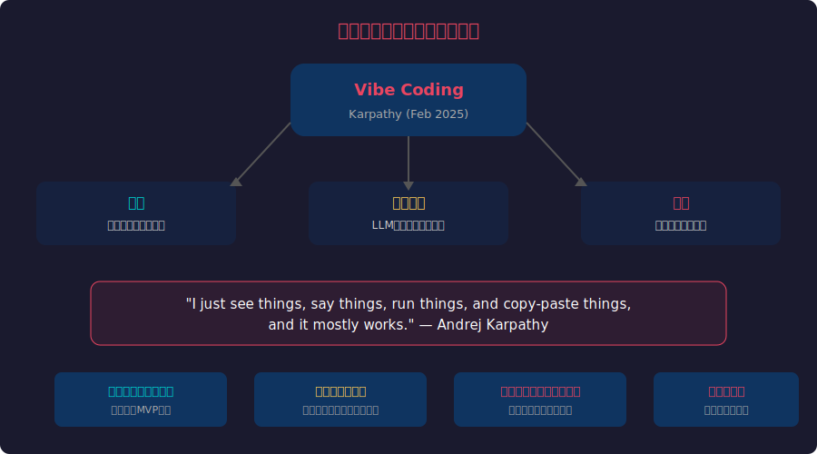
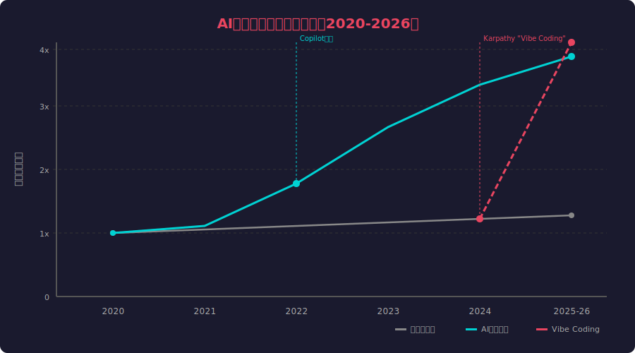
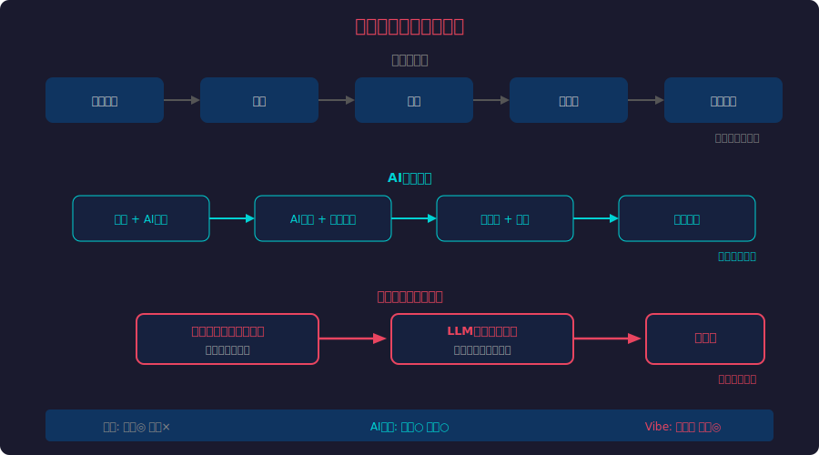
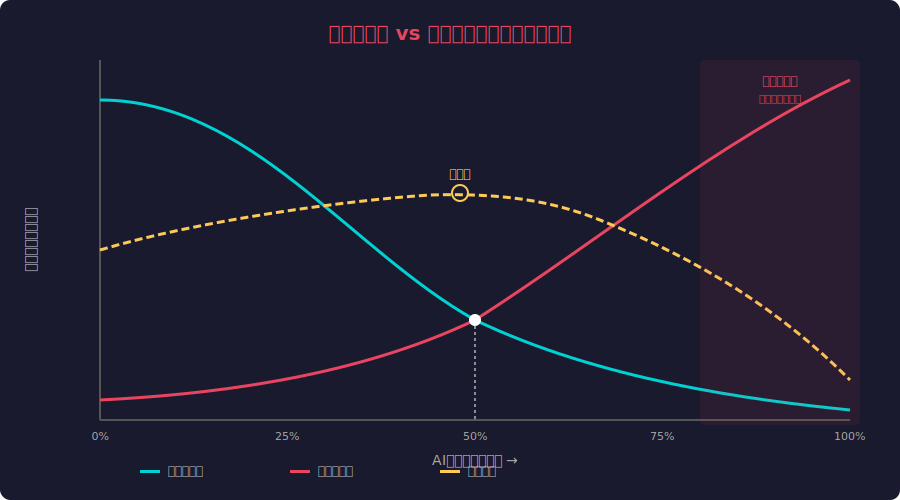
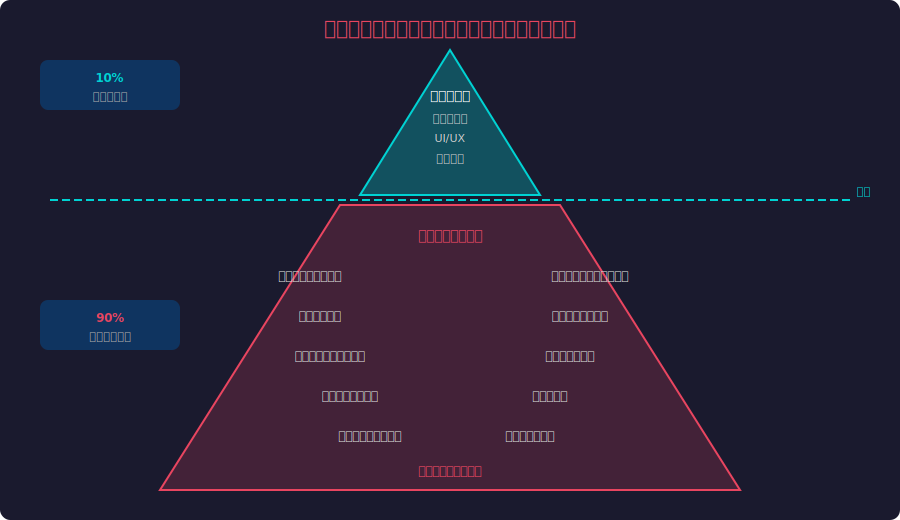
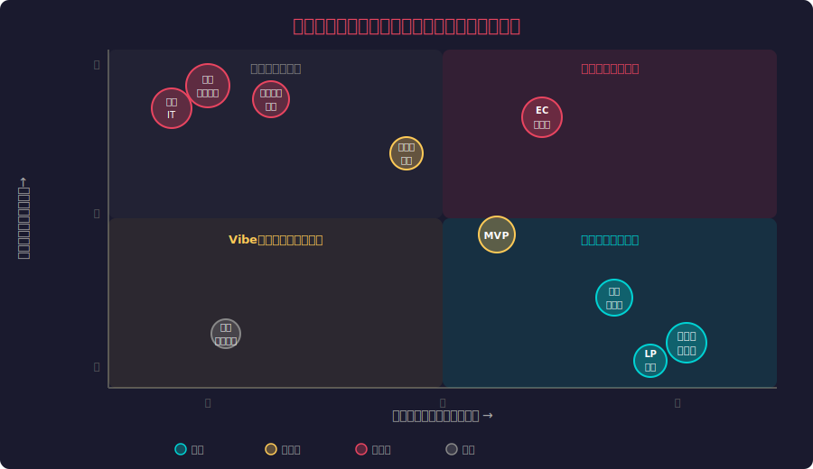
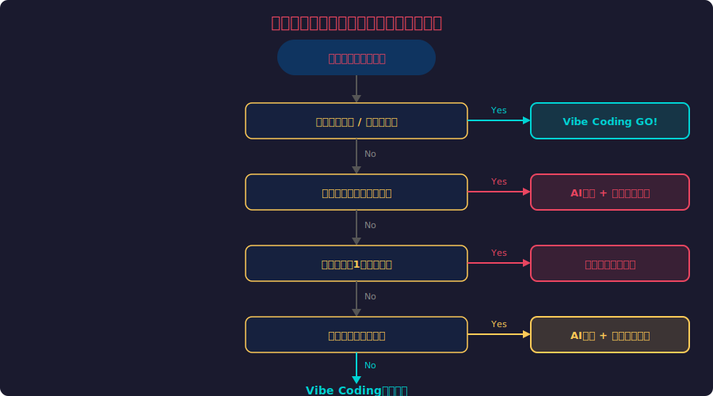

<!-- _class: lead -->
# バイブコーディングの経済学

- 速く作れるが速く壊れる時代
- Karpathy 2025 × AI開発生産性 × 保守コストのトレードオフ

---

# アジェンダ

- - 1. バイブコーディングとは何か
- - 2. AI開発生産性の飛躍
- - 3. 開発ワークフローの変化
- - 4. 経済性の分析：開発コスト vs 保守コスト
- - 5. 技術的負債の氷山
- - 6. 用途別リスク評価
- - 7. 判断フレームワークと未来展望

---

<!-- _class: lead -->
# バイブコーディングとは

- Andrej Karpathy が2025年2月に提唱した新しい開発スタイル

---

# Karpathyの定義

---

# バイブコーディングの本質

- - **完全な自然言語駆動** — コードを書かず「こういうの作って」で開発
- - **コードを読まない** — 生成結果を理解せずに受け入れる
- - **エラーもAIに丸投げ** — エラーメッセージをコピペして修正依頼
- - **驚くほど速い** — プロトタイプが数分〜数時間で完成
- - **非エンジニアも参入** — プログラミング知識不要の開発民主化
- - **「動けばOK」精神** — 品質よりスピードを最優先

---

<!-- _class: lead -->
# AI開発生産性の飛躍

- 2020年から2026年、開発生産性はどう変わったか

---

# 生産性推移（2020-2026）

---

# 数字で見る生産性向上

- - **GitHub Copilot研究（2022）** — タスク完了速度が55%向上
- - **McKinsey報告（2023）** — コード生成タスクで最大2倍の生産性
- - **Google内部調査（2024）** — AI支援によりコードレビュー時間30%削減
- - **Cursor/Claude Code（2025）** — エージェント型で設計〜実装を自動化
- - **バイブコーディング（2025-26）** — 10倍速だが品質は未知数

<!--
各数値は公開レポートからの引用。バイブコーディングの10倍速は体感値で、長期的な保守コストを含まない。
-->

---

<!-- _class: lead -->
# 開発ワークフローの変化

- 従来型 → AI支援 → バイブコーディング

---

# 3つの開発パラダイム比較

---

# 速度と品質のパラドックス

- - **従来型**: 設計→実装→テスト→レビュー（品質担保あり）
- - **AI支援**: 人間が設計・レビュー、AIが実装（バランス型）
- - **バイブ**: AIが全工程、人間は指示のみ（速度特化型）
- - 速度と品質は常にトレードオフ関係にある
- - バイブコーディングは**速度を極限まで最適化**した結果
- - 問題：品質検証プロセスが完全に欠如

---

<!-- _class: lead -->
# 経済性の分析

- 開発コスト vs 保守コスト — 本当に安いのか？

---

# コストカーブのトレードオフ

---

# 隠れたコストの正体

- - **初期開発コスト**: バイブコーディングで90%削減も可能
- - **保守コスト**: AI自動化率75%超で指数関数的に増加
- - **総コスト最適点**: AI自動化率40-60%（人間レビュー併用）
- - **危険ゾーン**: 100%自動化は保守コストが開発コストの5-10倍に
- - バグ修正に元のコードを理解できる人間がいない
- - 「作り直した方が早い」症候群の頻発

---

<!-- _class: lead -->
# 技術的負債の氷山

- 見える成果の下に潜む膨大な負債

---

# 氷山モデル：可視10% vs 隠れた90%

---

# 負債が顕在化するタイミング

- - **1週間後** — 「あの機能を少し変更して」→ 全体が壊れる
- - **1ヶ月後** — セキュリティスキャンで脆弱性が大量検出
- - **3ヶ月後** — ユーザー増加でパフォーマンス問題が顕在化
- - **6ヶ月後** — チームメンバーが誰もコードを理解できない
- - **1年後** — 「作り直し」の決断を迫られる
- - 技術的負債の利子は**複利**で増加する

---

<!-- _class: lead -->
# 用途別リスク評価

- どこで使うべきか、どこで避けるべきか

---

# 用途別リスクマトリクス

---

# 判断フレームワーク

---

# 結論：バイブコーディングとの付き合い方

- - **使うべき場面**: プロトタイプ、ハッカソン、個人プロジェクト、LP制作
- - **慎重に使う場面**: MVP開発、社内ツール（レビュー必須）
- - **避けるべき場面**: 金融・医療・インフラ、長期運用システム
- - **黄金ルール**: 「速く作り、速く検証し、必要なら正しく作り直す」
- - AI支援開発の最適解は「人間の判断 + AIの速度」
- - バイブコーディングは**道具**であり、万能解ではない

