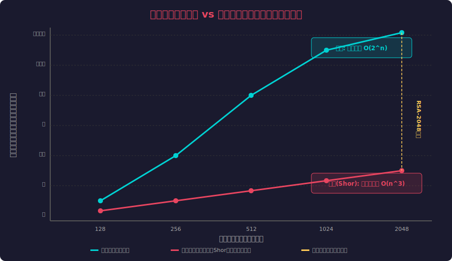
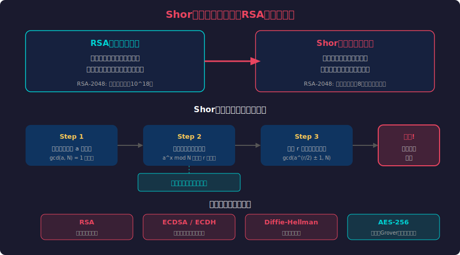
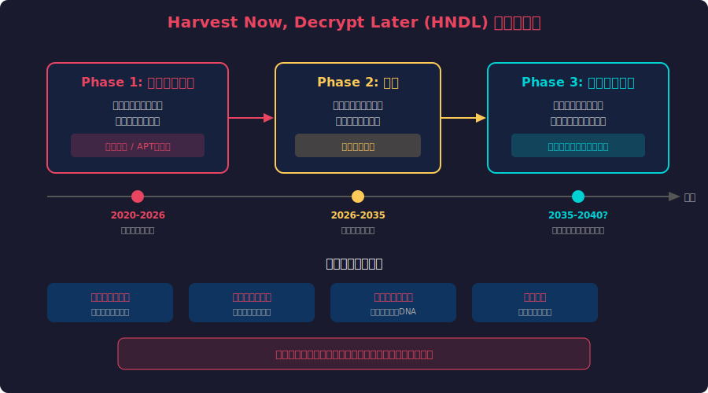
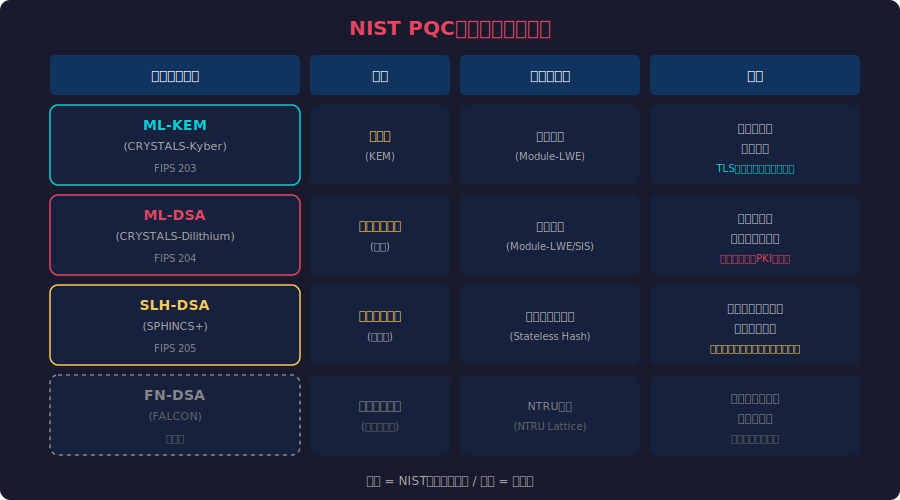
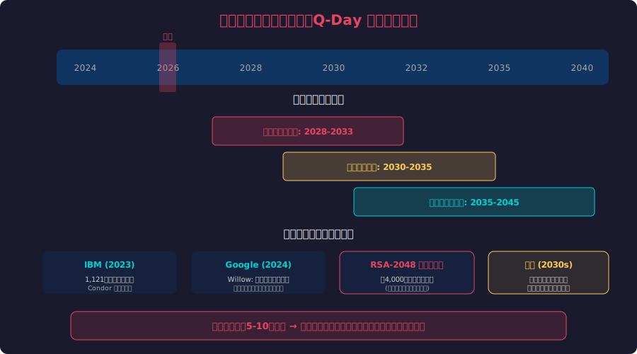
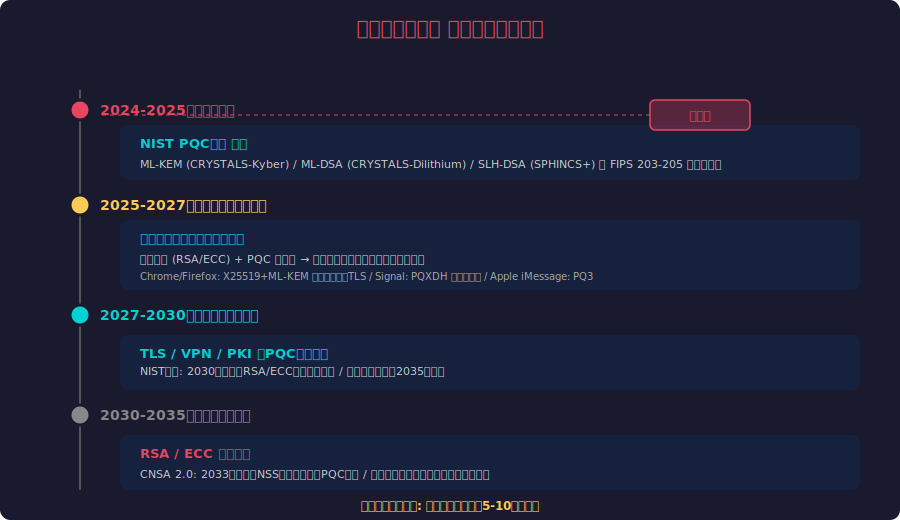

<!-- _class: lead -->
# ポスト量子暗号

- 今日の秘密は明日解読される
- Harvest Now, Decrypt Later × Shorのアルゴリズム × NIST PQC

---

# アジェンダ

- - 1. 現代暗号が直面する脅威
- - 2. Shorのアルゴリズムと量子コンピュータ
- - 3. Harvest Now, Decrypt Later攻撃
- - 4. NIST PQC標準化の成果
- - 5. 量子脅威タイムライン
- - 6. 移行ロードマップと実践

---

<!-- _class: lead -->
# 現代暗号が直面する脅威

- 量子コンピュータはなぜ暗号を破壊するのか

---

# 暗号の安全性の前提

- - **RSA暗号**: 巨大な数の素因数分解が計算上不可能
- - **楕円曲線暗号 (ECC)**: 楕円曲線上の離散対数問題が困難
- - **Diffie-Hellman**: 離散対数問題に基づく鍵交換
- - これらは全て**数学的困難性**に依存している
- - 古典コンピュータでは数十億年かかる計算
- - しかし量子コンピュータが前提を根底から覆す

---

# 古典 vs 量子：計算量の断崖

---

<!-- _class: lead -->
# Shorのアルゴリズム

- 1994年に発表された、暗号学を揺るがす量子アルゴリズム

---

# Shorのアルゴリズムの仕組み

---

# なぜShorは脅威なのか

- - **指数時間 → 多項式時間**: O(2^n) から O(n^3) への劇的削減
- - **RSA-2048**: 古典で10^18年 → 量子で約8時間（理論値）
- - **量子フーリエ変換**: 古典では不可能な超並列計算を実現
- - **影響範囲**: RSA, ECDSA, ECDH, Diffie-Hellman が全て破壊
- - **AES-256は安全**: Groverアルゴリズムでも鍵長半減のみ
- - 公開鍵暗号の根幹が揺らぐ事態

<!--
Peter Shorが1994年に発表。当時は量子コンピュータが実現不可能と考えられていたが、近年の進展で現実の脅威に。
-->

---

<!-- _class: lead -->
# Harvest Now, Decrypt Later

- 量子コンピュータを待たずに始まっている攻撃

---

# HNDL攻撃フロー

---

# HNDLが深刻な理由

- - **既に進行中**: 国家レベルの傍受活動は公知の事実
- - **遡及的な被害**: 過去のデータが将来解読される
- - **長寿命データが標的**: 外交・軍事・医療・金融情報
- - **防御が困難**: 傍受の事実を検知できない
- - **時間が味方しない**: データの価値は保存期間と比例
- - 「暗号化しているから安全」は**もはや成立しない**

---

<!-- _class: lead -->
# NIST PQC標準化の成果

- 10年の選定プロセスを経て、新たな暗号標準が誕生

---

# NIST PQC標準アルゴリズム

---

# 格子暗号とは何か

- - **格子問題**: 高次元格子上の最近ベクトル問題 (SVP/CVP)
- - **LWE問題**: Learning With Errors — ノイズ付き連立方程式
- - 量子コンピュータでも効率的に解けないと信じられている
- - ML-KEMとML-DSAの両方が格子暗号ベース
- - **鍵サイズ**: RSAより大きいが実用的（数KB程度）
- - **処理速度**: RSAと同等かそれ以上の場合も

<!--
格子暗号は1990年代から研究されており、量子耐性以外にも準同型暗号などの応用がある。
-->

---

# 実装の現状：既に動き出している

- - **Chrome / Firefox**: X25519+ML-KEM ハイブリッドTLS (2024〜)
- - **Signal**: PQXDH プロトコル導入 (2023)
- - **Apple iMessage**: PQ3 プロトコル (2024)
- - **AWS**: s2n-tls でML-KEMハイブリッド対応
- - **Cloudflare**: ポスト量子TLSをデフォルト有効化
- - 主要プラットフォームは移行を**既に開始**している

---

<!-- _class: lead -->
# 量子脅威タイムライン

- Q-Day（量子コンピュータが暗号を破る日）はいつ来るか

---

# Q-Day予測と量子コンピュータの進展

---

<!-- _class: lead -->
# 移行ロードマップと実践

- 今から始めるべき具体的なステップ

---

# ポスト量子暗号 移行ロードマップ

---

# 今すぐ始められるアクション

- - **暗号インベントリ作成**: 自組織で使用中の暗号方式を棚卸し
- - **データ分類**: 長期秘匿が必要なデータを特定（10年以上）
- - **ハイブリッド化**: 古典暗号+PQCの併用から開始
- - **ライブラリ更新**: liboqs, PQClean 等のPQC対応ライブラリ導入
- - **テスト環境構築**: PQC対応のTLS/VPN検証環境を準備
- - **ロードマップ策定**: 2030年完全移行を目標に計画立案

---

# 結論：暗号のパラダイムシフトに備えよ

- - **量子の脅威は理論ではなく現実**: HNDLは既に進行中
- - **NIST標準は確定**: ML-KEM, ML-DSA, SLH-DSA が利用可能
- - **移行には5-10年必要**: 今始めなければ間に合わない
- - **ハイブリッドから始める**: 完全移行の前にリスクを低減
- - **「まだ早い」は危険**: Q-Dayの正確な予測は不可能
- - 今日の秘密を守るためには、**今日の行動**が必要

