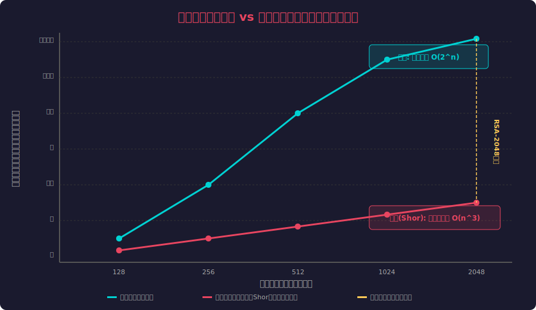
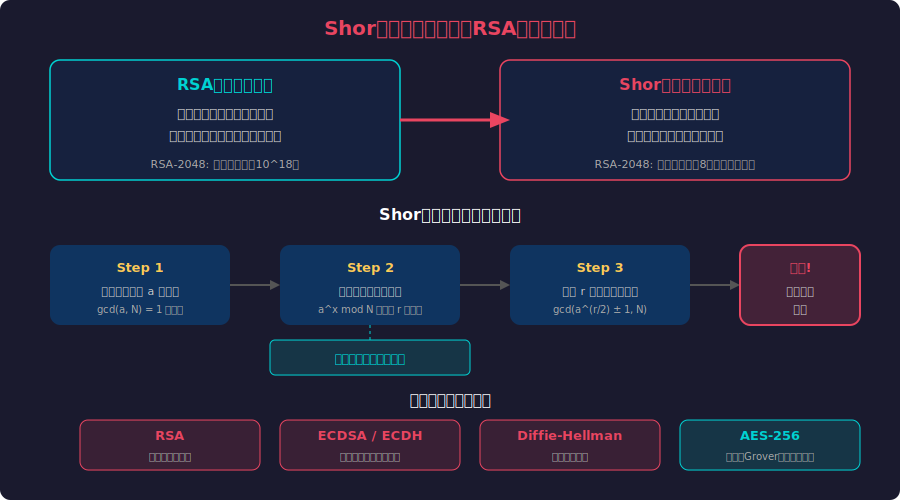
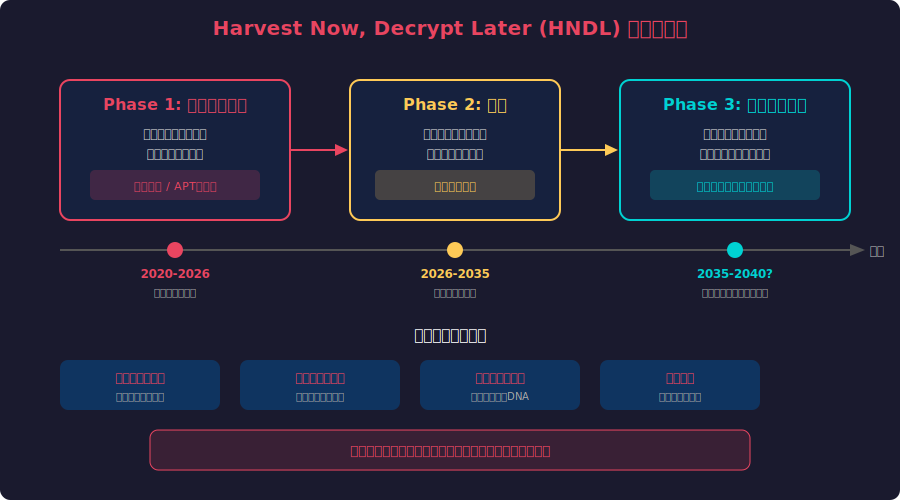
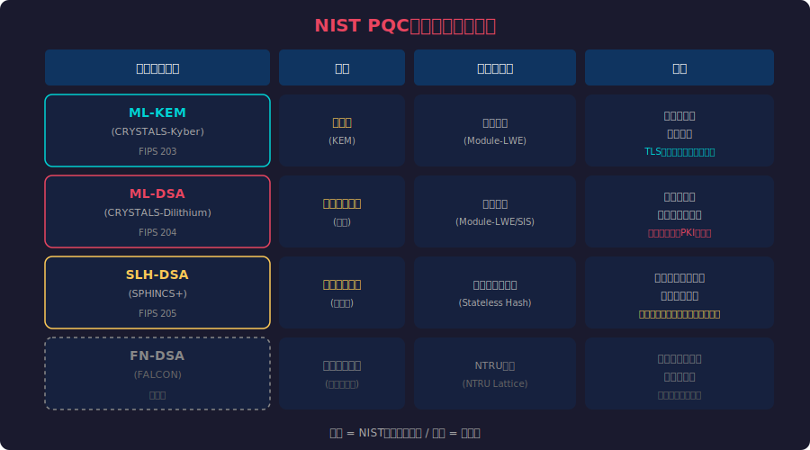
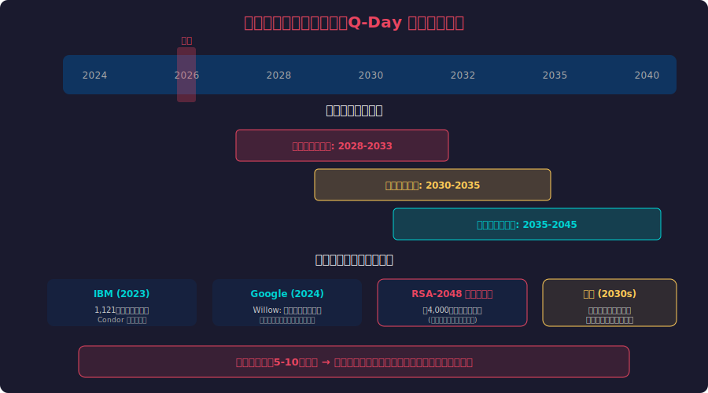
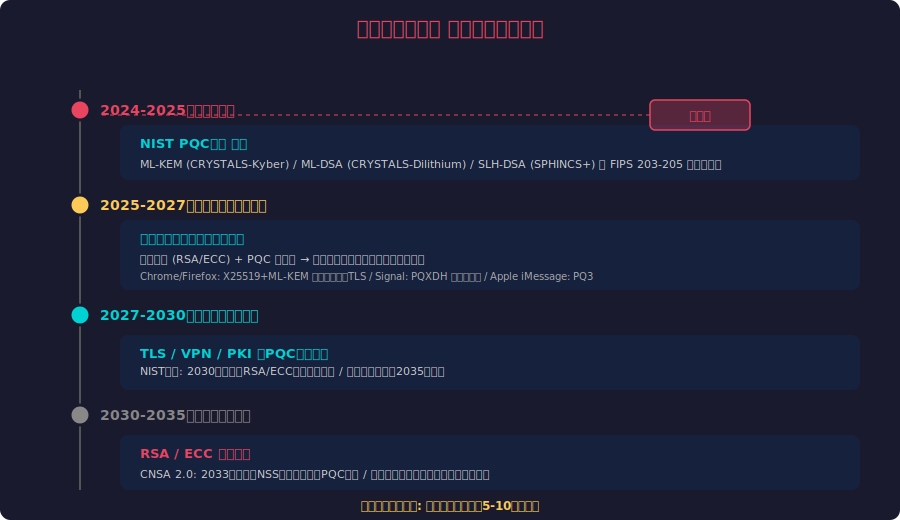

<!-- _class: lead -->
# ポスト量子暗号

- 今日の秘密は明日解読される
- Harvest Now, Decrypt Later × Shorのアルゴリズム × NIST PQC

---

# アジェンダ

> *暗号・量子・HNDLの6章構成で移行戦略を導く*

- - 1. 現代暗号が直面する脅威
- - 2. Shorのアルゴリズムと量子コンピュータ
- - 3. Harvest Now, Decrypt Later攻撃
- - 4. NIST PQC標準化の成果
- - 5. 量子脅威タイムライン
- - 6. 移行ロードマップと実践

---

<!-- _class: lead -->
# 現代暗号が直面する脅威

- <svg viewBox="0 0 800 360" style="max-height:70vh;max-width:100%;display:block;margin:0 auto;" xmlns="http://www.w3.org/2000/svg"><rect width="800" height="360" fill="#1a1a2e"/><text x="400" y="28" text-anchor="middle" fill="#f9a825" font-size="16" font-weight="bold" font-family="sans-serif">現代暗号が直面する3つの脅威</text><rect x="40" y="50" width="220" height="280" rx="10" fill="#16213e" stroke="#e91e63" stroke-width="2"/><text x="150" y="75" text-anchor="middle" fill="#e91e63" font-size="13" font-weight="bold" font-family="sans-serif">①量子コンピュータ</text><rect x="58" y="90" width="184" height="50" rx="6" fill="#1a1a2e"/><text x="150" y="112" text-anchor="middle" fill="#ffffff" font-size="11" font-family="sans-serif">Shorのアルゴリズムが</text><text x="150" y="130" text-anchor="middle" fill="#ffffff" font-size="11" font-family="sans-serif">RSA/ECCを破る</text><rect x="58" y="148" width="184" height="50" rx="6" fill="#1a1a2e"/><text x="150" y="168" text-anchor="middle" fill="#e91e63" font-size="11" font-family="sans-serif">2048bit RSA:</text><text x="150" y="186" text-anchor="middle" fill="#e91e63" font-size="11" font-family="sans-serif">4000論理qubitで解読可能</text><rect x="58" y="206" width="184" height="50" rx="6" fill="#1a1a2e"/><text x="150" y="226" text-anchor="middle" fill="#aaaaaa" font-size="11" font-family="sans-serif">現在: ~1000 noisy qubit</text><text x="150" y="244" text-anchor="middle" fill="#f9a825" font-size="11" font-family="sans-serif">Q-Day: 2030-2035?</text><rect x="58" y="265" width="184" height="50" rx="6" fill="#e91e63" fill-opacity="0.2"/><text x="150" y="287" text-anchor="middle" fill="#e91e63" font-size="11" font-family="sans-serif">全既存暗号通信が</text><text x="150" y="303" text-anchor="middle" fill="#e91e63" font-size="11" font-family="sans-serif">遡及的に解読される</text><rect x="290" y="50" width="220" height="280" rx="10" fill="#16213e" stroke="#f9a825" stroke-width="2"/><text x="400" y="75" text-anchor="middle" fill="#f9a825" font-size="13" font-weight="bold" font-family="sans-serif">②HNDL攻撃</text><rect x="308" y="90" width="184" height="50" rx="6" fill="#1a1a2e"/><text x="400" y="112" text-anchor="middle" fill="#ffffff" font-size="11" font-family="sans-serif">Harvest Now,</text><text x="400" y="130" text-anchor="middle" fill="#ffffff" font-size="11" font-family="sans-serif">Decrypt Later</text><rect x="308" y="148" width="184" height="50" rx="6" fill="#1a1a2e"/><text x="400" y="168" text-anchor="middle" fill="#f9a825" font-size="11" font-family="sans-serif">今すぐ暗号データを収集</text><text x="400" y="186" text-anchor="middle" fill="#f9a825" font-size="11" font-family="sans-serif">量子時代に復号する</text><rect x="308" y="206" width="184" height="50" rx="6" fill="#1a1a2e"/><text x="400" y="226" text-anchor="middle" fill="#aaaaaa" font-size="11" font-family="sans-serif">国家レベルで実施中</text><text x="400" y="244" text-anchor="middle" fill="#e91e63" font-size="11" font-family="sans-serif">今対策しないと手遅れ</text><rect x="308" y="265" width="184" height="50" rx="6" fill="#f9a825" fill-opacity="0.15"/><text x="400" y="287" text-anchor="middle" fill="#f9a825" font-size="11" font-family="sans-serif">機密情報の有効期間が</text><text x="400" y="303" text-anchor="middle" fill="#f9a825" font-size="11" font-family="sans-serif">対策タイムラインを決める</text><rect x="540" y="50" width="220" height="280" rx="10" fill="#16213e" stroke="#e91e63" stroke-width="2"/><text x="650" y="75" text-anchor="middle" fill="#e91e63" font-size="13" font-weight="bold" font-family="sans-serif">③移行の困難さ</text><rect x="558" y="90" width="184" height="50" rx="6" fill="#1a1a2e"/><text x="650" y="112" text-anchor="middle" fill="#ffffff" font-size="11" font-family="sans-serif">TLS/PKI全体の</text><text x="650" y="130" text-anchor="middle" fill="#ffffff" font-size="11" font-family="sans-serif">更新が必要</text><rect x="558" y="148" width="184" height="50" rx="6" fill="#1a1a2e"/><text x="650" y="168" text-anchor="middle" fill="#e91e63" font-size="11" font-family="sans-serif">インターネット規模の</text><text x="650" y="186" text-anchor="middle" fill="#e91e63" font-size="11" font-family="sans-serif">インフラ更新</text><rect x="558" y="206" width="184" height="50" rx="6" fill="#1a1a2e"/><text x="650" y="226" text-anchor="middle" fill="#aaaaaa" font-size="11" font-family="sans-serif">IoT/組込みシステムは</text><text x="650" y="244" text-anchor="middle" fill="#e91e63" font-size="11" font-family="sans-serif">10年以上かかる</text><rect x="558" y="265" width="184" height="50" rx="6" fill="#e91e63" fill-opacity="0.2"/><text x="650" y="287" text-anchor="middle" fill="#e91e63" font-size="11" font-family="sans-serif">今すぐ始めないと</text><text x="650" y="303" text-anchor="middle" fill="#e91e63" font-size="11" font-family="sans-serif">間に合わない</text></svg>
- 量子コンピュータはなぜ暗号を破壊するのか

---

# 暗号の安全性の前提

> *RSA/ECCは素因数分解の困難性に依存—量子で破れる*

- <svg viewBox="0 0 800 360" style="max-height:70vh;max-width:100%;display:block;margin:0 auto;" xmlns="http://www.w3.org/2000/svg"><rect width="800" height="360" fill="#1a1a2e"/><text x="400" y="28" text-anchor="middle" fill="#f9a825" font-size="17" font-family="sans-serif" font-weight="bold">現代暗号の安全性：「計算困難性」という脆弱な土台</text><rect x="40" y="50" width="340" height="270" rx="10" fill="#16213e" stroke="#4fc3f7" stroke-width="2"/><text x="210" y="78" text-anchor="middle" fill="#4fc3f7" font-size="14" font-family="sans-serif" font-weight="bold">古典コンピュータ</text><text x="60" y="108" fill="#ffffff" font-size="12" font-family="sans-serif" font-weight="bold">RSA暗号</text><text x="60" y="128" fill="#aaaaaa" font-size="11" font-family="sans-serif">2048ビット整数の素因数分解</text><text x="60" y="148" fill="#81c784" font-size="11" font-family="sans-serif">古典: 10^18年（宇宙の年齢の10億倍）</text><line x1="60" y1="162" x2="360" y2="162" stroke="#333355" stroke-width="1"/><text x="60" y="182" fill="#ffffff" font-size="12" font-family="sans-serif" font-weight="bold">楕円曲線暗号 (ECC)</text><text x="60" y="202" fill="#aaaaaa" font-size="11" font-family="sans-serif">楕円曲線上の離散対数問題</text><text x="60" y="222" fill="#81c784" font-size="11" font-family="sans-serif">現在: 「解読不可能」とされる</text><line x1="60" y1="235" x2="360" y2="235" stroke="#333355" stroke-width="1"/><text x="210" y="265" text-anchor="middle" fill="#4fc3f7" font-size="12" font-family="sans-serif" font-weight="bold">インターネットの全TLS通信</text><text x="210" y="285" text-anchor="middle" fill="#4fc3f7" font-size="12" font-family="sans-serif" font-weight="bold">が依存する基盤</text><rect x="420" y="50" width="340" height="270" rx="10" fill="#16213e" stroke="#e91e63" stroke-width="2"/><text x="590" y="78" text-anchor="middle" fill="#e91e63" font-size="14" font-family="sans-serif" font-weight="bold">量子コンピュータ（未来）</text><text x="440" y="108" fill="#ffffff" font-size="12" font-family="sans-serif" font-weight="bold">Shorのアルゴリズム</text><text x="440" y="128" fill="#e91e63" font-size="11" font-family="sans-serif">同じ問題を多項式時間で解く</text><text x="440" y="148" fill="#e91e63" font-size="11" font-family="sans-serif">RSA-2048: 約8時間（理論値）</text><line x1="440" y1="162" x2="740" y2="162" stroke="#333355" stroke-width="1"/><text x="440" y="182" fill="#ffffff" font-size="12" font-family="sans-serif" font-weight="bold">Groverのアルゴリズム</text><text x="440" y="202" fill="#f9a825" font-size="11" font-family="sans-serif">AES等の対称暗号: 鍵長半減</text><text x="440" y="222" fill="#aaaaaa" font-size="11" font-family="sans-serif">AES-256 → AES-128相当に</text><line x1="440" y1="235" x2="740" y2="235" stroke="#333355" stroke-width="1"/><text x="590" y="265" text-anchor="middle" fill="#e91e63" font-size="12" font-family="sans-serif" font-weight="bold">公開鍵暗号の根幹が</text><text x="590" y="285" text-anchor="middle" fill="#e91e63" font-size="12" font-family="sans-serif" font-weight="bold">崩壊するリスク</text></svg>
- - **RSA暗号**: 巨大な数の素因数分解が計算上不可能
- - **楕円曲線暗号 (ECC)**: 楕円曲線上の離散対数問題が困難
- - **Diffie-Hellman**: 離散対数問題に基づく鍵交換
- - これらは全て**数学的困難性**に依存している
- - 古典コンピュータでは数十億年かかる計算
- - しかし量子コンピュータが前提を根底から覆す

---

# 古典 vs 量子：計算量の断崖

- <svg viewBox="0 0 800 360" style="max-height:70vh;max-width:100%;display:block;margin:0 auto;" xmlns="http://www.w3.org/2000/svg"><rect width="800" height="360" fill="#1a1a2e"/><text x="400" y="28" text-anchor="middle" fill="#f9a825" font-size="16" font-weight="bold" font-family="sans-serif">古典 vs 量子：計算量の断崖</text><rect x="40" y="50" width="340" height="280" rx="10" fill="#16213e" stroke="#f9a825" stroke-width="2"/><text x="210" y="75" text-anchor="middle" fill="#f9a825" font-size="13" font-weight="bold" font-family="sans-serif">古典コンピュータ</text><text x="210" y="95" text-anchor="middle" fill="#aaaaaa" font-size="11" font-family="sans-serif">RSA-2048の因数分解</text><rect x="58" y="108" width="304" height="44" rx="6" fill="#1a1a2e"/><text x="210" y="127" text-anchor="middle" fill="#ffffff" font-size="12" font-family="sans-serif">最良アルゴリズム: GNFS</text><text x="210" y="143" text-anchor="middle" fill="#aaaaaa" font-size="11" font-family="sans-serif">計算量: exp(n^(1/3)) クラス</text><rect x="58" y="160" width="304" height="44" rx="6" fill="#1a1a2e"/><text x="210" y="179" text-anchor="middle" fill="#ffffff" font-size="12" font-family="sans-serif">現在最速スパコン:</text><text x="210" y="195" text-anchor="middle" fill="#f9a825" font-size="12" font-family="sans-serif">RSA-2048 ≈ 10^14 年</text><rect x="58" y="212" width="304" height="44" rx="6" fill="#1a1a2e"/><text x="210" y="231" text-anchor="middle" fill="#ffffff" font-size="12" font-family="sans-serif">宇宙の年齢: ~10^10 年</text><text x="210" y="247" text-anchor="middle" fill="#aaaaaa" font-size="11" font-family="sans-serif">つまり事実上「解けない」</text><rect x="58" y="264" width="304" height="50" rx="6" fill="#f9a825" fill-opacity="0.15"/><text x="210" y="286" text-anchor="middle" fill="#f9a825" font-size="12" font-weight="bold" font-family="sans-serif">現代暗号の前提</text><text x="210" y="304" text-anchor="middle" fill="#f9a825" font-size="11" font-family="sans-serif">「計算量が保証する安全性」</text><rect x="420" y="50" width="340" height="280" rx="10" fill="#16213e" stroke="#e91e63" stroke-width="2"/><text x="590" y="75" text-anchor="middle" fill="#e91e63" font-size="13" font-weight="bold" font-family="sans-serif">量子コンピュータ</text><text x="590" y="95" text-anchor="middle" fill="#aaaaaa" font-size="11" font-family="sans-serif">Shorのアルゴリズム</text><rect x="438" y="108" width="304" height="44" rx="6" fill="#1a1a2e"/><text x="590" y="127" text-anchor="middle" fill="#ffffff" font-size="12" font-family="sans-serif">量子フーリエ変換を活用</text><text x="590" y="143" text-anchor="middle" fill="#aaaaaa" font-size="11" font-family="sans-serif">計算量: poly(n) クラス</text><rect x="438" y="160" width="304" height="44" rx="6" fill="#1a1a2e"/><text x="590" y="179" text-anchor="middle" fill="#ffffff" font-size="12" font-family="sans-serif">必要qubit数:</text><text x="590" y="195" text-anchor="middle" fill="#e91e63" font-size="12" font-family="sans-serif">RSA-2048 ≈ 4,000 論理qubit</text><rect x="438" y="212" width="304" height="44" rx="6" fill="#1a1a2e"/><text x="590" y="231" text-anchor="middle" fill="#ffffff" font-size="12" font-family="sans-serif">予測解読時間: 数時間</text><text x="590" y="247" text-anchor="middle" fill="#e91e63" font-size="11" font-family="sans-serif">10^14年 → 数時間に短縮</text><rect x="438" y="264" width="304" height="50" rx="6" fill="#e91e63" fill-opacity="0.2"/><text x="590" y="286" text-anchor="middle" fill="#e91e63" font-size="12" font-weight="bold" font-family="sans-serif">前提が崩壊する</text><text x="590" y="304" text-anchor="middle" fill="#e91e63" font-size="11" font-family="sans-serif">全ての公開鍵暗号が危険に</text></svg>

---

<!-- _class: lead -->
# Shorのアルゴリズム

- 1994年に発表された、暗号学を揺るがす量子アルゴリズム

---

# Shorのアルゴリズムの仕組み

---

# なぜShorは脅威なのか

> *4096bit RSAを量子PCが数時間で解読できる*

- <svg viewBox="0 0 800 360" style="max-height:70vh;max-width:100%;display:block;margin:0 auto;" xmlns="http://www.w3.org/2000/svg"><rect width="800" height="360" fill="#1a1a2e"/><text x="400" y="28" text-anchor="middle" fill="#f9a825" font-size="17" font-family="sans-serif" font-weight="bold">Shorのアルゴリズム：指数時間 → 多項式時間の断崖</text><rect x="40" y="50" width="340" height="200" rx="10" fill="#16213e" stroke="#4fc3f7" stroke-width="2"/><text x="210" y="78" text-anchor="middle" fill="#4fc3f7" font-size="13" font-family="sans-serif" font-weight="bold">古典アルゴリズム</text><text x="210" y="108" text-anchor="middle" fill="#ffffff" font-size="12" font-family="sans-serif">計算量: O(exp(n^1/3))</text><text x="210" y="130" text-anchor="middle" fill="#aaaaaa" font-size="11" font-family="sans-serif">指数関数的に増加</text><text x="210" y="165" text-anchor="middle" fill="#e91e63" font-size="22" font-family="sans-serif" font-weight="bold">10^18 年</text><text x="210" y="188" text-anchor="middle" fill="#aaaaaa" font-size="11" font-family="sans-serif">RSA-2048の解読</text><text x="210" y="228" text-anchor="middle" fill="#aaaaaa" font-size="11" font-family="sans-serif">現実的に不可能</text><rect x="420" y="50" width="340" height="200" rx="10" fill="#16213e" stroke="#e91e63" stroke-width="2"/><text x="590" y="78" text-anchor="middle" fill="#e91e63" font-size="13" font-family="sans-serif" font-weight="bold">Shorのアルゴリズム</text><text x="590" y="108" text-anchor="middle" fill="#ffffff" font-size="12" font-family="sans-serif">計算量: O(n^3)</text><text x="590" y="130" text-anchor="middle" fill="#aaaaaa" font-size="11" font-family="sans-serif">多項式時間</text><text x="590" y="165" text-anchor="middle" fill="#81c784" font-size="22" font-family="sans-serif" font-weight="bold">約 8 時間</text><text x="590" y="188" text-anchor="middle" fill="#aaaaaa" font-size="11" font-family="sans-serif">同じRSA-2048（理論値）</text><text x="590" y="228" text-anchor="middle" fill="#e91e63" font-size="12" font-family="sans-serif">量子フーリエ変換で実現</text><rect x="160" y="280" width="480" height="60" rx="8" fill="#16213e" stroke="#f9a825" stroke-width="2"/><text x="400" y="305" text-anchor="middle" fill="#f9a825" font-size="14" font-family="sans-serif" font-weight="bold">影響範囲: RSA, ECDSA, ECDH, DH — 全破壊</text><text x="400" y="328" text-anchor="middle" fill="#aaaaaa" font-size="11" font-family="sans-serif">AES-256のみ: Groverで鍵長半減（対策可能）</text></svg>
- - **指数時間 → 多項式時間**: O(2^n) から O(n^3) への劇的削減
- - **RSA-2048**: 古典で10^18年 → 量子で約8時間（理論値）
- - **量子フーリエ変換**: 古典では不可能な超並列計算を実現
- - **影響範囲**: RSA, ECDSA, ECDH, Diffie-Hellman が全て破壊
- - **AES-256は安全**: Groverアルゴリズムでも鍵長半減のみ
- - 公開鍵暗号の根幹が揺らぐ事態

<!--
Peter Shorが1994年に発表。当時は量子コンピュータが実現不可能と考えられていたが、近年の進展で現実の脅威に。
-->

---

<!-- _class: lead -->
# Harvest Now, Decrypt Later

- 量子コンピュータを待たずに始まっている攻撃

---

# HNDL攻撃フロー

- <svg viewBox="0 0 800 360" style="max-height:70vh;max-width:100%;display:block;margin:0 auto;" xmlns="http://www.w3.org/2000/svg"><rect width="800" height="360" fill="#1a1a2e"/><text x="400" y="28" text-anchor="middle" fill="#f9a825" font-size="16" font-weight="bold" font-family="sans-serif">HNDL攻撃の深刻さ：なぜ今すぐ対策が必要か</text><line x1="80" y1="110" x2="720" y2="110" stroke="#f9a825" stroke-width="2.5"/><circle cx="120" cy="110" r="6" fill="#f9a825"/><text x="120" y="97" text-anchor="middle" fill="#f9a825" font-size="11" font-family="sans-serif">現在</text><text x="120" y="83" text-anchor="middle" fill="#ffffff" font-size="10" font-family="sans-serif">収集開始</text><circle cx="280" cy="110" r="6" fill="#e91e63"/><text x="280" y="97" text-anchor="middle" fill="#e91e63" font-size="11" font-family="sans-serif">2026-2028</text><text x="280" y="83" text-anchor="middle" fill="#ffffff" font-size="10" font-family="sans-serif">PQC移行期限</text><circle cx="480" cy="110" r="6" fill="#e91e63"/><text x="480" y="97" text-anchor="middle" fill="#e91e63" font-size="11" font-family="sans-serif">2030-2035</text><text x="480" y="83" text-anchor="middle" fill="#ffffff" font-size="10" font-family="sans-serif">Q-Day予測</text><circle cx="680" cy="110" r="6" fill="#aaaaaa"/><text x="680" y="97" text-anchor="middle" fill="#aaaaaa" font-size="11" font-family="sans-serif">Q-Day後</text><text x="680" y="83" text-anchor="middle" fill="#aaaaaa" font-size="10" font-family="sans-serif">大規模解読</text><rect x="40" y="130" width="340" height="200" rx="8" fill="#16213e" stroke="#e91e63" stroke-width="1.5"/><text x="210" y="153" text-anchor="middle" fill="#e91e63" font-size="13" font-weight="bold" font-family="sans-serif">攻撃の仕組み</text><rect x="58" y="165" width="304" height="36" rx="5" fill="#1a1a2e"/><text x="210" y="188" text-anchor="middle" fill="#ffffff" font-size="12" font-family="sans-serif">今: 暗号化通信を大量収集・保管</text><rect x="58" y="209" width="304" height="36" rx="5" fill="#1a1a2e"/><text x="210" y="232" text-anchor="middle" fill="#ffffff" font-size="12" font-family="sans-serif">Q-Day後: 全データを一括復号</text><rect x="58" y="253" width="304" height="36" rx="5" fill="#1a1a2e"/><text x="210" y="276" text-anchor="middle" fill="#ffffff" font-size="12" font-family="sans-serif">対象: 機密通信・医療・金融</text><rect x="58" y="297" width="304" height="22" rx="5" fill="#e91e63" fill-opacity="0.2"/><text x="210" y="313" text-anchor="middle" fill="#e91e63" font-size="11" font-family="sans-serif">収集済みデータは後から保護不可能</text><rect x="420" y="130" width="340" height="200" rx="8" fill="#16213e" stroke="#f9a825" stroke-width="1.5"/><text x="590" y="153" text-anchor="middle" fill="#f9a825" font-size="13" font-weight="bold" font-family="sans-serif">対策のタイムライン</text><rect x="438" y="165" width="304" height="36" rx="5" fill="#1a1a2e"/><text x="590" y="188" text-anchor="middle" fill="#ffffff" font-size="12" font-family="sans-serif">機密情報の有効期間: 10-30年</text><rect x="438" y="209" width="304" height="36" rx="5" fill="#1a1a2e"/><text x="590" y="232" text-anchor="middle" fill="#ffffff" font-size="12" font-family="sans-serif">PQC移行期間: 5-10年</text><rect x="438" y="253" width="304" height="36" rx="5" fill="#1a1a2e"/><text x="590" y="276" text-anchor="middle" fill="#f9a825" font-size="12" font-family="sans-serif">つまり: 今から対策が必須</text><rect x="438" y="297" width="304" height="22" rx="5" fill="#f9a825" fill-opacity="0.15"/><text x="590" y="313" text-anchor="middle" fill="#f9a825" font-size="11" font-family="sans-serif">Q-Day前に移行完了が必要条件</text></svg>

---

# HNDLが深刻な理由

> *今盗んだ暗号文を量子PC完成後に解読する攻撃が現実*

- <svg viewBox="0 0 800 360" style="max-height:70vh;max-width:100%;display:block;margin:0 auto;" xmlns="http://www.w3.org/2000/svg"><rect width="800" height="360" fill="#1a1a2e"/><text x="400" y="28" text-anchor="middle" fill="#f9a825" font-size="17" font-family="sans-serif" font-weight="bold">Harvest Now, Decrypt Later：今日暗号化しても明日解読される</text><rect x="40" y="50" width="220" height="260" rx="8" fill="#16213e" stroke="#e91e63" stroke-width="2"/><text x="150" y="78" text-anchor="middle" fill="#e91e63" font-size="12" font-family="sans-serif" font-weight="bold">今日（2026年）</text><line x1="60" y1="88" x2="240" y2="88" stroke="#333355" stroke-width="1"/><text x="150" y="115" text-anchor="middle" fill="#ffffff" font-size="11" font-family="sans-serif">国家機関が暗号通信を</text><text x="150" y="133" text-anchor="middle" fill="#ffffff" font-size="11" font-family="sans-serif">大量に傍受・保存</text><text x="150" y="165" text-anchor="middle" fill="#e91e63" font-size="28" font-family="sans-serif">⬇</text><text x="150" y="200" text-anchor="middle" fill="#aaaaaa" font-size="10" font-family="sans-serif">外交電報</text><text x="150" y="218" text-anchor="middle" fill="#aaaaaa" font-size="10" font-family="sans-serif">軍事機密</text><text x="150" y="236" text-anchor="middle" fill="#aaaaaa" font-size="10" font-family="sans-serif">医療・金融データ</text><text x="150" y="280" text-anchor="middle" fill="#e91e63" font-size="11" font-family="sans-serif" font-weight="bold">「暗号化済み」でも</text><text x="150" y="298" text-anchor="middle" fill="#e91e63" font-size="11" font-family="sans-serif" font-weight="bold">安心できない</text><rect x="290" y="50" width="60" height="260" rx="6" fill="#16213e" stroke="#555577" stroke-width="1"/><text x="320" y="200" text-anchor="middle" fill="#555577" font-size="36" font-family="sans-serif">→</text><rect x="540" y="50" width="220" height="260" rx="8" fill="#16213e" stroke="#f9a825" stroke-width="2"/><text x="650" y="78" text-anchor="middle" fill="#f9a825" font-size="12" font-family="sans-serif" font-weight="bold">Q-Day（未来）</text><line x1="560" y1="88" x2="740" y2="88" stroke="#333355" stroke-width="1"/><text x="650" y="115" text-anchor="middle" fill="#ffffff" font-size="11" font-family="sans-serif">量子コンピュータで</text><text x="650" y="133" text-anchor="middle" fill="#ffffff" font-size="11" font-family="sans-serif">保存データを解読</text><text x="650" y="165" text-anchor="middle" fill="#f9a825" font-size="28" font-family="sans-serif">⬇</text><text x="650" y="200" text-anchor="middle" fill="#e91e63" font-size="11" font-family="sans-serif">RSA暗号が解読</text><text x="650" y="220" text-anchor="middle" fill="#e91e63" font-size="11" font-family="sans-serif">秘密情報が漏洩</text><text x="650" y="240" text-anchor="middle" fill="#aaaaaa" font-size="10" font-family="sans-serif">過去に遡って全て</text><text x="650" y="280" text-anchor="middle" fill="#f9a825" font-size="11" font-family="sans-serif" font-weight="bold">今の通信が</text><text x="650" y="298" text-anchor="middle" fill="#f9a825" font-size="11" font-family="sans-serif" font-weight="bold">未来のリスクになる</text></svg>
- - **既に進行中**: 国家レベルの傍受活動は公知の事実
- - **遡及的な被害**: 過去のデータが将来解読される
- - **長寿命データが標的**: 外交・軍事・医療・金融情報
- - **防御が困難**: 傍受の事実を検知できない
- - **時間が味方しない**: データの価値は保存期間と比例
- - 「暗号化しているから安全」は**もはや成立しない**

---

<!-- _class: lead -->
# NIST PQC標準化の成果

- <svg viewBox="0 0 800 360" style="max-height:70vh;max-width:100%;display:block;margin:0 auto;" xmlns="http://www.w3.org/2000/svg"><rect width="800" height="360" fill="#1a1a2e"/><text x="400" y="28" text-anchor="middle" fill="#f9a825" font-size="16" font-weight="bold" font-family="sans-serif">NIST PQC標準化の成果：4つの新アルゴリズム</text><rect x="40" y="50" width="340" height="130" rx="8" fill="#16213e" stroke="#f9a825" stroke-width="2"/><text x="60" y="73" fill="#f9a825" font-size="12" font-weight="bold" font-family="sans-serif">ML-KEM (Kyber) — 鍵カプセル化</text><text x="60" y="95" fill="#ffffff" font-size="11" font-family="sans-serif">格子問題の困難性に基づく</text><text x="60" y="113" fill="#aaaaaa" font-size="11" font-family="sans-serif">TLSの鍵交換に直接置き換え可能</text><text x="60" y="131" fill="#f9a825" font-size="11" font-family="sans-serif">→ 2024年8月 FIPS 203 として標準化</text><text x="60" y="160" fill="#aaaaaa" font-size="10" font-family="sans-serif">既にGoogle Chrome / CloudFlare で試験実装</text><rect x="420" y="50" width="340" height="130" rx="8" fill="#16213e" stroke="#e91e63" stroke-width="2"/><text x="440" y="73" fill="#e91e63" font-size="12" font-weight="bold" font-family="sans-serif">ML-DSA (Dilithium) — デジタル署名</text><text x="440" y="95" fill="#ffffff" font-size="11" font-family="sans-serif">格子問題ベースの署名スキーム</text><text x="440" y="113" fill="#aaaaaa" font-size="11" font-family="sans-serif">コードサイニング・証明書の置き換え</text><text x="440" y="131" fill="#e91e63" font-size="11" font-family="sans-serif">→ 2024年8月 FIPS 204 として標準化</text><text x="440" y="160" fill="#aaaaaa" font-size="10" font-family="sans-serif">NSAが政府システム向けに推奨</text><rect x="40" y="200" width="340" height="130" rx="8" fill="#16213e" stroke="#f9a825" stroke-width="2"/><text x="60" y="223" fill="#f9a825" font-size="12" font-weight="bold" font-family="sans-serif">SLH-DSA (SPHINCS+) — 署名(代替)</text><text x="60" y="245" fill="#ffffff" font-size="11" font-family="sans-serif">ハッシュ関数ベース (最も保守的)</text><text x="60" y="263" fill="#aaaaaa" font-size="11" font-family="sans-serif">量子後も信頼性の高い数学的根拠</text><text x="60" y="281" fill="#f9a825" font-size="11" font-family="sans-serif">→ 2024年8月 FIPS 205 として標準化</text><text x="60" y="310" fill="#aaaaaa" font-size="10" font-family="sans-serif">バックアップ署名スキームとして位置づけ</text><rect x="420" y="200" width="340" height="130" rx="8" fill="#16213e" stroke="#aaaaaa" stroke-width="1.5"/><text x="440" y="223" fill="#aaaaaa" font-size="12" font-weight="bold" font-family="sans-serif">FN-DSA (Falcon) — 署名(高効率)</text><text x="440" y="245" fill="#ffffff" font-size="11" font-family="sans-serif">NTRU格子ベース、署名サイズが小さい</text><text x="440" y="263" fill="#aaaaaa" font-size="11" font-family="sans-serif">IoT/制約環境向けに最適化</text><text x="440" y="281" fill="#aaaaaa" font-size="11" font-family="sans-serif">→ FIPS 206 として標準化</text><text x="440" y="310" fill="#aaaaaa" font-size="10" font-family="sans-serif">実装の複雑さが課題</text></svg>
- 10年の選定プロセスを経て、新たな暗号標準が誕生

---

# NIST PQC標準アルゴリズム

---

# 格子暗号とは何か

> *量子でも解けない最短ベクトル問題を安全性の根拠にする*

- <svg viewBox="0 0 800 360" style="max-height:70vh;max-width:100%;display:block;margin:0 auto;" xmlns="http://www.w3.org/2000/svg"><rect width="800" height="360" fill="#1a1a2e"/><text x="400" y="28" text-anchor="middle" fill="#f9a825" font-size="17" font-family="sans-serif" font-weight="bold">格子暗号：量子耐性の根拠となる数学的困難性</text><rect x="40" y="50" width="340" height="270" rx="8" fill="#16213e" stroke="#4fc3f7" stroke-width="2"/><text x="210" y="78" text-anchor="middle" fill="#4fc3f7" font-size="13" font-family="sans-serif" font-weight="bold">格子問題の視覚化</text><text x="210" y="100" text-anchor="middle" fill="#aaaaaa" font-size="10" font-family="sans-serif">高次元格子上の最近ベクトル問題 (SVP)</text><g transform="translate(60,120)"><line x1="0" y1="0" x2="220" y2="0" stroke="#333355" stroke-width="1"/><line x1="0" y1="40" x2="220" y2="40" stroke="#333355" stroke-width="1"/><line x1="0" y1="80" x2="220" y2="80" stroke="#333355" stroke-width="1"/><line x1="0" y1="120" x2="220" y2="120" stroke="#333355" stroke-width="1"/><line x1="0" y1="0" x2="0" y2="130" stroke="#333355" stroke-width="1"/><line x1="40" y1="0" x2="40" y2="130" stroke="#333355" stroke-width="1"/><line x1="80" y1="0" x2="80" y2="130" stroke="#333355" stroke-width="1"/><line x1="120" y1="0" x2="120" y2="130" stroke="#333355" stroke-width="1"/><line x1="160" y1="0" x2="160" y2="130" stroke="#333355" stroke-width="1"/><line x1="200" y1="0" x2="200" y2="130" stroke="#333355" stroke-width="1"/><circle cx="40" cy="40" r="4" fill="#4fc3f7"/><circle cx="80" cy="80" r="4" fill="#4fc3f7"/><circle cx="120" cy="40" r="4" fill="#4fc3f7"/><circle cx="160" cy="80" r="4" fill="#4fc3f7"/><circle cx="200" cy="40" r="4" fill="#4fc3f7"/><circle cx="0" cy="120" r="4" fill="#4fc3f7"/><circle cx="110" cy="95" r="6" fill="#f9a825"/><text x="120" y="90" fill="#f9a825" font-size="8" font-family="sans-serif">探索点</text><line x1="110" y1="95" x2="80" y2="80" stroke="#e91e63" stroke-width="1.5" stroke-dasharray="3,3"/><text x="88" y="92" fill="#e91e63" font-size="8" font-family="sans-serif">最近</text></g><text x="210" y="270" text-anchor="middle" fill="#aaaaaa" font-size="10" font-family="sans-serif">高次元では「最も近い格子点」を</text><text x="210" y="286" text-anchor="middle" fill="#aaaaaa" font-size="10" font-family="sans-serif">見つけるのは計算困難</text><rect x="420" y="50" width="340" height="270" rx="8" fill="#16213e" stroke="#f9a825" stroke-width="2"/><text x="590" y="78" text-anchor="middle" fill="#f9a825" font-size="13" font-family="sans-serif" font-weight="bold">ML-KEM / ML-DSA の特性</text><text x="440" y="108" fill="#ffffff" font-size="11" font-family="sans-serif">基盤問題: LWE (Learning With Errors)</text><text x="440" y="128" fill="#aaaaaa" font-size="10" font-family="sans-serif">ノイズ付き連立方程式 — 解くのが困難</text><line x1="440" y1="142" x2="740" y2="142" stroke="#333355" stroke-width="1"/><text x="440" y="165" fill="#81c784" font-size="11" font-family="sans-serif" font-weight="bold">量子耐性あり</text><text x="440" y="183" fill="#aaaaaa" font-size="10" font-family="sans-serif">量子コンピュータでも解けない</text><text x="440" y="200" fill="#aaaaaa" font-size="10" font-family="sans-serif">（と信じられている）</text><line x1="440" y1="212" x2="740" y2="212" stroke="#333355" stroke-width="1"/><text x="440" y="235" fill="#4fc3f7" font-size="11" font-family="sans-serif" font-weight="bold">実用的な鍵サイズ</text><text x="440" y="253" fill="#aaaaaa" font-size="10" font-family="sans-serif">数KB程度 — 実装可能</text><line x1="440" y1="265" x2="740" y2="265" stroke="#333355" stroke-width="1"/><text x="440" y="288" fill="#f9a825" font-size="11" font-family="sans-serif" font-weight="bold">処理速度</text><text x="440" y="306" fill="#aaaaaa" font-size="10" font-family="sans-serif">RSAと同等かそれ以上</text></svg>
- - **格子問題**: 高次元格子上の最近ベクトル問題 (SVP/CVP)
- - **LWE問題**: Learning With Errors — ノイズ付き連立方程式
- - 量子コンピュータでも効率的に解けないと信じられている
- - ML-KEMとML-DSAの両方が格子暗号ベース
- - **鍵サイズ**: RSAより大きいが実用的（数KB程度）
- - **処理速度**: RSAと同等かそれ以上の場合も

<!--
格子暗号は1990年代から研究されており、量子耐性以外にも準同型暗号などの応用がある。
-->

---

# 実装の現状：既に動き出している

> *NIST 2024年標準化完了—移行ウィンドウはあと3〜5年*

- <svg viewBox="0 0 800 360" style="max-height:70vh;max-width:100%;display:block;margin:0 auto;" xmlns="http://www.w3.org/2000/svg"><rect width="800" height="360" fill="#1a1a2e"/><text x="400" y="28" text-anchor="middle" fill="#f9a825" font-size="17" font-family="sans-serif" font-weight="bold">PQC実装の現状：移行は既に始まっている</text><rect x="40" y="50" width="220" height="70" rx="6" fill="#16213e" stroke="#81c784" stroke-width="2"/><text x="150" y="75" text-anchor="middle" fill="#81c784" font-size="11" font-family="sans-serif" font-weight="bold">Chrome / Firefox</text><text x="150" y="95" text-anchor="middle" fill="#aaaaaa" font-size="10" font-family="sans-serif">X25519+ML-KEM ハイブリッドTLS</text><text x="150" y="112" text-anchor="middle" fill="#aaaaaa" font-size="9" font-family="sans-serif">2024年〜 デフォルト</text><rect x="290" y="50" width="220" height="70" rx="6" fill="#16213e" stroke="#81c784" stroke-width="2"/><text x="400" y="75" text-anchor="middle" fill="#81c784" font-size="11" font-family="sans-serif" font-weight="bold">Signal</text><text x="400" y="95" text-anchor="middle" fill="#aaaaaa" font-size="10" font-family="sans-serif">PQXDH プロトコル導入</text><text x="400" y="112" text-anchor="middle" fill="#aaaaaa" font-size="9" font-family="sans-serif">2023年 実装</text><rect x="540" y="50" width="220" height="70" rx="6" fill="#16213e" stroke="#81c784" stroke-width="2"/><text x="650" y="75" text-anchor="middle" fill="#81c784" font-size="11" font-family="sans-serif" font-weight="bold">Apple iMessage</text><text x="650" y="95" text-anchor="middle" fill="#aaaaaa" font-size="10" font-family="sans-serif">PQ3 プロトコル</text><text x="650" y="112" text-anchor="middle" fill="#aaaaaa" font-size="9" font-family="sans-serif">2024年 iOS 17以降</text><rect x="40" y="145" width="220" height="70" rx="6" fill="#16213e" stroke="#4fc3f7" stroke-width="2"/><text x="150" y="170" text-anchor="middle" fill="#4fc3f7" font-size="11" font-family="sans-serif" font-weight="bold">AWS s2n-tls</text><text x="150" y="190" text-anchor="middle" fill="#aaaaaa" font-size="10" font-family="sans-serif">ML-KEMハイブリッド対応</text><text x="150" y="207" text-anchor="middle" fill="#aaaaaa" font-size="9" font-family="sans-serif">エンタープライズ向け</text><rect x="290" y="145" width="220" height="70" rx="6" fill="#16213e" stroke="#4fc3f7" stroke-width="2"/><text x="400" y="170" text-anchor="middle" fill="#4fc3f7" font-size="11" font-family="sans-serif" font-weight="bold">Cloudflare</text><text x="400" y="190" text-anchor="middle" fill="#aaaaaa" font-size="10" font-family="sans-serif">PQC TLSをデフォルト有効化</text><text x="400" y="207" text-anchor="middle" fill="#aaaaaa" font-size="9" font-family="sans-serif">大量トラフィックで検証済</text><rect x="540" y="145" width="220" height="70" rx="6" fill="#16213e" stroke="#f9a825" stroke-width="2"/><text x="650" y="170" text-anchor="middle" fill="#f9a825" font-size="11" font-family="sans-serif" font-weight="bold">NIST標準 (2024)</text><text x="650" y="190" text-anchor="middle" fill="#aaaaaa" font-size="10" font-family="sans-serif">ML-KEM, ML-DSA, SLH-DSA</text><text x="650" y="207" text-anchor="middle" fill="#aaaaaa" font-size="9" font-family="sans-serif">正式標準として公布</text><rect x="100" y="248" width="600" height="85" rx="8" fill="#16213e" stroke="#f9a825" stroke-width="2"/><text x="400" y="278" text-anchor="middle" fill="#f9a825" font-size="14" font-family="sans-serif" font-weight="bold">「まだ早い」は危険な先入観</text><text x="400" y="302" text-anchor="middle" fill="#ffffff" font-size="12" font-family="sans-serif">主要プラットフォームは移行を既に開始している</text><text x="400" y="322" text-anchor="middle" fill="#aaaaaa" font-size="11" font-family="sans-serif">移行完了には5-10年かかる → 今から計画が必要</text></svg>
- - **Chrome / Firefox**: X25519+ML-KEM ハイブリッドTLS (2024〜)
- - **Signal**: PQXDH プロトコル導入 (2023)
- - **Apple iMessage**: PQ3 プロトコル (2024)
- - **AWS**: s2n-tls でML-KEMハイブリッド対応
- - **Cloudflare**: ポスト量子TLSをデフォルト有効化
- - 主要プラットフォームは移行を**既に開始**している

---

<!-- _class: lead -->
# 量子脅威タイムライン

- Q-Day（量子コンピュータが暗号を破る日）はいつ来るか

---

# Q-Day予測と量子コンピュータの進展

- <svg viewBox="0 0 800 360" style="max-height:70vh;max-width:100%;display:block;margin:0 auto;" xmlns="http://www.w3.org/2000/svg"><rect width="800" height="360" fill="#1a1a2e"/><text x="400" y="28" text-anchor="middle" fill="#f9a825" font-size="16" font-weight="bold" font-family="sans-serif">Q-Day予測：量子コンピュータの進展シナリオ</text><line x1="80" y1="240" x2="720" y2="240" stroke="#ffffff" stroke-width="1.5"/><line x1="80" y1="60" x2="80" y2="240" stroke="#ffffff" stroke-width="1.5"/><text x="400" y="260" text-anchor="middle" fill="#ffffff" font-size="12" font-family="sans-serif">年</text><text x="80" y="256" text-anchor="middle" fill="#aaaaaa" font-size="10" font-family="sans-serif">2024</text><text x="208" y="256" text-anchor="middle" fill="#aaaaaa" font-size="10" font-family="sans-serif">2026</text><text x="336" y="256" text-anchor="middle" fill="#aaaaaa" font-size="10" font-family="sans-serif">2028</text><text x="464" y="256" text-anchor="middle" fill="#aaaaaa" font-size="10" font-family="sans-serif">2030</text><text x="592" y="256" text-anchor="middle" fill="#aaaaaa" font-size="10" font-family="sans-serif">2032</text><text x="720" y="256" text-anchor="middle" fill="#aaaaaa" font-size="10" font-family="sans-serif">2034</text><text x="72" y="244" text-anchor="end" fill="#aaaaaa" font-size="10" font-family="sans-serif">100</text><text x="72" y="180" text-anchor="end" fill="#aaaaaa" font-size="10" font-family="sans-serif">1K</text><text x="72" y="120" text-anchor="end" fill="#aaaaaa" font-size="10" font-family="sans-serif">10K</text><text x="72" y="65" text-anchor="end" fill="#aaaaaa" font-size="10" font-family="sans-serif">100K</text><!-- Optimistic scenario --><path d="M 80 225 C 160 215, 250 195, 336 165 C 420 135, 510 100, 600 72 C 640 62, 670 61, 720 60" stroke="#e91e63" stroke-width="2" fill="none" stroke-dasharray="8,4"/><text x="600" y="55" fill="#e91e63" font-size="10" font-family="sans-serif">楽観シナリオ(楽)</text><!-- Conservative scenario --><path d="M 80 228 C 160 222, 280 210, 400 188 C 490 170, 580 140, 660 110 C 690 98, 710 90, 720 85" stroke="#f9a825" stroke-width="2.5" fill="none"/><!-- Target line: 4000 logical qubits = RSA-2048 threat --><line x1="80" y1="120" x2="720" y2="120" stroke="#ffffff" stroke-width="1" stroke-dasharray="4,4"/><text x="726" y="118" fill="#ffffff" font-size="10" font-family="sans-serif">RSA-2048</text><text x="726" y="130" fill="#ffffff" font-size="10" font-family="sans-serif">解読ライン</text><circle cx="600" cy="120" r="6" fill="#e91e63"/><text x="580" y="108" fill="#e91e63" font-size="10" font-family="sans-serif">~2031</text><text x="395" y="110" fill="#f9a825" font-size="10" font-family="sans-serif">~2033</text><circle cx="395" cy="120" r="6" fill="#f9a825"/><rect x="40" y="272" width="340" height="64" rx="6" fill="#16213e" stroke="#e91e63" stroke-width="1"/><text x="210" y="292" text-anchor="middle" fill="#e91e63" font-size="11" font-weight="bold" font-family="sans-serif">最速シナリオ: 2030-2032年</text><text x="210" y="310" text-anchor="middle" fill="#ffffff" font-size="11" font-family="sans-serif">誤り訂正の突破口が鍵</text><text x="210" y="326" text-anchor="middle" fill="#aaaaaa" font-size="10" font-family="sans-serif">Google/IBM の競争加速が影響</text><rect x="420" y="272" width="340" height="64" rx="6" fill="#16213e" stroke="#f9a825" stroke-width="1"/><text x="590" y="292" text-anchor="middle" fill="#f9a825" font-size="11" font-weight="bold" font-family="sans-serif">保守シナリオ: 2033-2038年</text><text x="590" y="310" text-anchor="middle" fill="#ffffff" font-size="11" font-family="sans-serif">物理qubitからの論理qubit比率</text><text x="590" y="326" text-anchor="middle" fill="#aaaaaa" font-size="10" font-family="sans-serif">現状: 1000物理→1論理qubit</text></svg>

---

<!-- _class: lead -->
# 移行ロードマップと実践

- 今から始めるべき具体的なステップ

---

# ポスト量子暗号 移行ロードマップ

---

# 今すぐ始められるアクション

> *暗号インベントリ作成→ハイブリッド移行→PQC置換の3段階*

- <svg viewBox="0 0 800 360" style="max-height:70vh;max-width:100%;display:block;margin:0 auto;" xmlns="http://www.w3.org/2000/svg"><rect width="800" height="360" fill="#1a1a2e"/><text x="400" y="28" text-anchor="middle" fill="#f9a825" font-size="17" font-family="sans-serif" font-weight="bold">今すぐ始められる6つのアクション</text><rect x="40" y="50" width="340" height="90" rx="6" fill="#16213e" stroke="#f9a825" stroke-width="2"/><text x="60" y="76" fill="#f9a825" font-size="12" font-family="sans-serif" font-weight="bold">① 暗号インベントリ作成</text><text x="60" y="98" fill="#ffffff" font-size="11" font-family="sans-serif">自組織で使用中の暗号方式を棚卸し</text><text x="60" y="118" fill="#aaaaaa" font-size="10" font-family="sans-serif">TLS証明書・ファイル暗号化・鍵管理を全て列挙</text><rect x="420" y="50" width="340" height="90" rx="6" fill="#16213e" stroke="#4fc3f7" stroke-width="2"/><text x="440" y="76" fill="#4fc3f7" font-size="12" font-family="sans-serif" font-weight="bold">② データ分類</text><text x="440" y="98" fill="#ffffff" font-size="11" font-family="sans-serif">長期秘匿が必要なデータを特定</text><text x="440" y="118" fill="#aaaaaa" font-size="10" font-family="sans-serif">10年以上保護が必要なデータを優先的に対応</text><rect x="40" y="170" width="340" height="90" rx="6" fill="#16213e" stroke="#81c784" stroke-width="2"/><text x="60" y="196" fill="#81c784" font-size="12" font-family="sans-serif" font-weight="bold">③ ハイブリッド化</text><text x="60" y="218" fill="#ffffff" font-size="11" font-family="sans-serif">古典暗号+PQCの併用から開始</text><text x="60" y="238" fill="#aaaaaa" font-size="10" font-family="sans-serif">X25519+ML-KEMのハイブリッドモード</text><rect x="420" y="170" width="340" height="90" rx="6" fill="#16213e" stroke="#e91e63" stroke-width="2"/><text x="440" y="196" fill="#e91e63" font-size="12" font-family="sans-serif" font-weight="bold">④ ライブラリ更新</text><text x="440" y="218" fill="#ffffff" font-size="11" font-family="sans-serif">PQC対応ライブラリ導入</text><text x="440" y="238" fill="#aaaaaa" font-size="10" font-family="sans-serif">liboqs, PQClean, OpenSSL 3.x</text><rect x="40" y="285" width="340" height="55" rx="6" fill="#16213e" stroke="#ff9800" stroke-width="2"/><text x="60" y="309" fill="#ff9800" font-size="12" font-family="sans-serif" font-weight="bold">⑤ テスト環境構築</text><text x="60" y="328" fill="#aaaaaa" font-size="11" font-family="sans-serif">PQC対応のTLS/VPN検証環境</text><rect x="420" y="285" width="340" height="55" rx="6" fill="#16213e" stroke="#f9a825" stroke-width="2"/><text x="440" y="309" fill="#f9a825" font-size="12" font-family="sans-serif" font-weight="bold">⑥ ロードマップ策定</text><text x="440" y="328" fill="#aaaaaa" font-size="11" font-family="sans-serif">2030年完全移行を目標に計画立案</text></svg>
- - **暗号インベントリ作成**: 自組織で使用中の暗号方式を棚卸し
- - **データ分類**: 長期秘匿が必要なデータを特定（10年以上）
- - **ハイブリッド化**: 古典暗号+PQCの併用から開始
- - **ライブラリ更新**: liboqs, PQClean 等のPQC対応ライブラリ導入
- - **テスト環境構築**: PQC対応のTLS/VPN検証環境を準備
- - **ロードマップ策定**: 2030年完全移行を目標に計画立案

---

# 結論：暗号のパラダイムシフトに備えよ

> *HNDL攻撃は今日始まっている—移行を今年開始せよ*

- - **量子の脅威は理論ではなく現実**: HNDLは既に進行中
- - **NIST標準は確定**: ML-KEM, ML-DSA, SLH-DSA が利用可能
- - **移行には5-10年必要**: 今始めなければ間に合わない
- - **ハイブリッドから始める**: 完全移行の前にリスクを低減
- - **「まだ早い」は危険**: Q-Dayの正確な予測は不可能
- - 今日の秘密を守るためには、**今日の行動**が必要

