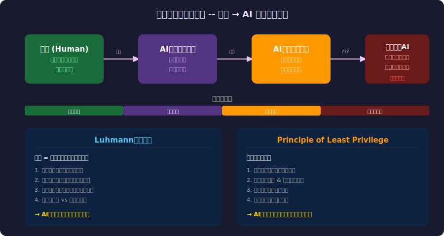
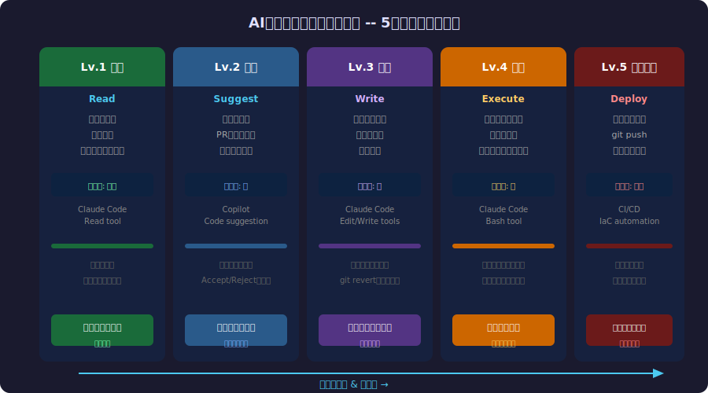
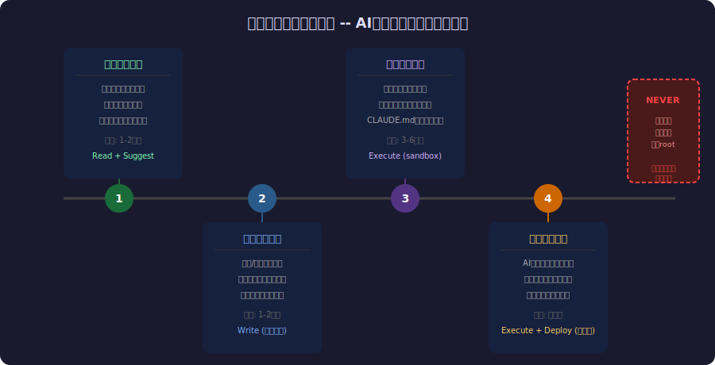

<!-- _class: lead -->
# AIエージェントの信頼問題

- いつSUDO権限を与えるのか
- 
- Luhmannの信頼論 × Principle of Least Privilege

---

# 目次 (1/2)

- - 1. 信頼とは何か -- Luhmannの社会学
- - 2. AIエージェントへの信頼の構造
- - 3. 信頼の委譲チェーン
- - 4. 権限の5段階モデル
- - 5. Claude Code に学ぶ権限設計
- - 6. Principle of Least Privilege

---

# 目次 (2/2)

- - 7. 信頼構築のロードマップ
- - 8. 信頼の崩壊と回復
- - 9. 制度的信頼 vs 人格的信頼
- - 10. SUDO問題の本質
- - 11. まとめと提言

---

<!-- _class: lead -->
# Luhmannの信頼論

---

# Niklas Luhmann -- 信頼の社会学

- - ドイツの社会学者 (1927-1998)
- - 著書『信頼 -- 社会的複雑性の縮減メカニズム』(1968)
- - **信頼の定義**: 複雑性を縮減する社会的メカニズム
- - 全ての可能性を検証することは不可能
- - 信頼によって「検証せずに受け入れる」ことが可能になる
- 
- **AIへの信頼も同じ原理で動く**

---

# 信頼の2つの形態

- - **人格的信頼 (Personal Trust)**
-   - 特定の個人への信頼
-   - 経験と実績に基づく
-   - 「この人なら大丈夫」
- - **制度的信頼 (System Trust)**
-   - 仕組み・制度への信頼
-   - ルールと監査に基づく
-   - 「このシステムなら大丈夫」
- 
- AIエージェントには**両方**が必要

---

<!-- _class: lead -->
# AIへの信頼の構造

---

# 信頼の委譲チェーン

---

# なぜ信頼が必要なのか

- - AIエージェントの出力を**毎回全て検証する**のは非現実的
- - 検証コストがAI使用の利益を上回る → 意味がない
- - しかし**検証なしに全て受け入れる**のは危険
- - 信頼 = 「どこまで検証を省略できるか」の閾値
- 
- **Luhmannの洞察:**
- 「信頼は複雑性を縮減する。しかし信頼にはリスクがある。」

---

<!-- _class: lead -->
# 権限設計

---

# AIエージェント権限段階図

---

# Claude Code の権限モデル

- - **Read**: ファイル読み取り → 自動許可
- - **Edit/Write**: ファイル編集 → 設定で自動許可可能
- - **Bash**: シェルコマンド → コマンドごとに許可設定
- - **外部通信**: git push, API呼び出し → 常に確認
- 
- **設計思想:**
- - デフォルトは最小権限
- - ユーザーが段階的に権限を拡大
- - `--dangerously-skip-permissions` は明示的なオプトイン

---

# Principle of Least Privilege

- - **最小権限の原則** -- セキュリティの基本原則
- - 起源: 1975年 Saltzer & Schroeder
- - 「全てのプログラムと全てのユーザーは、
-   タスク完了に必要な最小限の権限のみで動作すべき」
- - Unix: root vs 一般ユーザー
- - AWS IAM: ポリシーベースのアクセス制御
- - Android/iOS: アプリごとの権限許可
- 
- **AIエージェントにも同じ原則を適用すべき**

---

<!-- _class: lead -->
# SUDO問題

---

# いつSUDO権限を与えるのか

- - **SUDO = 全権委任** -- 最も危険な信頼の形
- - Unixで `sudo` を打つ時、あなたは何を信頼しているか？
-   - そのコマンドが意図通り動くこと
-   - 副作用が許容範囲であること
-   - 取り消し可能であること(最悪の場合)
- - AIに `--dangerously-skip-permissions` を与える時も同じ
- 
- **「便利だから全権限を与える」は sudo ALL=(ALL) NOPASSWD: ALL と同じ**

---

# 信頼の崩壊と回復

- - **信頼の非対称性**: 構築は遅く、崩壊は一瞬
- - AIエージェントが本番環境を壊したら？
-   - 技術的損害 + 心理的信頼の崩壊
-   - 「二度と使わない」反応が自然
- - **回復の条件 (Luhmann)**:
-   - 原因の透明な説明
-   - 再発防止の制度的保証
-   - 段階的な信頼の再構築

---

<!-- _class: lead -->
# 信頼構築ロードマップ

---

# 4フェーズの信頼構築

---

# 制度的信頼の設計

- - **監査ログ**: 全てのAI操作を記録する
- - **サンドボックス**: 本番環境と分離された実行環境
- - **ロールバック**: いつでも元に戻せる仕組み
- - **レビュー**: 人間によるサンプルチェック
- - **設定ファイル**: CLAUDE.md = AIへの制度的契約
- 
- **人格的信頼に頼らない。制度で信頼を担保する。**

---

# 現実のケーススタディ

- - **GitHub Copilot**: Lv.2 (Suggest) -- 提案のみ、人間が判断
- - **Claude Code**: Lv.1-4 -- 段階的権限、設定で制御
- - **Devin**: Lv.3-4 -- 自律的にコード書き・実行
- - **自動運転 (Tesla FSD)**: Lv.4 -- 監視付き自律運転
- - **高頻度取引 (HFT)**: Lv.5 -- 完全自律(ただし厳格な制約)
- 
- 信頼レベルはタスクの**可逆性**と**影響範囲**で決まる

---

<!-- _class: lead -->
# 設計原則

---

# AIエージェント信頼設計の7原則

- - **1. デフォルト最小権限**: 必要になるまで権限を与えない
- - **2. 段階的エスカレーション**: 実績に応じて権限を拡大
- - **3. 可逆性の確保**: いつでも元に戻せる設計
- - **4. 透明性**: AIが何をしたか常に把握できる
- - **5. スコープ限定**: 権限は時間・範囲を限定
- - **6. 人間のバイパス**: 常に人間が介入できる経路
- - **7. 継続的較正**: 信頼レベルを定期的に見直す

---

# まとめ

- - Luhmannの信頼論はAI時代にこそ重要
- - 信頼 = 複雑性の縮減 → AIの出力を全て検証しなくて済む
- - 最小権限の原則はAIエージェントにも適用される
- - 信頼は段階的に構築し、制度で担保する
- - 「便利だから全権限」は最も危険なアンチパターン
- 
- **「SUDOは信頼の最終形態。まだその段階ではない。」**

---

# 参考文献

- - **Sociology:**
- - [Trust and Power - Niklas Luhmann (1979)](https://en.wikipedia.org/wiki/Niklas_Luhmann)
- - **Security:**
- - [The Protection of Information in Computer Systems - Saltzer & Schroeder (1975)](https://web.mit.edu/Saltzer/www/publications/protection/)
- - **AI Tools:**
- - [Claude Code Documentation](https://docs.anthropic.com/en/docs/claude-code)
- - [OWASP Top 10 for LLM Applications (2025)](https://genai.owasp.org/)

