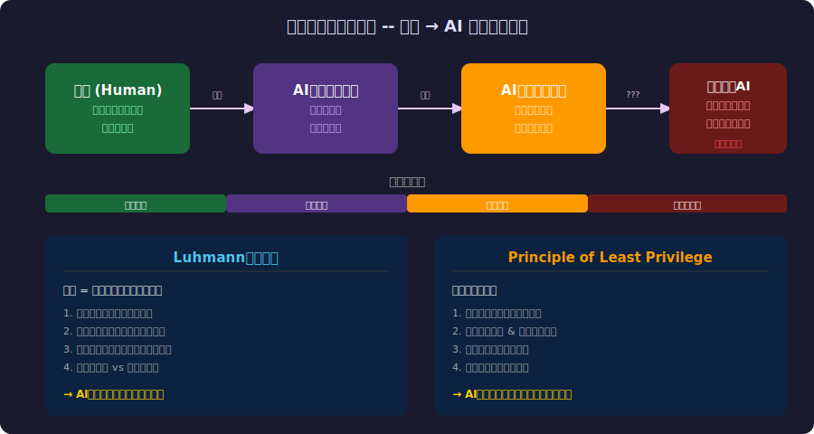
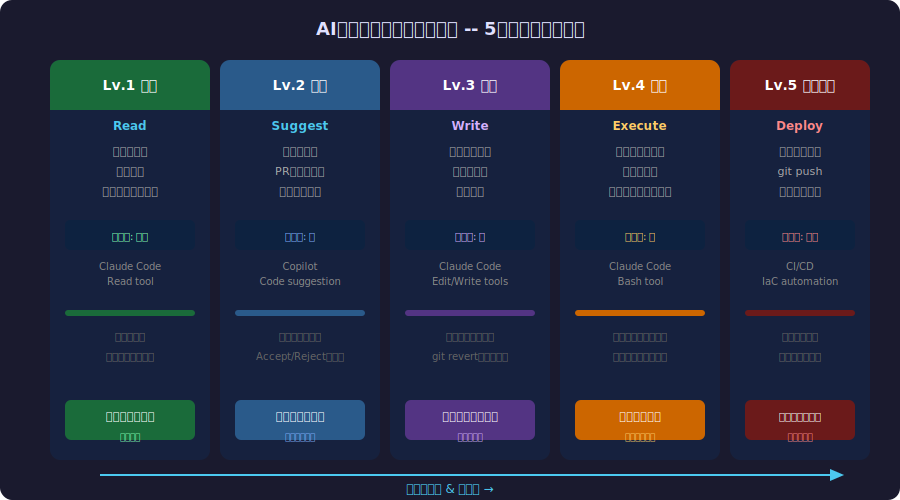
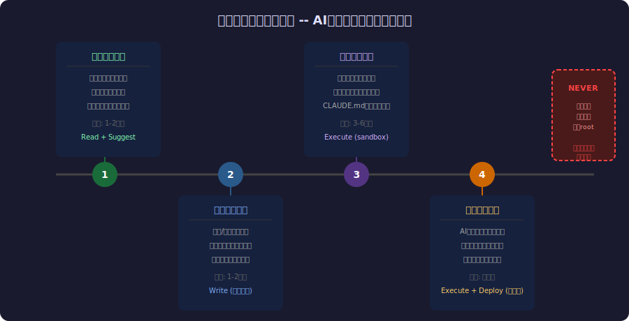

<!-- _class: lead -->
# AIエージェントの信頼問題

- いつSUDO権限を与えるのか
- 
- Luhmannの信頼論 × Principle of Least Privilege

---

# 目次 (1/2)

- - 1. 信頼とは何か -- Luhmannの社会学
- - 2. AIエージェントへの信頼の構造
- - 3. 信頼の委譲チェーン
- - 4. 権限の5段階モデル
- - 5. Claude Code に学ぶ権限設計
- - 6. Principle of Least Privilege

---

# 目次 (2/2)

- - 7. 信頼構築のロードマップ
- - 8. 信頼の崩壊と回復
- - 9. 制度的信頼 vs 人格的信頼
- - 10. SUDO問題の本質
- - 11. まとめと提言

---

<!-- _class: lead -->
# Luhmannの信頼論

---

# Niklas Luhmann -- 信頼の社会学

- - ドイツの社会学者 (1927-1998)
- - 著書『信頼 -- 社会的複雑性の縮減メカニズム』(1968)
- - **信頼の定義**: 複雑性を縮減する社会的メカニズム
- - 全ての可能性を検証することは不可能
- - 信頼によって「検証せずに受け入れる」ことが可能になる
- 
- **AIへの信頼も同じ原理で動く**

---

# 信頼の2つの形態（1/2）

- - **人格的信頼 (Personal Trust)**
-   - 特定の個人への信頼
-   - 経験と実績に基づく
-   - 「この人なら大丈夫」
- - **制度的信頼 (System Trust)**

---

# 信頼の2つの形態（2/2）

-   - 仕組み・制度への信頼
-   - ルールと監査に基づく
-   - 「このシステムなら大丈夫」
- 
- AIエージェントには**両方**が必要

---

<!-- _class: lead -->
# AIへの信頼の構造

---

# 信頼の委譲チェーン

---

# マルチエージェント信頼チェーン（図解）

- <svg viewBox="0 0 800 360" style="max-height:70vh;max-width:100%;display:block;margin:0 auto;" xmlns="http://www.w3.org/2000/svg">
<rect width="800" height="360" fill="#1a1a2e"/>
<text x="400" y="34" text-anchor="middle" fill="#ffffff" font-size="15" font-weight="bold">信頼の委譲チェーン（マルチエージェント）</text>
<rect x="30" y="120" width="130" height="70" rx="8" fill="#16213e" stroke="#f9a825" stroke-width="2"/>
<text x="95" y="152" text-anchor="middle" fill="#f9a825" font-size="12" font-weight="bold">人間</text>
<text x="95" y="172" text-anchor="middle" fill="#ffffff" font-size="10">Orchestrator</text>
<line x1="160" y1="155" x2="218" y2="155" stroke="#f9a825" stroke-width="2"/>
<polygon points="218,148 234,155 218,162" fill="#f9a825"/>
<text x="197" y="144" text-anchor="middle" fill="#f9a825" font-size="9">委譲</text>
<rect x="234" y="120" width="130" height="70" rx="8" fill="#16213e" stroke="#e91e63" stroke-width="2"/>
<text x="299" y="152" text-anchor="middle" fill="#e91e63" font-size="12" font-weight="bold">Agent A</text>
<text x="299" y="172" text-anchor="middle" fill="#ffffff" font-size="10">Team Lead</text>
<line x1="364" y1="155" x2="422" y2="155" stroke="#e91e63" stroke-width="2"/>
<polygon points="422,148 438,155 422,162" fill="#e91e63"/>
<text x="401" y="144" text-anchor="middle" fill="#e91e63" font-size="9">委譲</text>
<rect x="438" y="120" width="130" height="70" rx="8" fill="#16213e" stroke="#4db6ac" stroke-width="2"/>
<text x="503" y="152" text-anchor="middle" fill="#4db6ac" font-size="12" font-weight="bold">Agent B</text>
<text x="503" y="172" text-anchor="middle" fill="#ffffff" font-size="10">Worker</text>
<line x1="568" y1="155" x2="626" y2="155" stroke="#4db6ac" stroke-width="2"/>
<polygon points="626,148 642,155 626,162" fill="#4db6ac"/>
<text x="605" y="144" text-anchor="middle" fill="#4db6ac" font-size="9">委譲</text>
<rect x="642" y="120" width="128" height="70" rx="8" fill="#16213e" stroke="#aaaaaa" stroke-width="2"/>
<text x="706" y="152" text-anchor="middle" fill="#aaaaaa" font-size="12" font-weight="bold">Agent C</text>
<text x="706" y="172" text-anchor="middle" fill="#ffffff" font-size="10">Sub-Worker</text>
<text x="95" y="220" text-anchor="middle" fill="#f9a825" font-size="10">Lv.5 (全権)</text>
<text x="299" y="220" text-anchor="middle" fill="#e91e63" font-size="10">Lv.3-4</text>
<text x="503" y="220" text-anchor="middle" fill="#4db6ac" font-size="10">Lv.2-3</text>
<text x="706" y="220" text-anchor="middle" fill="#aaaaaa" font-size="10">Lv.1-2</text>
<text x="400" y="270" text-anchor="middle" fill="#ffffff" font-size="11" font-weight="bold">問題: 委譲の連鎖で信頼の根拠が希薄化する</text>
<rect x="160" y="295" width="480" height="40" rx="6" fill="#e91e63" opacity="0.2" stroke="#e91e63" stroke-width="1"/>
<text x="400" y="320" text-anchor="middle" fill="#e91e63" font-size="11">Agent Cは「誰から委譲されたか」を検証できない → 権限昇格攻撃のリスク</text>
</svg>

---

# なぜ信頼が必要なのか

- - AIエージェントの出力を**毎回全て検証する**のは非現実的
- - 検証コストがAI使用の利益を上回る → 意味がない
- - しかし**検証なしに全て受け入れる**のは危険
- - 信頼 = 「どこまで検証を省略できるか」の閾値
- 
- **Luhmannの洞察:**
- 「信頼は複雑性を縮減する。しかし信頼にはリスクがある。」

---

# 信頼が縮減する複雑性（図解）

- <svg viewBox="0 0 800 380" style="max-height:70vh;max-width:100%;display:block;margin:0 auto;" xmlns="http://www.w3.org/2000/svg">
<rect width="800" height="380" fill="#1a1a2e"/>
<text x="400" y="36" text-anchor="middle" fill="#ffffff" font-size="16" font-weight="bold">信頼 = 複雑性を縮減するメカニズム</text>
<ellipse cx="150" cy="210" rx="120" ry="95" fill="#16213e" stroke="#f9a825" stroke-width="2"/>
<text x="150" y="188" text-anchor="middle" fill="#f9a825" font-size="13" font-weight="bold">複雑性</text>
<text x="150" y="208" text-anchor="middle" fill="#ffffff" font-size="11">無数の可能性</text>
<text x="150" y="226" text-anchor="middle" fill="#ffffff" font-size="11">検証コスト∞</text>
<text x="150" y="248" text-anchor="middle" fill="#aaaaaa" font-size="10">リスク・不確実性</text>
<line x1="275" y1="210" x2="355" y2="210" stroke="#e91e63" stroke-width="2.5"/>
<polygon points="355,203 372,210 355,217" fill="#e91e63"/>
<rect x="372" y="162" width="136" height="96" rx="10" fill="#e91e63" opacity="0.9"/>
<text x="440" y="195" text-anchor="middle" fill="#ffffff" font-size="14" font-weight="bold">信頼</text>
<text x="440" y="215" text-anchor="middle" fill="#ffffff" font-size="11">複雑性の縮減</text>
<text x="440" y="233" text-anchor="middle" fill="#ffe082" font-size="10">Luhmann 1968</text>
<line x1="508" y1="210" x2="588" y2="210" stroke="#f9a825" stroke-width="2.5"/>
<polygon points="588,203 605,210 588,217" fill="#f9a825"/>
<rect x="605" y="168" width="130" height="84" rx="10" fill="#16213e" stroke="#f9a825" stroke-width="2"/>
<text x="670" y="198" text-anchor="middle" fill="#f9a825" font-size="13" font-weight="bold">行動可能</text>
<text x="670" y="218" text-anchor="middle" fill="#ffffff" font-size="11">検証を省略</text>
<text x="670" y="236" text-anchor="middle" fill="#aaaaaa" font-size="10">受け入れる</text>
<text x="440" y="290" text-anchor="middle" fill="#e91e63" font-size="10">※ 信頼にはリスクが伴う</text>
<text x="400" y="340" text-anchor="middle" fill="#aaaaaa" font-size="12">AIの出力を毎回全て検証することは不可能 → 信頼が必要</text>
</svg>

---

<!-- _class: lead -->
# 権限設計

---

# AIエージェント権限段階図

---

# Claude Code の権限モデル（1/2）

- - **Read**: ファイル読み取り → 自動許可
- - **Edit/Write**: ファイル編集 → 設定で自動許可可能
- - **Bash**: シェルコマンド → コマンドごとに許可設定
- - **外部通信**: git push, API呼び出し → 常に確認

---

# Claude Code の権限モデル（2/2）

- 
- **設計思想:**
- - デフォルトは最小権限
- - ユーザーが段階的に権限を拡大
- - `--dangerously-skip-permissions` は明示的なオプトイン

---

# Principle of Least Privilege（1/2）

- - **最小権限の原則** -- セキュリティの基本原則
- - 起源: 1975年 Saltzer & Schroeder
- - 「全てのプログラムと全てのユーザーは、
-   タスク完了に必要な最小限の権限のみで動作すべき」

---

# Principle of Least Privilege（2/2）

- - Unix: root vs 一般ユーザー
- - AWS IAM: ポリシーベースのアクセス制御
- - Android/iOS: アプリごとの権限許可
- 
- **AIエージェントにも同じ原則を適用すべき**

---

<!-- _class: lead -->
# SUDO問題

---

# いつSUDO権限を与えるのか（1/2）

- - **SUDO = 全権委任** -- 最も危険な信頼の形
- - Unixで `sudo` を打つ時、あなたは何を信頼しているか？
-   - そのコマンドが意図通り動くこと
-   - 副作用が許容範囲であること

---

# いつSUDO権限を与えるのか（2/2）

-   - 取り消し可能であること(最悪の場合)
- - AIに `--dangerously-skip-permissions` を与える時も同じ
- 
- **「便利だから全権限を与える」は sudo ALL=(ALL) NOPASSWD: ALL と同じ**

---

# 信頼の崩壊と回復（1/2）

- - **信頼の非対称性**: 構築は遅く、崩壊は一瞬
- - AIエージェントが本番環境を壊したら？
-   - 技術的損害 + 心理的信頼の崩壊
-   - 「二度と使わない」反応が自然

---

# 信頼の崩壊と回復（2/2）

- - **回復の条件 (Luhmann)**:
-   - 原因の透明な説明
-   - 再発防止の制度的保証
-   - 段階的な信頼の再構築

---

# 信頼の非対称性（図解）

- <svg viewBox="0 0 800 360" style="max-height:70vh;max-width:100%;display:block;margin:0 auto;" xmlns="http://www.w3.org/2000/svg">
<rect width="800" height="360" fill="#1a1a2e"/>
<text x="400" y="34" text-anchor="middle" fill="#ffffff" font-size="15" font-weight="bold">信頼の崩壊と回復 — 非対称性</text>
<line x1="80" y1="300" x2="720" y2="300" stroke="#444" stroke-width="1"/>
<line x1="80" y1="80" x2="80" y2="300" stroke="#444" stroke-width="1"/>
<text x="400" y="328" text-anchor="middle" fill="#aaaaaa" font-size="11">時間</text>
<text x="50" y="190" text-anchor="middle" fill="#aaaaaa" font-size="11" transform="rotate(-90,50,190)">信頼レベル</text>
<polyline points="80,280 160,260 240,240 320,210 380,180 420,180" fill="none" stroke="#f9a825" stroke-width="2.5"/>
<text x="260" y="198" fill="#f9a825" font-size="10">構築（遅い）</text>
<line x1="420" y1="180" x2="470" y2="295" stroke="#e91e63" stroke-width="3"/>
<text x="445" y="248" fill="#e91e63" font-size="10" font-weight="bold">崩壊</text>
<text x="440" y="265" fill="#e91e63" font-size="10">（一瞬）</text>
<polygon points="466,295 472,280 478,295" fill="#e91e63"/>
<polyline points="470,295 530,285 580,275 630,265 680,258" fill="none" stroke="#4db6ac" stroke-width="2" stroke-dasharray="6,3"/>
<text x="580" y="250" fill="#4db6ac" font-size="10">回復（困難）</text>
<circle cx="420" cy="180" r="6" fill="#f9a825"/>
<text x="420" y="168" text-anchor="middle" fill="#f9a825" font-size="9">最高信頼</text>
<circle cx="470" cy="295" r="6" fill="#e91e63"/>
<text x="470" y="315" text-anchor="middle" fill="#e91e63" font-size="9">信頼崩壊</text>
<rect x="100" y="120" width="220" height="55" rx="6" fill="#16213e" stroke="#f9a825" stroke-width="1"/>
<text x="210" y="143" text-anchor="middle" fill="#f9a825" font-size="11" font-weight="bold">回復の3条件 (Luhmann)</text>
<text x="115" y="161" fill="#ffffff" font-size="10">① 原因の透明な説明</text>
<text x="115" y="173" fill="#ffffff" font-size="10">② 制度的再発防止　③ 段階的再構築</text>
</svg>

---

<!-- _class: lead -->
# 信頼構築ロードマップ

---

# 4フェーズの信頼構築

---

# 制度的信頼の設計

- - **監査ログ**: 全てのAI操作を記録する
- - **サンドボックス**: 本番環境と分離された実行環境
- - **ロールバック**: いつでも元に戻せる仕組み
- - **レビュー**: 人間によるサンプルチェック
- - **設定ファイル**: CLAUDE.md = AIへの制度的契約
- 
- **人格的信頼に頼らない。制度で信頼を担保する。**

---

# 現実のケーススタディ

- - **GitHub Copilot**: Lv.2 (Suggest) -- 提案のみ、人間が判断
- - **Claude Code**: Lv.1-4 -- 段階的権限、設定で制御
- - **Devin**: Lv.3-4 -- 自律的にコード書き・実行
- - **自動運転 (Tesla FSD)**: Lv.4 -- 監視付き自律運転
- - **高頻度取引 (HFT)**: Lv.5 -- 完全自律(ただし厳格な制約)
- 
- 信頼レベルはタスクの**可逆性**と**影響範囲**で決まる

---

<!-- _class: lead -->
# 設計原則

---

# AIエージェント信頼設計の7原則

- - **1. デフォルト最小権限**: 必要になるまで権限を与えない
- - **2. 段階的エスカレーション**: 実績に応じて権限を拡大
- - **3. 可逆性の確保**: いつでも元に戻せる設計
- - **4. 透明性**: AIが何をしたか常に把握できる
- - **5. スコープ限定**: 権限は時間・範囲を限定
- - **6. 人間のバイパス**: 常に人間が介入できる経路
- - **7. 継続的較正**: 信頼レベルを定期的に見直す

---

# まとめ

- - Luhmannの信頼論はAI時代にこそ重要
- - 信頼 = 複雑性の縮減 → AIの出力を全て検証しなくて済む
- - 最小権限の原則はAIエージェントにも適用される
- - 信頼は段階的に構築し、制度で担保する
- - 「便利だから全権限」は最も危険なアンチパターン
- 
- **「SUDOは信頼の最終形態。まだその段階ではない。」**

---

# 参考文献

- - **Sociology:**
- - [Trust and Power - Niklas Luhmann (1979)](https://en.wikipedia.org/wiki/Niklas_Luhmann)
- - **Security:**
- - [The Protection of Information in Computer Systems - Saltzer & Schroeder (1975)](https://web.mit.edu/Saltzer/www/publications/protection/)
- - **AI Tools:**
- - [Claude Code Documentation](https://docs.anthropic.com/en/docs/claude-code)
- - [OWASP Top 10 for LLM Applications (2025)](https://genai.owasp.org/)

