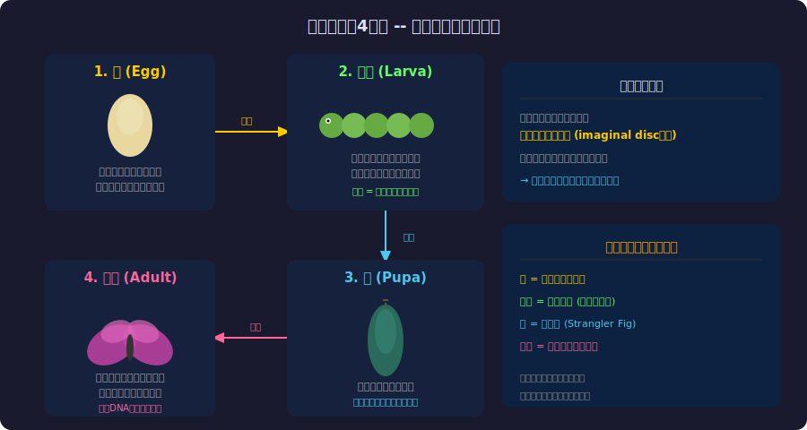
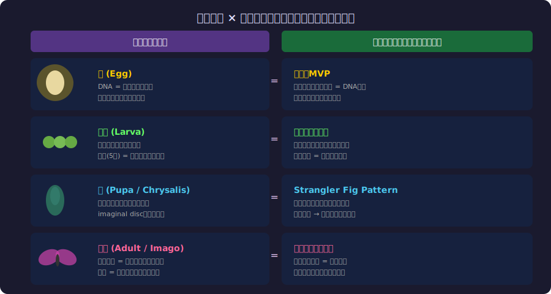
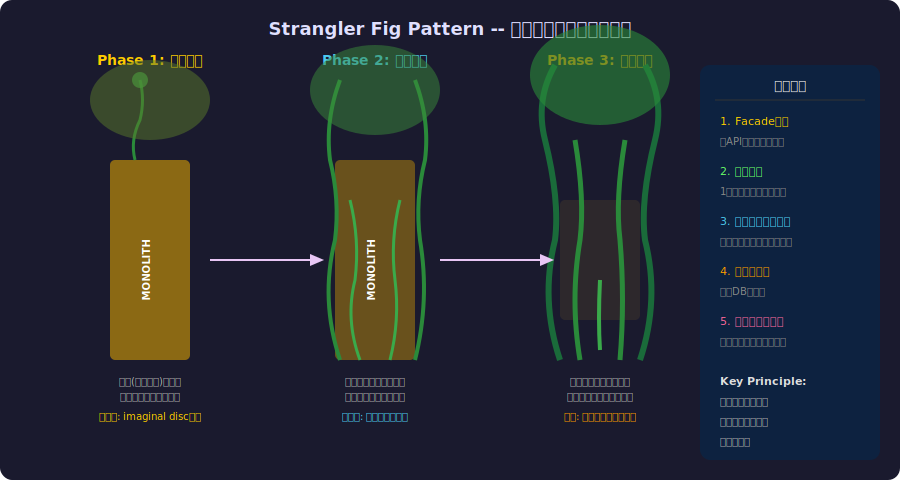

<!-- _class: lead -->
# 完全変態

- モノリスがマイクロサービスに変わるとき
- 
- 昆虫の驚異的な変身から学ぶシステム移行の哲学

---

# 目次

- - 1. 完全変態とは何か
- - 2. 4段階の変身プロセス
- - 3. ソフトウェアマイグレーションとの対応
- - 4. Strangler Fig Pattern
- - 5. 蛹の中で起きていること
- - 6. 変態の教訓 -- 移行の設計原則

---

<!-- _class: lead -->
# 完全変態とは

---

# 昆虫の完全変態 (Holometabolism)

- - **完全変態**: 卵 → 幼虫 → 蛹 → 成虫の4段階
- - 昆虫の約80%が完全変態を行う(チョウ、カブトムシ、ハチ等)
- - 対義語: **不完全変態** = 蛹の段階がない(バッタ、カマキリ等)
- - 約3.5億年前に進化した戦略
- 
- なぜ完全変態は成功したのか？
- → **幼虫と成虫で異なるニッチを占められる**

---

# 4段階の変身プロセス

---

# 蛹の中の驚異 -- Imaginal Disc

- - 蛹の中で幼虫の体は**酵素によってほぼ完全に分解**される
- - しかし**imaginal disc**(成虫原基)は生き残る
- - imaginal discは幼虫時代から存在する「未来の設計図」
-   - 翅のdisc、脚のdisc、目のdisc...
-   - 幼虫の体液(栄養)を使って成虫の体を構築
- 
- **「古いシステムのリソースを使って新システムを構築する」**

---

<!-- _class: lead -->
# ソフトウェアとの対応

---

# 完全変態 × マイグレーション対応図

---

# 幼虫 = モノリスの成長期

- - 幼虫は**ひたすら食べて大きくなる**
- - モノリスも**ひたすら機能を追加して大きくなる**
- - 幼虫の脱皮(5回) = メジャーリリース
-   - 外殻を脱ぎ捨てるが内部構造は同じ
-   - リファクタリングせずにバージョンアップ
- - **幼虫の限界**: ある大きさを超えると脱皮では対応できない
- - **モノリスの限界**: ある規模を超えるとスケールしない

---

# 蛹 = 移行期間

- - 蛹の外見は静か。しかし中身は激変している
- - **ソフトウェア移行も同じ:**
-   - ユーザーから見た挙動は変わらない(外殻 = API)
-   - 内部は完全に作り直されている
-   - 古い組織が溶けて新しい組織に再構築される
- - **重要**: 蛹の中でも生物は**生きている**
-   - 移行中もサービスは稼働し続ける必要がある

---

<!-- _class: lead -->
# Strangler Fig Pattern

---

# 絞め殺しイチジクの知恵

---

# Martin Fowlerの提案 (2004)

- - **Strangler Fig Pattern**: Martin Fowlerが命名
- - 熱帯のイチジクは宿主の木に巻きついて成長
- - やがて宿主を「絞め殺して」自立する
- - **ソフトウェアへの応用:**
-   - 新システムを旧システムの周りに構築
-   - 機能を1つずつ新システムに移行
-   - 最終的に旧システムを除去
- 
- **Big Bang移行(一気に切り替え)の反対概念**

---

# Strangler Fig = 蛹の中のImaginal Disc

- - **Imaginal disc**: 幼虫の中に潜む「未来の設計図」
-   - 幼虫の体(旧システム)の栄養を使って成長
-   - 幼虫が溶けても生き残る
- - **新マイクロサービス**: モノリスの中に潜む「未来の設計」
-   - モノリスのデータとインフラを使って構築
-   - モノリスが除去されても動き続ける
- 
- **生物学的に最も正確なアナロジー**

---

# 成虫 = マイクロサービスの飛翔

- - **成虫の特徴**: 飛行能力、生殖能力、分散
- - **マイクロサービスの特徴**:
-   - **飛行** = 独立デプロイ(どこにでも配置可能)
-   - **生殖** = 新サービスを容易に生み出せる
-   - **分散** = 複数の環境で同時に動作
- - 幼虫にはできなかったことが成虫にはできる
- - モノリスにはできなかったことがマイクロサービスにはできる

---

<!-- _class: lead -->
# 移行の設計原則

---

# 変態から学ぶ移行の5原則

- - **1. 止まらない**: 蛹の中でも生物は生きている → ゼロダウンタイム
- - **2. 外殻を維持**: APIの互換性を保つ → Facade Pattern
- - **3. 段階的に溶かす**: 一度に全てを変えない → 漸進的移行
- - **4. 設計図を先に**: imaginal discを先に作る → 新アーキテクチャを先に設計
- - **5. 栄養を再利用**: 旧システムのリソースを新に活用 → データ移行

---

# 不完全変態 vs 完全変態

- - **不完全変態(バッタ型)** = インクリメンタルなリファクタリング
-   - 毎回少しずつ形が変わる
-   - 根本的な構造変化はない
-   - 安全だが限界がある
- - **完全変態(チョウ型)** = アーキテクチャの全面刷新
-   - 一度「溶けて」から再構築する
-   - リスクは高いが、根本的に異なる能力を獲得
- 
- **どちらが正解かはコンテキスト次第**

---

# まとめ

- - 昆虫の完全変態は3.5億年の進化が証明した移行戦略
- - モノリス → マイクロサービスは完全変態そのもの
- - Strangler Fig Pattern = 蛹の中のimaginal disc
- - 「止まらない」「外殻を維持」「段階的に溶かす」
- - Big Bang移行は進化が棄却した戦略
- 
- **「最も成功した移行は、外からは何も変わっていないように見える。」**

---

# 参考文献

- - **Biology:**
- - [Holometabolism - Wikipedia](https://en.wikipedia.org/wiki/Holometabolism)
- - [What Happens Inside a Chrysalis - Scientific American](https://www.scientificamerican.com/article/caterpillar-butterfly-metamorphosis-explained/)
- - **Software Architecture:**
- - [Strangler Fig Application - Martin Fowler (2004)](https://martinfowler.com/bliki/StranglerFigApplication.html)
- - [Building Microservices - Sam Newman (2021)](https://samnewman.io/books/building_microservices_2nd_edition/)

