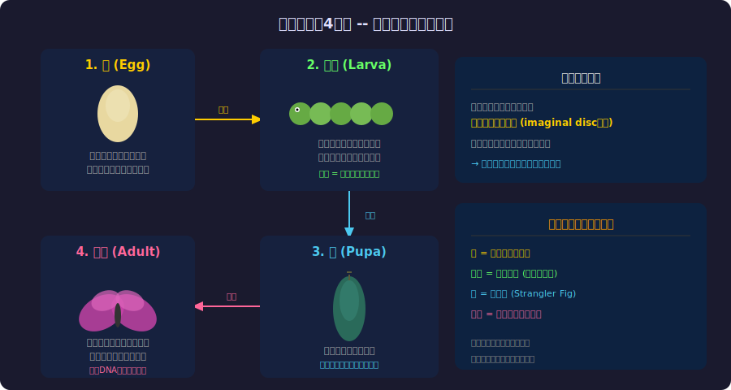
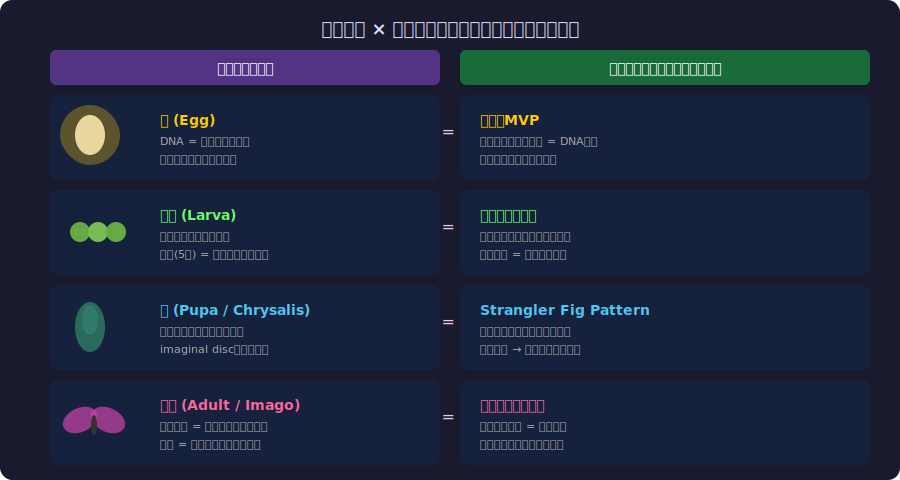
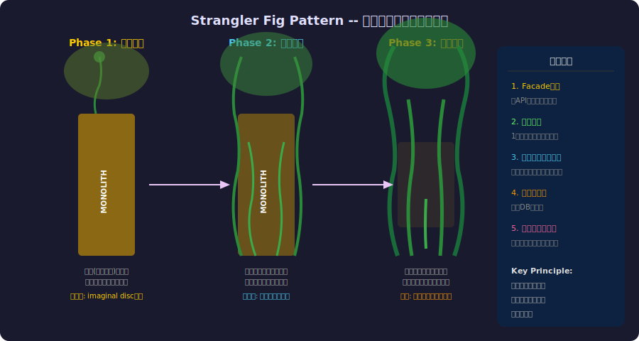

<!-- _class: lead -->
# 完全変態

- モノリスがマイクロサービスに変わるとき
- 
- 昆虫の驚異的な変身から学ぶシステム移行の哲学

---

# 目次

- - 1. 完全変態とは何か
- - 2. 4段階の変身プロセス
- - 3. ソフトウェアマイグレーションとの対応
- - 4. Strangler Fig Pattern
- - 5. 蛹の中で起きていること
- - 6. 変態の教訓 -- 移行の設計原則

---

<!-- _class: lead -->
# 完全変態とは

- <svg viewBox="0 0 800 400" style="max-height:70vh;max-width:100%;display:block;margin:0 auto;" xmlns="http://www.w3.org/2000/svg">
<rect width="800" height="400" fill="#1a1a2e"/>
<text x="400" y="36" text-anchor="middle" fill="#ffffff" font-size="15" font-weight="bold">完全変態 vs 不完全変態</text>
<rect x="30" y="65" width="340" height="290" rx="12" fill="#16213e" stroke="#f9a825" stroke-width="2"/>
<text x="200" y="96" text-anchor="middle" fill="#f9a825" font-size="14" font-weight="bold">完全変態（Holometabolism）</text>
<text x="50" y="128" fill="#ffffff" font-size="11">卵 → 幼虫 → 蛹 → 成虫</text>
<text x="50" y="152" fill="#aaaaaa" font-size="11">各ステージが完全に異なる形態</text>
<text x="50" y="176" fill="#aaaaaa" font-size="11">蛹の中で組織が溶解・再構成</text>
<text x="50" y="200" fill="#f9a825" font-size="11">昆虫の80%以上が採用</text>
<rect x="50" y="226" width="290" height="100" rx="8" fill="#f9a825" opacity="0.12" stroke="#f9a825" stroke-width="1"/>
<text x="195" y="252" text-anchor="middle" fill="#f9a825" font-size="12" font-weight="bold">代表例</text>
<text x="70" y="276" fill="#ffffff" font-size="11">• チョウ、カブトムシ、ハチ</text>
<text x="70" y="298" fill="#ffffff" font-size="11">• カ（蚊）、アリ、ノミ</text>
<rect x="430" y="65" width="340" height="290" rx="12" fill="#16213e" stroke="#e91e63" stroke-width="2"/>
<text x="600" y="96" text-anchor="middle" fill="#e91e63" font-size="14" font-weight="bold">不完全変態（Hemimetabolism）</text>
<text x="450" y="128" fill="#ffffff" font-size="11">卵 → 幼虫（若虫）→ 成虫</text>
<text x="450" y="152" fill="#aaaaaa" font-size="11">形態が徐々に変化する</text>
<text x="450" y="176" fill="#aaaaaa" font-size="11">蛹のステージなし</text>
<text x="450" y="200" fill="#e91e63" font-size="11">漸進的な成長モデル</text>
<rect x="450" y="226" width="290" height="100" rx="8" fill="#e91e63" opacity="0.12" stroke="#e91e63" stroke-width="1"/>
<text x="595" y="252" text-anchor="middle" fill="#e91e63" font-size="12" font-weight="bold">代表例</text>
<text x="470" y="276" fill="#ffffff" font-size="11">• バッタ、トンボ、カマキリ</text>
<text x="470" y="298" fill="#ffffff" font-size="11">• ゴキブリ、シラミ</text>
<text x="400" y="380" text-anchor="middle" fill="#aaaaaa" font-size="11">システム移行との対応：完全変態 ＝ ゼロダウンタイム移行の手本</text>
</svg>

---

# 昆虫の完全変態 (Holometabolism)

- <svg viewBox="0 0 800 400" style="max-height:70vh;max-width:100%;display:block;margin:0 auto;" xmlns="http://www.w3.org/2000/svg">
<rect width="800" height="400" fill="#1a1a2e"/>
<text x="400" y="36" text-anchor="middle" fill="#ffffff" font-size="15" font-weight="bold">昆虫の完全変態：4ステージ</text>
<rect x="30" y="80" width="160" height="220" rx="10" fill="#16213e" stroke="#4db6ac" stroke-width="2"/>
<text x="110" y="110" text-anchor="middle" fill="#4db6ac" font-size="14" font-weight="bold">卵</text>
<text x="110" y="132" text-anchor="middle" fill="#aaaaaa" font-size="10">Egg</text>
<text x="50" y="162" fill="#ffffff" font-size="10">• 静的な状態</text>
<text x="50" y="180" fill="#ffffff" font-size="10">• エネルギー蓄積</text>
<text x="50" y="198" fill="#ffffff" font-size="10">• 設計図の保持</text>
<text x="50" y="220" fill="#aaaaaa" font-size="10">= 要件定義フェーズ</text>
<polygon points="190,190 206,183 206,197" fill="#f9a825"/>
<rect x="210" y="80" width="160" height="220" rx="10" fill="#16213e" stroke="#f9a825" stroke-width="2"/>
<text x="290" y="110" text-anchor="middle" fill="#f9a825" font-size="14" font-weight="bold">幼虫</text>
<text x="290" y="132" text-anchor="middle" fill="#aaaaaa" font-size="10">Larva</text>
<text x="230" y="162" fill="#ffffff" font-size="10">• ひたすら食べる</text>
<text x="230" y="180" fill="#ffffff" font-size="10">• 急速な成長</text>
<text x="230" y="198" fill="#ffffff" font-size="10">• リソース蓄積</text>
<text x="230" y="220" fill="#aaaaaa" font-size="10">= モノリス成長期</text>
<polygon points="370,190 386,183 386,197" fill="#e91e63"/>
<rect x="390" y="80" width="160" height="220" rx="10" fill="#16213e" stroke="#e91e63" stroke-width="2"/>
<text x="470" y="110" text-anchor="middle" fill="#e91e63" font-size="14" font-weight="bold">蛹</text>
<text x="470" y="132" text-anchor="middle" fill="#aaaaaa" font-size="10">Pupa</text>
<text x="410" y="162" fill="#ffffff" font-size="10">• 外見は静的</text>
<text x="410" y="180" fill="#ffffff" font-size="10">• 内部で大変革</text>
<text x="410" y="198" fill="#ffffff" font-size="10">• Imaginal Disc 活性化</text>
<text x="410" y="220" fill="#aaaaaa" font-size="10">= 移行フェーズ</text>
<polygon points="550,190 566,183 566,197" fill="#4db6ac"/>
<rect x="570" y="80" width="200" height="220" rx="10" fill="#16213e" stroke="#4db6ac" stroke-width="2"/>
<text x="670" y="110" text-anchor="middle" fill="#4db6ac" font-size="14" font-weight="bold">成虫</text>
<text x="670" y="132" text-anchor="middle" fill="#aaaaaa" font-size="10">Imago</text>
<text x="590" y="162" fill="#ffffff" font-size="10">• 完全に異なる形態</text>
<text x="590" y="180" fill="#ffffff" font-size="10">• 飛翔能力</text>
<text x="590" y="198" fill="#ffffff" font-size="10">• 生殖・次世代</text>
<text x="590" y="220" fill="#aaaaaa" font-size="10">= マイクロサービス</text>
<text x="400" y="345" text-anchor="middle" fill="#aaaaaa" font-size="11">重要：幼虫と成虫は同じ DNA を持つが、完全に異なるシステムとして機能する</text>
</svg>
- - **完全変態**: 卵 → 幼虫 → 蛹 → 成虫の4段階
- - 昆虫の約80%が完全変態を行う(チョウ、カブトムシ、ハチ等)
- - 対義語: **不完全変態** = 蛹の段階がない(バッタ、カマキリ等)
- - 約3.5億年前に進化した戦略
- 
- なぜ完全変態は成功したのか？
- → **幼虫と成虫で異なるニッチを占められる**

---

# 4段階の変身プロセス

- <svg viewBox="0 0 800 400" style="max-height:70vh;max-width:100%;display:block;margin:0 auto;" xmlns="http://www.w3.org/2000/svg">
<rect width="800" height="400" fill="#1a1a2e"/>
<text x="400" y="36" text-anchor="middle" fill="#ffffff" font-size="15" font-weight="bold">変身の4段階プロセス詳細</text>
<rect x="30" y="70" width="175" height="260" rx="10" fill="#16213e" stroke="#4db6ac" stroke-width="2"/>
<text x="118" y="98" text-anchor="middle" fill="#4db6ac" font-size="12" font-weight="bold">① 準備期</text>
<text x="118" y="116" text-anchor="middle" fill="#aaaaaa" font-size="10">Wandering Stage</text>
<text x="48" y="144" fill="#ffffff" font-size="10">• 幼虫が食事を止める</text>
<text x="48" y="162" fill="#ffffff" font-size="10">• 安全な場所を探す</text>
<text x="48" y="180" fill="#ffffff" font-size="10">• エネルギーを内部に</text>
<text x="48" y="198" fill="#f9a825" font-size="10">= 移行計画の立案</text>
<polygon points="205,200 218,193 218,207" fill="#f9a825"/>
<rect x="218" y="70" width="175" height="260" rx="10" fill="#16213e" stroke="#f9a825" stroke-width="2"/>
<text x="306" y="98" text-anchor="middle" fill="#f9a825" font-size="12" font-weight="bold">② 溶解期</text>
<text x="306" y="116" text-anchor="middle" fill="#aaaaaa" font-size="10">Histolysis</text>
<text x="236" y="144" fill="#ffffff" font-size="10">• 幼虫の組織が溶解</text>
<text x="236" y="162" fill="#ffffff" font-size="10">• 幹細胞だけ残る</text>
<text x="236" y="180" fill="#ffffff" font-size="10">• 破壊的再構成</text>
<text x="236" y="198" fill="#e91e63" font-size="10">= レガシー解体</text>
<polygon points="393,200 406,193 406,207" fill="#e91e63"/>
<rect x="406" y="70" width="175" height="260" rx="10" fill="#16213e" stroke="#e91e63" stroke-width="2"/>
<text x="494" y="98" text-anchor="middle" fill="#e91e63" font-size="12" font-weight="bold">③ 再構成期</text>
<text x="494" y="116" text-anchor="middle" fill="#aaaaaa" font-size="10">Histogenesis</text>
<text x="424" y="144" fill="#ffffff" font-size="10">• Imaginal Disc が展開</text>
<text x="424" y="162" fill="#ffffff" font-size="10">• 新しい組織が形成</text>
<text x="424" y="180" fill="#ffffff" font-size="10">• 神経・筋肉・翅</text>
<text x="424" y="198" fill="#4db6ac" font-size="10">= マイクロサービス構築</text>
<polygon points="581,200 594,193 594,207" fill="#4db6ac"/>
<rect x="594" y="70" width="176" height="260" rx="10" fill="#16213e" stroke="#4db6ac" stroke-width="2"/>
<text x="682" y="98" text-anchor="middle" fill="#4db6ac" font-size="12" font-weight="bold">④ 完成期</text>
<text x="682" y="116" text-anchor="middle" fill="#aaaaaa" font-size="10">Eclosion</text>
<text x="612" y="144" fill="#ffffff" font-size="10">• 殻を破って出現</text>
<text x="612" y="162" fill="#ffffff" font-size="10">• 翅を乾かす</text>
<text x="612" y="180" fill="#ffffff" font-size="10">• 初飛行</text>
<text x="612" y="198" fill="#f9a825" font-size="10">= カットオーバー</text>
<text x="400" y="365" text-anchor="middle" fill="#aaaaaa" font-size="11">蛹の中では「サービス」は止まらない — Imaginal Disc は静かに動いている</text>
</svg>

---

# 蛹の中の驚異 -- Imaginal Disc

- - 蛹の中で幼虫の体は**酵素によってほぼ完全に分解**される
- - しかし**imaginal disc**(成虫原基)は生き残る
- - imaginal discは幼虫時代から存在する「未来の設計図」
-   - 翅のdisc、脚のdisc、目のdisc...
-   - 幼虫の体液(栄養)を使って成虫の体を構築
- 
- **「古いシステムのリソースを使って新システムを構築する」**

---

# Imaginal Disc と Strangler Fig（図解）

- <svg viewBox="0 0 800 360" style="max-height:70vh;max-width:100%;display:block;margin:0 auto;" xmlns="http://www.w3.org/2000/svg">
<rect width="800" height="360" fill="#1a1a2e"/>
<text x="400" y="34" text-anchor="middle" fill="#ffffff" font-size="15" font-weight="bold">蛹の中で起きていること — Imaginal Disc</text>
<ellipse cx="400" cy="185" rx="180" ry="120" fill="#16213e" stroke="#f9a825" stroke-width="2.5"/>
<text x="400" y="165" text-anchor="middle" fill="#aaaaaa" font-size="12">幼虫の組織が酵素で分解</text>
<text x="400" y="183" text-anchor="middle" fill="#aaaaaa" font-size="12">（旧モノリスのリソース化）</text>
<ellipse cx="400" cy="205" rx="50" ry="32" fill="#e91e63" opacity="0.9"/>
<text x="400" y="201" text-anchor="middle" fill="#ffffff" font-size="11" font-weight="bold">Imaginal</text>
<text x="400" y="217" text-anchor="middle" fill="#ffffff" font-size="11" font-weight="bold">Disc</text>
<text x="400" y="253" text-anchor="middle" fill="#f9a825" font-size="10">生き残る「未来の設計図」</text>
<line x1="220" y1="185" x2="345" y2="185" stroke="#aaaaaa" stroke-width="1.5" stroke-dasharray="4,3"/>
<text x="140" y="162" text-anchor="middle" fill="#aaaaaa" font-size="10">幼虫の脚</text>
<text x="140" y="178" text-anchor="middle" fill="#aaaaaa" font-size="10">が溶解</text>
<text x="140" y="200" text-anchor="middle" fill="#aaaaaa" font-size="10">翅の原基</text>
<text x="140" y="216" text-anchor="middle" fill="#aaaaaa" font-size="10">が成長</text>
<line x1="455" y1="185" x2="570" y2="185" stroke="#aaaaaa" stroke-width="1.5" stroke-dasharray="4,3"/>
<text x="640" y="162" text-anchor="middle" fill="#aaaaaa" font-size="10">目の原基</text>
<text x="640" y="178" text-anchor="middle" fill="#aaaaaa" font-size="10">が発達</text>
<text x="640" y="200" text-anchor="middle" fill="#aaaaaa" font-size="10">口器の</text>
<text x="640" y="216" text-anchor="middle" fill="#aaaaaa" font-size="10">再構築</text>
<rect x="120" y="295" width="260" height="40" rx="6" fill="#16213e" stroke="#f9a825" stroke-width="1"/>
<text x="250" y="316" text-anchor="middle" fill="#f9a825" font-size="11" font-weight="bold">モノリスの旧コード = 幼虫の組織</text>
<text x="250" y="330" text-anchor="middle" fill="#ffffff" font-size="10">「溶かして」新システムの栄養に</text>
<rect x="420" y="295" width="260" height="40" rx="6" fill="#16213e" stroke="#e91e63" stroke-width="1"/>
<text x="550" y="316" text-anchor="middle" fill="#e91e63" font-size="11" font-weight="bold">新マイクロサービス = Imaginal Disc</text>
<text x="550" y="330" text-anchor="middle" fill="#ffffff" font-size="10">旧システムの中で育つ新設計</text>
</svg>

---

<!-- _class: lead -->
# ソフトウェアとの対応

- <svg viewBox="0 0 800 400" style="max-height:70vh;max-width:100%;display:block;margin:0 auto;" xmlns="http://www.w3.org/2000/svg">
<rect width="800" height="400" fill="#1a1a2e"/>
<text x="400" y="36" text-anchor="middle" fill="#ffffff" font-size="15" font-weight="bold">生物変態 ↔ ソフトウェア移行 対応図</text>
<rect x="30" y="65" width="330" height="280" rx="10" fill="#16213e" stroke="#f9a825" stroke-width="2"/>
<text x="195" y="94" text-anchor="middle" fill="#f9a825" font-size="14" font-weight="bold">生物学</text>
<text x="50" y="130" fill="#ffffff" font-size="12">卵</text>
<text x="50" y="158" fill="#ffffff" font-size="12">幼虫（成長期）</text>
<text x="50" y="186" fill="#ffffff" font-size="12">蛹殻</text>
<text x="50" y="214" fill="#ffffff" font-size="12">Imaginal Disc</text>
<text x="50" y="242" fill="#ffffff" font-size="12">組織溶解</text>
<text x="50" y="270" fill="#ffffff" font-size="12">成虫への羽化</text>
<text x="50" y="298" fill="#ffffff" font-size="12">同一DNA</text>
<rect x="440" y="65" width="330" height="280" rx="10" fill="#16213e" stroke="#e91e63" stroke-width="2"/>
<text x="605" y="94" text-anchor="middle" fill="#e91e63" font-size="14" font-weight="bold">ソフトウェア</text>
<text x="460" y="130" fill="#aaaaaa" font-size="12">要件定義・設計書</text>
<text x="460" y="158" fill="#aaaaaa" font-size="12">モノリスの機能追加</text>
<text x="460" y="186" fill="#aaaaaa" font-size="12">並行稼働環境</text>
<text x="460" y="214" fill="#aaaaaa" font-size="12">Strangler Fig のルーティング</text>
<text x="460" y="242" fill="#aaaaaa" font-size="12">旧コードの段階的削除</text>
<text x="460" y="270" fill="#aaaaaa" font-size="12">マイクロサービス本番移行</text>
<text x="460" y="298" fill="#aaaaaa" font-size="12">同一ビジネスロジック</text>
<line x1="360" y1="130" x2="440" y2="130" stroke="#f9a825" stroke-width="1.5" stroke-dasharray="4,3"/>
<line x1="360" y1="158" x2="440" y2="158" stroke="#f9a825" stroke-width="1.5" stroke-dasharray="4,3"/>
<line x1="360" y1="186" x2="440" y2="186" stroke="#f9a825" stroke-width="1.5" stroke-dasharray="4,3"/>
<line x1="360" y1="214" x2="440" y2="214" stroke="#e91e63" stroke-width="1.5" stroke-dasharray="4,3"/>
<line x1="360" y1="242" x2="440" y2="242" stroke="#e91e63" stroke-width="1.5" stroke-dasharray="4,3"/>
<line x1="360" y1="270" x2="440" y2="270" stroke="#4db6ac" stroke-width="1.5" stroke-dasharray="4,3"/>
<line x1="360" y1="298" x2="440" y2="298" stroke="#4db6ac" font-size="1.5" stroke-dasharray="4,3"/>
<text x="400" y="375" text-anchor="middle" fill="#aaaaaa" font-size="11">自然は数億年かけて「ゼロダウンタイム移行」を完成させた</text>
</svg>

---

# 完全変態 × マイグレーション対応図

- <svg viewBox="0 0 800 400" style="max-height:70vh;max-width:100%;display:block;margin:0 auto;" xmlns="http://www.w3.org/2000/svg">
<rect width="800" height="400" fill="#1a1a2e"/>
<text x="400" y="36" text-anchor="middle" fill="#ffffff" font-size="15" font-weight="bold">完全変態 × マイグレーション 実践対応</text>
<rect x="30" y="65" width="740" height="70" rx="8" fill="#16213e" stroke="#f9a825" stroke-width="2"/>
<text x="150" y="95" text-anchor="middle" fill="#f9a825" font-size="12" font-weight="bold">幼虫フェーズ</text>
<text x="150" y="115" text-anchor="middle" fill="#ffffff" font-size="10">モノリスの安定稼働</text>
<text x="400" y="95" text-anchor="middle" fill="#e91e63" font-size="12" font-weight="bold">蛹フェーズ</text>
<text x="400" y="115" text-anchor="middle" fill="#ffffff" font-size="10">Strangler Fig 並行稼働</text>
<text x="650" y="95" text-anchor="middle" fill="#4db6ac" font-size="12" font-weight="bold">成虫フェーズ</text>
<text x="650" y="115" text-anchor="middle" fill="#ffffff" font-size="10">マイクロサービス完全移行</text>
<line x1="265" y1="100" x2="320" y2="100" stroke="#aaaaaa" stroke-width="1"/>
<polygon points="320,93 336,100 320,107" fill="#aaaaaa"/>
<line x1="480" y1="100" x2="535" y2="100" stroke="#aaaaaa" stroke-width="1"/>
<polygon points="535,93 551,100 535,107" fill="#aaaaaa"/>
<rect x="30" y="160" width="220" height="180" rx="8" fill="#16213e" stroke="#f9a825" stroke-width="1.5"/>
<text x="140" y="186" text-anchor="middle" fill="#f9a825" font-size="11" font-weight="bold">モノリス特性</text>
<text x="50" y="212" fill="#ffffff" font-size="10">• 全機能が密結合</text>
<text x="50" y="230" fill="#ffffff" font-size="10">• デプロイが重い</text>
<text x="50" y="248" fill="#ffffff" font-size="10">• スケールが困難</text>
<text x="50" y="266" fill="#ffffff" font-size="10">• チームが大きい</text>
<text x="50" y="288" fill="#f9a825" font-size="10">→ 蛹化が必要なサイン</text>
<rect x="290" y="160" width="220" height="180" rx="8" fill="#16213e" stroke="#e91e63" stroke-width="1.5"/>
<text x="400" y="186" text-anchor="middle" fill="#e91e63" font-size="11" font-weight="bold">移行期の特性</text>
<text x="310" y="212" fill="#ffffff" font-size="10">• モノリスは動き続ける</text>
<text x="310" y="230" fill="#ffffff" font-size="10">• 新旧が並行稼働</text>
<text x="310" y="248" fill="#ffffff" font-size="10">• ルーティングで制御</text>
<text x="310" y="266" fill="#ffffff" font-size="10">• Imaginal Disc = 新MS</text>
<text x="310" y="288" fill="#e91e63" font-size="10">→ 最も慎重なフェーズ</text>
<rect x="550" y="160" width="220" height="180" rx="8" fill="#16213e" stroke="#4db6ac" stroke-width="1.5"/>
<text x="660" y="186" text-anchor="middle" fill="#4db6ac" font-size="11" font-weight="bold">マイクロサービス</text>
<text x="570" y="212" fill="#ffffff" font-size="10">• 独立したデプロイ</text>
<text x="570" y="230" fill="#ffffff" font-size="10">• 疎結合アーキテクチャ</text>
<text x="570" y="248" fill="#ffffff" font-size="10">• 個別スケール可能</text>
<text x="570" y="266" fill="#ffffff" font-size="10">• チームが小さい</text>
<text x="570" y="288" fill="#4db6ac" font-size="10">→ 変態の完成</text>
</svg>

---

# 幼虫 = モノリスの成長期

- <svg viewBox="0 0 800 400" style="max-height:70vh;max-width:100%;display:block;margin:0 auto;" xmlns="http://www.w3.org/2000/svg"><rect width="800" height="400" fill="#1a1a2e"/><text x="400" y="36" text-anchor="middle" fill="#ffffff" font-size="15" font-weight="bold">幼虫フェーズ：モノリスの成長と限界</text><rect x="30" y="65" width="360" height="290" rx="10" fill="#16213e" stroke="#f9a825" stroke-width="2"/><text x="210" y="96" text-anchor="middle" fill="#f9a825" font-size="13" font-weight="bold">モノリス成長の軌跡</text><line x1="60" y1="320" x2="360" y2="320" stroke="#aaaaaa" stroke-width="1"/><line x1="60" y1="110" x2="60" y2="320" stroke="#aaaaaa" stroke-width="1"/><text x="210" y="340" text-anchor="middle" fill="#aaaaaa" font-size="10">時間（年）</text><text x="45" y="200" fill="#aaaaaa" font-size="9" transform="rotate(-90,45,200)">複雑度</text><polyline points="60,310 100,295 140,275 180,248 220,215 260,178 300,140 340,120" fill="none" stroke="#f9a825" stroke-width="2"/><text x="350" y="118" fill="#f9a825" font-size="9">複雑度↑</text><text x="90" y="308" fill="#4db6ac" font-size="9">Year 1</text><text x="170" y="246" fill="#f9a825" font-size="9">Year 3</text><text x="250" y="176" fill="#e91e63" font-size="9">Year 5+</text><rect x="60" y="115" width="8" height="205" fill="#f9a825" opacity="0.3"/><text x="95" y="220" fill="#aaaaaa" font-size="9">開発者: 5人</text><rect x="180" y="115" width="12" height="205" fill="#f9a825" opacity="0.5"/><text x="215" y="200" fill="#aaaaaa" font-size="9">15人</text><rect x="290" y="115" width="18" height="205" fill="#e91e63" opacity="0.6"/><text x="325" y="180" fill="#aaaaaa" font-size="9">40人</text><rect x="430" y="65" width="340" height="290" rx="10" fill="#16213e" stroke="#e91e63" stroke-width="2"/><text x="600" y="96" text-anchor="middle" fill="#e91e63" font-size="13" font-weight="bold">蛹化のサイン</text><text x="450" y="128" fill="#ffffff" font-size="11">• デプロイに8時間以上かかる</text><text x="450" y="150" fill="#ffffff" font-size="11">• バグ修正が新バグを生む</text><text x="450" y="172" fill="#ffffff" font-size="11">• 新機能追加が3ヶ月以上</text><text x="450" y="194" fill="#ffffff" font-size="11">• チームが「触りたくない」コード</text><text x="450" y="216" fill="#ffffff" font-size="11">• 本番環境が怖い</text><rect x="450" y="242" width="280" height="80" rx="6" fill="#e91e63" opacity="0.12" stroke="#e91e63" stroke-width="1"/><text x="590" y="268" text-anchor="middle" fill="#e91e63" font-size="12" font-weight="bold">判断時期</text><text x="465" y="292" fill="#ffffff" font-size="10">幼虫が「もう限界」と感じたとき</text><text x="465" y="312" fill="#ffffff" font-size="10">が蛹化の最適タイミング</text><text x="400" y="378" text-anchor="middle" fill="#aaaaaa" font-size="11">完全変態は強さから生まれるのではなく、成長の必然として起きる</text></svg>
- - 幼虫は**ひたすら食べて大きくなる**
- - モノリスも**ひたすら機能を追加して大きくなる**
- - 幼虫の脱皮(5回) = メジャーリリース
-   - 外殻を脱ぎ捨てるが内部構造は同じ
-   - リファクタリングせずにバージョンアップ
- - **幼虫の限界**: ある大きさを超えると脱皮では対応できない
- - **モノリスの限界**: ある規模を超えるとスケールしない

---

# 蛹 = 移行期間

- <svg viewBox="0 0 800 400" style="max-height:70vh;max-width:100%;display:block;margin:0 auto;" xmlns="http://www.w3.org/2000/svg">
<rect width="800" height="400" fill="#1a1a2e"/>
<text x="400" y="36" text-anchor="middle" fill="#ffffff" font-size="15" font-weight="bold">蛹フェーズ：移行期間の詳細設計</text>
<rect x="30" y="70" width="340" height="290" rx="10" fill="#16213e" stroke="#e91e63" stroke-width="2"/>
<text x="200" y="100" text-anchor="middle" fill="#e91e63" font-size="14" font-weight="bold">蛹（移行期間）の内部</text>
<rect x="50" y="120" width="290" height="60" rx="6" fill="#e91e63" opacity="0.15" stroke="#e91e63" stroke-width="1"/>
<text x="195" y="146" text-anchor="middle" fill="#e91e63" font-size="12" font-weight="bold">外部: サービスは継続中</text>
<text x="195" y="164" text-anchor="middle" fill="#ffffff" font-size="10">ユーザーには変化が見えない</text>
<rect x="50" y="200" width="290" height="60" rx="6" fill="#f9a825" opacity="0.15" stroke="#f9a825" stroke-width="1"/>
<text x="195" y="226" text-anchor="middle" fill="#f9a825" font-size="12" font-weight="bold">内部: 大変革が進行中</text>
<text x="195" y="244" text-anchor="middle" fill="#ffffff" font-size="10">Strangler Fig で新サービスを育てる</text>
<rect x="50" y="280" width="290" height="55" rx="6" fill="#4db6ac" opacity="0.15" stroke="#4db6ac" stroke-width="1"/>
<text x="195" y="303" text-anchor="middle" fill="#4db6ac" font-size="11" font-weight="bold">制御機構: ルーティング</text>
<text x="195" y="323" text-anchor="middle" fill="#ffffff" font-size="10">新旧どちらを呼ぶかを動的に決定</text>
<rect x="430" y="70" width="340" height="290" rx="10" fill="#16213e" stroke="#f9a825" stroke-width="2"/>
<text x="600" y="100" text-anchor="middle" fill="#f9a825" font-size="14" font-weight="bold">移行タスクリスト</text>
<text x="450" y="130" fill="#4db6ac" font-size="11">✓ データモデルの分離</text>
<text x="450" y="152" fill="#4db6ac" font-size="11">✓ API境界の定義</text>
<text x="450" y="174" fill="#4db6ac" font-size="11">✓ イベント駆動化</text>
<text x="450" y="196" fill="#f9a825" font-size="11">◯ トランザクション分散</text>
<text x="450" y="218" fill="#f9a825" font-size="11">◯ 認証・認可の外部化</text>
<text x="450" y="240" fill="#f9a825" font-size="11">◯ 監視・ログの統一</text>
<text x="450" y="262" fill="#aaaaaa" font-size="11">△ レガシーコードの削除</text>
<text x="450" y="284" fill="#aaaaaa" font-size="11">△ 負荷テスト</text>
<text x="450" y="306" fill="#aaaaaa" font-size="11">△ フェイルオーバーテスト</text>
<text x="430" y="340" fill="#aaaaaa" font-size="10">✓完了 ◯進行中 △未着手</text>
</svg>
- - 蛹の外見は静か。しかし中身は激変している
- - **ソフトウェア移行も同じ:**
-   - ユーザーから見た挙動は変わらない(外殻 = API)
-   - 内部は完全に作り直されている
-   - 古い組織が溶けて新しい組織に再構築される
- - **重要**: 蛹の中でも生物は**生きている**
-   - 移行中もサービスは稼働し続ける必要がある

---

# 変態中もサービスは稼働する（図解）

- <svg viewBox="0 0 800 340" style="max-height:70vh;max-width:100%;display:block;margin:0 auto;" xmlns="http://www.w3.org/2000/svg">
<rect width="800" height="340" fill="#1a1a2e"/>
<text x="400" y="34" text-anchor="middle" fill="#ffffff" font-size="15" font-weight="bold">蛹の移行原則 — 生きたまま変態する</text>
<rect x="40" y="80" width="170" height="90" rx="10" fill="#16213e" stroke="#f9a825" stroke-width="2"/>
<text x="125" y="118" text-anchor="middle" fill="#f9a825" font-size="12" font-weight="bold">外殻 (API)</text>
<text x="125" y="138" text-anchor="middle" fill="#ffffff" font-size="11">変わらない</text>
<text x="125" y="155" text-anchor="middle" fill="#aaaaaa" font-size="10">Facade Pattern</text>
<rect x="250" y="80" width="170" height="90" rx="10" fill="#16213e" stroke="#e91e63" stroke-width="2"/>
<text x="335" y="118" text-anchor="middle" fill="#e91e63" font-size="12" font-weight="bold">内部構造</text>
<text x="335" y="138" text-anchor="middle" fill="#ffffff" font-size="11">激変する</text>
<text x="335" y="155" text-anchor="middle" fill="#aaaaaa" font-size="10">Strangler Fig</text>
<rect x="460" y="80" width="170" height="90" rx="10" fill="#16213e" stroke="#4db6ac" stroke-width="2"/>
<text x="545" y="118" text-anchor="middle" fill="#4db6ac" font-size="12" font-weight="bold">サービス継続</text>
<text x="545" y="138" text-anchor="middle" fill="#ffffff" font-size="11">止まらない</text>
<text x="545" y="155" text-anchor="middle" fill="#aaaaaa" font-size="10">Zero Downtime</text>
<rect x="40" y="210" width="590" height="80" rx="8" fill="#16213e" stroke="#f9a825" stroke-width="1.5"/>
<text x="335" y="238" text-anchor="middle" fill="#f9a825" font-size="13" font-weight="bold">変態の3原則</text>
<text x="120" y="268" text-anchor="middle" fill="#ffffff" font-size="11">① APIを変えるな</text>
<text x="335" y="268" text-anchor="middle" fill="#ffffff" font-size="11">② 段階的に移行せよ</text>
<text x="550" y="268" text-anchor="middle" fill="#ffffff" font-size="11">③ 常にサービス継続</text>
<text x="120" y="280" text-anchor="middle" fill="#aaaaaa" font-size="9">外殻の維持</text>
<text x="335" y="280" text-anchor="middle" fill="#aaaaaa" font-size="9">一度に全部変えない</text>
<text x="550" y="280" text-anchor="middle" fill="#aaaaaa" font-size="9">蛹も生きている</text>
</svg>

---

<!-- _class: lead -->
# Strangler Fig Pattern

- <svg viewBox="0 0 800 400" style="max-height:70vh;max-width:100%;display:block;margin:0 auto;" xmlns="http://www.w3.org/2000/svg">
<rect width="800" height="400" fill="#1a1a2e"/>
<text x="400" y="36" text-anchor="middle" fill="#ffffff" font-size="15" font-weight="bold">Strangler Fig Pattern：段階的置き換え</text>
<rect x="30" y="70" width="180" height="280" rx="10" fill="#16213e" stroke="#f9a825" stroke-width="2"/>
<text x="120" y="98" text-anchor="middle" fill="#f9a825" font-size="12" font-weight="bold">Step 1</text>
<text x="120" y="116" text-anchor="middle" fill="#f9a825" font-size="10">初期状態</text>
<rect x="50" y="140" width="120" height="170" rx="8" fill="#e91e63" opacity="0.6"/>
<text x="110" y="200" text-anchor="middle" fill="#ffffff" font-size="11" font-weight="bold">モノリス</text>
<text x="110" y="220" text-anchor="middle" fill="#ffffff" font-size="10">100%</text>
<rect x="220" y="70" width="180" height="280" rx="10" fill="#16213e" stroke="#f9a825" stroke-width="2"/>
<text x="310" y="98" text-anchor="middle" fill="#f9a825" font-size="12" font-weight="bold">Step 2</text>
<text x="310" y="116" text-anchor="middle" fill="#f9a825" font-size="10">新機能を分離</text>
<rect x="240" y="140" width="120" height="120" rx="8" fill="#e91e63" opacity="0.6"/>
<text x="300" y="205" text-anchor="middle" fill="#ffffff" font-size="11">モノリス</text>
<text x="300" y="222" text-anchor="middle" fill="#ffffff" font-size="10">70%</text>
<rect x="240" y="270" width="120" height="40" rx="6" fill="#4db6ac" opacity="0.8"/>
<text x="300" y="295" text-anchor="middle" fill="#1a1a2e" font-size="10" font-weight="bold">MS-A: 30%</text>
<rect x="410" y="70" width="180" height="280" rx="10" fill="#16213e" stroke="#f9a825" stroke-width="2"/>
<text x="500" y="98" text-anchor="middle" fill="#f9a825" font-size="12" font-weight="bold">Step 3</text>
<text x="500" y="116" text-anchor="middle" fill="#f9a825" font-size="10">さらに分離</text>
<rect x="430" y="140" width="120" height="80" rx="8" fill="#e91e63" opacity="0.6"/>
<text x="490" y="185" text-anchor="middle" fill="#ffffff" font-size="11">モノリス</text>
<text x="490" y="202" text-anchor="middle" fill="#ffffff" font-size="10">40%</text>
<rect x="430" y="230" width="55" height="35" rx="6" fill="#4db6ac" opacity="0.8"/>
<text x="458" y="252" text-anchor="middle" fill="#1a1a2e" font-size="9">MS-A</text>
<rect x="495" y="230" width="55" height="35" rx="6" fill="#4db6ac" opacity="0.8"/>
<text x="523" y="252" text-anchor="middle" fill="#1a1a2e" font-size="9">MS-B</text>
<rect x="430" y="275" width="120" height="35" rx="6" fill="#4db6ac" opacity="0.6"/>
<text x="490" y="297" text-anchor="middle" fill="#1a1a2e" font-size="9">MS-C</text>
<rect x="600" y="70" width="170" height="280" rx="10" fill="#16213e" stroke="#4db6ac" stroke-width="2"/>
<text x="685" y="98" text-anchor="middle" fill="#4db6ac" font-size="12" font-weight="bold">Step 4</text>
<text x="685" y="116" text-anchor="middle" fill="#4db6ac" font-size="10">移行完了</text>
<rect x="620" y="140" width="130" height="170" rx="8" fill="#4db6ac" opacity="0.7"/>
<text x="685" y="215" text-anchor="middle" fill="#1a1a2e" font-size="11" font-weight="bold">MS群</text>
<text x="685" y="235" text-anchor="middle" fill="#1a1a2e" font-size="10">100%</text>
<text x="685" y="258" text-anchor="middle" fill="#1a1a2e" font-size="9">モノリス終了</text>
<text x="400" y="380" text-anchor="middle" fill="#aaaaaa" font-size="11">絞め殺しイチジクが宿主木を徐々に置き換えるように</text>
</svg>

---

# 絞め殺しイチジクの知恵

---

# Martin Fowlerの提案 (2004)（1/2）

- - **Strangler Fig Pattern**: Martin Fowlerが命名
- - 熱帯のイチジクは宿主の木に巻きついて成長
- - やがて宿主を「絞め殺して」自立する
- - **ソフトウェアへの応用:**

---

# Martin Fowlerの提案 (2004)（2/2）

-   - 新システムを旧システムの周りに構築
-   - 機能を1つずつ新システムに移行
-   - 最終的に旧システムを除去
- 
- **Big Bang移行(一気に切り替え)の反対概念**

---

# Strangler Fig = 蛹の中のImaginal Disc（1/2）

- - **Imaginal disc**: 幼虫の中に潜む「未来の設計図」
-   - 幼虫の体(旧システム)の栄養を使って成長
-   - 幼虫が溶けても生き残る
- - **新マイクロサービス**: モノリスの中に潜む「未来の設計」

---

# Strangler Fig = 蛹の中のImaginal Disc（2/2）

-   - モノリスのデータとインフラを使って構築
-   - モノリスが除去されても動き続ける
- 
- **生物学的に最も正確なアナロジー**

---

# 成虫 = マイクロサービスの飛翔

- <svg viewBox="0 0 800 400" style="max-height:70vh;max-width:100%;display:block;margin:0 auto;" xmlns="http://www.w3.org/2000/svg">
<rect width="800" height="400" fill="#1a1a2e"/>
<text x="400" y="36" text-anchor="middle" fill="#ffffff" font-size="15" font-weight="bold">成虫フェーズ：マイクロサービスの飛翔</text>
<circle cx="400" cy="190" r="50" fill="#16213e" stroke="#f9a825" stroke-width="2"/>
<text x="400" y="185" text-anchor="middle" fill="#f9a825" font-size="12" font-weight="bold">API</text>
<text x="400" y="203" text-anchor="middle" fill="#f9a825" font-size="11">Gateway</text>
<rect x="30" y="80" width="140" height="60" rx="8" fill="#16213e" stroke="#4db6ac" stroke-width="2"/>
<text x="100" y="107" text-anchor="middle" fill="#4db6ac" font-size="11" font-weight="bold">User Service</text>
<text x="100" y="127" text-anchor="middle" fill="#ffffff" font-size="10">認証・認可</text>
<line x1="170" y1="110" x2="345" y2="165" stroke="#4db6ac" stroke-width="1.5"/>
<polygon points="345,159 356,168 342,174" fill="#4db6ac"/>
<rect x="30" y="180" width="140" height="60" rx="8" fill="#16213e" stroke="#e91e63" stroke-width="2"/>
<text x="100" y="207" text-anchor="middle" fill="#e91e63" font-size="11" font-weight="bold">Order Service</text>
<text x="100" y="227" text-anchor="middle" fill="#ffffff" font-size="10">注文管理</text>
<line x1="170" y1="210" x2="348" y2="197" stroke="#e91e63" stroke-width="1.5"/>
<polygon points="348,191 360,198 349,206" fill="#e91e63"/>
<rect x="30" y="280" width="140" height="60" rx="8" fill="#16213e" stroke="#f9a825" stroke-width="2"/>
<text x="100" y="307" text-anchor="middle" fill="#f9a825" font-size="11" font-weight="bold">Payment Service</text>
<text x="100" y="327" text-anchor="middle" fill="#ffffff" font-size="10">決済処理</text>
<line x1="170" y1="310" x2="352" y2="222" stroke="#f9a825" stroke-width="1.5"/>
<polygon points="352,217 364,224 351,232" fill="#f9a825"/>
<rect x="630" y="80" width="140" height="60" rx="8" fill="#16213e" stroke="#4db6ac" stroke-width="2"/>
<text x="700" y="107" text-anchor="middle" fill="#4db6ac" font-size="11" font-weight="bold">Notification</text>
<text x="700" y="127" text-anchor="middle" fill="#ffffff" font-size="10">通知サービス</text>
<line x1="455" y1="165" x2="630" y2="110" stroke="#4db6ac" stroke-width="1.5"/>
<polygon points="625,107 637,110 630,120" fill="#4db6ac"/>
<rect x="630" y="180" width="140" height="60" rx="8" fill="#16213e" stroke="#e91e63" stroke-width="2"/>
<text x="700" y="207" text-anchor="middle" fill="#e91e63" font-size="11" font-weight="bold">Inventory</text>
<text x="700" y="227" text-anchor="middle" fill="#ffffff" font-size="10">在庫管理</text>
<line x1="450" y1="197" x2="630" y2="210" stroke="#e91e63" stroke-width="1.5"/>
<polygon points="625,205 637,210 626,218" fill="#e91e63"/>
<rect x="630" y="280" width="140" height="60" rx="8" fill="#16213e" stroke="#f9a825" stroke-width="2"/>
<text x="700" y="307" text-anchor="middle" fill="#f9a825" font-size="11" font-weight="bold">Analytics</text>
<text x="700" y="327" text-anchor="middle" fill="#ffffff" font-size="10">分析サービス</text>
<line x1="452" y1="222" x2="630" y2="310" stroke="#f9a825" stroke-width="1.5"/>
<polygon points="625,307 637,310 628,320" fill="#f9a825"/>
<text x="400" y="375" text-anchor="middle" fill="#aaaaaa" font-size="11">各サービスが独立して「飛翔」できるようになった — 変態の完成</text>
</svg>
- - **成虫の特徴**: 飛行能力、生殖能力、分散
- - **マイクロサービスの特徴**:
-   - **飛行** = 独立デプロイ(どこにでも配置可能)
-   - **生殖** = 新サービスを容易に生み出せる
-   - **分散** = 複数の環境で同時に動作
- - 幼虫にはできなかったことが成虫にはできる
- - モノリスにはできなかったことがマイクロサービスにはできる

---

<!-- _class: lead -->
# 移行の設計原則

---

# 変態から学ぶ移行の5原則

- <svg viewBox="0 0 800 400" style="max-height:70vh;max-width:100%;display:block;margin:0 auto;" xmlns="http://www.w3.org/2000/svg">
<rect width="800" height="400" fill="#1a1a2e"/>
<text x="400" y="36" text-anchor="middle" fill="#ffffff" font-size="15" font-weight="bold">変態から学ぶ移行の5原則</text>
<rect x="30" y="65" width="220" height="130" rx="8" fill="#16213e" stroke="#f9a825" stroke-width="2"/>
<text x="140" y="93" text-anchor="middle" fill="#f9a825" font-size="12" font-weight="bold">原則1: 並行稼働</text>
<text x="50" y="120" fill="#ffffff" font-size="10">幼虫と成虫の同時存在</text>
<text x="50" y="140" fill="#ffffff" font-size="10">→ ゼロダウンタイム移行</text>
<text x="50" y="162" fill="#aaaaaa" font-size="10">蛹の中でも代謝は続く</text>
<rect x="290" y="65" width="220" height="130" rx="8" fill="#16213e" stroke="#e91e63" stroke-width="2"/>
<text x="400" y="93" text-anchor="middle" fill="#e91e63" font-size="12" font-weight="bold">原則2: 情報保存</text>
<text x="310" y="120" fill="#ffffff" font-size="10">DNAは変わらない</text>
<text x="310" y="140" fill="#ffffff" font-size="10">→ ビジネスロジックを保持</text>
<text x="310" y="162" fill="#aaaaaa" font-size="10">形が変わっても本質は同じ</text>
<rect x="550" y="65" width="220" height="130" rx="8" fill="#16213e" stroke="#4db6ac" stroke-width="2"/>
<text x="660" y="93" text-anchor="middle" fill="#4db6ac" font-size="12" font-weight="bold">原則3: 段階移行</text>
<text x="570" y="120" fill="#ffffff" font-size="10">一気に変態しない</text>
<text x="570" y="140" fill="#ffffff" font-size="10">→ 機能単位で移行</text>
<text x="570" y="162" fill="#aaaaaa" font-size="10">Imaginal Discが部分的に展開</text>
<rect x="30" y="225" width="355" height="120" rx="8" fill="#16213e" stroke="#f9a825" stroke-width="2"/>
<text x="208" y="253" text-anchor="middle" fill="#f9a825" font-size="12" font-weight="bold">原則4: 外部不変</text>
<text x="50" y="278" fill="#ffffff" font-size="10">蛹の外側は変わらない</text>
<text x="50" y="298" fill="#ffffff" font-size="10">→ APIインターフェースを維持</text>
<text x="50" y="320" fill="#aaaaaa" font-size="10">ユーザー体験を壊さない</text>
<rect x="415" y="225" width="355" height="120" rx="8" fill="#16213e" stroke="#e91e63" stroke-width="2"/>
<text x="593" y="253" text-anchor="middle" fill="#e91e63" font-size="12" font-weight="bold">原則5: 不可逆性の受容</text>
<text x="435" y="278" fill="#ffffff" font-size="10">幼虫に戻ることはできない</text>
<text x="435" y="298" fill="#ffffff" font-size="10">→ 後退計画より前進を優先</text>
<text x="435" y="320" fill="#aaaaaa" font-size="10">ただし判断は慎重に</text>
</svg>
- - **1. 止まらない**: 蛹の中でも生物は生きている → ゼロダウンタイム
- - **2. 外殻を維持**: APIの互換性を保つ → Facade Pattern
- - **3. 段階的に溶かす**: 一度に全てを変えない → 漸進的移行
- - **4. 設計図を先に**: imaginal discを先に作る → 新アーキテクチャを先に設計
- - **5. 栄養を再利用**: 旧システムのリソースを新に活用 → データ移行

---

# 不完全変態 vs 完全変態（1/2）

- <svg viewBox="0 0 800 400" style="max-height:70vh;max-width:100%;display:block;margin:0 auto;" xmlns="http://www.w3.org/2000/svg">
<rect width="800" height="400" fill="#1a1a2e"/>
<text x="400" y="36" text-anchor="middle" fill="#ffffff" font-size="15" font-weight="bold">移行戦略の比較：漸進 vs 変態</text>
<rect x="30" y="65" width="340" height="290" rx="12" fill="#16213e" stroke="#aaaaaa" stroke-width="2"/>
<text x="200" y="96" text-anchor="middle" fill="#aaaaaa" font-size="14" font-weight="bold">漸進的移行（不完全変態型）</text>
<text x="50" y="125" fill="#ffffff" font-size="11">特徴：継続的な小さな変更</text>
<text x="50" y="148" fill="#4db6ac" font-size="11">+ 常に動く状態を維持</text>
<text x="50" y="168" fill="#4db6ac" font-size="11">+ リスクが低く見える</text>
<text x="50" y="188" fill="#4db6ac" font-size="11">+ チームが慣れやすい</text>
<text x="50" y="215" fill="#e91e63" font-size="11">- 根本的な変革は難しい</text>
<text x="50" y="235" fill="#e91e63" font-size="11">- 技術的負債が残る</text>
<text x="50" y="255" fill="#e91e63" font-size="11">- 「半蛹」状態に陥る危険</text>
<rect x="50" y="275" width="290" height="55" rx="6" fill="#aaaaaa" opacity="0.12" stroke="#aaaaaa" stroke-width="1"/>
<text x="195" y="300" text-anchor="middle" fill="#aaaaaa" font-size="11">適用：小規模・低リスクシステム</text>
<text x="195" y="320" text-anchor="middle" fill="#aaaaaa" font-size="11">レガシーの負債が少ない場合</text>
<rect x="430" y="65" width="340" height="290" rx="12" fill="#16213e" stroke="#f9a825" stroke-width="2"/>
<text x="600" y="96" text-anchor="middle" fill="#f9a825" font-size="14" font-weight="bold">完全変態型移行</text>
<text x="450" y="125" fill="#ffffff" font-size="11">特徴：設計段階から分離前提</text>
<text x="450" y="148" fill="#4db6ac" font-size="11">+ 根本的なアーキテクチャ改善</text>
<text x="450" y="168" fill="#4db6ac" font-size="11">+ 技術的負債のリセット</text>
<text x="450" y="188" fill="#4db6ac" font-size="11">+ 長期的な保守性向上</text>
<text x="450" y="215" fill="#e91e63" font-size="11">- 並行稼働コストが高い</text>
<text x="450" y="235" fill="#e91e63" font-size="11">- 長期プロジェクトになる</text>
<text x="450" y="255" fill="#e91e63" font-size="11">- 判断が難しい転換点</text>
<rect x="450" y="275" width="290" height="55" rx="6" fill="#f9a825" opacity="0.12" stroke="#f9a825" stroke-width="1"/>
<text x="595" y="300" text-anchor="middle" fill="#f9a825" font-size="11">適用：大規模・複雑なシステム</text>
<text x="595" y="320" text-anchor="middle" fill="#f9a825" font-size="11">技術的負債が深刻な場合</text>
</svg>
- - **不完全変態(バッタ型)** = インクリメンタルなリファクタリング
-   - 毎回少しずつ形が変わる
-   - 根本的な構造変化はない
-   - 安全だが限界がある

---

# 不完全変態 vs 完全変態（2/2）

- - **完全変態(チョウ型)** = アーキテクチャの全面刷新
-   - 一度「溶けて」から再構築する
-   - リスクは高いが、根本的に異なる能力を獲得
- 
- **どちらが正解かはコンテキスト次第**

---

# 2つの変態戦略の比較（図解）

- <svg viewBox="0 0 800 360" style="max-height:70vh;max-width:100%;display:block;margin:0 auto;" xmlns="http://www.w3.org/2000/svg">
<rect width="800" height="360" fill="#1a1a2e"/>
<text x="400" y="34" text-anchor="middle" fill="#ffffff" font-size="15" font-weight="bold">不完全変態 vs 完全変態 — アーキテクチャ戦略の選択</text>
<rect x="30" y="60" width="340" height="260" rx="10" fill="#16213e" stroke="#f9a825" stroke-width="2"/>
<text x="200" y="88" text-anchor="middle" fill="#f9a825" font-size="14" font-weight="bold">不完全変態（バッタ型）</text>
<text x="200" y="108" text-anchor="middle" fill="#aaaaaa" font-size="11">インクリメンタルなリファクタリング</text>
<text x="50" y="138" fill="#ffffff" font-size="11">• 幼虫 → 幼虫 → ... → 成虫</text>
<text x="50" y="158" fill="#ffffff" font-size="11">• 形が少しずつ変わる</text>
<text x="50" y="178" fill="#ffffff" font-size="11">• 蛹がない = 完全停止なし</text>
<text x="50" y="198" fill="#ffffff" font-size="11">• 根本的な構造変化は起きない</text>
<rect x="50" y="218" width="300" height="60" rx="6" fill="#1a1a2e" stroke="#f9a825" stroke-width="1"/>
<text x="200" y="238" text-anchor="middle" fill="#f9a825" font-size="10" font-weight="bold">ソフトウェア版</text>
<text x="60" y="256" fill="#ffffff" font-size="10">✓ 安全だが限界がある</text>
<text x="60" y="270" fill="#aaaaaa" font-size="10">✗ 根本的な能力向上が難しい</text>
<rect x="430" y="60" width="340" height="260" rx="10" fill="#16213e" stroke="#e91e63" stroke-width="2"/>
<text x="600" y="88" text-anchor="middle" fill="#e91e63" font-size="14" font-weight="bold">完全変態（チョウ型）</text>
<text x="600" y="108" text-anchor="middle" fill="#aaaaaa" font-size="11">アーキテクチャの全面刷新</text>
<text x="450" y="138" fill="#ffffff" font-size="11">• 卵 → 幼虫 → 蛹 → 成虫</text>
<text x="450" y="158" fill="#ffffff" font-size="11">• 一度「溶けて」から再構築</text>
<text x="450" y="178" fill="#ffffff" font-size="11">• 幼虫と成虫で別の能力</text>
<text x="450" y="198" fill="#ffffff" font-size="11">• 3.5億年の進化が証明</text>
<rect x="450" y="218" width="300" height="60" rx="6" fill="#1a1a2e" stroke="#e91e63" stroke-width="1"/>
<text x="600" y="238" text-anchor="middle" fill="#e91e63" font-size="10" font-weight="bold">ソフトウェア版</text>
<text x="460" y="256" fill="#ffffff" font-size="10">✓ 根本的に異なる能力を獲得</text>
<text x="460" y="270" fill="#aaaaaa" font-size="10">✗ リスクが高い、計画が重要</text>
<text x="400" y="340" text-anchor="middle" fill="#aaaaaa" font-size="12">どちらが正解かはコンテキスト次第 — 変化の規模と許容リスクで選ぶ</text>
</svg>

---

# まとめ

- - 昆虫の完全変態は3.5億年の進化が証明した移行戦略
- - モノリス → マイクロサービスは完全変態そのもの
- - Strangler Fig Pattern = 蛹の中のimaginal disc
- - 「止まらない」「外殻を維持」「段階的に溶かす」
- - Big Bang移行は進化が棄却した戦略
- 
- **「最も成功した移行は、外からは何も変わっていないように見える。」**

---

# 参考文献

- - **Biology:**
- - [Holometabolism - Wikipedia](https://en.wikipedia.org/wiki/Holometabolism)
- - [What Happens Inside a Chrysalis - Scientific American](https://www.scientificamerican.com/article/caterpillar-butterfly-metamorphosis-explained/)
- - **Software Architecture:**
- - [Strangler Fig Application - Martin Fowler (2004)](https://martinfowler.com/bliki/StranglerFigApplication.html)
- - [Building Microservices - Sam Newman (2021)](https://samnewman.io/books/building_microservices_2nd_edition/)

