<!-- _class: lead -->
# AWS VPC Endpoint 深掘り

- Gateway Endpoint vs Interface Endpoint (PrivateLink)
- AWS ANS 受験対策 & 実務設計ガイド
- 対象: AWS ネットワーク専門家・ANS 受験者

<!--
本セッションでは Gateway Endpoint と Interface Endpoint (PrivateLink) の違いを技術仕様・コスト・セキュリティ・アーキテクチャパターンの観点から深掘りします。
-->

---

# アジェンダ

- ① VPC Endpoint の基礎と必要性
- ② Gateway Endpoint の仕組みと設計
- ③ Interface Endpoint (PrivateLink) の仕組みと設計
- ④ 両者の比較（技術・コスト・セキュリティ）
- ⑤ 高度なアーキテクチャパターン（TGW / オンプレ）
- ⑥ セキュリティ設計のベストプラクティス
- ⑦ トラブルシューティング & ANS 試験対策

<!--
7 つのセクションで構成。前半は各エンドポイントの仕組みを詳解し、後半は実務・試験に直結する内容を扱います。
-->

---

# VPC Endpoint とは何か？

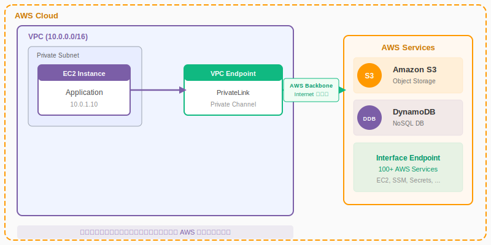

<!--
VPC Endpoint はインターネットを介さずに AWS サービスへプライベート接続する仕組みです。トラフィックは AWS バックボーン内に留まり、パブリック IP は不要です。
-->

---

# なぜ VPC Endpoint が必要か？

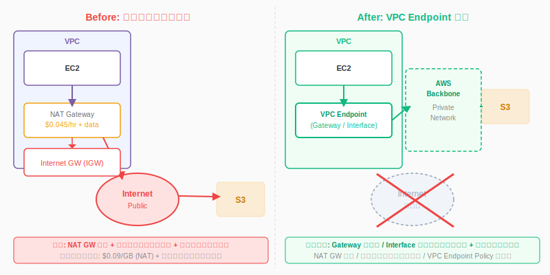

<!--
Before: IGW + NAT GW 経由でのインターネット経由接続はコスト高・セキュリティリスク有り。After: VPC Endpoint 経由でコスト削減とセキュリティ強化を同時に実現できます。
-->

---

# 2 種類の VPC Endpoint — 全体像

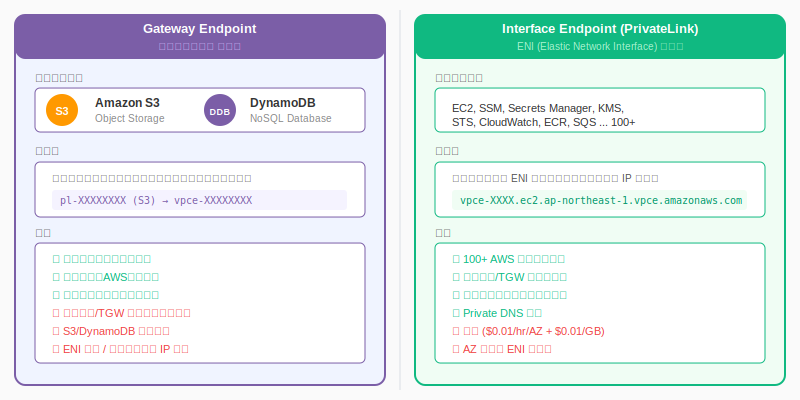

<!--
Gateway Endpoint: ルートテーブルベース、S3/DDB のみ、無料。Interface Endpoint: ENI ベース、100+ サービス対応、有料。この違いが選定の基本になります。
-->

---

# Gateway Endpoint — アーキテクチャ

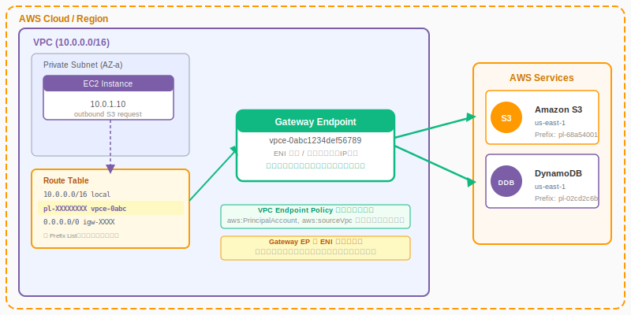

<!--
Gateway Endpoint は ENI を持たない仮想ゲートウェイです。ルートテーブルのエントリとして機能し、プレフィックスリスト宛てのトラフィックをエンドポイント経由に誘導します。
-->

---

# Gateway Endpoint — ルートテーブルの仕組み

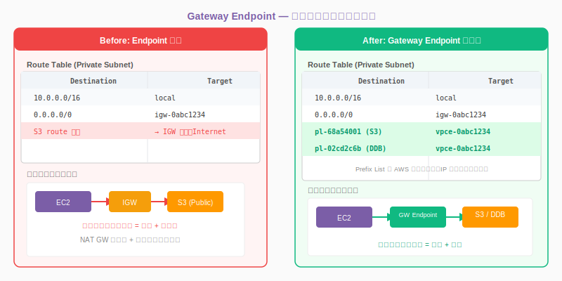

<!--
エンドポイント作成時にルートテーブルへ Managed Prefix List エントリが自動追加されます。プレフィックスリストは AWS が管理するため IP 範囲の変更を追跡する必要はありません。
-->

---

# Gateway Endpoint — 対応サービス詳細

- **Amazon S3 (Gateway Endpoint)**
- リージョン内全バケットに接続可能（クロスリージョンは不可）
- Prefix List: `pl-68a54001` (us-east-1) / `pl-61a54008` (us-west-2) 等
- S3 Access Point 経由でも利用可能
- **Amazon DynamoDB (Gateway Endpoint)**
- リージョン内全テーブルに接続可能
- Prefix List: `pl-02cd2c6b` (us-east-1) 等、リージョンにより異なる

<!--
Gateway EP は S3 と DynamoDB の 2 サービスのみ対応。どちらも大量データアクセスが発生しやすいサービスであり、無料の Gateway EP を優先的に使うことでコスト最適化できます。
-->

---

# Gateway Endpoint — ルートテーブル設定例

- **AWS CLI でエンドポイント作成**

```bash
# Gateway Endpoint 作成（S3用）
aws ec2 create-vpc-endpoint \
  --vpc-id vpc-0abc1234 \
  --service-name com.amazonaws.ap-northeast-1.s3 \
  --route-table-ids rtb-0xyz5678 rtb-0abc9012

# ルートテーブル確認（Prefix List エントリが追加されている）
aws ec2 describe-route-tables \
  --route-table-ids rtb-0xyz5678 \
  --query 'RouteTables[].Routes[]'

# Managed Prefix List の確認
aws ec2 describe-managed-prefix-lists \
  --filters 'Name=owner-id,Values=AWS'
```

<!--
create-vpc-endpoint コマンドで route-table-ids を指定することで、対象ルートテーブルに自動的にプレフィックスリストエントリが追加されます。複数のルートテーブルを一度に指定可能です。
-->

---

# Gateway Endpoint — アクセス制御（Endpoint Policy）

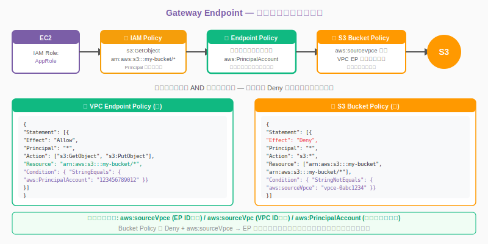

<!--
Gateway EP のアクセス制御は 4 層構造です。特に aws:sourceVpce 条件キーを使った Bucket Policy による Deny は、EP 経由以外からのアクセスを完全遮断する最も強力な制御手段です。
-->

---

# Interface Endpoint (PrivateLink) — 概要

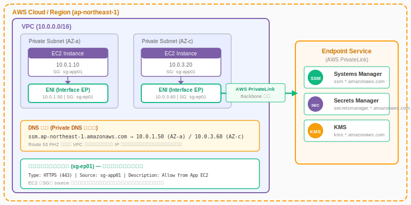

<!--
Interface Endpoint は VPC 内のサブネットに ENI を作成します。ENI はプライベート IP を持ち、セキュリティグループを適用できます。Private DNS により既存コードの変更なしでプライベート接続が可能です。
-->

---

# Interface Endpoint — マルチ AZ ENI 配置

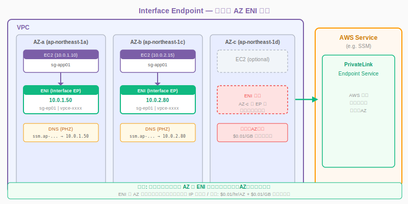

<!--
高可用性のため、使用する全 AZ に ENI を作成することを推奨します。ENI がない AZ からアクセスするとクロスAZ通信が発生し $0.01/GB のコストが発生します。
-->

---

# Interface Endpoint — DNS 解決の仕組み

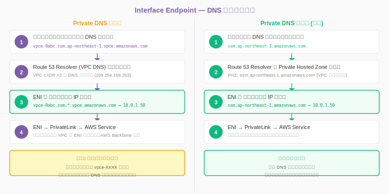

<!--
Private DNS を有効化すると Route 53 PHZ が自動作成され、標準の DNS 名がプライベート IP に解決されます。既存アプリのコード変更なしで移行できるため、本番環境での採用が容易です。
-->

---

# Private DNS 機能と Route 53 PHZ

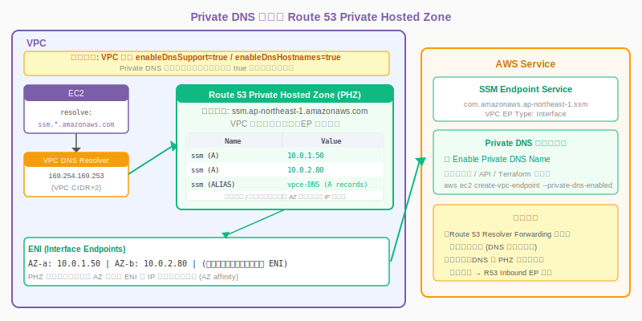

<!--
PHZ は Interface Endpoint 作成時に自動生成・VPC 関連付けされます。enableDnsSupport と enableDnsHostnames の両方が true である必要があります。オンプレから PHZ へのアクセスには R53 Inbound Resolver EP が必要です。
-->

---

# Interface Endpoint — 対応サービス一覧

- **コンピューティング & コンテナ:** EC2, ECS, ECR (API/dkr), Lambda
- **管理 & 運用:** SSM, Systems Manager, CloudWatch (Logs/Monitoring), CloudTrail
- **セキュリティ:** Secrets Manager, KMS, ACM, Security Hub, GuardDuty
- **ネットワーク:** Route 53 Resolver, PrivateLink, Network Firewall
- **データ & 分析:** S3 (Interface), Kinesis, Glue, Athena, SageMaker
- **その他:** SQS, SNS, STS, CodeBuild, CodePipeline, AppStream 2.0

<!--
現在 100 以上の AWS サービスが Interface Endpoint に対応しています。サービス名は com.amazonaws.<region>.<service-name> の形式です。利用可能なサービスは AWS コンソールまたは API で確認できます。
-->

---

# Interface Endpoint — セキュリティグループ設計

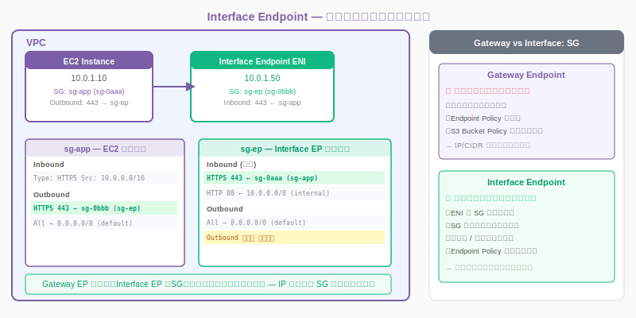

<!--
SG 参照（sg-id をソースに指定）は IP アドレス変更に依存しない堅牢な設計です。Gateway EP との最大の違いがこのセキュリティグループによる細粒度制御にあります。
-->

---

# 比較① — 技術仕様マトリクス

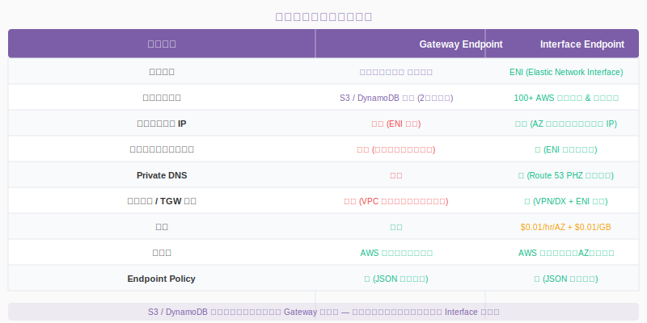

<!--
最重要の差分は「対応サービス数」「ENI 有無」「SG 設定可否」「オンプレ/TGW 経由可否」の 4 点です。ANS 試験ではこの比較から答えを導くケースが多いです。
-->

---

# 比較② — コスト構造

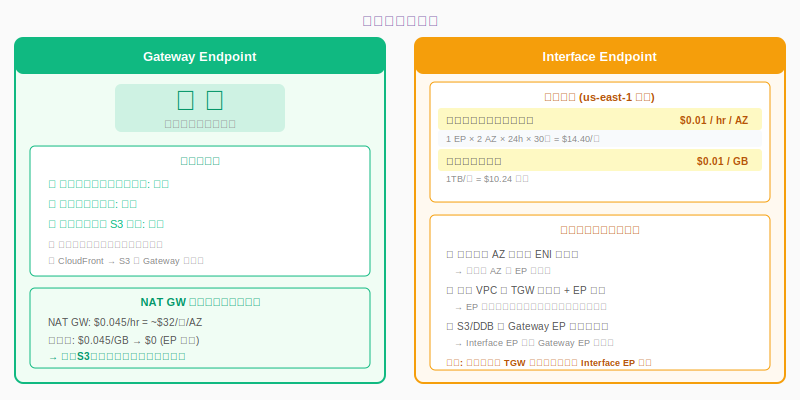

<!--
Gateway EP は完全無料です。大量の S3 アクセスがある場合は Gateway EP を使わないと NAT GW 経由で大きなコストが発生します。Interface EP は使用する AZ 数を最小化することでコスト最適化できます。
-->

---

# 比較③ — セキュリティモデル

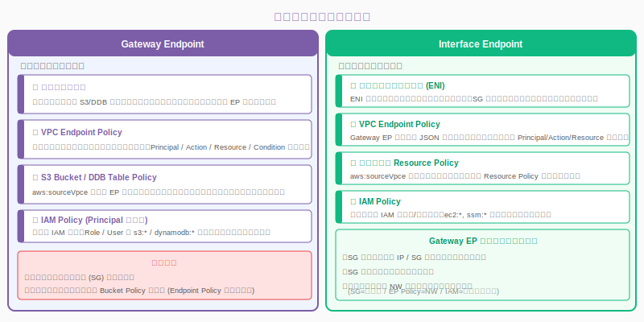

<!--
Gateway EP はルートテーブル + EP Policy + Bucket Policy の 3 層。Interface EP は SG + EP Policy + Resource Policy + IAM の 4 層でより細粒度な制御が可能です。
-->

---

# 比較④ — ユースケース選定フロー

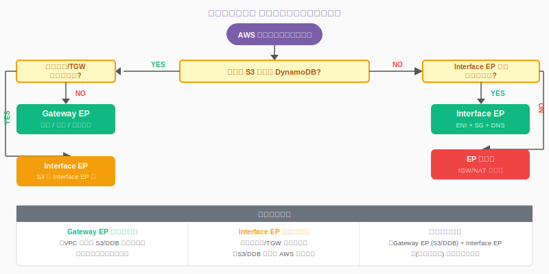

<!--
S3/DDB + VPC 内のみのアクセス → Gateway EP が第一選択。オンプレ経由や他サービス → Interface EP。両方組み合わせるのが現実的なアーキテクチャです。
-->

---

# PrivateLink — Consumer / Provider アーキテクチャ

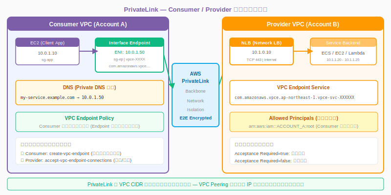

<!--
Consumer は Interface EP を通じて Provider の Endpoint Service に接続します。VPC CIDR が重複していても使用可能で、プロバイダー VPC の IP アドレス空間を意識する必要がありません。
-->

---

# PrivateLink — NLB 連携アーキテクチャ詳細

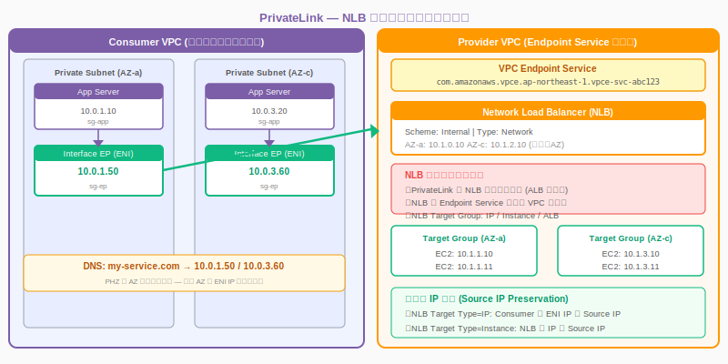

<!--
PrivateLink の Endpoint Service には Network Load Balancer（NLB）が必須です。ALB は対応していません。NLB の Target Type によって Source IP 保持の動作が異なります。
-->

---

# カスタム PrivateLink サービスの公開手順

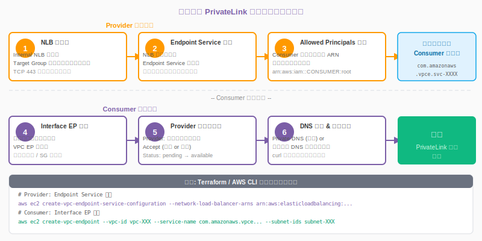

<!--
Provider 側が NLB + Endpoint Service を作成し、Consumer 側が Interface EP を作成して接続リクエストを送ります。Provider が承認すると接続が確立します。Terraform では aws_vpc_endpoint_service / aws_vpc_endpoint リソースで管理できます。
-->

---

# VPC Endpoint Policy — 設計方針

- **基本原則: 最小権限（Least Privilege）**
- デフォルトは `Allow *` — 意図的に制限する必要がある
- Principal / Action / Resource / Condition を組み合わせて制御
- **推奨アプローチ**
- 特定アカウント・サービスのみ許可: `aws:PrincipalAccount` 条件
- 特定 Action のみ許可: `s3:GetObject` 等の必要な操作のみ
- 特定リソースのみ許可: ARN で制限（例: `arn:aws:s3:::my-bucket/*`）

<!--
Endpoint Policy は JSON IAM ポリシーと同じ構文です。デフォルトは全許可なので、機密データを扱うエンドポイントは必ず制限します。Gateway EP と Interface EP でポリシーの適用タイミングが異なります（Gateway: ルーティング時、Interface: 接続時）。
-->

---

# S3 Bucket Policy との連携

- **EP 経由のみアクセスを許可する最強パターン**

```json
# S3 Bucket Policy: VPC Endpoint 経由以外を完全拒否
{
  "Version": "2012-10-17",
  "Statement": [
    {
      "Sid": "DenyNonVPCE",
      "Effect": "Deny",
      "Principal": "*",
      "Action": "s3:*",
      "Resource": [
        "arn:aws:s3:::my-secure-bucket",
        "arn:aws:s3:::my-secure-bucket/*"
      ],
      "Condition": {
        "StringNotEquals": {
          "aws:sourceVpce": "vpce-0abc1234def56789"
        }
      }
    }
  ]
}
```

<!--
aws:sourceVpce で特定の EP ID のみを許可、それ以外（インターネット・他 VPC）を Deny します。aws:sourceVpc で VPC 全体を許可することも可能です。この Deny は root アカウントからのアクセスも拒否します（注意が必要）。
-->

---

# マルチ VPC / マルチアカウント 設計パターン

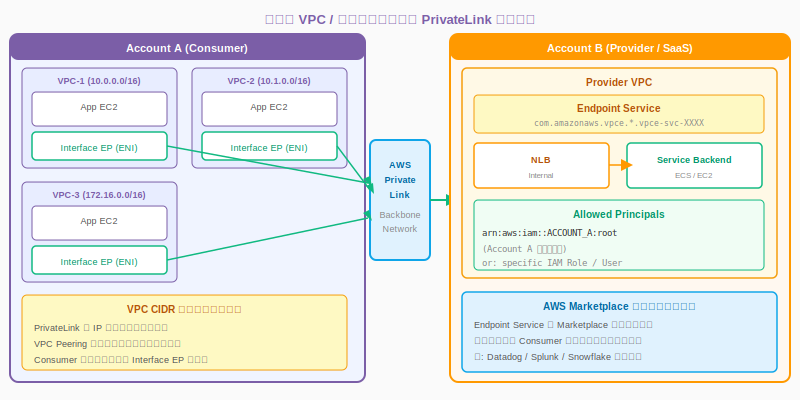

<!--
PrivateLink は VPC CIDR 重複を許容するため、マルチアカウント環境で異なるアカウントの VPC が同じ CIDR を持つケースでも問題なく使用できます。Consumer ごとに独立した Interface EP が必要です。
-->

---

# Transit Gateway + PrivateLink — 集中型アーキテクチャ

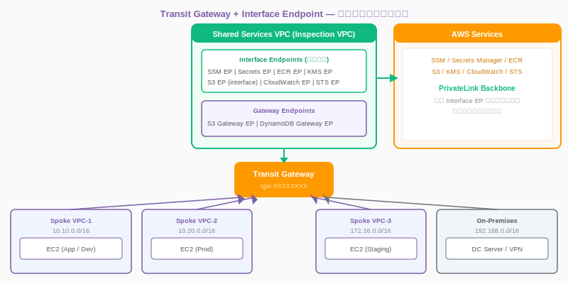

<!--
TGW を中心にした Hub-and-Spoke アーキテクチャでは、共有サービス VPC に Interface EP を集約し、すべての Spoke VPC および On-Premises から TGW 経由でアクセスさせます。EP 数を最小化できるコスト最適化パターンです。
-->

---

# Hub-and-Spoke — Interface Endpoint 集約

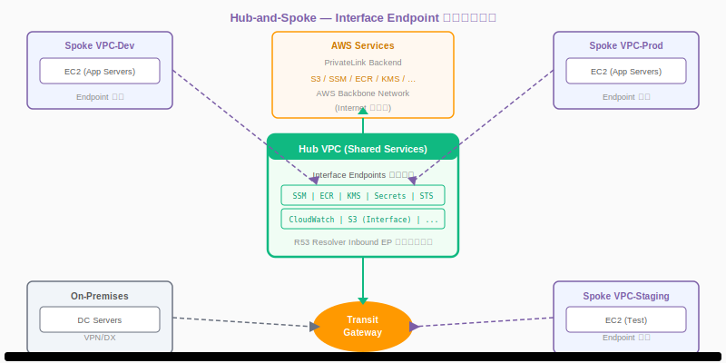

<!--
Hub VPC（共有サービス VPC）に Interface EP を集約し、Spoke VPC は EP を持たずに TGW 経由で Hub の EP を利用します。ただし Gateway EP は TGW を跨いで共有できないため、各 Spoke VPC に個別の Gateway EP が必要です。
-->

---

# PrivateLink + Direct Connect — オンプレ接続

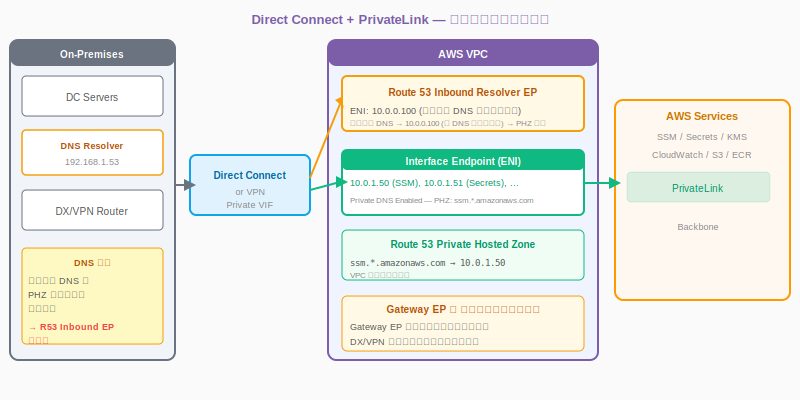

<!--
Gateway EP は VPC 外からのアクセスに対応していないため、オンプレからの接続には Interface EP が必須です。また Gateway EP の Endpoint Policy はオンプレからのアクセスには適用されない点も重要です。
-->

---

# オンプレミス接続時の DNS 解決フロー

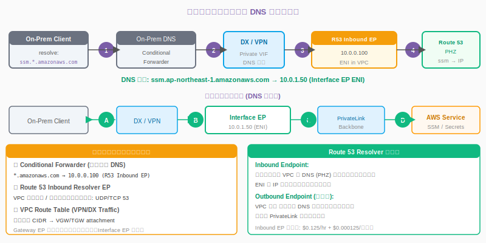

<!--
オンプレ DNS → Conditional Forwarder → R53 Inbound EP → PHZ の順で DNS 解決します。R53 Inbound EP は VPC 内に ENI を作成し、オンプレ DNS からの問い合わせを受け付けます。Gateway EP はこのフローでは機能しません。
-->

---

<!-- _class: lead -->
# セキュリティ設計

- VPC Endpoint Policy のベストプラクティス
- IAM 条件キーの活用
- セキュリティグループ設計パターン

<!--
セクション 6: セキュリティ設計。Endpoint Policy・IAM 条件キー・SG の組み合わせによる多層防御を解説します。
-->

---

# VPC Endpoint Policy — ベストプラクティス

- **① デフォルトポリシーを使用しない**
- デフォルトは全許可（Allow *）→ 必ず制限する
- **② Principal を絞る**
- `aws:PrincipalAccount` で自アカウントのみに限定
- **③ Action を最小化**
- ReadOnly 用途は `s3:Get*`, `s3:List*` のみ許可
- **④ Endpoint Policy + Bucket Policy の二重制御**
- EP Policy で通過制限 + Bucket Policy で `aws:sourceVpce` Deny

<!--
Endpoint Policy は IAM ポリシーと同じ構文ですが、Principal を省略できません。デフォルトの全許可ポリシーをそのまま使用するのは危険です。最低限 `aws:PrincipalAccount` で自アカウントに制限しましょう。
-->

---

# `aws:sourceVpc` 条件キーの活用

- **条件キーの使い分け**

```json
# aws:sourceVpce — 特定の VPC Endpoint ID で制限
{
  "Condition": { "StringEquals": {
    "aws:sourceVpce": "vpce-0abc1234def56789"
  }}
}

# aws:sourceVpc — 特定の VPC ID で制限 (同じ VPC の全 EP が対象)
{
  "Condition": { "StringEquals": {
    "aws:sourceVpc": "vpc-0abc1234"
  }}
}

# aws:PrincipalAccount — 特定アカウントのみ許可
{
  "Condition": { "StringEquals": {
    "aws:PrincipalAccount": "123456789012"
  }}
}

# 複合条件: 自アカウント + 特定 EP 経由のみ
{
  "Condition": {
    "StringEquals": {
      "aws:PrincipalAccount": "123456789012",
      "aws:sourceVpce": "vpce-0abc1234"
    }
  }
}
```

<!--
aws:sourceVpce は特定 EP ID で制限するため最も細かく制御できます。aws:sourceVpc はその VPC の全 EP に適用されます。マルチアカウントで Provider EP を共有する場合は aws:PrincipalAccount との組み合わせが重要です。
-->

---

# エンドポイント特有の IAM 条件キー一覧

- **vpc/endpoint 関連の条件キー**
- `aws:sourceVpce` — 送信元の VPC Endpoint ID
- `aws:sourceVpc` — 送信元の VPC ID
- `aws:sourceVpcSourceIp` — VPC 内の送信元 IP（CIDR 指定可）
- **Principal 関連の条件キー**
- `aws:PrincipalAccount` — 送信元 AWS アカウント ID
- `aws:PrincipalOrgID` — AWS Organizations の組織 ID
- `aws:PrincipalTag` — プリンシパルに付与されたタグ

<!--
aws:PrincipalOrgID を使うと AWS Organizations 全体を対象にしたポリシーが書けます。マルチアカウント環境での EP 共有時に有効です。ANS 試験では条件キーの選択が問われます。
-->

---

# セキュリティグループ設計パターン

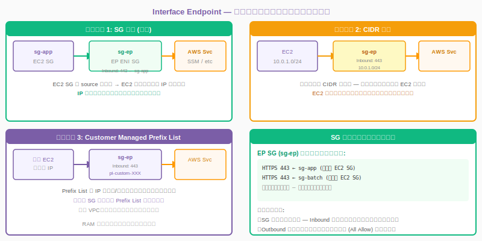

<!--
SG 参照パターンが最も推奨です。EC2 の IP が変わっても SG を変更する必要がありません。Prefix List パターンは複数チーム・複数 VPC で EP を共有する際に有効です。
-->

---

<!-- _class: lead -->
# トラブルシューティング

- 接続確認の基本フロー
- Gateway / Interface EP の頻出問題
- DNS デバッグ

<!--
セクション 7: トラブルシューティング。実際の現場で遭遇しやすい問題と解決策を体系的に解説します。
-->

---

# 接続確認 — 基本トラブルシューティングフロー

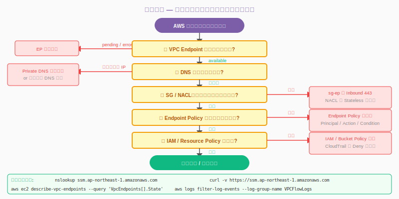

<!--
まず EP のステータスが available であることを確認します。次に DNS 解決がプライベート IP を返しているか確認し、SG/NACL → EP Policy → IAM の順にチェックします。
-->

---

# Gateway Endpoint — よくある問題と解決策

- **問題 1: トラフィックがインターネット経由になる**
- 原因: サブネットのルートテーブルに EP が関連付けられていない
- 解決: EP 作成時に対象ルートテーブルを指定 / 後から修正
- **問題 2: オンプレからアクセスできない**
- 原因: Gateway EP は VPC 内からのトラフィックのみ対応
- 解決: Interface EP（S3 Interface Endpoint）に切り替える
- **問題 3: EP Policy で拒否されている**
- 原因: EP Policy の Condition / Action が想定外に厳しい
- 解決: CloudTrail で拒否の詳細を確認し Policy を修正

<!--
Gateway EP の最もよくある問題はルートテーブルへの関連付け漏れです。VPC には複数のルートテーブルがある場合があるため、全サブネットが対象ルートテーブルを使用しているか確認します。
-->

---

# Interface Endpoint — よくある問題と解決策

- **問題 1: 特定 AZ だけ接続できない**
- 原因: その AZ に ENI が作成されていない
- 解決: 使用するすべての AZ にサブネットを指定して EP を修正
- **問題 2: DNS 解決がパブリック IP を返す**
- 原因: Private DNS が無効 / VPC の DNS 属性が false
- 解決: enableDnsSupport と enableDnsHostnames を true に変更後、Private DNS を有効化
- **問題 3: SG で接続がブロックされる**
- 原因: EP の SG にインバウンド 443 が許可されていない
- 解決: sg-ep のインバウンドに HTTPS 443 を追加（Source: EC2 SG）

<!--
Interface EP のトラブルで最も多いのが DNS 関連です。まず nslookup でプライベート IP が返るかを確認します。VPC Flow Logs を見て REJECT されているか確認することも有効です。
-->

---

# DNS トラブルシューティングフロー

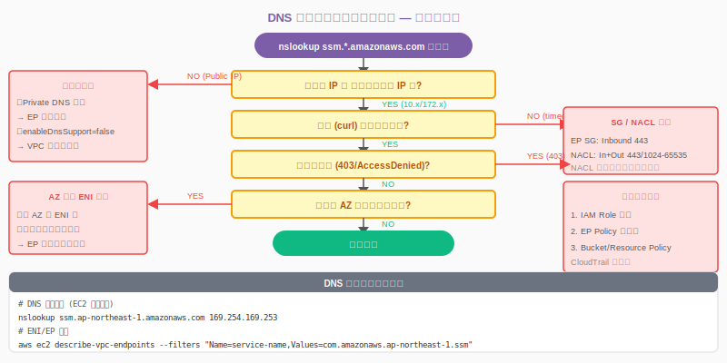

<!--
DNS 解決の問題は nslookup から始めます。プライベート IP が返らない場合は Private DNS 設定を確認し、接続タイムアウトの場合は SG/NACL を確認します。403 の場合はポリシー層を確認します。
-->

---

# CloudWatch メトリクス & VPC Flow Logs 活用

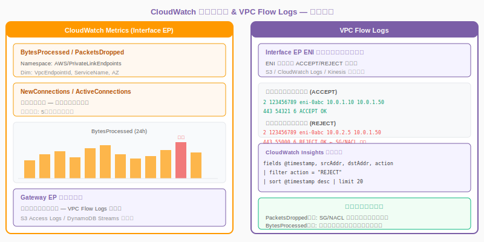

<!--
Interface EP は CloudWatch の AWS/PrivateLinkEndpoints 名前空間でメトリクスを取得できます。Gateway EP はメトリクスなしのため VPC Flow Logs で補います。PacketsDropped が急増した場合は SG/NACL の設定を見直してください。
-->

---

<!-- _class: lead -->
# ANS 試験対策ポイント

- ANS 頻出パターン問題
- 試験で問われる設計判断ポイント

<!--
セクション 8: ANS 試験対策。本セッションの内容を試験問題の視点から整理します。
-->

---

# ANS 頻出パターン — 設計問題

- **パターン A: コスト最小化 + S3 アクセス**
- → Gateway Endpoint (無料) を選択
- **パターン B: オンプレから SSM / Secrets Manager にアクセス**
- → Interface Endpoint + Direct Connect + R53 Inbound EP
- **パターン C: 複数 VPC で EP を共有したい**
- → TGW + Shared Services VPC に Interface EP を集約（Gateway EP は共有不可）
- **パターン D: VPC CIDR 重複環境でサービス共有**
- → PrivateLink（VPC Peering は CIDR 重複不可）

<!--
ANS 試験は「なぜその選択か」の理由が重要です。Gateway EP: 無料・S3/DDB のみ・VPC 内のみ。Interface EP: 有料・多サービス・オンプレ対応。この軸で問題を解くと正解率が上がります。
-->

---

# ANS 試験 — 設計判断決定木


<!--
試験で迷った場合はこの決定木を使います。S3/DDB + コスト最小化 = Gateway EP。それ以外 = Interface EP。VPC CIDR 重複 + サービス共有 = PrivateLink。オンプレ + DNS = R53 Inbound EP。
-->

---

# まとめ & 参考リンク

- **Gateway Endpoint** — S3/DDB 専用・無料・ルートテーブルベース・VPC 内のみ
- **Interface Endpoint** — 100+ サービス・有料・ENI+SG・オンプレ/TGW 対応
- **選定基準** — S3/DDB のみ+コスト重視 → Gateway EP、それ以外 → Interface EP
- **参考リンク:**
- [VPC Endpoints (AWS Doc)](https://docs.aws.amazon.com/vpc/latest/privatelink/vpc-endpoints.html)
- [AWS PrivateLink (公式)](https://docs.aws.amazon.com/vpc/latest/privatelink/privatelink-access-aws-services.html)
- [Gateway Endpoint vs Interface Endpoint](https://docs.aws.amazon.com/vpc/latest/privatelink/vpce-gateway.html)

<!--
本スライドで解説した Gateway EP と Interface EP の違いを理解することで、ANS 試験の設計問題の大部分に対応できます。実務では両者を組み合わせ、コストとセキュリティを最適化しましょう。
-->
