<!-- _class: lead -->
# ML評価指標 完全ガイド

- ML評価指標 完全ガイド
- 分類 / 回帰 / NLP生成 / ランキング / クラスタリング
- MLエンジニア・データサイエンティスト 完全リファレンス


---

# 目次

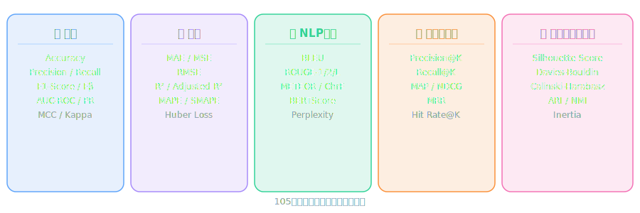


---

# なぜ指標選びが重要か

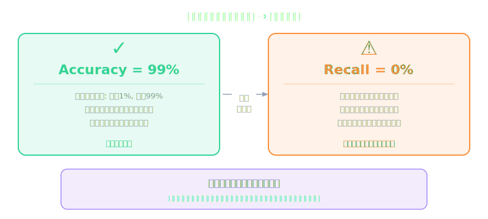


---

# 5カテゴリ 全体マップ

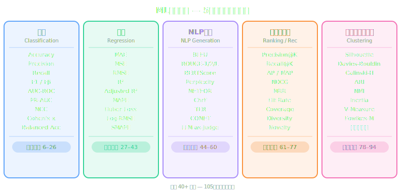


---

# 指標を選ぶための問いかけ

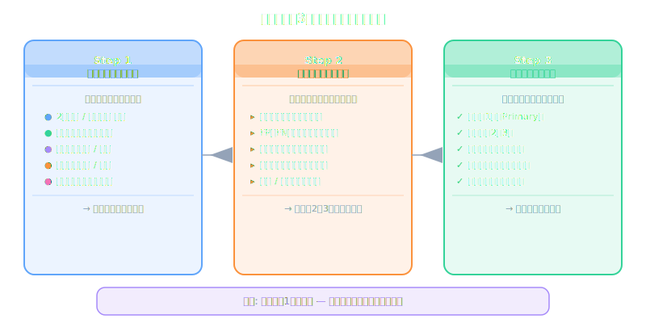


---

<!-- _class: lead -->
# Part 1: Classification Metrics

- 分類問題の評価指標
- Confusion Matrix を起点に体系的に整理


---

# 混同行列（Confusion Matrix）の構造

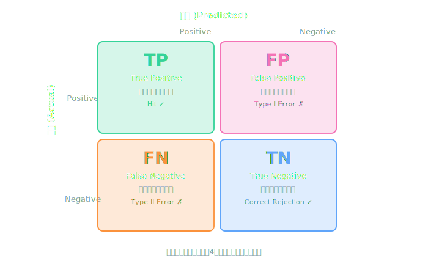


---

# TP / FP / TN / FN の直感的理解


---

# Accuracy（正解率）

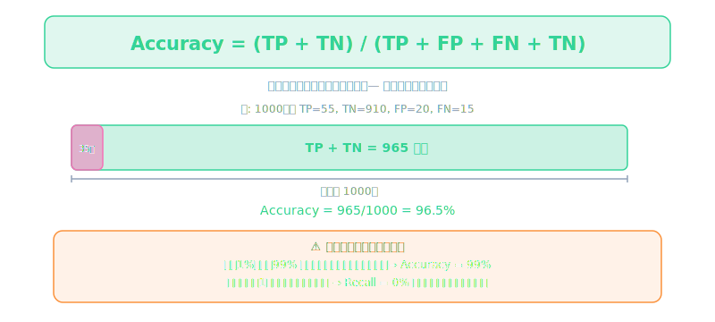


---

# Precision（適合率）

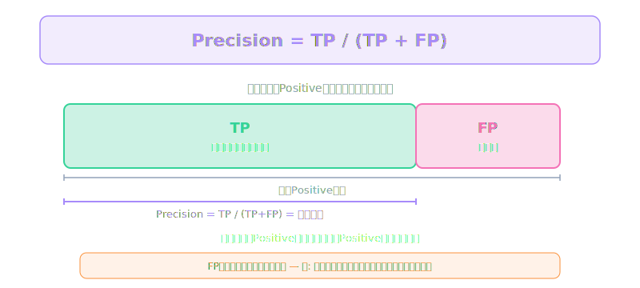


---

# Recall（再現率・感度）

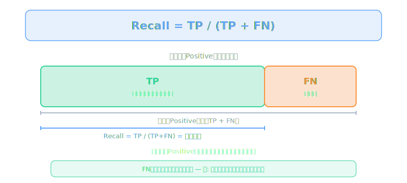


---

# Precision vs Recall トレードオフ

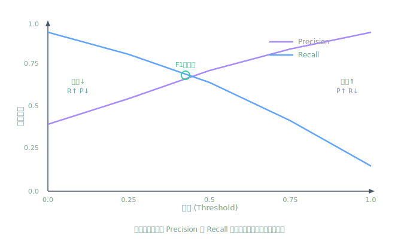


---

# F1-Score（調和平均）

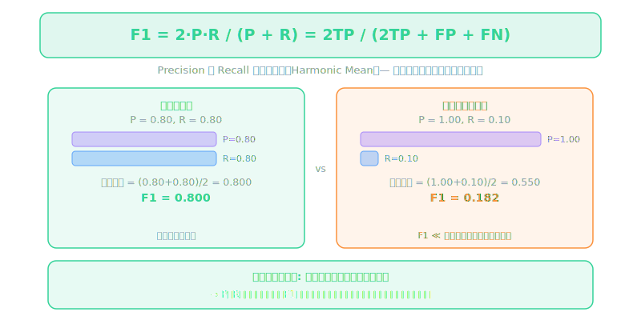


---

# Fβ-Score — β の使い分け

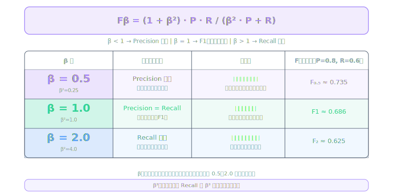


---

# ROC曲線の概念

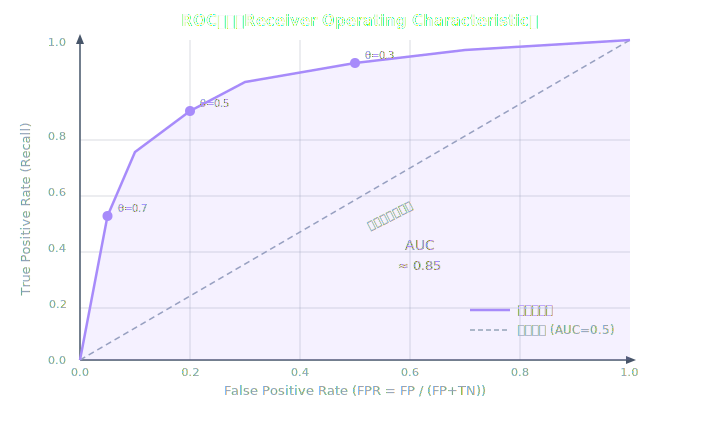


---

# AUC-ROC — 解釈と評価

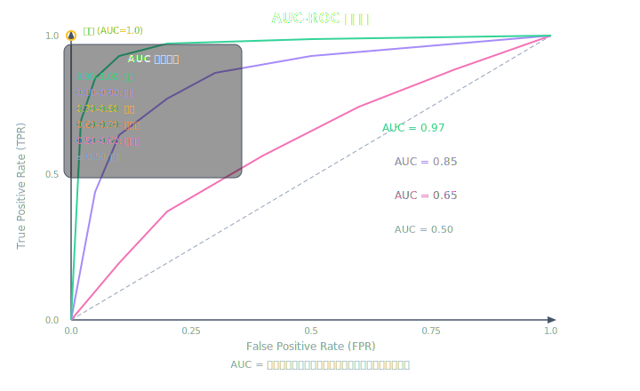


---

# PR曲線 vs ROC曲線

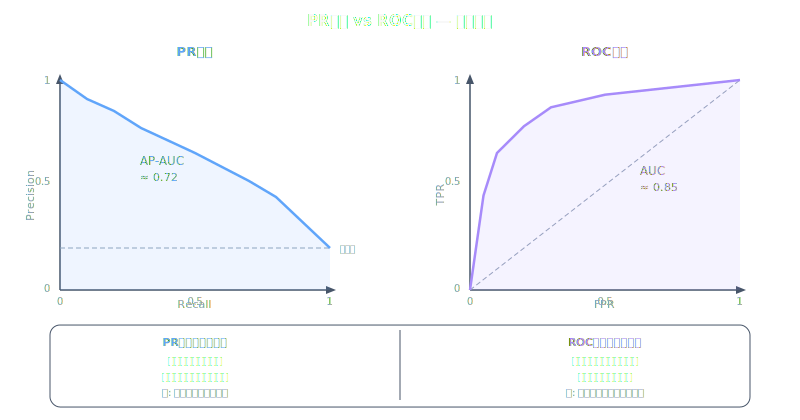


---

# マルチクラス — Micro / Macro / Weighted 平均

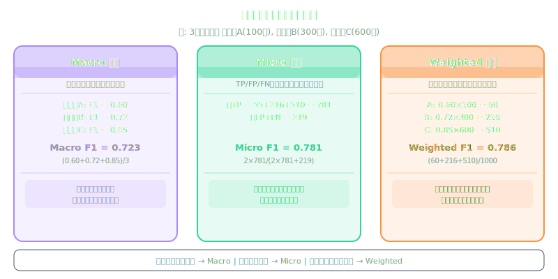


---

# 不均衡データでの指標選び

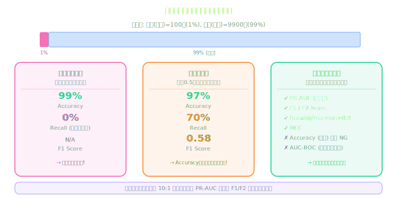


---

# Cohen's Kappa と MCC

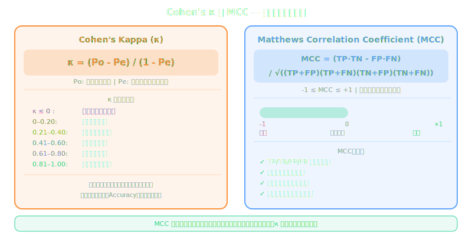


---

# 分類指標 比較マトリクス

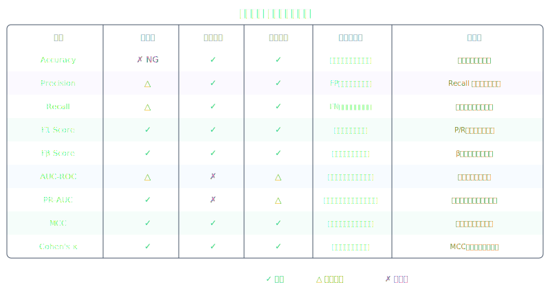


---

# 分類指標 選択フローチャート

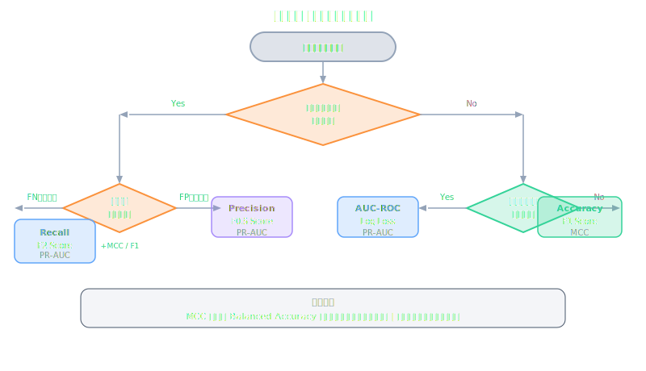


---

# 実装例（scikit-learn）

- scikit-learn で主要な分類指標をまとめて計算

```python
from sklearn.metrics import (
    accuracy_score, precision_score, recall_score,
    f1_score, roc_auc_score, classification_report,
    confusion_matrix, matthews_corrcoef
)

# 基本指標
print(f"Accuracy:  {accuracy_score(y_true, y_pred):.4f}")
print(f"Precision: {precision_score(y_true, y_pred):.4f}")
print(f"Recall:    {recall_score(y_true, y_pred):.4f}")
print(f"F1-Score:  {f1_score(y_true, y_pred):.4f}")
print(f"AUC-ROC:   {roc_auc_score(y_true, y_prob):.4f}")
print(f"MCC:       {matthews_corrcoef(y_true, y_pred):.4f}")

# 詳細レポート
print(classification_report(y_true, y_pred,
      target_names=["Negative", "Positive"]))

# 混同行列
cm = confusion_matrix(y_true, y_pred)
print(f"TN={cm[0,0]}, FP={cm[0,1]}, FN={cm[1,0]}, TP={cm[1,1]}")
```


---

# よくある落とし穴

- Accuracy のみで評価（不均衡データで 99% でも使えないモデルの可能性）
- テストセットで閾値を最適化 → 過学習（バリデーションセットで行うこと）
- クラス不均衡を無視したマクロ平均（小クラスの性能が過大評価される）
- ROC曲線とPR曲線の混同（不均衡データは PR 曲線が正直）
- 単一指標への過信（Precision・Recall・F1 を合わせて見ること）
- 評価指標とビジネス目標のミスアライン（FNコストとFPコストは異なる）


---

# Part 1 まとめ

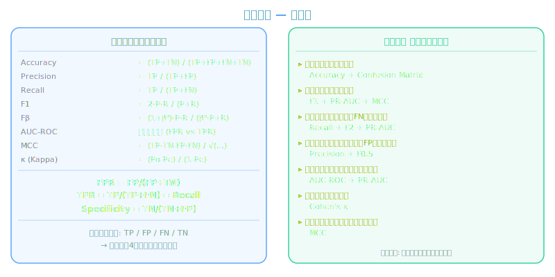


---

# （コラム）閾値調整と指標の変化

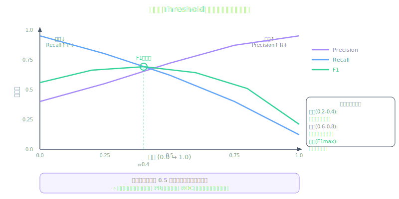


---

<!-- _class: lead -->
# 回帰指標

- 連続値予測の品質を測る指標群

<!--
MAE, MSE, RMSE, R², MAPE, Huber Loss を網羅
-->

---

# 回帰指標の全体像

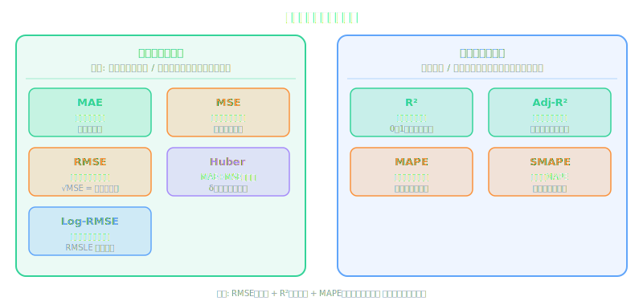

<!--
回帰指標の分類: スケール依存型 vs スケール独立型, 外れ値感度の違いを整理
-->

---

# MAE — 平均絶対誤差

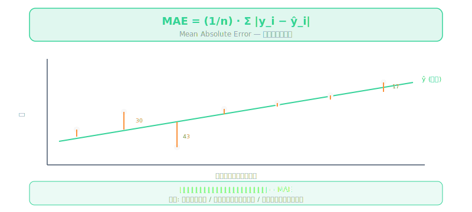

<!--
MAE = (1/n)Σ|yi - ŷi|。外れ値に対してロバスト。単位は元のスケールと同じ。
-->

---

# MSE — 平均二乗誤差

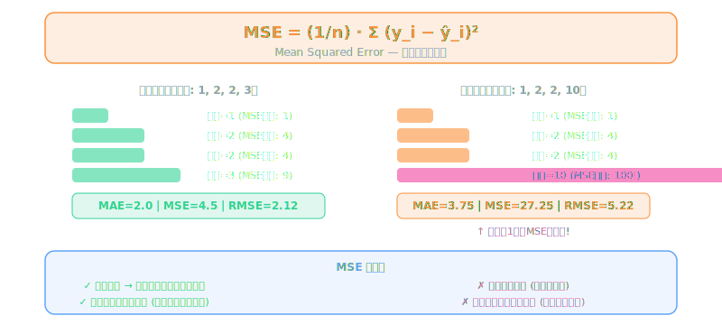

<!--
MSE = (1/n)Σ(yi - ŷi)²。外れ値を大きくペナルティ。微分可能で最適化しやすい。
-->

---

# RMSE — 二乗平均平方根誤差

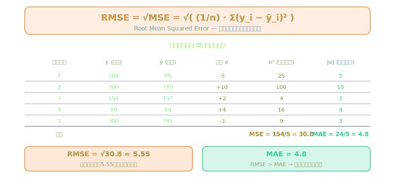

<!--
RMSE = √MSE。MSEと同じ性質だが元のスケールに戻せる点が有用。最も広く使われる回帰指標。
-->

---

# MAE vs MSE vs RMSE — 外れ値の影響

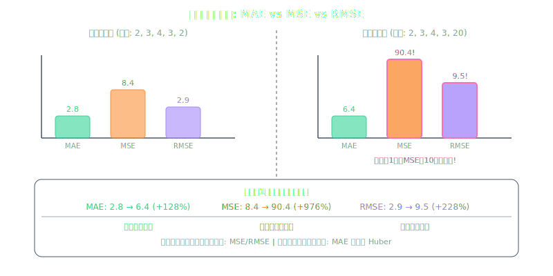

<!--
外れ値があるとMSE/RMSEが急上昇。MAEはロバストだが勾配が不連続。使い分けが重要。
-->

---

# R² — 決定係数

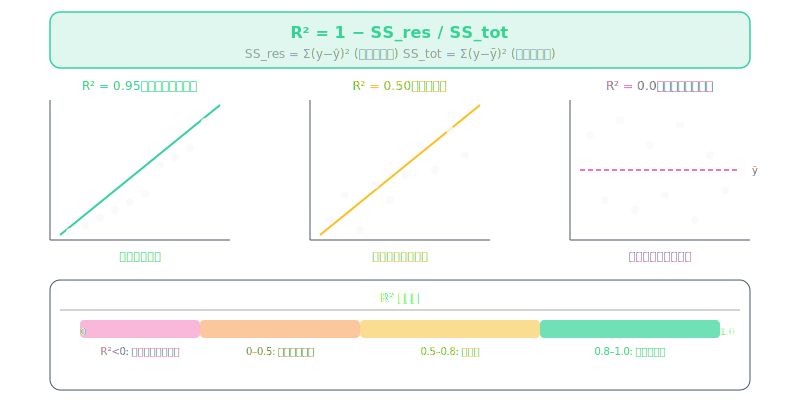

<!--
R² = 1 - SS_res/SS_tot。モデルがどれだけ分散を説明できるか。1.0が完璧、0はベースライン並み。
-->

---

# Adjusted R² — 調整済み決定係数

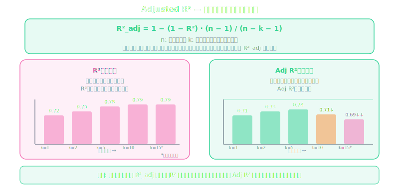

<!--
特徴量数が多いとR²は常に増加するため、特徴量数でペナルティを与えた補正版。過学習の検出に有用。
-->

---

# MAPE — 平均絶対パーセント誤差

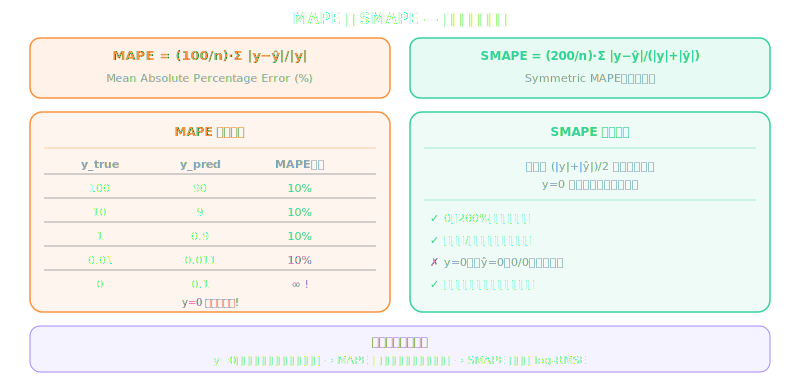

<!--
MAPE = (100/n)Σ|yi-ŷi|/|yi|。スケール独立だが y≈0 で発散する欠点あり。SMAPE で改善可能。
-->

---

# Huber Loss — ロバスト回帰損失

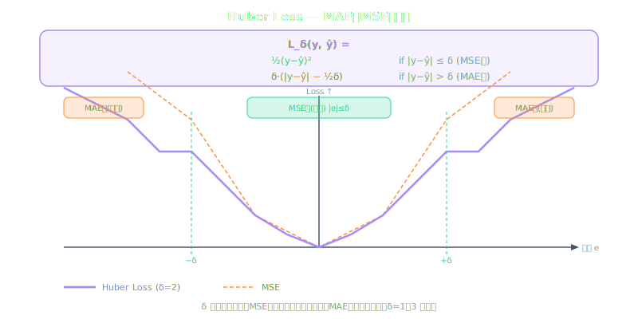

<!--
小誤差ではMSE的、大誤差ではMAE的に振る舞う。δパラメータで切り替え点を制御。外れ値耐性と微分可能性を両立。
-->

---

# 外れ値への感度比較

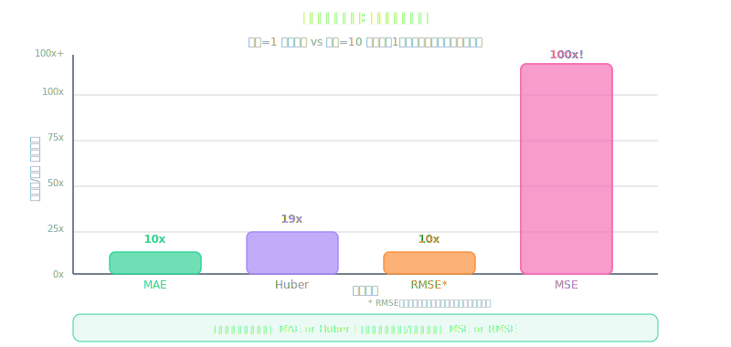

<!--
外れ値1点が各指標に与えるインパクトを視覚化。MSEは二乗なので外れ値に最も敏感。
-->

---

# 回帰指標 比較マトリクス

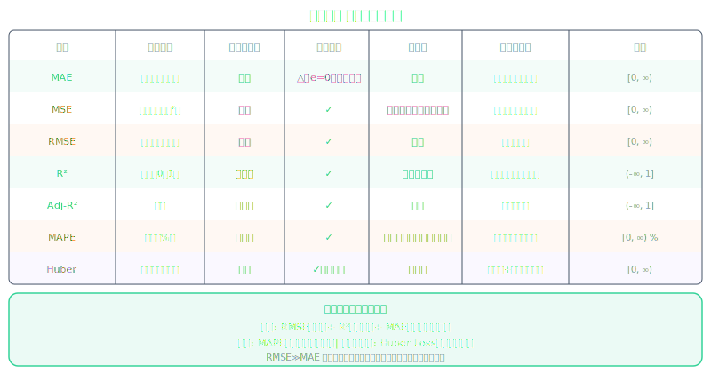

<!--
MAE/MSE/RMSE/R²/MAPE/Huberの性質を一覧比較。スケール依存性、外れ値感度、解釈容易さを軸に整理。
-->

---

# スケール依存 vs 独立

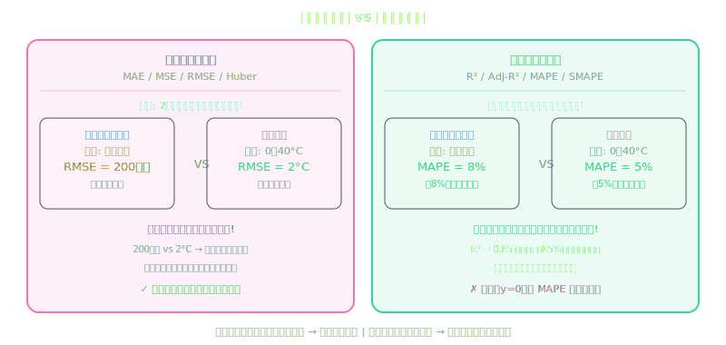

<!--
MAE/MSE/RMSEはスケール依存なので異なるデータセット間の比較に不向き。MAPE/R²はスケール独立で比較可能。
-->

---

# 回帰指標 選択フロー

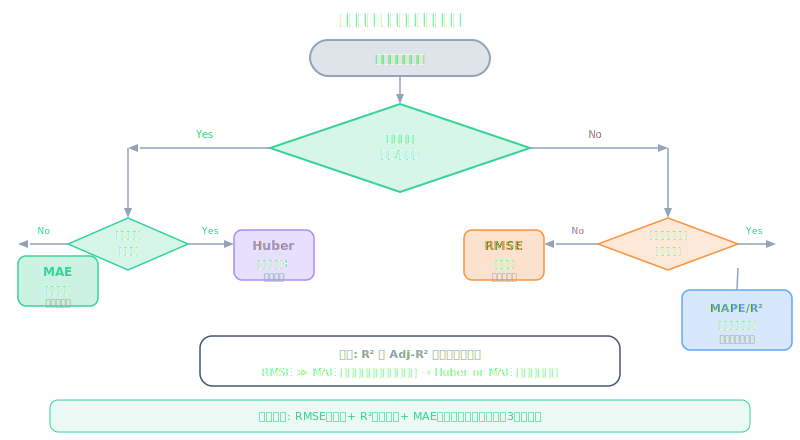

<!--
外れ値ありか？スケール比較するか？解釈が必要か？の問いで適切な指標に誘導するフローチャート。
-->

---

# 回帰指標 実装例 (Python)

- sklearn.metrics で全主要指標を計算する例

```python
from sklearn.metrics import (
    mean_absolute_error,
    mean_squared_error,
    r2_score,
    mean_absolute_percentage_error
)
import numpy as np

y_true = np.array([3.0, -0.5, 2.0, 7.0])
y_pred = np.array([2.5,  0.0, 2.0, 8.0])

print(f"MAE : {mean_absolute_error(y_true, y_pred):.4f}")
print(f"MSE : {mean_squared_error(y_true, y_pred):.4f}")
print(f"RMSE: {mean_squared_error(y_true, y_pred, squared=False):.4f}")
print(f"R²  : {r2_score(y_true, y_pred):.4f}")
print(f"MAPE: {mean_absolute_percentage_error(y_true, y_pred):.4f}")

# Huber Loss (手動実装)
delta = 1.0
resid = y_true - y_pred
huber = np.where(np.abs(resid)<=delta,
                 0.5*resid**2,
                 delta*(np.abs(resid)-0.5*delta))
print(f"Huber: {huber.mean():.4f}")
```

<!--
squared=False でRMSEを直接取得可能（sklearn 0.24+）。HuberはPyTorchではnn.HuberLoss()として利用可能。
-->

---

# 回帰指標まとめ

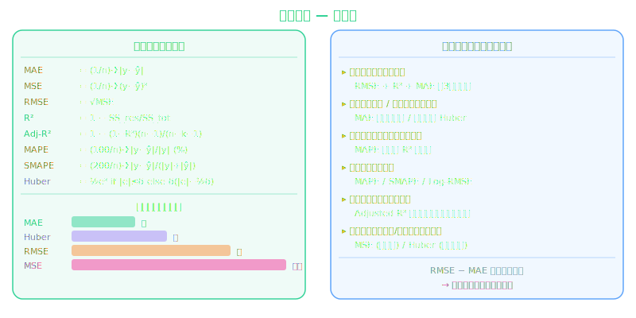

<!--
回帰指標の全体像、使い分けのポイント、外れ値処理の考え方をまとめる。
-->

---

# 回帰の落とし穴

- MAPE の罠: ゼロ近傍の値で発散 → SMAPE または sMAPE を使う
- R² < 0 は起こりうる: ベースライン予測より悪いモデルで R² が負になる
- RMSE ≠ MAE の差に注意: 差が大きいほど外れ値の影響大
- スケールの異なる比較: MAPE か対数スケールで正規化して比較
- 残差の正規性チェック: 残差プロットで系統的パターンがないか確認
- 多重共線性: Adjusted R² で特徴量の過剰追加を検出

<!--
よくある失敗パターンと対策を整理。実務では複数指標を組み合わせて判断することが重要。
-->

---

<!-- _class: lead -->
# NLP生成指標

- テキスト生成・翻訳・要約の品質を測る指標群

<!--
BLEU, ROUGE, BERTScore, Perplexity, METEOR, ChrF を網羅
-->

---

# NLP生成指標の全体像

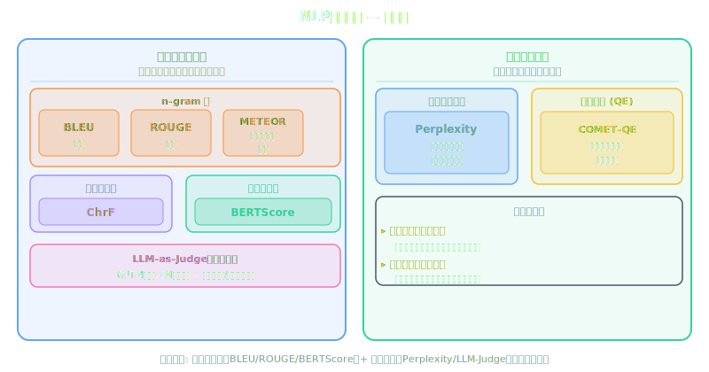

<!--
参照ベース指標と参照なし指標の2分類。n-gram系、埋め込み系、確率系を整理。
-->

---

# BLEU スコア — 概念

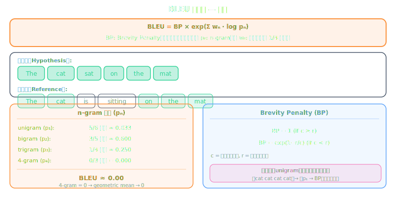

<!--
Bilingual Evaluation Understudy。生成テキストと参照テキストのn-gramの一致率を測る。機械翻訳評価の標準指標。
-->

---

# BLEU — n-gram精度と計算

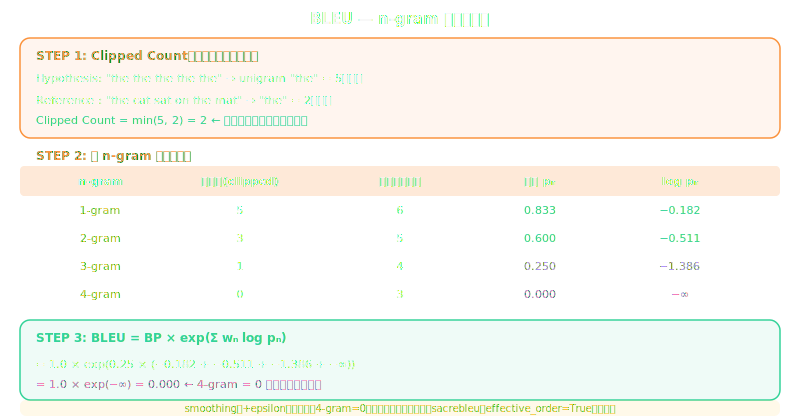

<!--
Precision@n-gram × Brevity Penalty。n=1,2,3,4のunigram〜4-gramを組み合わせて計算。短すぎる生成文にペナルティ。
-->

---

# ROUGE スコア

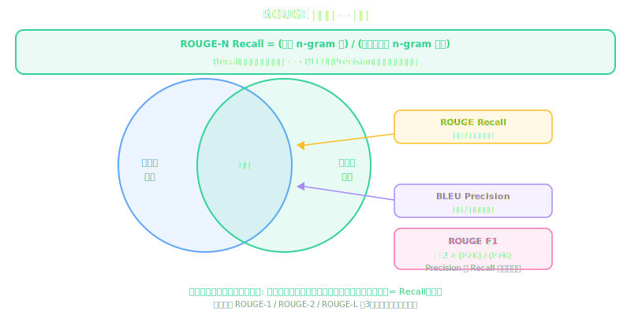

<!--
Recall-Oriented Understudy for Gisting Evaluation。参照サマリーとのRecall重視の指標。要約評価の標準。
-->

---

# ROUGE-1 / ROUGE-2 / ROUGE-L の違い


<!--
ROUGE-1: unigram一致, ROUGE-2: bigram一致, ROUGE-L: 最長共通部分列（LCS）ベース。
-->

---

# BERTScore — 意味的類似度

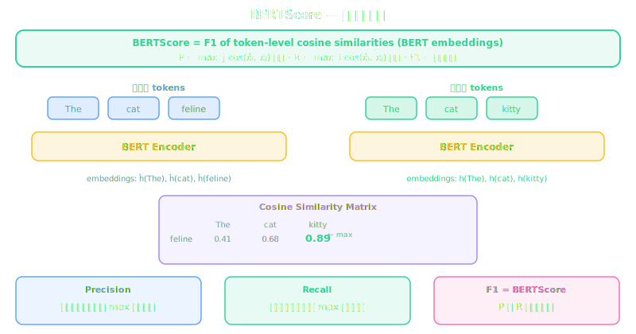

<!--
BERT埋め込みによるトークン間コサイン類似度を計算。語順・同義語・言い換えを考慮。n-gram一致より意味的に正確。
-->

---

# BERTScore vs BLEU/ROUGE

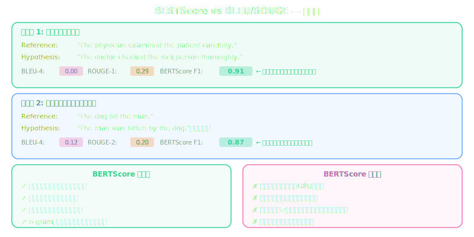

<!--
同義語・言い換えを含むケースでBERTScoreが優れていることを具体例で示す。計算コストは高い。
-->

---

# Perplexity — 言語モデルの内部評価

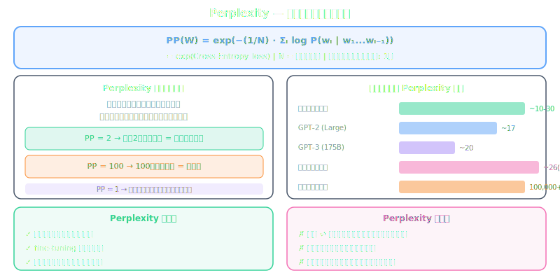

<!--
PP = exp(-1/N × Σ log P(w_i)). 低いほど良い。参照テキスト不要。モデル自体のテキスト生成確率を測る内部指標。
-->

---

# METEOR スコア

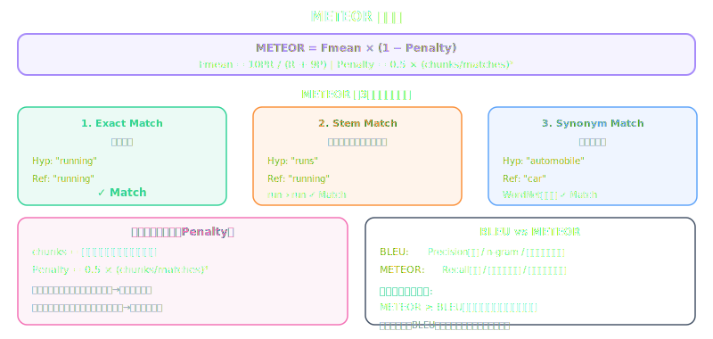

<!--
ステミング・同義語展開・語順ペナルティを含む。BLEUより人間評価との相関が高い。
-->

---

# ChrF スコア

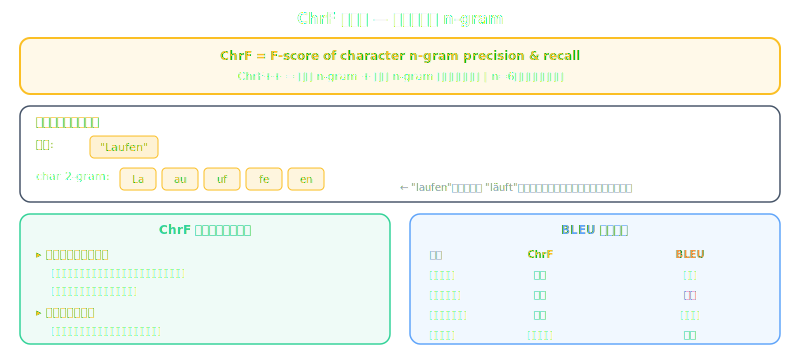

<!--
Character n-gram F-score。文字レベルのn-gram F値。形態素が豊富な言語（日本語・ドイツ語等）に特に有効。
-->

---

# タスク別 推奨指標マトリクス

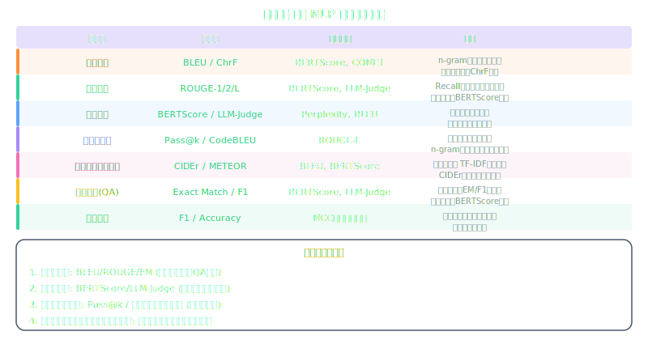

<!--
機械翻訳・要約・対話・コード生成・画像キャプション別に推奨指標をまとめたマトリクス。
-->

---

# 参照ベース vs 参照なし評価

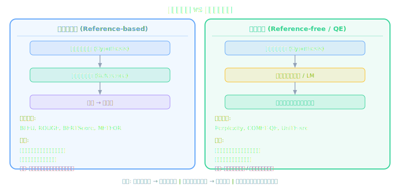

<!--
参照テキストありはBLEU/ROUGE/BERTScore。参照なし(QE)はComet-QEやPerplexity。ライブシステムでの継続評価に参照なしが有用。
-->

---

# LLM-as-Judge — GPTによる自動評価

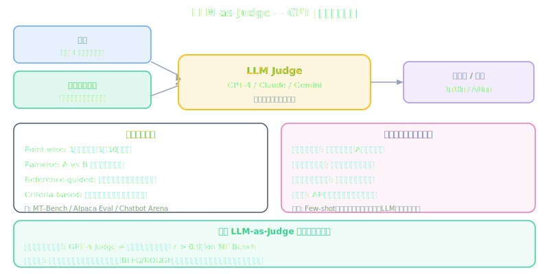

<!--
GPT-4等のLLMに評価させる新手法。従来指標より人間評価との相関が高い。バイアス・コスト・再現性の課題あり。
-->

---

# NLP評価 実装例

- sacrebleu / rouge-score / bert-score ライブラリを使った計算例

```python
# pip install sacrebleu rouge-score bert-score
from sacrebleu.metrics import BLEU, CHRF
from rouge_score import rouge_scorer
from bert_score import score as bert_score

hyp = "The cat sat on the mat"
ref = "The cat is sitting on the mat"

# BLEU
bleu = BLEU(effective_order=True)
print(f"BLEU: {bleu.sentence_score(hyp, [ref]).score:.2f}")

# ROUGE
scorer = rouge_scorer.RougeScorer(['rouge1','rouge2','rougeL'])
scores = scorer.score(ref, hyp)
for k, v in scores.items():
    print(f"{k}: F={v.fmeasure:.3f}")

# ChrF
chrf = CHRF()
print(f"ChrF: {chrf.sentence_score(hyp, [ref]).score:.2f}")

# BERTScore
P, R, F = bert_score([hyp], [ref], lang='en')
print(f"BERTScore F1: {F[0]:.3f}")
```

<!--
sacrebleuはBLEU計算の標準ライブラリ。bert-scoreは初回実行時にモデルをダウンロードするため数分かかる。
-->

---

# NLP指標まとめ

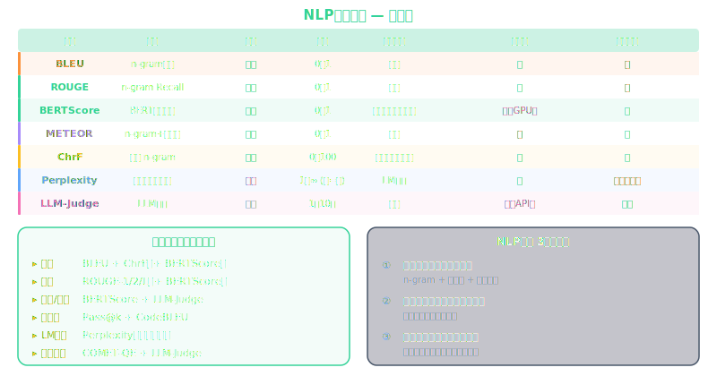

<!--
各NLP指標の特徴、計算コスト、適用タスクを整理したまとめスライド。
-->

---

# NLP評価の落とし穴

- BLEU の罠: 高BLEU≠高品質（繰り返し・短文・直訳でスコア操作可能）
- ROUGE の罠: Recall重視なので長文生成がスコアを稼ぎやすい
- Perplexity の限界: 流暢でも不正確・有害なテキストを検出できない
- BERTScore の課題: 計算コストが高い / モデル選択によって結果が変動
- LLM-as-Judge の課題: 位置バイアス・バーブス性・自己評価バイアス
- 最終判断は人間評価: 自動指標はあくまで近似 — 重要な判断には人間評価を加える

<!--
自動指標を盲目的に信頼することは危険。複数指標を組み合わせ、定期的に人間評価でキャリブレーションを行う。
-->

---

<!-- _class: lead -->
# ランキング・推薦指標

- 検索・推薦システムの品質を測る指標群

<!--
Precision@K, Recall@K, AP, MAP, NDCG, MRR, Hit Rate を網羅
-->

---

# ランキング指標の全体像

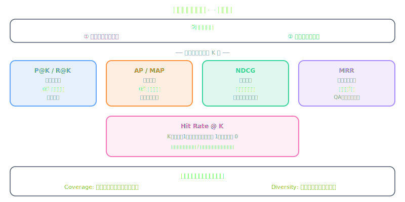

<!--
順序を考慮するか否か、K件での評価、グレードスコア（NDCG）の区別を整理。
-->

---

# Precision@K と Recall@K

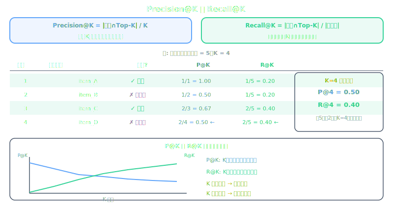

<!--
上位K件中の関連アイテム率(P@K)と全関連アイテムのうちK件内に含まれる率(R@K)。トレードオフ関係。
-->

---

# Average Precision (AP)

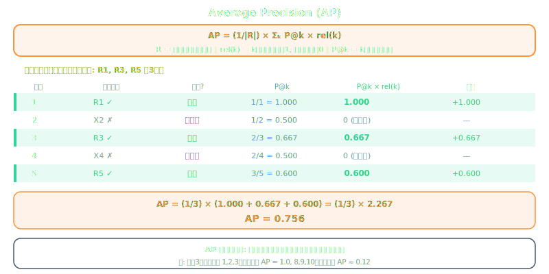

<!--
各関連アイテムが出現した位置でのPrecisionを平均。順序を考慮したPrecisionの統合。関連アイテムが上位に来るほど高スコア。
-->

---

# MAP — Mean Average Precision

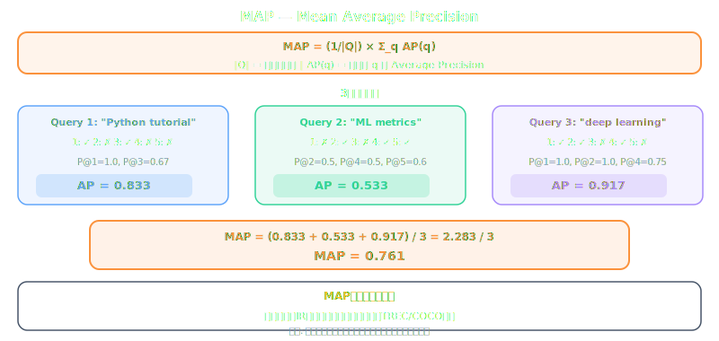

<!--
複数クエリのAPを平均したもの。IR/検索システムの標準的な評価指標。全クエリにわたる平均性能を表す。
-->

---

# NDCG — Normalized DCG の概念

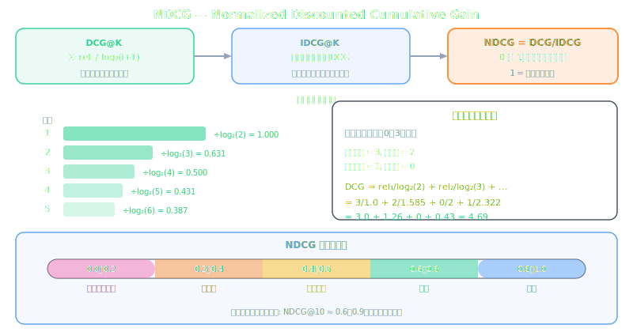

<!--
Discounted Cumulative Gain。順位に対数割引を適用し、上位ほど重要視。関連度スコアが多段階（0/1/2等）の場合に適切。
-->

---

# NDCG — 計算ステップ

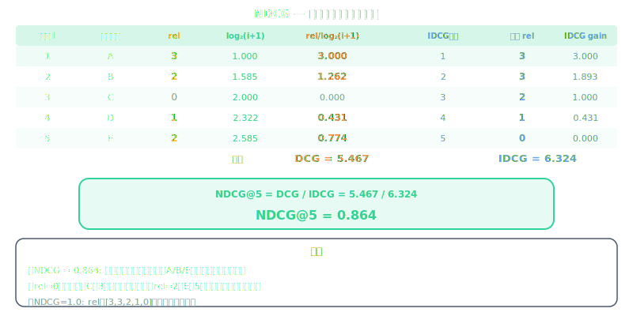

<!--
DCG = Σ rel_i/log2(i+1). NDCG = DCG/IDCG（理想的な順序のDCG）。0〜1で正規化された値。
-->

---

# MRR — Mean Reciprocal Rank

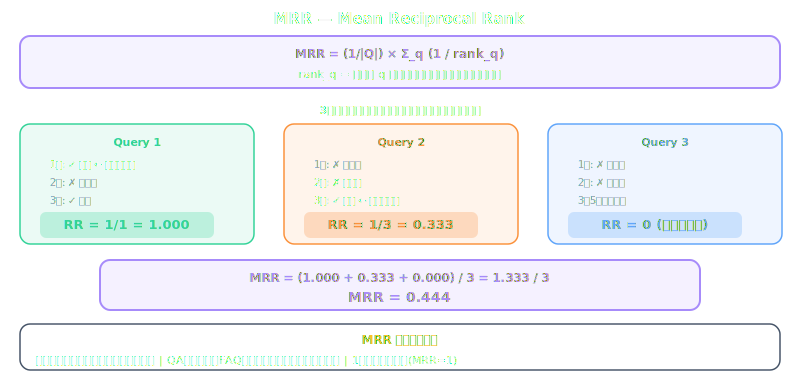

<!--
最初の関連アイテムの順位の逆数を平均。QAシステムや単一正解タスクに適している。
-->

---

# Hit Rate と Recall@K

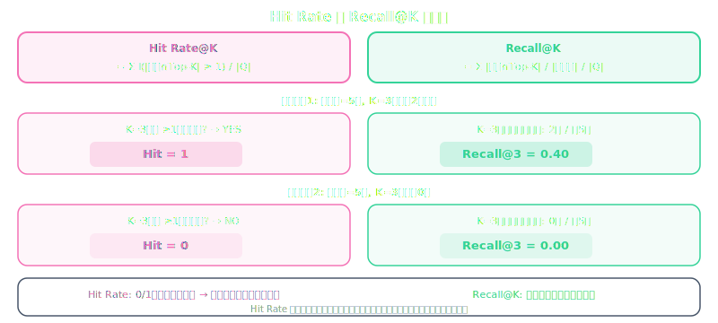

<!--
Hit Rate: クエリのうちK件以内に少なくとも1つの関連アイテムが入る割合。シンプルで直感的。Recall@Kとの違いを整理。
-->

---

# Coverage と Diversity

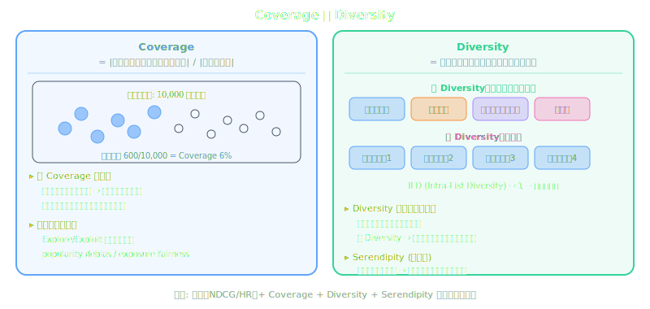

<!--
Coverage: 推薦できるアイテムの範囲。Diversity: 推薦リスト内の多様性。精度だけでなくビジネス要件として重要。
-->

---

# ランキング指標 比較マトリクス

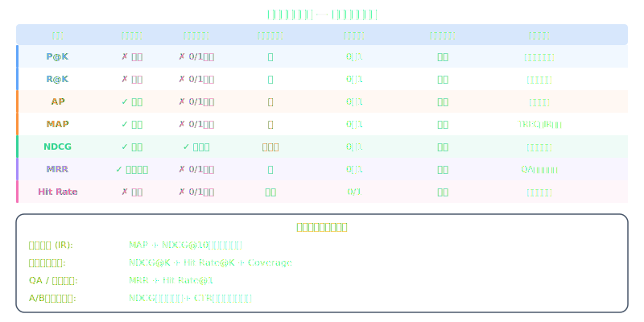

<!--
P@K/R@K/AP/MAP/NDCG/MRR/Hit Rateの特性比較。順序考慮・多段関連度・計算コストの軸で整理。
-->

---

# K値の選び方

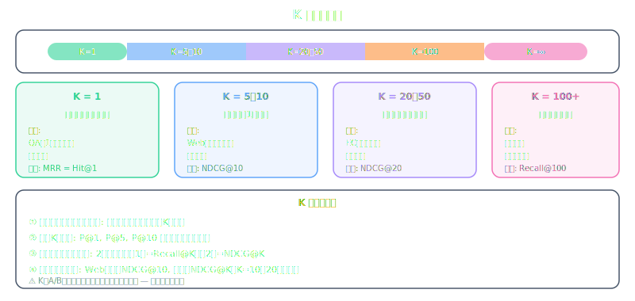

<!--
K=1: 最上位だけ見る(QA), K=5/10: 検索エンジン, K=20/50: レコメンド。ビジネス文脈に合わせてKを選ぶ。
-->

---

# Position Bias と評価への影響

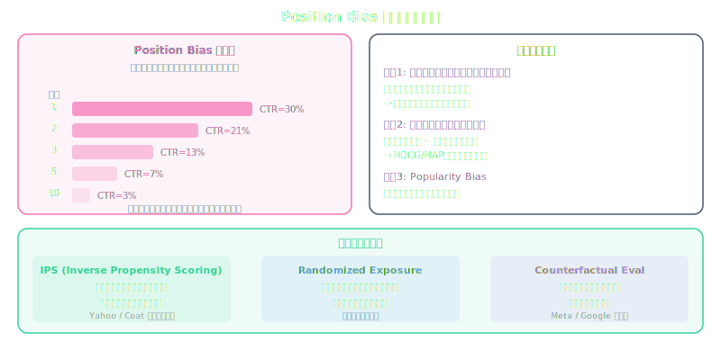

<!--
ユーザーは上位アイテムをクリックしやすいため、クリックデータは位置バイアスを含む。IPS等のデバイアス技術が必要。
-->

---

# ランキング指標 実装例

- sklearn と手動実装で主要ランキング指標を計算する例

```python
import numpy as np
from sklearn.metrics import ndcg_score

# P@K, R@K, Hit Rate
def precision_at_k(relevant, retrieved, k):
    return len(set(relevant) & set(retrieved[:k])) / k

def recall_at_k(relevant, retrieved, k):
    return len(set(relevant) & set(retrieved[:k])) / len(relevant)

def hit_rate_at_k(relevant, retrieved, k):
    return int(bool(set(relevant) & set(retrieved[:k])))

# Average Precision
def avg_precision(relevant, retrieved):
    hits, score = 0, 0.0
    for i, item in enumerate(retrieved, 1):
        if item in relevant:
            hits += 1
            score += hits / i
    return score / len(relevant)

# MRR
def mrr(relevant_list, retrieved_list):
    rr = [1/(retrieved.index(r)+1)
          for retrieved, rel in zip(retrieved_list, relevant_list)
          for r in rel if r in retrieved]
    return np.mean(rr)

# NDCG via sklearn
y_true = np.array([[3, 2, 0, 1, 0]])
y_score = np.array([[0.9,0.8,0.5,0.4,0.1]])
print(f"NDCG@5: {ndcg_score(y_true, y_score, k=5):.3f}")
```

<!--
sklearn.metrics.ndcg_scoreが最も信頼できるNDCG実装。P@K/R@K/MRRは手動実装が多い。
-->

---

# オフライン vs オンライン評価

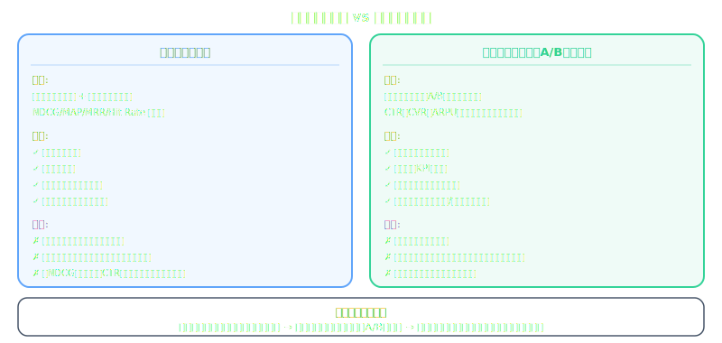

<!--
オフライン: 固定データセットでNDCG等を計算（高速・再現性あり）。オンライン: A/Bテストで実際のCTR/CVRを測定（真の効果を測る）。
-->

---

# ランキング指標まとめ

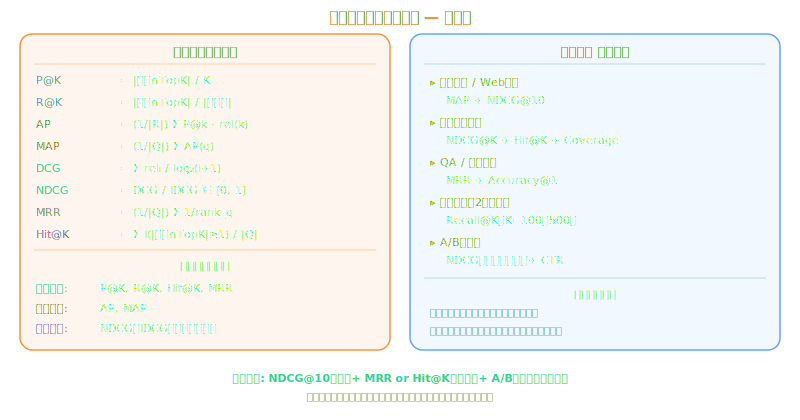

<!--
ランキング指標の全体像と、タスク別の推奨指標を整理したまとめスライド。
-->

---

# ランキングの落とし穴

- MAP の落とし穴: 全関連アイテムが既知でないと計算できない
- NDCG の注意: 関連度スコアの定義が変わると比較不能になる
- P@K だけでは不十分: 関連アイテムが多い場合 Recall@K も必要
- MRR の限界: 最初の関連アイテム以降を完全に無視する
- オフライン指標 ≠ オンライン指標: NDCGが高くてもCTRが上がるとは限らない
- Popularity Bias: 人気アイテムばかり推薦されると Coverage/Diversity が下がる

<!--
実務では必ず複数指標を組み合わせ、最終的にはオンラインA/Bテストで確認することが重要。
-->

---

<!-- _class: lead -->
# クラスタリング評価指標

- 教師なし学習のクラスタ品質を測る指標群

<!--
Inertia, Silhouette, Davies-Bouldin, Calinski-Harabasz, ARI, NMI を網羅
-->

---

# クラスタリング評価の全体像

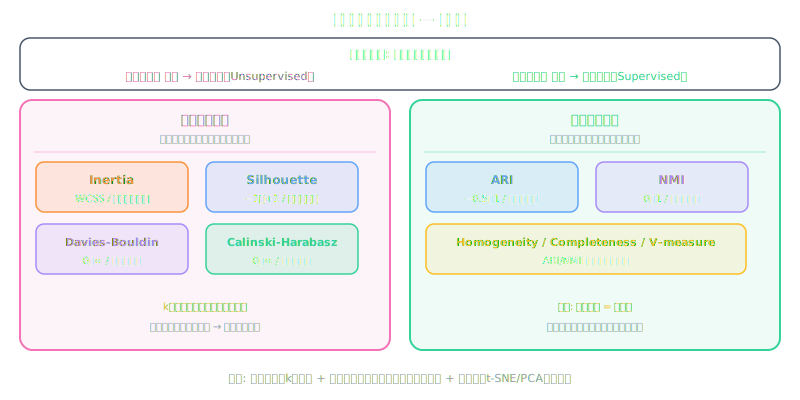

<!--
正解ラベルあり（外部評価）とラベルなし（内部評価）の2軸で整理。
-->

---

# 内部評価 vs 外部評価

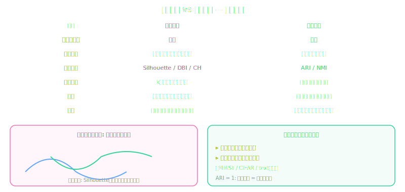

<!--
内部評価: データの幾何学的性質のみで評価（Inertia/Silhouette/DB/CH）。外部評価: 正解ラベルとの一致を評価（ARI/NMI）。
-->

---

# Inertia / WCSS

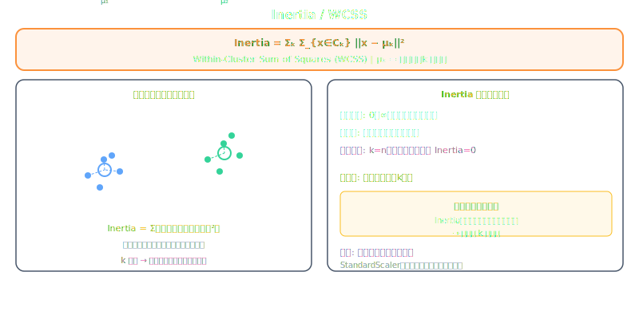

<!--
Within-Cluster Sum of Squares。各点からクラスタ重心までの距離の2乗和。小さいほど密集。k増加で単調減少 → エルボー法と組み合わせる。
-->

---

# Silhouette 係数 — 概念

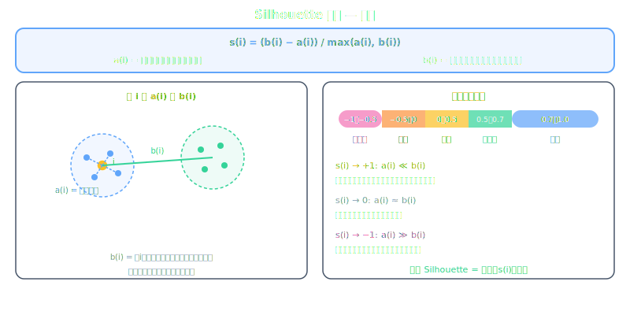

<!--
s(i) = (b-a)/max(a,b)。a=同クラスタ内距離、b=最近傍クラスタへの距離。−1〜+1の範囲。1に近いほどクラスタが明確に分離。
-->

---

# Silhouette 係数 — 計算ステップ

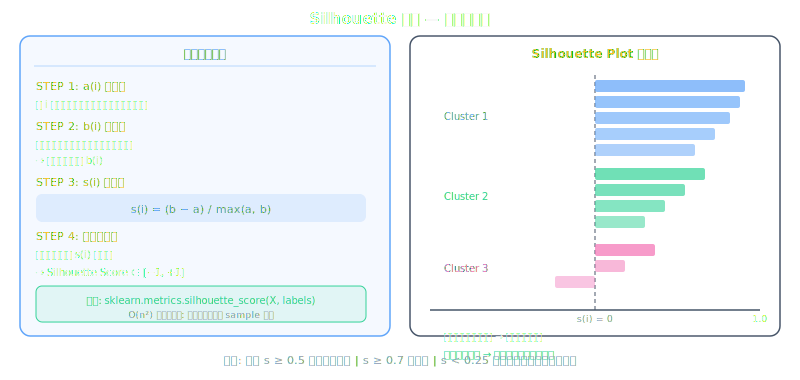

<!--
各サンプルのs(i)を計算し平均。0.7以上:強いクラスタ、0.5以上:合理的、0.25以上:弱いクラスタ。全サンプルのSilhouette plotで可視化も有効。
-->

---

# Davies-Bouldin Index

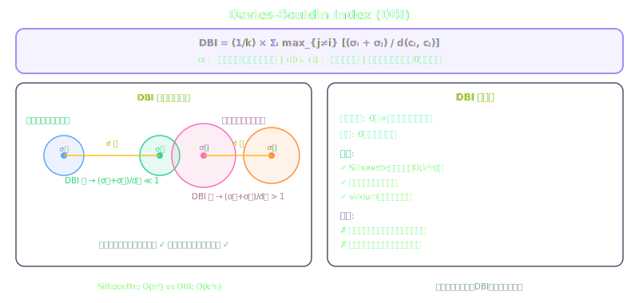

<!--
DBI = (1/k)Σ max_j≠i[(σ_i+σ_j)/d(c_i,c_j)]。クラスタ内分散とクラスタ間距離の比。小さいほど良い（0が理想）。SilhouetteはO(n²)、DBIはO(k²n)で高速。
-->

---

# Calinski-Harabasz Index

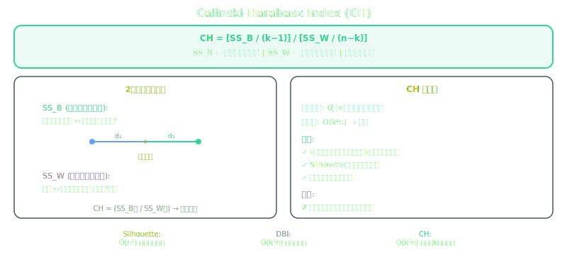

<!--
CH = [SS_B/(k-1)] / [SS_W/(n-k)]。クラスタ間分散とクラスタ内分散の比。大きいほど良い。計算が軽量でk選択に適している。
-->

---

# ARI — Adjusted Rand Index

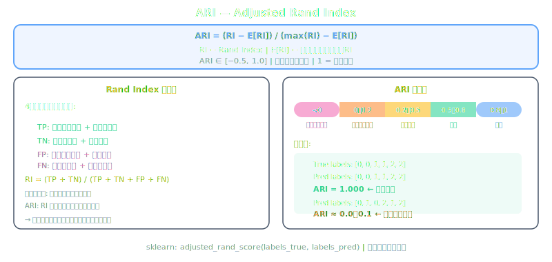

<!--
Rand Index を偶然一致の期待値で補正。−0.5〜1.0（理想=1）。クラスタ数・サイズが異なっても公平な比較が可能。正解ラベルが必要。
-->

---

# NMI — Normalized Mutual Information

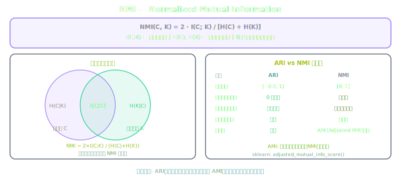

<!--
NMI = 2·I(C;K) / [H(C)+H(K)]。情報量ベース。0〜1（1が完全一致）。クラスタ数が多くても過大評価されにくい（Adjusted NMI が更に堅牢）。
-->

---

# エルボー法 — 最適 k の選び方

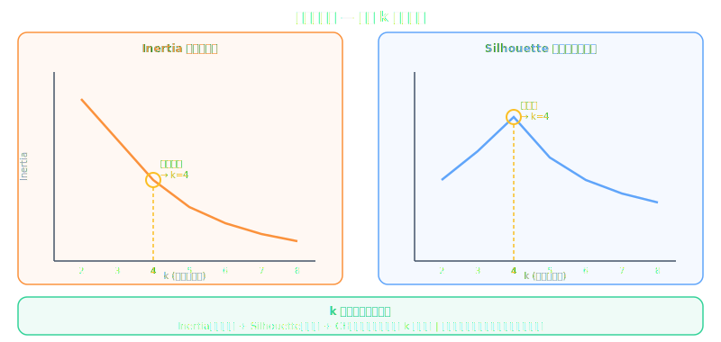

<!--
k増加に対するInertia減少率が急激に鈍化する点（エルボー）を最適kとする。CH/Silhouetteのピークとも合わせて判断するのが実務的。
-->

---

# 指標別 特性比較

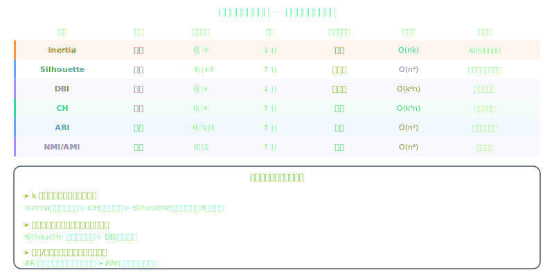

<!--
ラベルなし：Inertia/Silhouette/DBI/CH。ラベルあり：ARI/NMI。計算量・ノイズ耐性・クラスタ形状への仮定の違いを整理。
-->

---

# クラスタリング指標 比較マトリクス

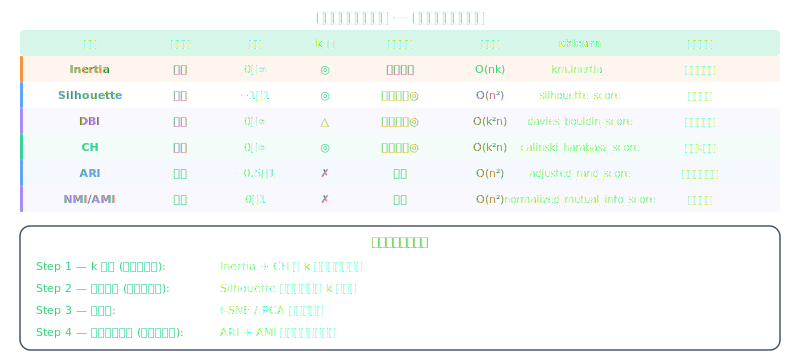

<!--
Inertia/Sil/DBI/CH/ARI/NMIの特性一覧。正解ラベル要否・値の範囲・優劣方向・計算コストを比較。
-->

---

# クラスタリング指標 実装例

- sklearn で主要クラスタリング指標を一括計算する例

```python
from sklearn.cluster import KMeans
from sklearn.metrics import (
    silhouette_score, davies_bouldin_score,
    calinski_harabasz_score,
    adjusted_rand_score, normalized_mutual_info_score
)
import numpy as np

# データ・クラスタリング
X = np.random.randn(200, 2)   # 特徴量
true_labels = np.array([0]*100 + [1]*100)  # 正解（外部評価用）

kmeans = KMeans(n_clusters=2, random_state=42, n_init=10)
pred = kmeans.fit_predict(X)

# 内部評価（ラベル不要）
print(f"Inertia   : {kmeans.inertia_:.2f}")
print(f"Silhouette: {silhouette_score(X, pred):.3f}")
print(f"Davies-Bouldin: {davies_bouldin_score(X, pred):.3f}")
print(f"Calinski-Harabasz: {calinski_harabasz_score(X, pred):.1f}")

# 外部評価（正解ラベル必要）
print(f"ARI : {adjusted_rand_score(true_labels, pred):.3f}")
print(f"NMI : {normalized_mutual_info_score(true_labels, pred):.3f}")
```

<!--
sklearn.metricsに主要指標がすべて揃っている。外部評価のARI/NMIは真のラベルが必要なため、本番データでは内部評価が主体になる。
-->

---

# エルボー法 実装

- Inertia + Silhouette + CH の3点で最適 k を探索する例

```python
from sklearn.cluster import KMeans
from sklearn.metrics import silhouette_score, calinski_harabasz_score
import matplotlib.pyplot as plt

k_range = range(2, 11)
results = {"inertia": [], "sil": [], "ch": []}

for k in k_range:
    km = KMeans(n_clusters=k, random_state=42, n_init=10)
    labels = km.fit_predict(X)
    results["inertia"].append(km.inertia_)
    results["sil"].append(silhouette_score(X, labels))
    results["ch"].append(calinski_harabasz_score(X, labels))

# 3つの指標でkを判断:
# inertia のエルボー点
# sil のピーク（最大）
# ch のピーク（最大）
best_sil_k = k_range[results["sil"].index(max(results["sil"]))]
print(f"Best k by Silhouette: {best_sil_k}")
```

<!--
3指標が同じkを指す場合は信頼性が高い。異なる場合はドメイン知識を加味して判断する。
-->

---

# クラスタリング指標まとめ

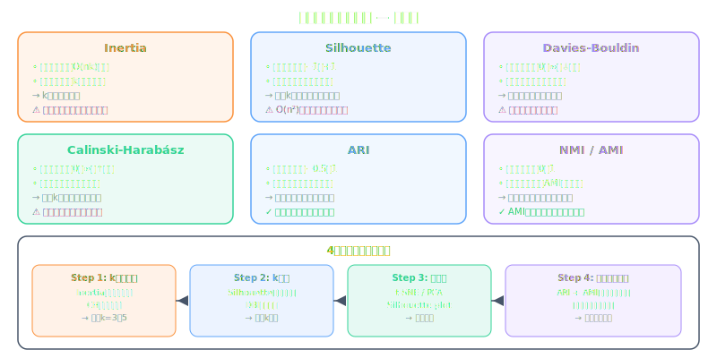

<!--
クラスタリング評価指標の全体像と、タスク別の推奨指標を整理したまとめスライド。
-->

---

# クラスタリングの落とし穴

- Inertia の罠: k が増えると必ず下がる → エルボーが曖昧なデータに注意
- Silhouette の限界: 非球形クラスタ（三日月形等）では過小評価されやすい
- DBI/CH の仮定: 凸形状・均一サイズのクラスタを前提にしている
- ARI の注意: 偶然一致を補正しているが、クラスタが不均一な場合に不安定
- 内部指標 ≠ 外部指標: Silhouetteが高くてもARIが低いケースは頻繁に発生
- 正規化必須: 距離ベース指標は特徴量スケールに敏感 — StandardScalerを使う

<!--
クラスタリングには唯一の正解がないため、複数指標＋可視化（t-SNE/PCA）＋ドメイン解釈の組み合わせが実務では必須。
-->

---

<!-- _class: lead -->
# まとめ・総括

- ML評価指標の全体像と実践ガイド

<!--
5カテゴリ全指標の俯瞰・タスク別ガイド・ベストプラクティスを整理
-->

---

# 全指標マップ — 5カテゴリ俯瞰

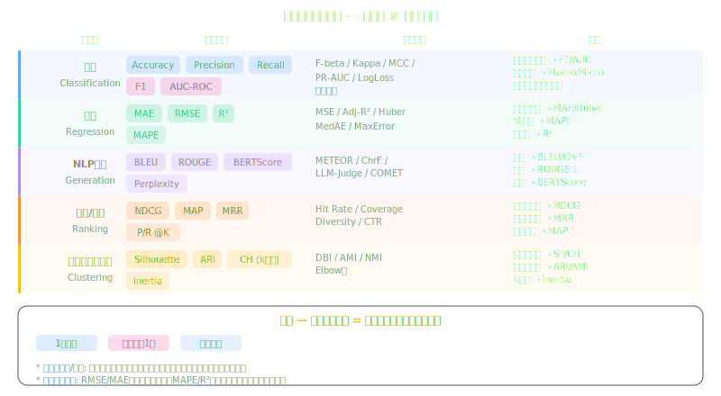

<!--
分類・回帰・NLP・ランキング・クラスタリングの全指標を1枚で俯瞰。タスク軸×評価軸でマッピング。
-->

---

# タスク別 指標選択ガイド

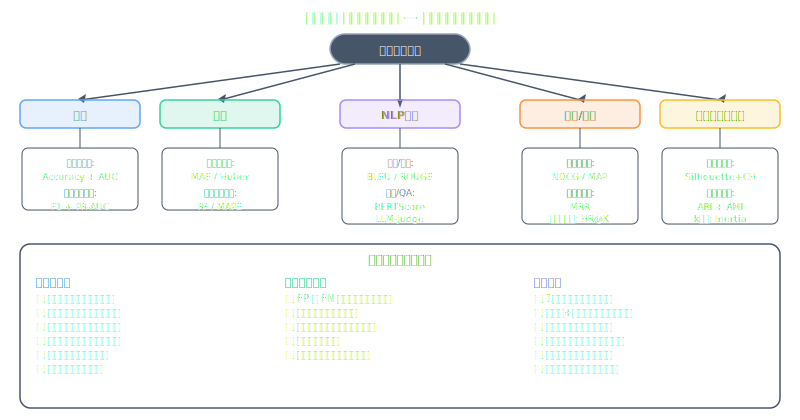

<!--
実務でよくある9タスク（二値分類・多値分類・回帰・翻訳・要約・QA・検索・推薦・クラスタリング）の推奨指標セットを整理。
-->

---

# 評価指標のアンチパターン

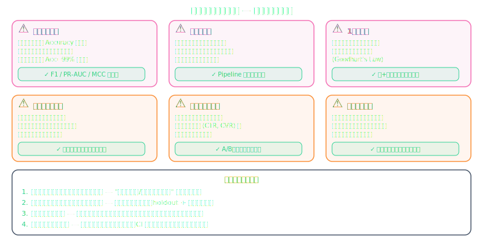

<!--
1指標だけを見る・学習データで評価する・不均衡無視・スケール比較誤り・オフライン指標の過信といった代表的なアンチパターンを解説。
-->

---

# 複数指標の組み合わせ戦略

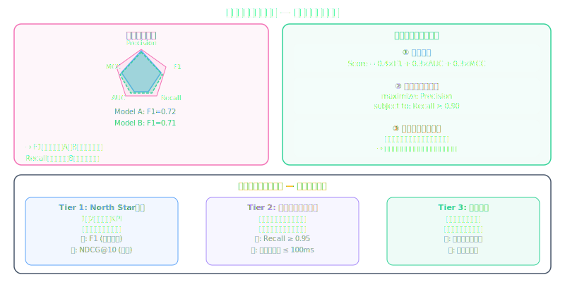

<!--
主指標（optimize）と制約指標（satisfy）の組み合わせ。例: F1を最大化しつつRecall≥0.9を満たす。Google MLGuidesの「one metric」原則も紹介。
-->

---

# 最適化指標 vs 評価指標の違い

- 最適化指標（Training Loss）: モデルが学習中に最小化/最大化する目的関数
- 評価指標（Metrics）: ビジネス要件や人間の判断を反映した品質測定
- 例: BCE Loss で学習 → AUC-ROC / F1 で評価（直接最適化不可）
- 代理指標の罠: MSEを下げてもMAPEが改善しないことがある
- 実務原則: 評価指標をビジネスKPIに対応させ、最適化指標は数値微分可能なものを選ぶ
- 注意: 学習時の指標と評価指標が完全一致しない限り、ギャップを定期的に確認

<!--
代理最適化（surrogate optimization）の概念。訓練損失と評価指標の乖離を常に監視することが重要。
-->

---

# ベストプラクティス 10箇条

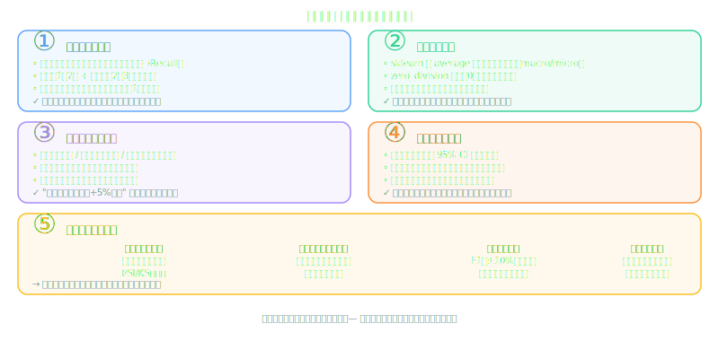

<!--
1)複数指標/2)ベースライン比較/3)クラス不均衡確認/4)信頼区間/5)テストセット汚染防止/6)評価データのドリフト監視/7)オンライン検証/8)ドメイン解釈/9)指標の透明な報告/10)定期的な再評価
-->

---

# タスク別 トップ3指標セット

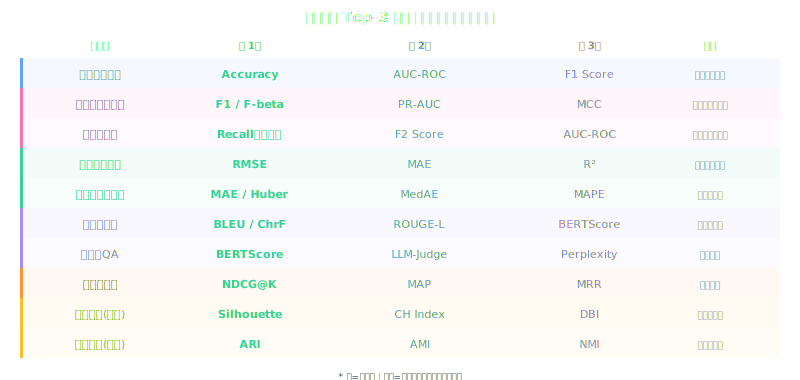

<!--
各タスクで「これを見ておけば外さない」トップ3指標を整理。実務での議論の出発点として活用。
-->

---

# クイックリファレンス

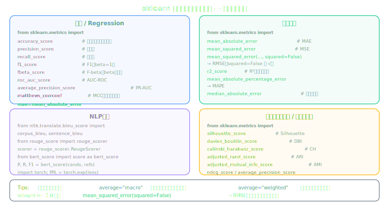

<!--
全指標の数式・範囲・方向（高/低が良い）・計算コストを1枚にまとめたチートシート。印刷用。
-->

---

# 参考文献・学習リソース

- scikit-learn: sklearn.metrics — 分類・回帰・クラスタリング指標の標準実装
- sacrebleu / rouge-score / bert-score — NLP評価の定番ライブラリ
- Hugging Face evaluate — 統合評価ライブラリ（100+指標）
- Hands-On ML (Géron) Chapter 3 — 分類評価指標の解説
- CS229 Notes — 回帰・分類評価の数学的基礎
- RecSys読み物: "Beyond Accuracy" — 推薦指標の多様性・公平性

<!--
sklearn.metricsが最も網羅的。NLPはsacrebleuが翻訳評価の業界標準。HF evaluateは2022年以降の新標準。
-->

---

<!-- _class: lead -->
# ご清聴ありがとうございました

- ML評価指標 完全ガイド
- 分類 / 回帰 / NLP生成 / ランキング・推薦 / クラスタリング
- 「何を測るかがモデルの方向性を決める」

<!--
評価指標はモデル開発の羅針盤。適切な指標の選択がプロジェクトの成否を左右します。
-->
