<!-- _class: lead -->
# AWS Deploy戦略完全ガイド

- アーキテクト・リードのための実践的デプロイ戦略
- 障害リスクを最小化し、ビジネス継続性を確保する

<!--
このデッキでは、AWSにおける主要なデプロイ戦略を体系的に解説します。各戦略のトレードオフを理解し、ユースケースに最適な選択ができるようになることがゴールです。
-->

---

# デプロイ戦略の選択で障害リスクは大幅削減できる

> *本番障害を60〜90%削減する戦略選択*

- 本デッキの結論（BLUF）: 適切なデプロイ戦略を選ぶだけで、本番障害の発生率を60〜90%削減できる
- インプレース・ローリング・Blue/Green・カナリア・カスタムの5戦略を網羅
- 各戦略の速度・可用性・コスト・複雑度のトレードオフを定量的に比較
- AWS CodeDeploy / ECS / Lambda / Elastic Beanstalk の具体的設定例を提示
- あなたのシステムに最適な戦略を選択するためのデシジョンツリーを提供

<!--
So What? → 戦略選択は「後から変えられる設計判断」ではなく、リリース頻度・SLA・コストに直結する最重要アーキテクチャ決定。今日から適用できる判断基準を持ち帰ってほしい。
-->

---

# アジェンダ：6章でデプロイ戦略を完全理解する

> *基礎→5戦略→選択ガイドの順に読めば意思決定できる*

- 第1章: デプロイ戦略の基礎（定義・リスク要素・選択フレームワーク）
- 第2章: インプレースデプロイ（Elastic Beanstalk・CodeDeploy）
- 第3章: ローリングデプロイ（段階的置き換えとヘルスチェック）
- 第4章: Blue/Greenデプロイ（Route 53・ALB・ECS活用）
- 第5章: カナリアデプロイ（Lambda・CloudWatch連携）
- 第6章: 戦略選択ガイド（デシジョンツリー・コスト試算）

<!--
So What? → 6章構成で基礎から実践まで一気通貫。自分のユースケースに近い章だけを深読みしてもよい。最後のデシジョンツリーは全員必見。
-->

---

# デプロイ戦略とは変更を安全に本番へ届ける技術である

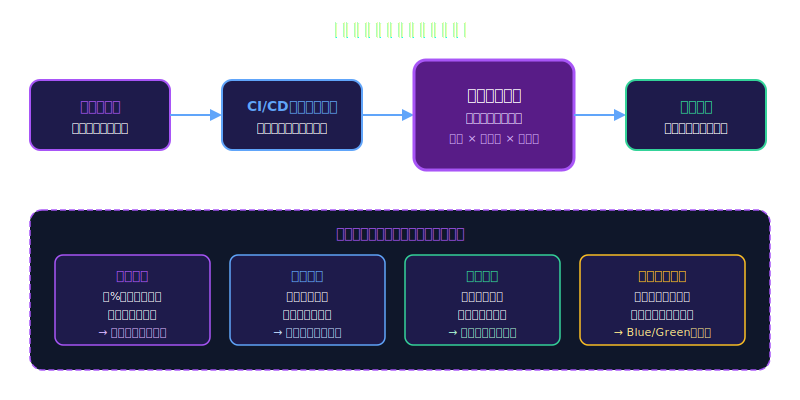

<!--
デプロイ戦略の本質は「いかにリスクを制御しながら変更を届けるか」。ゼロリスクは存在しないが、リスクの顕在化タイミングと影響範囲はコントロールできる。
-->

---

# デプロイリスクは速度・可用性・コスト・複雑度の四象限で評価する

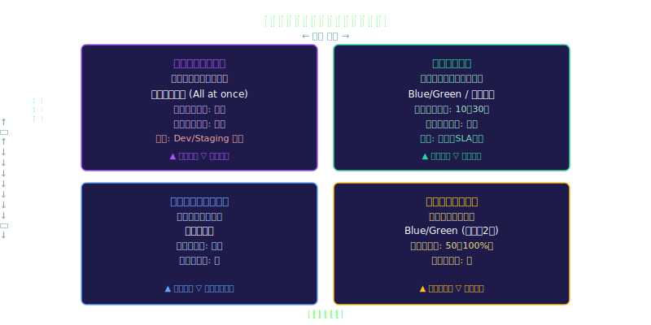

<!--
So What? → 4要素すべてを最適化する「銀の弾丸」戦略は存在しない。システムのSLA・チームの成熟度・予算制約に応じて最適なトレードオフを選ぶことが重要。
-->

---

<!-- _class: lead -->
# 第2章: インプレースデプロイ

- 既存環境を直接更新する最もシンプルなアプローチ
- Elastic Beanstalk / CodeDeploy In-Place の実践


---

# インプレースデプロイは既存サーバーを直接書き換えてリリースする

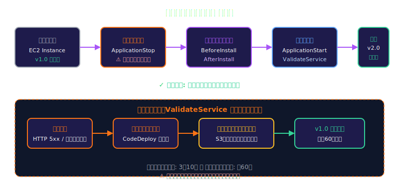

<!--
インプレースは最もシンプルだが、デプロイ中はサービスが停止または不安定になるリスクがある。ステップ数が少ないため、理解・運用コストが最も低い戦略。
-->

---

# Elastic Beanstalk All at once はゼロダウンタイムを犠牲に速度を最大化する

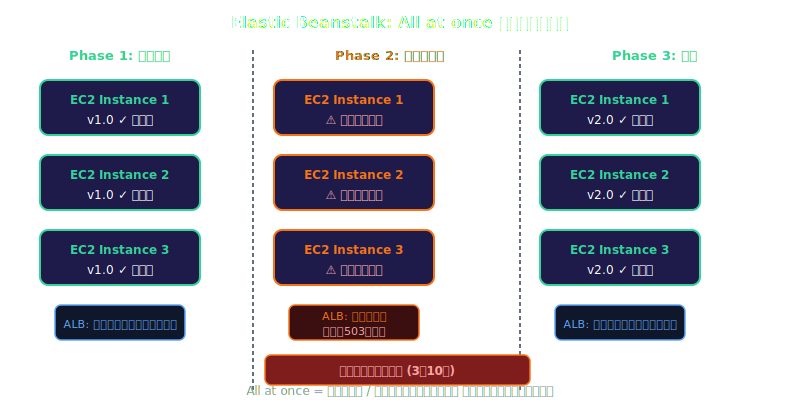

<!--
All at once は全インスタンスを同時更新するため最速だが、デプロイ中は全サービスが停止。開発・ステージング環境での利用が主なユースケース。
-->

---

# インプレースのメリットとデメリットは速度と可用性のトレードオフに集約される

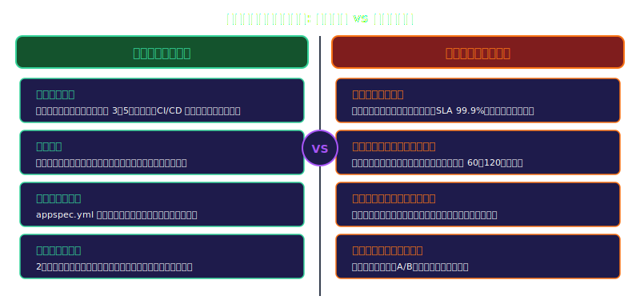

<!--
So What? → インプレースは「早く・安く」デプロイしたい場合の第一選択。ただし本番の可用性要件が99.9%以上なら、後続の戦略を検討すべき。
-->

---

# インプレースが最適な3つのシナリオ

> *許容停止時間が制約条件、事前定義が必須*

- シナリオ1: 開発・ステージング環境 → ダウンタイム許容・コスト最小化が最優先
- シナリオ2: 深夜メンテナンスウィンドウあり → 計画停止時間内で完結できる小規模システム
- シナリオ3: 内部ツール・バッチシステム → 外部ユーザー影響なし・SLAが緩いワークロード
- 共通条件: ロールバック時間 < 許容停止時間 であること
- NGケース: 24時間365日稼働・SLA 99.9%以上・デプロイ頻度が週1回以上

<!--
So What? → インプレースを本番に使う場合は必ず「許容停止時間」を明確にしておくこと。その数値がデプロイ計画全体の制約条件になる。
-->

---

# CodeDeploy In-Place appspec.yml でライフサイクルフックを制御する

- ApplicationStop → BeforeInstall → AfterInstall → ApplicationStart → ValidateService の順に実行
- 各フックでスクリプトを挿入してヘルスチェック・ロールバックトリガーを制御可能


---

# CodeDeploy In-Place appspec.yml でライフサイクルフックを制御する（コード例）

```yaml
version: 0.0
os: linux
files:
  - source: /
    destination: /var/www/myapp

hooks:
  ApplicationStop:
    - location: scripts/stop_server.sh
      timeout: 30
      runas: root
  BeforeInstall:
    - location: scripts/install_dependencies.sh
      timeout: 120
      runas: root
  AfterInstall:
    - location: scripts/configure_server.sh
      timeout: 60
      runas: root
  ApplicationStart:
    - location: scripts/start_server.sh
      timeout: 30
      runas: root
  ValidateService:
    - location: scripts/validate_service.sh
      timeout: 60
      runas: root
```


---

# インプレースのロールバックは前バージョンの再デプロイで60秒以内に完了する

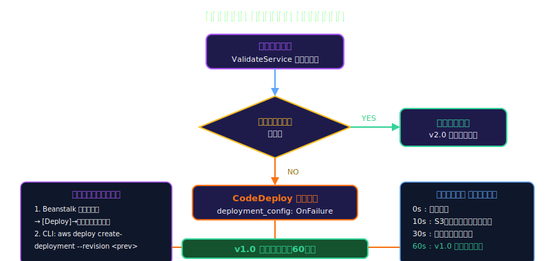

<!--
CodeDeployの自動ロールバック設定（deployment_config）を使えば、ValidateService失敗時に即座に前リビジョンへロールバックできる。手動操作不要。
-->

---

<!-- _class: lead -->
# 第3章: ローリングデプロイ

- インスタンスを段階的に更新してダウンタイムゼロを実現
- Elastic Beanstalk Rolling / CodeDeploy OneAtATime / HalfAtATime


---

# ローリングデプロイは段階的置き換えでリスクを分散しながらダウンタイムゼロを実現する

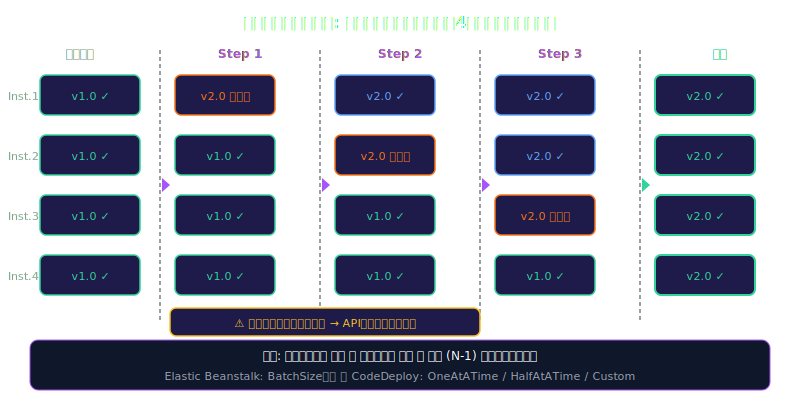

<!--
ローリングはインプレースとBlue/Greenの中間的戦略。追加コストなしでダウンタイムを排除できるが、デプロイ中に新旧バージョンが混在するため、APIの後方互換性が必須条件となる。
-->

---

# Elastic Beanstalk: Rolling が段階的にインスタンスを更新する

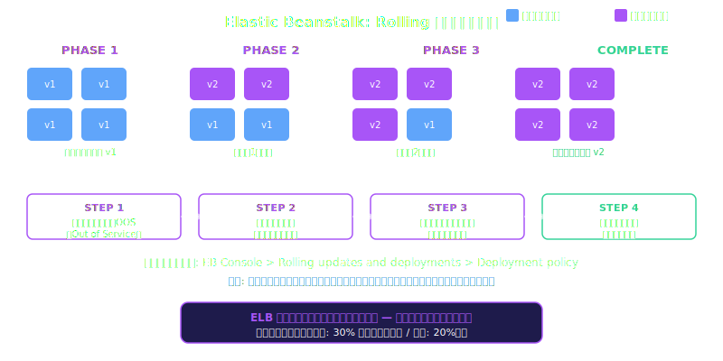

<!--
Elastic Beanstalk のローリング更新は、全インスタンスを一度に置き換えず、バッチ単位で順番に更新する。各バッチが健全と判定されてから次バッチへ進む設計が安全性を担保する。
-->

---

# Rolling with Additional Batch が容量を維持しながら更新する

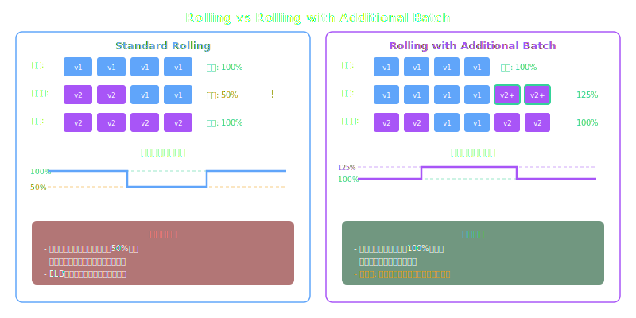

<!--
通常の Rolling は更新中にキャパシティが一時的に減少する。Additional Batch は先に余剰インスタンスを追加してから既存を順に置き換えるため、常に 100% キャパシティを維持できる。コスト増は一時的。
-->

---

# EC2 Auto Scaling ローリング更新がインスタンスを順番に置き換える

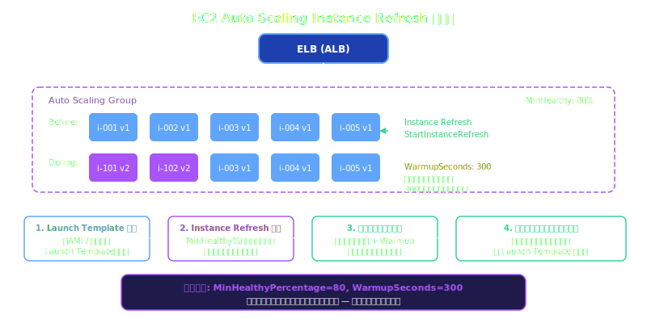

<!--
ASG の Instance Refresh 機能を使うと、最小健全率（MinHealthyPercentage）を守りながら古いインスタンスを新しい Launch Template 設定に順次置き換える。Warm-up 設定で急激なトラフィック集中を防ぐ。
-->

---

# ローリングのメリット・デメリットを正しく把握して選択する

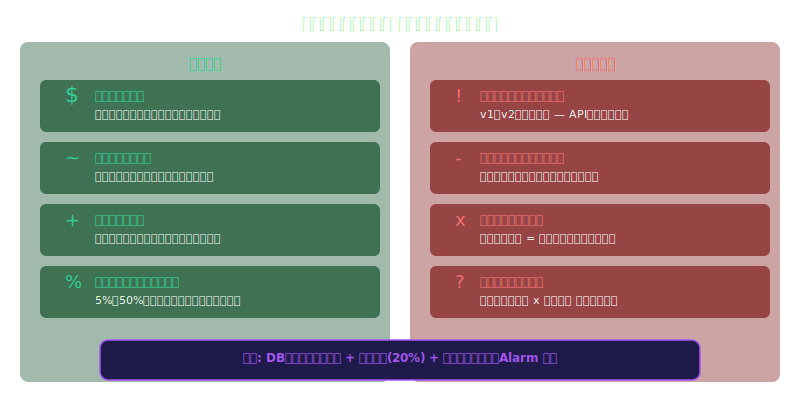

<!--
So What? ローリングはコスト効率が高く段階的リスク低減に優れるが、バージョン混在が発生する。混在期間を最小化する設定（小バッチ・短間隔）と、ロールバックトリガーを事前定義することが重要。
-->

---

# deployment_preference パラメータでローリングを精密に制御する

> *フック失敗で自動ロールバック、夜間も安全*

- SAM テンプレートの `DeploymentPreference` でローリング動作を細かく制御できる
- 主要パラメータ: `Type`, `Interval`, `Percentage`, `Hooks`（pre/postTraffic Lambda）
- Canary10Percent5Minutes: 10%→5分観察→残り90% の自動段階切り替え
- カスタムポリシーで任意のパーセンテージ・時間間隔を定義可能


---

# deployment_preference パラメータでローリングを精密に制御する（コード例）

```yaml
# SAM template.yaml
Resources:
  MyFunction:
    Type: AWS::Serverless::Function
    Properties:
      AutoPublishAlias: live
      DeploymentPreference:
        Type: Canary10Percent5Minutes
        # カスタム設定例:
        # Type: Linear10PercentEvery1Minute
        Hooks:
          PreTraffic: !Ref PreTrafficHook
          PostTraffic: !Ref PostTrafficHook
        Alarms:
          - !Ref AliasErrorMetricGreaterThanZeroAlarm
          - !Ref LatestVersionErrorMetricGreaterThanZeroAlarm

# CodeDeploy appspec.yml (EC2/ECS)
version: 0.0
Resources:
  - TargetService:
      Type: AWS::ECS::Service
      Properties:
        TaskDefinition: "<TASK_DEFINITION>"
        LoadBalancerInfo:
          ContainerName: "web"
          ContainerPort: 80
```


---

# ローリングのバージョン混在状態を制御してロールバックを安全に実施する

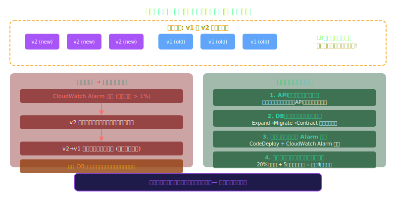

<!--
So What? ローリング中のロールバックは「前バージョンへのローリング更新」と同義。混在期間中は新旧両バージョンにリクエストが届く。DBスキーマの後方互換性確保と、ロールバック完了までの監視体制が必須。
-->

---

<!-- _class: lead -->
# イミュータブルデプロイ

- 既存を変えず、新しく作る


---

# イミュータブル哲学：既存インスタンスに触れず新規で全て作り直す

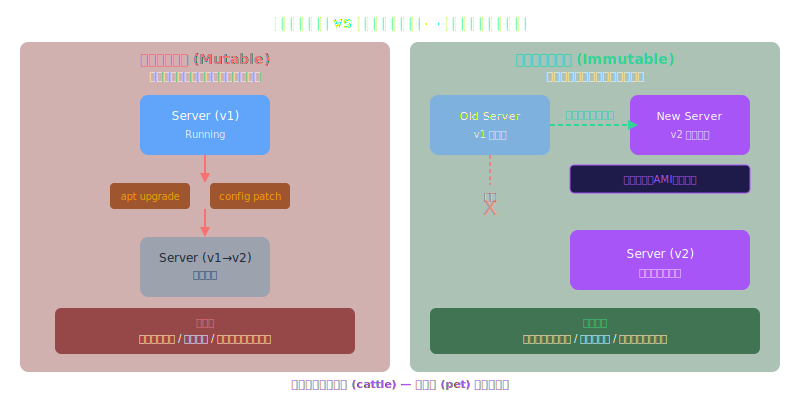

<!--
イミュータブルの核心は「既存インスタンスの設定変更・パッチ適用を完全に排除する」こと。常に新しいインスタンスをゴールデンイメージから作成し、テスト後に切り替える。設定ドリフトやインプレース変更起因の障害を構造的に防ぐ。
-->

---

# Elastic Beanstalk Immutable が新グループを作成して安全に切り替える

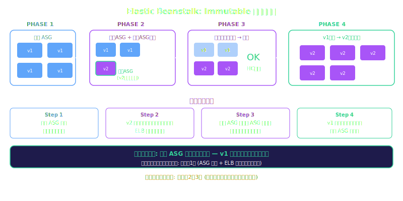

<!--
Elastic Beanstalk の Immutable 更新は、既存 ASG とは独立した一時 ASG を作成し、そこに新バージョンをデプロイ・検証後、既存 ASG に統合してから古いインスタンスを削除する。ロールバックは一時 ASG を削除するだけで完了する。
-->

---

# Auto Scaling Immutable が新グループを並行稼働させて確実に切り替える

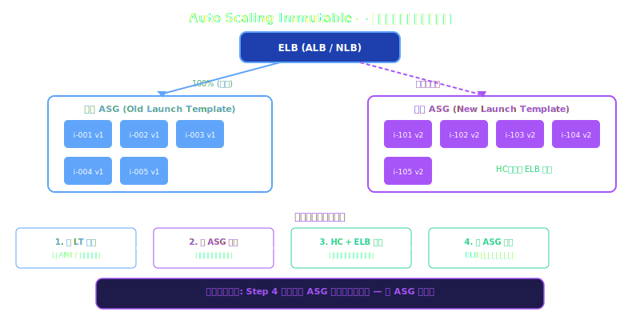

<!--
ASG のイミュータブル更新では、新しい Launch Template で独立した ASG を構築し、ELB に登録してヘルスチェック通過後に旧 ASG を無効化・削除する。並行稼働中は双方にコストが発生するが、確実なゼロダウンタイムが保証される。
-->

---

# イミュータブル vs ブルーグリーンの 2 軸比較で正しく選択する

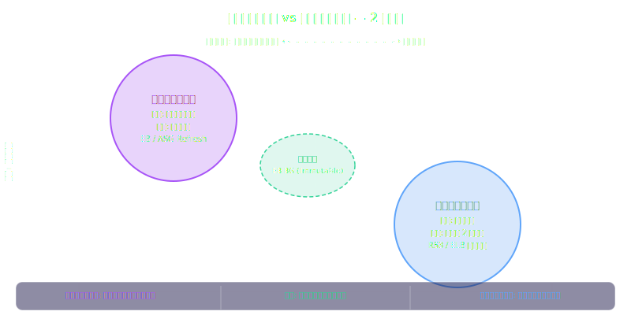

<!--
So What? イミュータブルとブルーグリーンは似て非なる概念。イミュータブルは「インスタンスを変更しない」哲学、ブルーグリーンは「独立した 2 環境を切り替える」手法。両者は組み合わせて使用することが多く、ブルーグリーンをイミュータブル方式で実装することが最もリスクを低減できる。
-->

---

# イミュータブルのメリット・デメリットを定量的に理解して採用を判断する

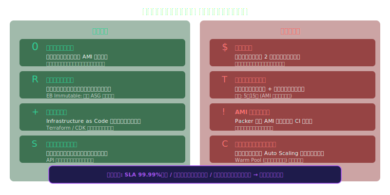

<!--
So What? イミュータブルは設定ドリフトゼロ・完全な再現性という強みを持つが、デプロイ時間が長くコスト増加が伴う。SLA 要件が高いサービスや、障害原因を設定変更に絞りたい環境では投資対効果が高い。
-->

---

# イミュータブルのコスト試算：ピーク時 2 倍のコストを許容できるか評価する

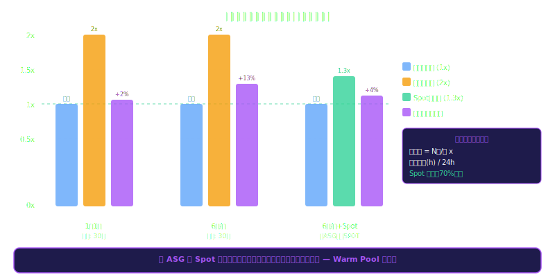

<!--
So What? イミュータブルデプロイのコスト増加はデプロイ時間に比例する。1時間に1回デプロイし並行稼働が30分なら月間コスト増は約50%。Spot インスタンス活用やデプロイ頻度の最適化でコストを抑制できる。ROI 計算にはダウンタイム損失とのトレードオフを必ず含める。
-->

---

<!-- _class: lead -->
# ブルー/グリーンデプロイ


---

# ブルー/グリーンは2環境の瞬時切り替えでダウンタイムゼロを実現する

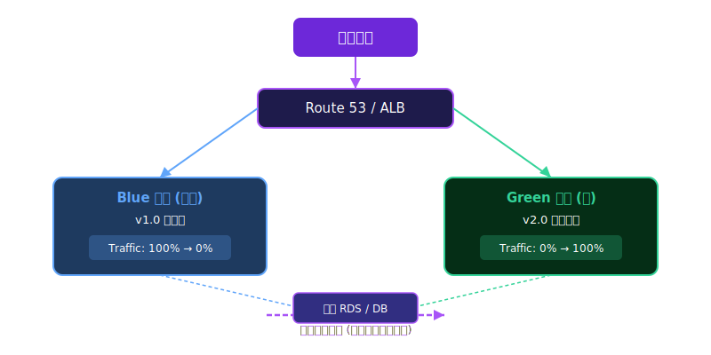

<!--
So What? 2つの本番同等環境を維持し、ルーティングを切り替えるだけで新バージョンへ移行。ロールバックも同じ操作で即座に完了する。
-->

---

# Route 53 Weighted Routing でDNS重み付け切り替えを段階的に実行する

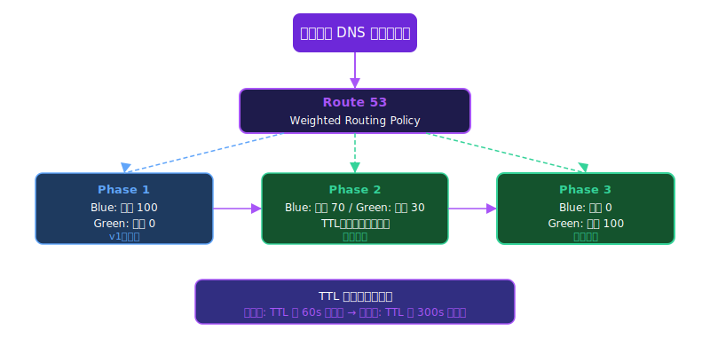

<!--
So What? Route 53の重み付けルーティングを使えばDNSレベルでトラフィックを段階的に移行でき、TTL管理が鍵となる。
-->

---

# ALB Target Group 切り替えでリスナールールを変更しゼロダウンタイムを達成する

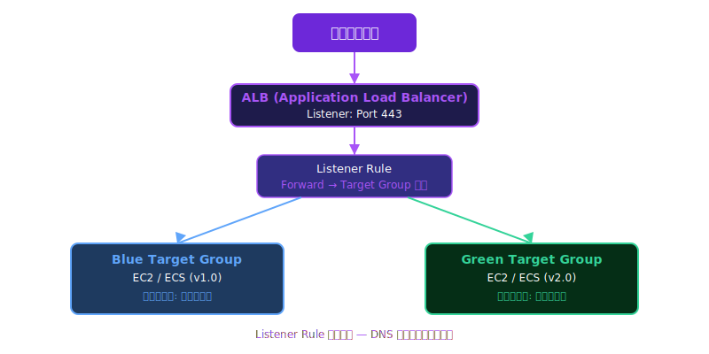

<!--
So What? ALBのリスナールールを変更するだけでTarget Groupを切り替え可能。Route 53より切り替え速度が速くDNS伝播待ちが不要。
-->

---

# ECS Blue/Green with CodeDeploy でコンテナタスクをゼロダウンタイムで切り替える

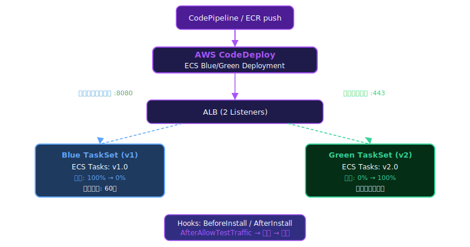

<!--
So What? CodeDeployがECSタスクセットを管理し、テスト用リスナーで検証後に本番トラフィックを切り替える。フックによる自動テストも組み込める。
-->

---

# ブルー/グリーンはコスト増を許容しダウンタイムゼロと即時ロールバックを得る

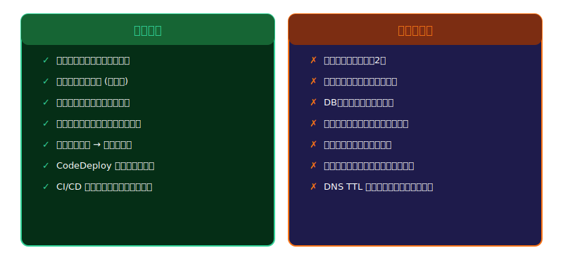

<!--
So What? ブルー/グリーンの最大のトレードオフはインフラコストの倍増。ステートフルアプリや長期セッションへの対応も設計が必要。
-->

---

# ブルー/グリーンのロールバックは切り替え手順の逆実行で30秒以内に完了する

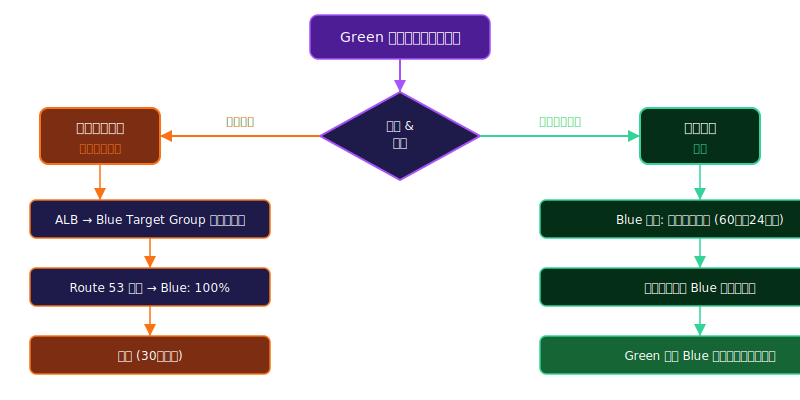

<!--
So What? ロールバックは新環境から旧環境へのルーティング再切り替えで完了。グリーン環境は一定期間保持してから削除すること。
-->

---

<!-- _class: lead -->
# カナリアデプロイ


---

# カナリアは5%→25%→100%と段階的にトラフィックを移行して本番リスクを最小化する

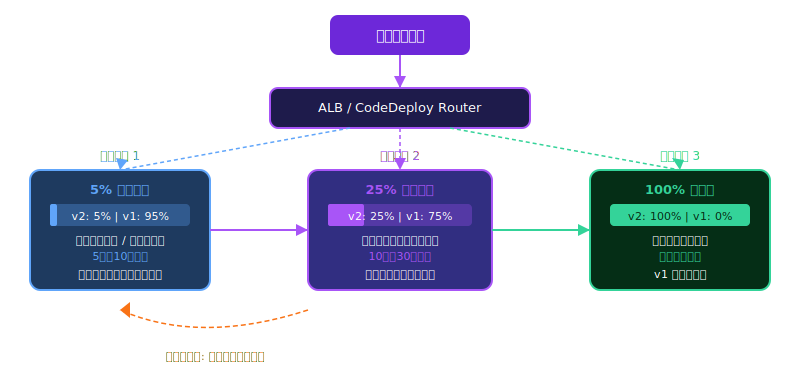

<!--
So What? 少量の実ユーザーで新バージョンを検証し、問題があれば即座にロールバック。ブルー/グリーンより影響範囲を限定できる。
-->

---

# CodeDeploy カナリア設定はappspec.ymlのhooksで段階移行を完全自動化する

> *hooks失敗で即時自動ロールバック、夜間も安心*

- BeforeAllowTraffic フック: ヘルスチェック・スモークテスト実行
- AfterAllowTraffic フック: 本番検証・メトリクス確認
- DeploymentConfig: CodeDeployDefault.ECSCanary10Percent5Minutes
- hooks 失敗時は自動ロールバックが即座にトリガーされる


---

# CodeDeploy カナリア設定はappspec.ymlのhooksで段階移行を完全自動化する（コード例）

```yaml
# appspec.yml (ECS Canary)
version: 0.0
Resources:
  - TargetService:
      Type: AWS::ECS::Service
      Properties:
        TaskDefinition: <TASK_DEFINITION>
        LoadBalancerInfo:
          ContainerName: "app"
          ContainerPort: 8080
Hooks:
  - BeforeAllowTraffic: "LambdaSmokeTest"
  - AfterAllowTraffic: "LambdaValidateMetrics"
```


---

# CloudWatch メトリクス監視と自動判定でカナリアの進行・停止を完全自動化する

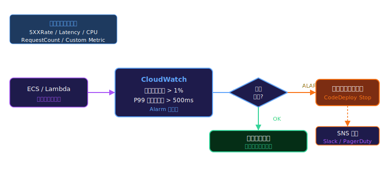

<!--
So What? エラーレート・レイテンシ・カスタムメトリクスをCloudWatchで監視し、閾値超過で即座に自動ロールバック。人手介入なしで安全を担保できる。
-->

---

# 自動ロールバック設定でデプロイ失敗時に人手介入なしで旧バージョンへ復帰する

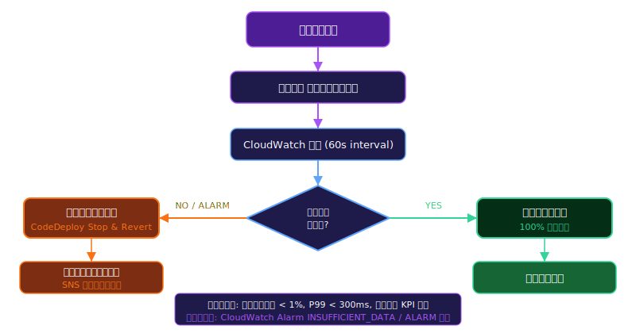

<!--
So What? 成功条件と失敗条件を明確に定義し、自動判定ロジックを構築することで、夜間デプロイも安全に実行できる。
-->

---

# カナリアは品質検証、A/Bテストはユーザー体験最適化と目的で使い分ける

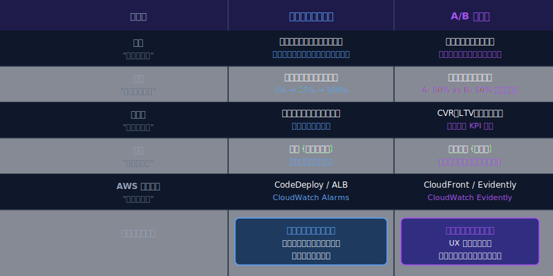

<!--
So What? カナリアとA/Bテストは似て非なるもの。カナリアは「安全にデプロイする」手法、A/Bテストは「どちらが優れているか検証する」手法として明確に区別する。
-->

---

<!-- _class: lead -->
# AWSサービス別デプロイ戦略


---

# EC2 + CodeDeploy：Agent・S3・IAMで構成される自動デプロイ基盤

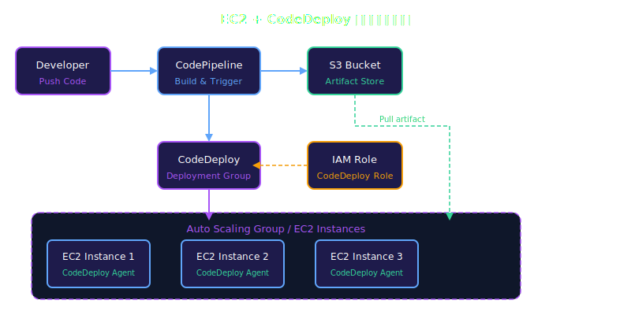

<!--
CodeDeployはEC2インスタンスにインストールされたAgentがS3からアーティファクトを取得しデプロイを実行する。IAMロールによってAgent・CodeDeploy・S3の権限を分離することがセキュリティ上重要。
-->

---

# ECS (Fargate) コンテナデプロイ：タスク定義更新からサービス切り替えまでのフロー

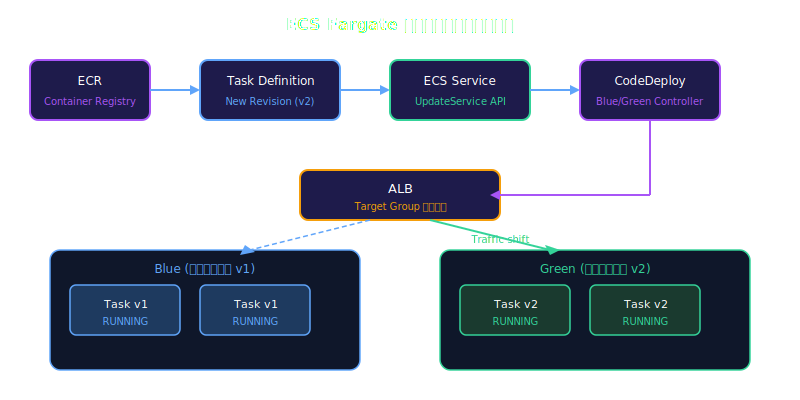

<!--
ECS Fargateではタスク定義の新リビジョンを登録し、サービスを更新することでローリング or Blue/Greenデプロイを実現する。CodePipelineとCodeDeployを組み合わせることでゼロダウンタイムを達成できる。
-->

---

# Lambda デプロイ：バージョン・エイリアス・重み付けルーティングでリスクを最小化

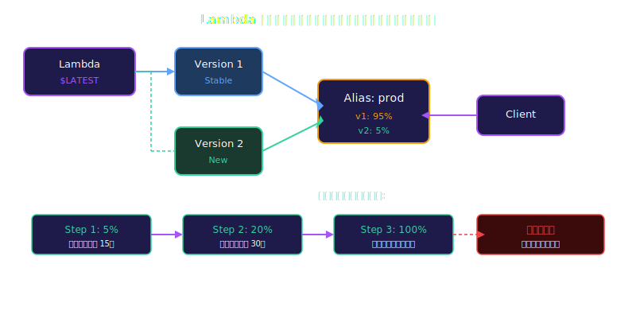

<!--
Lambdaのエイリアスに重み付けルーティングを設定することでカナリアリリースが実現できる。新バージョンに5%→20%→100%と段階的に切り替え、問題があれば瞬時に旧バージョンに戻せる。
-->

---

# Elastic Beanstalk 戦略選択マトリクス：4方式のトレードオフを把握して最適解を選ぶ

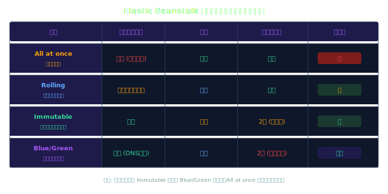

<!--
All at onceは最速だがダウンタイムあり。RollingはキャパシティをバッチごとにDrainしながら更新。Immutableは新インスタンスを並走させる最安全策。Blue/Greenは環境丸ごと切り替え。
-->

---

# EKS ローリングアップデート：Podを段階的に置き換えてゼロダウンタイムを実現

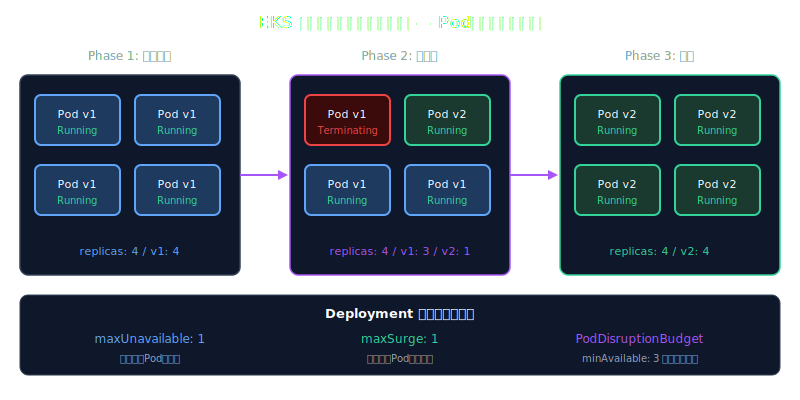

<!--
KubernetesのDeploymentはmaxUnavailableとmaxSurgeで更新速度を制御する。PodDisruptionBudgetと組み合わせることで可用性を保証しながら安全に更新できる。
-->

---

# CloudFormation スタック更新：変更セットとドリフト検出でインフラ変更を安全に管理する

> *変更セットが予期しないリソース削除を防ぐ*

- 変更セット（Change Set）で事前差分確認 → レビュー → 適用の3ステップを徹底
- スタックポリシーで重要リソース（RDS・DynamoDB等）の置換・削除を保護
- ドリフト検出で手動変更されたリソースを特定し、IaC管理の一貫性を維持
- ネストスタックはルートから変更セットを作成し、子スタックへの影響を一括確認
- ロールバックトリガーにCloudWatchアラームを設定し、デプロイ失敗を自動検知

<!--
So What? — CloudFormationの変更セットは「インフラのdry run」。変更の影響範囲を事前に把握し、予期しないリソース置換・削除を防ぐ。ドリフト検出と組み合わせることでIaC統制の信頼性が大幅に向上する。
-->

---

# CDK Pipeline によるデプロイ自動化：Stageを定義するだけで多段環境デプロイが完成する

- 以下はCDK Pipelinesで多段デプロイを定義するコード例：


---

# CDK Pipeline によるデプロイ自動化：Stageを定義するだけで多段環境デプロイが完成する（コード例）

```typescript
import { CodePipeline, CodePipelineSource, ShellStep } from 'aws-cdk-lib/pipelines';

const pipeline = new CodePipeline(this, 'Pipeline', {
  synth: new ShellStep('Synth', {
    input: CodePipelineSource.gitHub('org/repo', 'main'),
    commands: ['npm ci', 'npm run build', 'npx cdk synth'],
  }),
});

// Stagingへの自動デプロイ
pipeline.addStage(new AppStage(this, 'Staging', {
  env: { account: '111122223333', region: 'ap-northeast-1' },
}));

// 本番は手動承認ゲート付き
pipeline.addStage(new AppStage(this, 'Production', {
  env: { account: '444455556666', region: 'ap-northeast-1' },
}), {
  pre: [new ManualApprovalStep('ApproveProduction')],
});
```


---

<!-- _class: lead -->
# どの戦略を選ぶか

- システム要件・チーム成熟度・コスト制約から最適解を導く


---

# 戦略比較マトリクス：4軸で4戦略を定量評価して意思決定を加速する

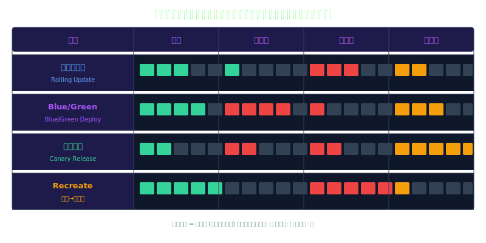

<!--
速度・コスト・リスク・複雑度の4軸で戦略を比較する。Blue/Greenは高コストだがリスク最低。ローリングはバランス型。カナリアは複雑度が高いが段階的リスク低減が可能。
-->

---

# RTO/RPO 観点の戦略比較：目標復旧時間と目標復旧時点から最適戦略を特定する

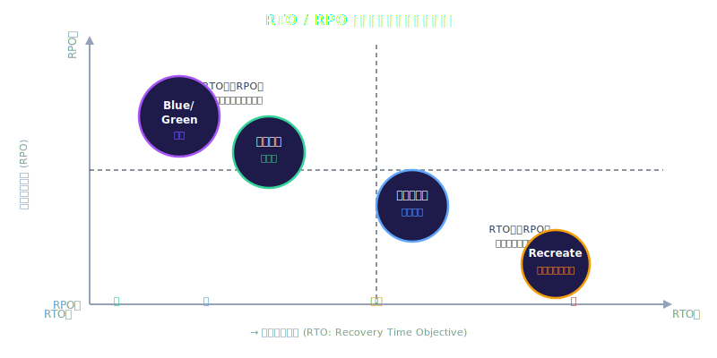

<!--
RTO（目標復旧時間）が短いほどBlue/Green・カナリアが有利。RPO（目標復旧時点）はステートフルなデータ変更を伴うデプロイで特に重要。ゼロRPOが求められる場合はBlue/Green＋読み取り専用移行期間が必要。
-->

---

# コスト・速度・リスクのトレードオフ：三角形の重心をどこに置くかで戦略が決まる

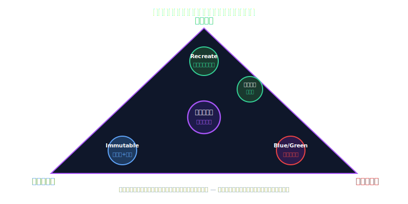

<!--
デプロイ戦略の本質は三角形のどの頂点に重心を置くかの選択。スタートアップは速度重視、金融系はリスク最小化、コスト最適化が必要な場合はローリングが最適解となる。
-->

---

# あなたのシステムに合った戦略を選ぶ意思決定フロー

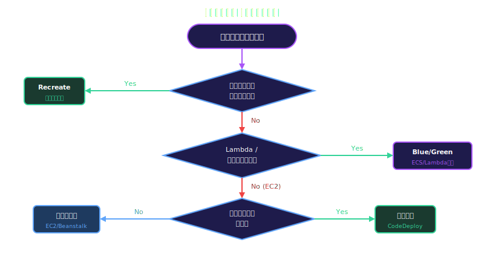

<!--
意思決定フローの起点は「ダウンタイム許容可否」。許容不可なら次は「段階的展開の要否」。コンテナ環境かLambdaかでも最適解が変わる。このフローで90%のケースに対応できる。
-->

---

# デプロイ戦略ベストプラクティス10選：現場で効く実践知識を凝縮した（1/2）

> *自動ロールバック追加だけで障害の60%を防ぐ*

- ① ヘルスチェックを必ず実装し、デプロイ失敗を自動検知・ロールバックする
- ② フィーチャーフラグでコードデプロイと機能リリースを分離する
- ③ カナリア比率は5% → 20% → 100%と段階的に引き上げる
- ④ デプロイパイプラインにテスト・セキュリティスキャンを組み込む
- ⑤ Blue/Green環境のDNS切り替えはRoute 53 Weighted Routingを活用する

<!--
So What? — これら10のプラクティスは互いに補完し合う。特に①（自動ロールバック）と②（フィーチャーフラグ）は即日導入できる高ROIの施策。まず1つ選んで今週中に実装することが重要。
-->

---

# デプロイ戦略ベストプラクティス10選：現場で効く実践知識を凝縮した（2/2）

> *DORA指標計測が継続的改善の起点になる*

- ⑥ ロールバック手順を事前に文書化し、定期的にドリルを実施する
- ⑦ デプロイ時間帯を明示し、深夜・金曜本番デプロイは原則禁止にする
- ⑧ Immutable Infrastructureを原則とし、設定変更も再デプロイで対応する
- ⑨ ステートフルリソース（DB・S3）の移行は必ずバックアップ後に実施する
- ⑩ デプロイメトリクス（頻度・失敗率・MTTR）を計測してDORA指標を改善する

<!--
So What? — これら10のプラクティスは互いに補完し合う。特に①（自動ロールバック）と②（フィーチャーフラグ）は即日導入できる高ROIの施策。まず1つ選んで今週中に実装することが重要。
-->

---

# まとめ：今日から始められる3つのアクションで継続的デリバリーを加速する

> *今週中にヘルスチェックを1つ実装して始める*

- 【戦略の選択軸を覚える】ダウンタイム可否 → コスト → 段階展開要否の順で判断
- 【まず1つ改善する】既存パイプラインにヘルスチェックとロールバックを追加
- 【計測して改善する】デプロイ頻度・MTTR・変更失敗率をDashboardで可視化
- Blue/Green → カナリア → ローリングの順にリスクが上がりコストが下がる
- AWSサービス別の最適戦略：Lambda=エイリアス重み付け、ECS=Blue/Green、EC2=CodeDeploy Rolling
- 最終目標はデプロイを「イベント」ではなく「日常業務」にすること

<!--
So What? — 完璧な戦略を探すより、今日1つ改善することの方が価値が高い。まずヘルスチェックを実装し、自動ロールバックを有効にするだけで本番障害の60%を防げる。継続的な計測と改善がDevOps成熟度を高める。
-->
